# Flow — Run and Story lifecycle with authoritative information flow

This flow uses the objects and relationships of the [canonical model](../model.md) and the
participants located in the [system context](../context.md). It adds time, causality, and failure
paths; it does not define new structural facts.

## Run lifecycle

| Run stage                    | Meaning                                                                                                                                                                                                                                        | Exit or owned stop                                                                                                                                                                                                                                                                                                     |
| ---------------------------- | ---------------------------------------------------------------------------------------------------------------------------------------------------------------------------------------------------------------------------------------------- | ---------------------------------------------------------------------------------------------------------------------------------------------------------------------------------------------------------------------------------------------------------------------------------------------------------------------- |
| **Received**                 | Jig accepts the submitted Execution Envelope under its composition digest for pre-Run evaluation; no `ID-RUN` exists yet and no execution effect has occurred.                                                                                 | Proceed to Preflighting.                                                                                                                                                                                                                                                                                               |
| **Preflighting**             | Validate the whole envelope, authority, routes, required capabilities, resource feasibility, and policy.                                                                                                                                       | Reject durably before Story effects, or freeze the Run definition and activate.                                                                                                                                                                                                                                        |
| **Active**                   | Derive eligibility, admit work within resource-class capacity, coordinate Story lifecycles, and serialize target finalization.                                                                                                                 | Continue while business progress is possible; park or interrupt only at the smallest safe scope.                                                                                                                                                                                                                       |
| **Parked**                   | A durable named Run- or Story-scoped question awaits Arye or a recorded delegate.                                                                                                                                                              | A valid scoped decision deterministically continues, blocks, or enters `Suspended` before an explicit terminal-stop decision; unaffected work continues only when shared authority is not implicated.                                                                                                                  |
| **Interrupted / Recovering** | Fence stale control, verify and reconstruct durable state, reconcile operations, authorities, target facts, and uncertain effects.                                                                                                             | Resume, park, or block after authoritative state is reconstructed. `FC-TRUST` first fences and halts without an in-ledger claim; `Stopped` records only on a trustworthy witnessed append basis or later external recovery.                                                                                            |
| **Suspended**                | A validated operator stop durably pauses dispatch while preserving every unfinished Story's underlying state. Any held finalization authority is retained-but-fenced until its holding Story's in-flight target-changing Operations reconcile. | Resume through a new controller generation and `RC-RESUME-INTEGRITY`, park changed assumptions for exact re-approval, receive an explicit terminal-stop decision, or record the phase-preserving, dispatch-free reconciliation completion that releases retained authority only after every target effect is resolved. |
| **Settling**                 | No Story can make further business progress; final outcomes and Retirement obligations are being resolved.                                                                                                                                     | Complete after all outcomes are final and every duty is complete or its exact Residual Obligation has status `accepted-handoff`.                                                                                                                                                                                       |
| **Completed**                | Every Story has a final business outcome and every Retirement duty is complete or represented by an exact Residual Obligation with status `accepted-handoff`.                                                                                  | Terminal durable Run result; later obligation handoff acceptance or resolution is post-terminal administration and does not revise these facts.                                                                                                                                                                        |
| **Stopped**                  | A recorded `FC-TRUST` trust-root failure, including a liveness-assumption breach that destroys that root, or an explicit terminal-stop decision ended the Run.                                                                                 | Terminal durable non-delivery outcome when a trustworthy witnessed append basis or external recovery establishes it; it runs the same settlement duty set as `Settling` until the terminal-settlement position commits, then projects as product `ended`, never resumable `stopped`.                                   |

A preflight rejection is a durable Run-level non-delivery outcome, not `Completed` delivery. An
interrupted Run does not resume from ambient process state; it resumes only from reconstructed and
reconciled authority. Product-visible **stopped** projects only to design `Suspended`; design
`Stopped` projects separately as product-visible **ended**.

### View V3a — Run phases

- **Question:** Which phases can a Run be in, and which transitions connect them?
- **View type:** Run phase state view; the diagram form of the Run lifecycle table above.
- **Audience and purpose:** Every reader of this flow; see the Run's shape before the detailed
  progression in V3.
- **Scope and exclusions:** Run phases and named transitions only. Story detail, transition
  machinery, and exhaustive substates are excluded.
- **State:** Proposed. **Owner:** Arye Kogan.

```mermaid
%%{init: {"theme": "base", "themeVariables": {"fontFamily": "Inter, ui-sans-serif, system-ui", "primaryTextColor": "#172033", "lineColor": "#65758b"}}}%%
stateDiagram-v2
    direction LR
    state "Received" as Received
    state "Preflighting" as Preflighting
    state "Durable preflight rejection" as Rejected
    state "Active" as Active
    state "Parked" as Parked
    state "Interrupted / Recovering" as Recovering
    state "Suspended" as Suspended
    state "Settling" as Settling
    state "Completed" as Completed
    state "Durable named stop" as Stopped

    [*] --> Received: PORT-INTAKE submission, LG-INTAKE commit
    Received --> Preflighting: same atomic intake evaluation
    Preflighting --> Rejected: SCH-INTAKE-ACK rejected disposition
    Preflighting --> Active: EV-ENVELOPE-SUBMITTED, accepted ack and frozen basis
    Active --> Parked: cataloged event selects owner-changeable wait
    Parked --> Active: EV-OWNER-DECISION, scoped continuation
    Active --> Recovering: EV-RECOVERY-OBSERVATION, shared authority uncertain
    Parked --> Recovering: EV-RECOVERY-OBSERVATION, shared authority uncertain
    Settling --> Recovering: EV-RECOVERY-OBSERVATION, shared authority uncertain
    Recovering --> Active: EV-RECOVERY-OBSERVATION, integrity and reconciliation pass
    Recovering --> Parked: EV-RECOVERY-OBSERVATION, parked state restored or owner-changeable question
    Recovering --> Settling: EV-RECOVERY-OBSERVATION, settlement state restored
    Recovering --> Stopped: EV-RECOVERY-OBSERVATION, FC-TRUST
    Active --> Suspended: EV-RUN-SUSPEND-DECISION
    Parked --> Suspended: EV-RUN-SUSPEND-DECISION
    Suspended --> Suspended: EV-RECOVERY-OBSERVATION or EV-EFFECT-CERTAINTY, last target effect resolved; durable authority release
    Suspended --> Active: EV-RUN-RESUME-DECISION, new generation and RC-RESUME-INTEGRITY pass
    Suspended --> Parked: EV-RUN-RESUME-DECISION, changed basis needs re-approval
    Suspended --> Stopped: EV-RUN-TERMINAL-STOP-DECISION
    Stopped --> Stopped: EV-WAKE-SETTLEMENT, terminal duties complete or handed off
    Active --> Settling: EV-WAKE-SETTLEMENT, every Story terminal/retiring
    Settling --> Completed: EV-WAKE-SETTLEMENT, settlement complete or handed off
    Rejected --> [*]
    Stopped --> [*]
    Completed --> [*]

    classDef phase fill:#e8f1ff,stroke:#5a78a8,color:#172033
    classDef outcome fill:#e8f7ed,stroke:#4f8a63,color:#172033
    classDef exception fill:#fce8e6,stroke:#a7615b,color:#172033
    class Received,Preflighting,Active,Settling,Suspended phase
    class Completed,Rejected outcome
    class Parked,Recovering,Stopped exception
```

**V3a legend:** Every node is a Run phase or durable Run outcome from the table above; labels on the
directed transitions name their causes. Blue nodes are normal phases, green nodes are terminal
durable outcomes, and red nodes are exceptional conditions (`Parked`, `Interrupted / Recovering`,
and the terminal stop). `Suspended` is durable and resumable but dispatch-free; its blue phase
styling distinguishes it from terminal red `Stopped`. Color is redundant with the phase names. The
start and end markers are the standard state-diagram entry and terminal points.

### Exhaustive Run-transition contract

The first three rows are the pre-controller intake protocol. The `LG-INTAKE` `terminal-ack`
conditional-create is its one atomic authority commit point: `Received` and `Preflighting` describe
evaluation, not separately committed Run-ledger positions. Pre-ack `SCH-INTAKE-ACK`
configuration-read attempt variants may be conditional-created during intake, while referenced
`SCH-CAPABILITY-PROOF` attempts were conditional-created during composition. Both are immutable
mechanism evidence under deterministic keys in `LG-PREFLIGHT-ATTEMPT`, and intake only reads and
validates the capability-proof records; neither class carries Run authority. Before the terminal
acknowledgement exists, the submission has no `ID-RUN` or
`ID-EVENT`. `CP-INTAKE` first stages `acknowledgementContentDigest` over the canonical terminal
content while excluding the digest itself, `ID-RUN`, the unassigned `LG-INTAKE` position, and
derived create/lookup/witness material. The durable create then establishes the stable
`(compositionDigest, intakeCreatePosition, acknowledgementContentDigest)` tuple; only an accepted
tuple derives `ID-RUN`, after which the newly spawned controller commits `EV-ENVELOPE-SUBMITTED` as
the first ordered Run event. A rejected terminal acknowledgement is the durable terminal preflight
authority fact and no controller is spawned. A rejected submission creates no Run, ledger, or
export: its attempt variants plus immutable rejected terminal acknowledgement are the complete
durable evidence, and only the latter is readable by `LG-INTAKE` digest lookup.
`SCH-AUDIT-EXPORT` is structurally inapplicable because this path never has a terminal-settlement
position.

| From → to                                                      | Trigger                                                                                                                                                                                                                                                                                                               | Guard                                                                                                                                                                                                                                             | Persisted fact                                                                                                                                                                                                                                                      |
| -------------------------------------------------------------- | --------------------------------------------------------------------------------------------------------------------------------------------------------------------------------------------------------------------------------------------------------------------------------------------------------------------- | ------------------------------------------------------------------------------------------------------------------------------------------------------------------------------------------------------------------------------------------------- | ------------------------------------------------------------------------------------------------------------------------------------------------------------------------------------------------------------------------------------------------------------------- |
| entry → `Received`                                             | Validated `PORT-INTAKE` submission (pre-Run, not yet an `ID-EVENT`)                                                                                                                                                                                                                                                   | Envelope shape and composition digest are readable                                                                                                                                                                                                | Intake evaluation begins; deterministic `SCH-INTAKE-ACK` configuration-read attempts may conditional-create immutable records in `LG-PREFLIGHT-ATTEMPT`, while referenced `SCH-CAPABILITY-PROOF` attempts are only read and validated; no intake authority commits. |
| `Received` → `Preflighting`                                    | Same intake evaluation                                                                                                                                                                                                                                                                                                | Attempt chains and all other preflight inputs validate                                                                                                                                                                                            | Accepted/rejected terminal disposition is computed; no Run-ledger commit exists.                                                                                                                                                                                    |
| `Preflighting` → rejected                                      | Rejected `SCH-INTAKE-ACK` `terminal-ack` disposition                                                                                                                                                                                                                                                                  | Invalid/insufficient envelope, exhausted configuration read, or infeasible authority/capacity                                                                                                                                                     | Immutable rejected terminal acknowledgement, reason, and bound attempt-chain handles; no Run ledger/controller.                                                                                                                                                     |
| `Preflighting` → `Active`                                      | `EV-ENVELOPE-SUBMITTED`                                                                                                                                                                                                                                                                                               | Accepted acknowledgement exists, derived Run ledger exists, frozen digest matches                                                                                                                                                                 | First `SCH-EVENT`/`SCH-TRANSITION`, frozen Run basis, and current `ID-GEN`.                                                                                                                                                                                         |
| `Active` → `Parked`                                            | Any cataloged input whose fixed selector yields Run-level park: `EV-SESSION-HUMAN-REQUEST`, `EV-SESSION-FAULT`, `EV-WORKSPACE-FACT`, `EV-SETUP-FACT`, `EV-ARTIFACT-FACT`, `EV-LIVENESS-OBSERVED`, `EV-CHECK-OBSERVATION`, `EV-TARGET-FACT`, `EV-EFFECT-CERTAINTY`, `EV-RULE-SURFACE-TOUCHED`, or `EV-BOUND-EXHAUSTED` | Fixed failure selector proves a recorded owner action or changed external fact can advance                                                                                                                                                        | `ID-PARK`, exact question/reason, accountable responder, wake condition, and suspended Story positions.                                                                                                                                                             |
| `Parked` → `Active`                                            | `EV-OWNER-DECISION`                                                                                                                                                                                                                                                                                                   | Exact request, lifecycle position, responder/current grant, and continuation guard pass                                                                                                                                                           | Decision, closed parked request, and resumed durable positions.                                                                                                                                                                                                     |
| `Active`, `Parked`, or `Settling` → `Interrupted / Recovering` | `EV-RECOVERY-OBSERVATION` (including a restart-derived observation)                                                                                                                                                                                                                                                   | Shared ledger/registry/generation/effect authority is uncertain                                                                                                                                                                                   | Prior phase, dispatch fence, Recovery entry reason, and reconciliation set.                                                                                                                                                                                         |
| `Interrupted / Recovering` → `Active`                          | `EV-RECOVERY-OBSERVATION`                                                                                                                                                                                                                                                                                             | Chain/currency/generation verification and every mandatory reconciliation pass                                                                                                                                                                    | New generation, adopted reconciliations, and Recovery-complete fact.                                                                                                                                                                                                |
| `Interrupted / Recovering` → `Parked`                          | `EV-RECOVERY-OBSERVATION`                                                                                                                                                                                                                                                                                             | Integrity passes and the recorded prior phase was `Parked`, or a recorded owner action can resolve the remaining question                                                                                                                         | Restored or newly created parked request plus preserved reconciliation evidence.                                                                                                                                                                                    |
| `Interrupted / Recovering` → `Settling`                        | `EV-RECOVERY-OBSERVATION`                                                                                                                                                                                                                                                                                             | Integrity and reconciliation pass and the recorded prior phase was `Settling`                                                                                                                                                                     | New generation, adopted reconciliations, restored terminal-settlement work set, and Recovery-complete fact.                                                                                                                                                         |
| `Interrupted / Recovering` → `Stopped`                         | `EV-RECOVERY-OBSERVATION`                                                                                                                                                                                                                                                                                             | `FC-TRUST` is selected and a trustworthy witnessed append basis remains for the final fenced record                                                                                                                                               | Named trust-root stop and externally governed recovery requirement. If no such basis remains, phase one fences and halts without claiming an in-ledger stop; externally governed recovery owns the terminal disposition.                                            |
| `Active` or `Parked` → `Suspended`                             | `EV-RUN-SUSPEND-DECISION`                                                                                                                                                                                                                                                                                             | Exact Run/lifecycle position and responder/current grant pass; dispatch is fenced immediately. An in-flight target-changing Operation may be parked `Uncertain` under `BND-RECOVERY`, but that does not satisfy authority release.                | Dispatch fence, reason, and preserved Story states; while any target-changing Operation is unresolved, finalization authority is retained-but-fenced, and the Run still suspends.                                                                                   |
| `Suspended` → `Suspended`                                      | `EV-RECOVERY-OBSERVATION` or `EV-EFFECT-CERTAINTY`                                                                                                                                                                                                                                                                    | The fact resolves the last in-flight target-changing Operation of the holding Story as confirmed effect, confirmed absence, or cancelled with proof of no effect; the dispatch fence remains in force. An `Uncertain` result continues the fence. | Phase remains `Suspended`; the Transition records reconciliation provenance and durably releases the retained authority only after that last effect is resolved. This is legal reconciliation-duty processing only and dispatches no Operation.                     |
| `Suspended` → `Active`                                         | `EV-RUN-RESUME-DECISION`                                                                                                                                                                                                                                                                                              | New generation and `RC-RESUME-INTEGRITY`, including the accepted-successor fence, pass unchanged                                                                                                                                                  | Resume decision, new `ID-GEN`, and resumed positions.                                                                                                                                                                                                               |
| `Suspended` → `Parked`                                         | `EV-RUN-RESUME-DECISION`                                                                                                                                                                                                                                                                                              | Resume integrity finds a changed safety basis requiring exact approval                                                                                                                                                                            | Parked re-approval request and invalidated dependent evidence/authority.                                                                                                                                                                                            |
| `Suspended` → `Stopped`                                        | `EV-RUN-TERMINAL-STOP-DECISION`                                                                                                                                                                                                                                                                                       | Explicit terminal intent and no resumable transition remains                                                                                                                                                                                      | Terminal non-delivery outcome; for every non-terminal Story, a disposition fact of preserved-in-state under that outcome; and the same preservation, session-close, authority-release-with-reconciliation, and obligation-handoff duty set as `Settling`.           |
| `Active` → `Settling`                                          | `EV-WAKE-SETTLEMENT`                                                                                                                                                                                                                                                                                                  | Every Story has a terminal business root or is retiring; no business transition remains                                                                                                                                                           | Terminal-settlement work set and business-final cut predecessor.                                                                                                                                                                                                    |
| `Settling` or pre-terminal `Stopped` → same phase              | `EV-OWNER-DECISION`                                                                                                                                                                                                                                                                                                   | Arye accepts the exact live `open` `ID-OBLIGATION` and its completion criteria                                                                                                                                                                    | Status becomes `accepted-handoff`; exact replay appends nothing, and the next settlement wake re-evaluates the remaining duty set.                                                                                                                                  |
| `Settling` or pre-terminal `Stopped` → same phase              | `EV-OBLIGATION-RESOLVED`                                                                                                                                                                                                                                                                                              | The exact live `open` or `accepted-handoff` duty completed; responder/current grant, completion criteria, and digest-verified evidence pass                                                                                                       | Status becomes terminal `resolved`; exact replay appends nothing, and the next settlement wake re-evaluates the remaining duty set.                                                                                                                                 |
| `Settling` → `Completed`                                       | `EV-WAKE-SETTLEMENT`                                                                                                                                                                                                                                                                                                  | Every Retirement duty is complete or represented by an exact `ID-OBLIGATION` whose status is `accepted-handoff`                                                                                                                                   | Terminal-settlement position, complete outcomes/obligations, and `Completed`.                                                                                                                                                                                       |
| `Stopped` → `Stopped`                                          | `EV-WAKE-SETTLEMENT`                                                                                                                                                                                                                                                                                                  | Every terminal-stop settlement duty is complete or represented by an exact `ID-OBLIGATION` whose status is `accepted-handoff`                                                                                                                     | Terminal-settlement position for the stopped Run; the existing post-terminal administrative regime then applies unchanged.                                                                                                                                          |

Every active-Run row commits its trigger and Transition atomically and therefore names both the
guard evaluated and the fact replay consumes; no ambient process transition is legal.
After the terminal-settlement position, the only legal appends are **post-terminal administrative
Transitions**: the settlement-authorized create-once audit-export put and its receipt/failure fact,
obligation handoff acceptance or resolution, and owner-authorized evidence disposal. They cannot alter any Run
phase, Story state, business-final cut, outcome, authority, or dependency result.

| Post-terminal administrative Transition | Cataloged trigger        | Exact guard and permitted append                                                                                                                                                                             |
| --------------------------------------- | ------------------------ | ------------------------------------------------------------------------------------------------------------------------------------------------------------------------------------------------------------ |
| Audit-export receipt or failure         | `EV-ARTIFACT-FACT`       | Exact create-once export subject and terminal-cut basis match; append only receipt/certainty/failure and, on failure, an `open` export obligation.                                                           |
| Residual Obligation handoff acceptance  | `EV-OWNER-DECISION`      | Exact live obligation status is `open`, and Arye's authenticated configured principal accepts the exact obligation and completion criteria; append `accepted-handoff` while retaining all settled facts.     |
| Residual Obligation resolution          | `EV-OBLIGATION-RESOLVED` | Exact live obligation status is `open` or `accepted-handoff`; responder/current grant, completion criteria, and digest-verified evidence pass; append terminal `resolved` while retaining all settled facts. |
| Evidence-disposal authorization         | `EV-OWNER-DECISION`      | Arye alone authorizes one exact digest after preservation, retention, obligation, audit-hold, protected-reference, and exhaustive deployment-wide live-pin guards pass; append only the disposal intent.     |
| Evidence-disposal receipt or failure    | `EV-ARTIFACT-FACT`       | Exact authorized disposal subject and Operation fence match; append only the digest-verified receipt, certainty, or failure.                                                                                 |

An exact replay returns the existing administrative record and appends nothing. These rows may not
change phase, Story state, business-final cut, outcome, authority, or dependency facts.
The terminal-stop Transition keeps every non-terminal Story in its existing Story state and records
its disposition as preserved-in-state under the Run's terminal non-delivery outcome. `Stopped`
then drives the same settlement duty set as `Settling` — preservation, session close, authority
release after reconciliation, and obligation handoff — through the existing Run-scoped
`EV-WAKE-SETTLEMENT` derivation. Its terminal-settlement position authorizes the unchanged
post-terminal administrative regime, including `SCH-AUDIT-EXPORT`/`ID-EXPORT`.

`Suspended` is the deliberate crash-stable exception to ordinary Recovery entry: it has no live
dispatch and no usable finalization authority. Its only legal activity under the suspend fence is
dispatch-free reconciliation-duty processing of already-dispatched target-changing Operations: the
cataloged certainty/recovery fact commits the phase-preserving `Suspended` → `Suspended` Transition,
which durably releases retained authority only when the last such Operation is resolved as a
confirmed effect, confirmed absence, or cancellation with proof of no effect.
A held authority remains retained-but-fenced, rather
than released, until every in-flight target-changing Operation of its holding Story is resolved.
An `Uncertain` Operation under `BND-RECOVERY` keeps the target fence in place; only reconciliation
or an explicit terminal governance disposition that preserves or externally transfers that fence
can end that retention, never acquisition by another Story or Run.
Restart reconstructs that same `Suspended` projection without a lifecycle Transition; only the
cataloged resume or terminal-stop events can leave it.

### Run-state closure inventory

This table is the R1.4 closure surface for every V3a Run phase and the durable preflight-rejection
disposition. It enumerates existing entries, exits, and terminal append rules without adding a phase
or Transition.

| Run phase or disposition    | Existing entry                                                      | Existing exit or legal post-terminal append                                                                                                                                                                                                          |
| --------------------------- | ------------------------------------------------------------------- | ---------------------------------------------------------------------------------------------------------------------------------------------------------------------------------------------------------------------------------------------------- |
| `Received`                  | Validated `PORT-INTAKE` submission within pre-controller evaluation | `Preflighting`; pre-ack attempt variants are mechanism evidence, not Run state.                                                                                                                                                                      |
| `Preflighting`              | `Received`                                                          | Durable preflight rejection or `Active`.                                                                                                                                                                                                             |
| Durable preflight rejection | Failed `Preflighting` before activation                             | Terminal outside the Run ledger: no Run-ledger, export, Operation, or further attempt variant. Duplicate submission returns the rejected `terminal-ack`; it and the bound attempt chain are the complete durable outcome.                            |
| `Active`                    | `Preflighting`, `Parked`, Recovery, or `Suspended`                  | `Parked`, `Interrupted / Recovering`, `Suspended`, or `Settling`.                                                                                                                                                                                    |
| `Parked`                    | `Active`, Recovery, or `Suspended`                                  | `Active`, `Interrupted / Recovering`, or `Suspended`; an explicit terminal-stop decision first enters the existing stop path.                                                                                                                        |
| `Interrupted / Recovering`  | `Active`, `Parked`, or `Settling`                                   | `Active`, `Parked`, `Settling`, or `Stopped`.                                                                                                                                                                                                        |
| `Suspended`                 | `Active` or `Parked`                                                | Dispatch-free `Suspended` reconciliation self-append, `Active`, `Parked`, or `Stopped`. The self-append may release retained authority only after the authority-release prerequisite holds.                                                          |
| `Settling`                  | `Active` or Recovery                                                | Recovery or `Completed`.                                                                                                                                                                                                                             |
| `Completed`                 | `Settling` at the terminal-settlement position                      | Only the settlement-authorized audit-export put and receipt/failure, obligation handoff acceptance or resolution, and owner-authorized evidence disposal. None may change phase, Story state, business-final cut, outcome, authority, or dependency. |
| `Stopped`                   | Trust-root stop in Recovery or terminal-stop decision               | `Stopped` settlement-duty self-appends until the terminal-settlement position; thereafter exactly the same three post-terminal administrative append classes as `Completed`. It never resumes.                                                       |

## Story lifecycle

| Story stage                  | Meaning and authority                                                                                                                                                                                            |
| ---------------------------- | ---------------------------------------------------------------------------------------------------------------------------------------------------------------------------------------------------------------- |
| **Pending**                  | Wait for every prerequisite to be confirmed `Landed`; allocate no Story resources.                                                                                                                               |
| **Eligible**                 | Enter deterministic admission ordering when prerequisites and resource-class capacity permit.                                                                                                                    |
| **Preparing**                | Establish isolated resources and a bounded implementer assignment.                                                                                                                                               |
| **Implementing**             | Produce a committed exact Candidate and the evidence required by the frozen Run basis.                                                                                                                           |
| **Reviewing**                | An independent reviewer judges the complete exact Candidate; changes return through separately bounded rework.                                                                                                   |
| **Accepted**                 | Jig durably records valid reviewer approval after identity, authority, exact binding, evidence availability/integrity, findings, and lifecycle validation.                                                       |
| **Waiting for finalization** | Wait in deterministic order without target finalization authority and without repeated target mutation.                                                                                                          |
| **Finalizing**               | Hold the sole target-scoped authority; align to target, renew review after Candidate-changing refresh, perform policy-selected final verification, authorize delivery, reconcile uncertainty, and prove landing. |
| **Business outcome**         | Record `Landed`, directly `Blocked`, owner-decided `Rejected`, or derive `Not run — dependency blocked`.                                                                                                         |
| **Retiring**                 | Settle or fence pending operations, release authority only after the authority-release prerequisite, preserve work/evidence, close sessions, and safely retire or hand off resources.                            |
| **Closed**                   | Both business outcome and Retirement obligations are final.                                                                                                                                                      |

**Authority-release prerequisite:** Every finalization-authority release in this view requires
every in-flight target-changing Operation of the holding Story to resolve as a confirmed effect,
confirmed absence, or cancellation with proof of no effect. An `Uncertain` Operation parked under
`BND-RECOVERY` keeps the authority fenced until reconciliation or an explicit terminal governance
disposition preserves or externally transfers that target fence; it never permits another Story or
Run to acquire it. Until the prerequisite is met, the named Story or Run transition still records
its state change but retains the authority fenced; the reconciliation-completing Transition releases
it durably.

These are high-level phases, not an exhaustive state machine. `Parked`, `Suspended`, and
`Interrupted / Recovering` may suspend a Run or a Story without replacing the Story's underlying
phase. No Story transition fires while the Run is `Suspended`. Exact substates, transitions, event
types, counters, and cancellation behavior belong to Layer 2.
When a changed-safety-basis re-approval park closes while acceptance remains invalidated, each
affected `Accepted`, `Waiting`, or `Finalizing` Story takes the same cataloged
`EV-OWNER-DECISION` transition to `Reviewing` as a rule-surface invalidation; the `Finalizing`
transition releases its held authority and every transition creates a fresh `RP-PACKAGE`.

### View V3b — Story phases

- **Question:** Which phases can a Story be in, and which transitions connect them?
- **View type:** Story phase state view; the diagram form of the Story lifecycle table above.
- **Audience and purpose:** Every reader of this flow; see one Story's shape before the detailed
  progression in V3.
- **Scope and exclusions:** Story phases, business outcomes, and Retirement only. Run-level
  conditions (`Parked`, `Interrupted / Recovering`) suspend a Story without replacing its phase and
  are shown in V3a and V3, not here.
- **State:** Proposed. **Owner:** Arye Kogan.

```mermaid
%%{init: {"theme": "base", "themeVariables": {"fontFamily": "Inter, ui-sans-serif, system-ui", "primaryTextColor": "#172033", "lineColor": "#65758b"}}}%%
stateDiagram-v2
    direction LR
    state "Pending" as Pending
    state "Eligible" as Eligible
    state "Preparing" as Preparing
    state "Implementing" as Implementing
    state "Reviewing" as Reviewing
    state "Accepted" as Accepted
    state "Waiting for finalization" as Waiting
    state "Finalizing" as Finalizing
    state "Landed" as Landed
    state "Directly Blocked" as Blocked
    state "Rejected by owner" as StoryRejected
    state "Not run — dependency blocked" as NotRun
    state "Retiring" as Retiring
    state "Closed" as Closed

    [*] --> Pending: admitted in the frozen Run definition
    Pending --> NotRun: reachable prerequisite directly Blocked or Rejected
    Pending --> Eligible: prerequisites Landed and capacity permits
    Eligible --> Preparing: deterministic admission
    Preparing --> Implementing: isolated resources and bounded assignment
    Implementing --> Reviewing: committed exact Candidate submitted
    Reviewing --> Implementing: changes required through bounded rework
    Reviewing --> Accepted: valid exact-Candidate approval
    Accepted --> Waiting: enters deterministic order without authority
    Waiting --> Finalizing: acquires sole target-scoped authority
    Finalizing --> Landed: authoritative target proof
    Implementing --> Blocked: bounded failure
    Reviewing --> Blocked: unapprovable or exhausted rework
    Finalizing --> Blocked: reconciled failure
    Preparing --> StoryRejected: owner declines an exact Story-bound parked request
    Implementing --> StoryRejected: owner declines an exact Story-bound parked request
    Reviewing --> StoryRejected: owner declines an exact Story-bound parked request
    Accepted --> StoryRejected: owner declines an exact Story-bound parked request
    Waiting --> StoryRejected: owner declines an exact Story-bound parked request
    Finalizing --> StoryRejected: owner declines an exact Story-bound parked request; authority releases only after reconciliation prerequisite
    Landed --> Retiring: releases dependents first
    Blocked --> Retiring: preservation-safe
    StoryRejected --> Retiring: preservation-safe
    Retiring --> Closed: EV-WAKE-SETTLEMENT, Story-scoped derivation, last settlement duty completed or handed off
    NotRun --> Closed: Retirement already satisfied
    Closed --> [*]

    classDef phase fill:#fff7df,stroke:#a8781f,color:#172033
    classDef outcome fill:#e8f7ed,stroke:#4f8a63,color:#172033
    class Pending,Eligible,Preparing,Implementing,Reviewing,Accepted,Waiting,Finalizing phase
    class Landed,Blocked,StoryRejected,NotRun,Retiring,Closed outcome
```

**V3b legend:** Every node is a Story phase, business outcome, or Retirement stage from the table
above; labels on the directed transitions name their causes. Yellow nodes are working phases; green
nodes are business outcomes and the Retirement path to `Closed`. Color is redundant with the phase
names. The start and end markers are the standard state-diagram entry and terminal points.

## Business outcome and Retirement are orthogonal

| Business outcome               | Immediate consequence                                                                                 | Retirement that still follows                                                                                                                                                                                                                                                                                                                                                                                                             |
| ------------------------------ | ----------------------------------------------------------------------------------------------------- | ----------------------------------------------------------------------------------------------------------------------------------------------------------------------------------------------------------------------------------------------------------------------------------------------------------------------------------------------------------------------------------------------------------------------------------------- |
| `Landed`                       | Dependents become eligible immediately after authoritative proof. Cleanup cannot reverse the outcome. | Release finalization authority only after every in-flight target-changing Operation resolves as confirmed effect, confirmed absence, or cancellation with proof of no effect. An `Uncertain` Operation keeps it fenced until reconciliation or an explicit terminal governance disposition preserves or externally transfers that fence; then settle operations, preserve evidence, close sessions, and retire or hand off resources.     |
| Directly `Blocked`             | Transitive dependents become ineligible immediately; independent work may continue.                   | Reconcile uncertainty, preserve work/evidence, apply governing preservation policy, then release authority only after every in-flight target-changing Operation has the same required disposition; until then retain it fenced and retire safely.                                                                                                                                                                                         |
| `Rejected`                     | Transitive dependents become ineligible immediately from the recorded owner decision.                 | Release any authority only after every in-flight target-changing Operation resolves as confirmed effect, confirmed absence, or cancellation with proof of no effect. An `Uncertain` Operation keeps finalization authority fenced until reconciliation or an explicit terminal governance disposition preserves or externally transfers that fence; then preserve work/evidence, close sessions, and retire or hand off resources safely. |
| `Not run — dependency blocked` | Report the complete canonically ordered set of reachable direct blocker roots.                        | No Story resources were allocated, so Retirement is already satisfied.                                                                                                                                                                                                                                                                                                                                                                    |

## Authoritative transition ordering

Every accepted trigger follows one invariant sequence. The ordered trigger in I4 is the committed
`SCH-EVENT` sequence: `ID-EVENT` is minted from the Run-ledger position, replay consumes ledger
commit order, and no arrival-time or provider-time ordering exists.

1. validate its identity, role, exact subject, authority fence, capability, and current authoritative
   lifecycle position;
2. deterministically calculate the next decision, stable Transition identity, and authorized
   Operation identities;
3. conditionally and durably record that decision and the Operation intents against the expected
   prior ledger position;
4. confirm the exact durable commit or reconcile its acknowledgement;
5. only after confirmed commit, adopt the new live projection and dispatch authorized mechanisms;
6. receive attributable mechanism results or effect certainty as later ordered triggers; and
7. validate, record, and decide again. Uncertain persistence or effects enter reconciliation rather
   than assumption or blind retry.

An owner escalation obeys the same order: Jig records a bounded parked question, validates the
responder and delegated scope, records the selected decision, and only then continues or stops.

### View V3c — authoritative transition ordering

- **Question:** What ordering makes every accepted trigger authoritative, and where does uncertainty
  exit the normal path?
- **View type:** Transition-machinery view; the diagram form of the invariant sequence above. V3
  references this machinery as one collapsed step.
- **Audience and purpose:** Architecture, engineering, and operations readers verifying
  record-before-adopt/dispatch ordering.
- **Scope and exclusions:** The single-transition cycle only. Run/Story phases, schemas, and storage
  mechanics are excluded.
- **State:** Proposed. **Owner:** Arye Kogan.

```mermaid
%%{init: {"theme": "base", "themeVariables": {"fontFamily": "Inter, ui-sans-serif, system-ui", "primaryTextColor": "#172033", "lineColor": "#65758b"}}}%%
flowchart LR
    subgraph Transition["One authoritative transition"]
        Validate["FLOW-VALIDATE<br/>1 · Validate trigger and authority<br/>[Decision step]"]
        Decide["FLOW-DECIDE<br/>2 · Calculate deterministic decision<br/>[Decision step]"]
        Record[("FLOW-RECORD<br/>3–4 · Commit ordered decision and intents<br/>[Durable authority]")]
        Adopt["FLOW-ADOPT<br/>5 · Adopt projection and dispatch<br/>[Decision step]"]
    end
    subgraph Outside["Dispatch and reconciliation"]
        Mechanisms["FLOW-MECHANISMS<br/>Authorized mechanisms and participants<br/>[Dispatch target]"]
        Reconcile["FLOW-RECONCILE<br/>Reconciliation instead of blind retry<br/>[Recovery responsibility]"]
    end

    Validate -->|"1 · supplies ordered validated trigger to"| Decide
    Decide -->|"2 · proposes transition and Operation intents to"| Record
    Record -->|"3–4 · confirms exact durable commit before"| Adopt
    Adopt -->|"5 · dispatches authorized work to"| Mechanisms
    Mechanisms -->|"6–7 · returns attributable results as later ordered triggers to"| Validate
    Record -.->|"uncertain acknowledgement enters"| Reconcile
    Mechanisms -.->|"uncertain effect enters"| Reconcile
    Reconcile -.->|"resolves before resubmitting to"| Validate

    style Transition fill:#eef5ff,stroke:#7a96bd,color:#172033
    style Outside fill:#f4f5f7,stroke:#7c8798,color:#172033
    classDef decision fill:#fff1cf,stroke:#a8781f,color:#172033
    classDef durable fill:#fff1cf,stroke:#a8781f,stroke-width:3px,color:#172033
    classDef dispatch fill:#f1e9ff,stroke:#8061a8,color:#172033
    classDef recovery fill:#fce8e6,stroke:#a7615b,stroke-dasharray:5 3,color:#172033
    class Validate,Decide,Adopt decision
    class Record durable
    class Mechanisms dispatch
    class Reconcile recovery
```

**V3c legend:** Rectangles are decision steps or the grouped dispatch target; the cylinder is the
authoritative durable commit, marked with a thick border. The dashed-border node is the
reconciliation responsibility. Numbered edge labels match the seven-step invariant sequence above,
so the ordering does not rely on layout. Solid arrows are the normal cycle; dashed arrows are the
uncertainty exits. `FLOW-RECONCILE` is the same reconciliation responsibility detailed in
[state and recovery](../state-and-recovery.md).

## View V3 — Run/Story lifecycle and authoritative information flow

- **Question:** How does a Run and each Story progress on the primary success path, where do
  rejection, failure, interruption, and uncertainty branch, and what ordering makes the flow
  authoritative?
- **View type:** Coarse lifecycle and authoritative information-flow view.
- **Audience and purpose:** Product, architecture, engineering, security, and operations; verify one
  complete success and unhappy-path narrative with record-before-adopt/dispatch ordering.
- **Scope and exclusions:** High-level Run/Story phases and durable decision flow. Exhaustive states,
  event/operation catalogs, retry counts, timers, algorithms, and provider mechanics are excluded.
- **State:** Proposed.
- **Owner:** Arye Kogan.
- **Sources:** D4, D5, D8; I4–I7, I15–I19; project brief QS1, QS5–QS9, and QS12.
- **Related views:** [V1](../context.md) supplies the boundary;
  [V2](../perspectives/authority-and-trust.md) supplies powers and fault scopes; V3a/V3b above show
  the Run and Story phases alone; V3c above expands the collapsed transition machinery;
  [V4](../state-and-recovery.md) expands the state, acceptance, concurrency, and finalization
  relationships; the [story delivery scenario](./story-delivery.md) plays one Story through this
  flow in message order.
- **Stable IDs:** `RUN-RECEIVED`, `RUN-PREFLIGHT`, `RUN-REJECTED`, `FLOW-TRANSITION`, `STORY-WORK`,
  `STORY-REVIEW`, `STORY-ACCEPTED`, `STORY-WAIT`, `STORY-FINALIZE`, `OUT-LANDED`, `OUT-BLOCKED`,
  `OUT-REJECTED`, `OUT-NOTRUN`, `STORY-RETIRE`, `STORY-CLOSED`, `RUN-RECOVER`, `RUN-PARK`,
  `RUN-SUSPEND`, `RUN-STOP`.
- **Relationship labels:** Solid arrows are normal authoritative progression. Dashed arrows are
  rejection, failure, interruption, uncertainty, or assumption-loss branches. `FLOW-TRANSITION`
  collapses the validate–decide–record–adopt machinery that V3c expands; every trigger entering it
  is recorded durably before adoption or dispatch.

```mermaid
%%{init: {"theme": "base", "themeVariables": {"fontFamily": "Inter, ui-sans-serif, system-ui", "primaryTextColor": "#172033", "lineColor": "#65758b"}}}%%
flowchart LR
    subgraph Intake["Run intake and authoritative transition"]
        Received["RUN-RECEIVED<br/>Received<br/>[Run phase]"]
        Preflight["RUN-PREFLIGHT<br/>Preflighting<br/>[Run phase]"]
        Rejected["RUN-REJECTED<br/>Durable preflight rejection<br/>[Run outcome]"]
        Transition[("FLOW-TRANSITION<br/>Authoritative transition<br/>validate · decide · record · adopt<br/>[Durable decision step]")]
    end

    subgraph Story["Primary Story progression"]
        Work["STORY-WORK<br/>Pending · Eligible · Preparing · Implementing<br/>[Story phases]"]
        Review["STORY-REVIEW<br/>Reviewing<br/>[Story phase]"]
        Accepted["STORY-ACCEPTED<br/>Accepted<br/>[Durable lifecycle decision]"]
        Wait["STORY-WAIT<br/>Waiting for finalization<br/>[Story phase]"]
        Finalize["STORY-FINALIZE<br/>Finalizing<br/>[Target authority phase]"]
    end

    subgraph Outcomes["Business outcome and Retirement"]
        Landed["OUT-LANDED<br/>Landed<br/>[Business outcome]"]
        Blocked["OUT-BLOCKED<br/>Directly Blocked<br/>[Business outcome]"]
        StoryRejected["OUT-REJECTED<br/>Rejected by owner<br/>[Business outcome]"]
        NotRun["OUT-NOTRUN<br/>Not run — dependency blocked<br/>[Derived outcome]"]
        Retire["STORY-RETIRE<br/>Retiring<br/>[Obligation phase]"]
        Closed["STORY-CLOSED<br/>Closed<br/>[Story terminal]"]
    end

    subgraph Exceptions["Owned rejection, failure, interruption, and uncertainty"]
        Recover["RUN-RECOVER<br/>Interrupted / Recovering<br/>[Recovery phase]"]
        Park["RUN-PARK<br/>Parked named question<br/>[Authority wait]"]
        Suspend["RUN-SUSPEND<br/>Suspended<br/>[Resumable Run phase]"]
        Stop["RUN-STOP<br/>Durable named stop<br/>[Run outcome]"]
    end

    Received -->|"begins"| Preflight
    Preflight -.->|"invalid or insufficient envelope rejects before Story effects"| Rejected
    Preflight -->|"freezes valid Run definition and submits trigger to"| Transition
    Transition -->|"records durable decision and dispatches authorized Story work to"| Work
    Work -->|"submits committed exact Candidate to"| Review
    Review -->|"valid exact-Candidate approval permits"| Accepted
    Review -->|"changes required returns through bounded rework to"| Work
    Accepted -->|"enters deterministic order at"| Wait
    Wait -->|"acquires sole target authority for"| Finalize
    Finalize -->|"authoritative target proof records"| Landed
    Landed -->|"releases dependents and begins"| Retire
    Retire -->|"completes or hands off every obligation before"| Closed

    Work -.->|"bounded failure may record"| Blocked
    Review -.->|"unapprovable or exhausted rework may record"| Blocked
    Finalize -.->|"reconciled failure may record"| Blocked
    Work -.->|"exact Story-bound owner decline may record"| StoryRejected
    Review -.->|"exact Story-bound owner decline may record"| StoryRejected
    Finalize -.->|"exact Story-bound owner decline records; authority releases only after reconciliation prerequisite"| StoryRejected
    Blocked -->|"begins preservation-safe"| Retire
    StoryRejected -->|"begins preservation-safe"| Retire
    Blocked -->|"makes transitive dependents derive"| NotRun
    StoryRejected -->|"makes transitive dependents derive"| NotRun
    Transition -.->|"interruption or shared authority loss enters"| Recover
    Finalize -.->|"uncertain effect enters"| Recover
    Recover -->|"reconstructs and reconciles before resubmitting to"| Transition
    Recover -.->|"unresolved scoped authority question enters"| Park
    Park -->|"validated owner decision resubmits to"| Transition
    Transition -.->|"validated operator stop records"| Suspend
    Suspend -->|"new generation and resume-integrity pass resubmit to"| Transition
    Suspend -.->|"changed safety basis parks for exact re-approval at"| Park
    Suspend -.->|"explicit terminal-stop decision records"| Stop
    Recover -.->|"FC-TRUST trust-root failure records"| Stop

    style Intake fill:#eef5ff,stroke:#7a96bd,color:#172033
    style Story fill:#fff6dd,stroke:#b8903a,color:#172033
    style Outcomes fill:#edf8f0,stroke:#659574,color:#172033
    style Exceptions fill:#fcecea,stroke:#aa6b64,color:#172033
    classDef run fill:#e8f1ff,stroke:#5a78a8,color:#172033
    classDef durable fill:#fff1cf,stroke:#a8781f,stroke-width:3px,color:#172033
    classDef story fill:#fff7df,stroke:#a8781f,color:#172033
    classDef outcome fill:#e8f7ed,stroke:#4f8a63,color:#172033
    classDef exception fill:#fce8e6,stroke:#a7615b,stroke-dasharray:5 3,color:#172033
    class Received,Preflight run
    class Transition durable
    class Work,Review,Accepted,Wait,Finalize story
    class Landed,Blocked,StoryRejected,NotRun,Retire,Closed,Rejected outcome
    class Recover,Park,Suspend,Stop exception
```

**V3 legend:** Rectangles are phases or outcomes; the cylinder is the authoritative transition,
which records durably before adopting or dispatching. Thick border marks that durable authority
point. Dashed borders mark exceptional recovery, authority-wait, or stop states. Blue `RUN-*` nodes
cover Run intake, the yellow cylinder is the collapsed `FLOW-TRANSITION` machinery (expanded in
V3c), yellow `STORY-*` nodes cover Story progression, green `OUT-*` nodes and related rectangles
cover outcomes/Retirement, and red nodes cover exceptional paths. Color is redundant because each
node has a stable ID and bracketed type. Solid arrows are the normal path; dashed arrows are explicit
rejection, failure, interruption, uncertainty, or assumption-loss branches. `RUN` means Run,
`FLOW` authoritative transition, `STORY` Story phase, and `OUT` business or derived outcome.

## Where to go next

- One Story played through this flow in message order:
  [story delivery scenario](./story-delivery.md).
- What makes the recorded decision durable and recoverable:
  [state and recovery](../state-and-recovery.md).
- How Accepted work is ordered and finalized: [concurrency and
  finalization](../concurrency-and-finalization.md).
- Why this lifecycle shape was selected, with rejected alternatives:
  [D4 — lifecycle and information flow](../decisions/D4-lifecycle-and-information-flow.md).
