# Flow — Run and Story lifecycle with authoritative information flow

This flow uses the objects and relationships of the [canonical model](../model.md) and the
participants located in the [system context](../context.md). It adds time, causality, and failure
paths; it does not define new structural facts.

## Run lifecycle

| Run stage                    | Meaning                                                                                                                            | Exit or owned stop                                                                                                                             |
| ---------------------------- | ---------------------------------------------------------------------------------------------------------------------------------- | ---------------------------------------------------------------------------------------------------------------------------------------------- |
| **Received**                 | Jig assigns a stable Run identity to the submitted Execution Envelope. No execution effect has occurred.                           | Proceed to Preflighting.                                                                                                                       |
| **Preflighting**             | Validate the whole envelope, authority, routes, required capabilities, resource feasibility, and policy.                           | Reject durably before Story effects, or freeze the Run definition and activate.                                                                |
| **Active**                   | Derive eligibility, admit work within resource-class capacity, coordinate Story lifecycles, and serialize target finalization.     | Continue while business progress is possible; park or interrupt only at the smallest safe scope.                                               |
| **Parked**                   | A durable named Run- or Story-scoped question awaits Arye or a recorded delegate.                                                  | A valid scoped decision deterministically continues, blocks, or stops; unaffected work continues only when shared authority is not implicated. |
| **Interrupted / Recovering** | Fence stale control, verify and reconstruct durable state, reconcile operations, authorities, target facts, and uncertain effects. | Resume, park, block, or stop only after authoritative state is trustworthy.                                                                    |
| **Settling**                 | No Story can make further business progress; final outcomes and Retirement obligations are being resolved.                         | Complete after all outcomes and obligations are final or explicitly handed off.                                                                |
| **Completed**                | Every Story has a final business outcome and every Retirement obligation is complete or an owner-accepted Residual Obligation.     | Terminal durable Run result.                                                                                                                   |

A preflight rejection is a durable Run-level non-delivery outcome, not `Completed` delivery. An
interrupted Run does not resume from ambient process state; it resumes only from reconstructed and
reconciled authority.

## Story lifecycle

| Story stage                  | Meaning and authority                                                                                                                                                                                            |
| ---------------------------- | ---------------------------------------------------------------------------------------------------------------------------------------------------------------------------------------------------------------- |
| **Pending**                  | Wait for every prerequisite to be confirmed `Landed`; allocate no Story resources.                                                                                                                               |
| **Eligible**                 | Enter deterministic admission ordering when prerequisites and resource-class capacity permit.                                                                                                                    |
| **Preparing**                | Establish isolated resources and a bounded implementer assignment.                                                                                                                                               |
| **Implementing**             | Produce a committed exact Candidate and the evidence required by the frozen Run basis.                                                                                                                           |
| **Reviewing**                | An independent reviewer judges the complete exact Candidate; changes return through separately bounded rework.                                                                                                   |
| **Accepted**                 | Jig durably records valid reviewer approval after identity, authority, exact binding, evidence availability/integrity, findings, and lifecycle validation.                                                       |
| **Waiting for finalization** | Wait in deterministic order without target finalization authority and without repeated target mutation.                                                                                                          |
| **Finalizing**               | Hold the sole target-scoped authority; align to target, renew review after Candidate-changing refresh, perform policy-selected final verification, authorize delivery, reconcile uncertainty, and prove landing. |
| **Business outcome**         | Record `Landed`, directly `Blocked`, or derive `Not run — dependency blocked`.                                                                                                                                   |
| **Retiring**                 | Settle or fence pending operations, release authority, preserve work/evidence, close sessions, and safely retire or hand off resources.                                                                          |
| **Closed**                   | Both business outcome and Retirement obligations are final.                                                                                                                                                      |

These are high-level phases, not an exhaustive state machine. `Parked` and `Interrupted / Recovering`
may suspend a Run or a Story without replacing the Story's underlying phase. Exact substates,
transitions, event types, counters, and cancellation behavior belong to Layer 2.

## Business outcome and Retirement are orthogonal

| Business outcome               | Immediate consequence                                                                                 | Retirement that still follows                                                                                             |
| ------------------------------ | ----------------------------------------------------------------------------------------------------- | ------------------------------------------------------------------------------------------------------------------------- |
| `Landed`                       | Dependents become eligible immediately after authoritative proof. Cleanup cannot reverse the outcome. | Release finalization authority, settle operations, preserve evidence, close sessions, and retire or hand off resources.   |
| Directly `Blocked`             | Transitive dependents become ineligible immediately; independent work may continue.                   | Reconcile uncertainty, preserve work/evidence, apply governing preservation policy, release authority, and retire safely. |
| `Not run — dependency blocked` | Report the complete canonically ordered set of reachable direct blocker roots.                        | No Story resources were allocated, so Retirement is already satisfied.                                                    |

## Authoritative transition ordering

Every accepted trigger follows one invariant sequence:

1. validate its identity, role, exact subject, authority fence, capability, and current authoritative
   lifecycle position;
2. deterministically calculate the next decision, stable Transition identity, and authorized
   Operation identities;
3. conditionally and durably record that decision and the Operation intents against the expected
   prior ledger position;
4. confirm the exact durable commit or reconcile its acknowledgement;
5. only after confirmed commit, adopt the new live projection and dispatch authorized mechanisms;
6. receive attributable mechanism results or effect certainty as later ordered triggers; and
7. validate, record, and decide again. Uncertain persistence or effects enter reconciliation rather
   than assumption or blind retry.

An owner escalation obeys the same order: Jig records a bounded parked question, validates the
responder and delegated scope, records the selected decision, and only then continues or stops.

## View V3 — Run/Story lifecycle and authoritative information flow

- **Question:** How does a Run and each Story progress on the primary success path, where do
  rejection, failure, interruption, and uncertainty branch, and what ordering makes the flow
  authoritative?
- **View type:** Coarse lifecycle and authoritative information-flow view.
- **Audience and purpose:** Product, architecture, engineering, security, and operations; verify one
  complete success and unhappy-path narrative with record-before-adopt/dispatch ordering.
- **Scope and exclusions:** High-level Run/Story phases and durable decision flow. Exhaustive states,
  event/operation catalogs, retry counts, timers, algorithms, and provider mechanics are excluded.
- **State:** Proposed.
- **Owner:** Arye Kogan.
- **Sources:** D4, D5, D8; I4–I7, I15–I19; project brief QS1, QS5–QS9, and QS12.
- **Related views:** [V1](../context.md) supplies the boundary;
  [V2](../perspectives/authority-and-trust.md) supplies powers and fault scopes;
  [V4](../state-and-recovery.md) expands the state, acceptance, concurrency, and finalization
  relationships.
- **Stable IDs:** `RUN-RECEIVED`, `RUN-PREFLIGHT`, `RUN-REJECTED`, `FLOW-VALIDATE`, `FLOW-DECIDE`,
  `FLOW-RECORD`, `FLOW-ADOPT`, `STORY-WORK`, `STORY-REVIEW`, `STORY-ACCEPTED`, `STORY-WAIT`,
  `STORY-FINALIZE`, `OUT-LANDED`, `OUT-BLOCKED`, `OUT-NOTRUN`, `STORY-RETIRE`, `STORY-CLOSED`,
  `RUN-RECOVER`, `RUN-PARK`, `RUN-STOP`.
- **Relationship labels:** Solid arrows are normal authoritative progression. Dashed arrows are
  rejection, failure, interruption, uncertainty, or assumption-loss branches. The numbered labels
  on `FLOW-*` arrows make commit-before-adoption ordering non-visual and explicit.

```mermaid
%%{init: {"theme": "base", "themeVariables": {"fontFamily": "Inter, ui-sans-serif, system-ui", "primaryTextColor": "#172033", "lineColor": "#65758b"}}}%%
flowchart LR
    subgraph Intake["Run intake and authoritative transition"]
        Received["RUN-RECEIVED<br/>Received<br/>[Run phase]"]
        Preflight["RUN-PREFLIGHT<br/>Preflighting<br/>[Run phase]"]
        Rejected["RUN-REJECTED<br/>Durable preflight rejection<br/>[Run outcome]"]
        Validate["FLOW-VALIDATE<br/>1 · Validate trigger and authority<br/>[Decision step]"]
        Decide["FLOW-DECIDE<br/>2 · Calculate deterministic decision<br/>[Decision step]"]
        Record[("FLOW-RECORD<br/>3–4 · Commit ordered decision and intents<br/>[Durable authority]")]
        Adopt["FLOW-ADOPT<br/>5 · Adopt projection and dispatch<br/>[Decision step]"]
    end

    subgraph Story["Primary Story progression"]
        Work["STORY-WORK<br/>Pending · Eligible · Preparing · Implementing<br/>[Story phases]"]
        Review["STORY-REVIEW<br/>Reviewing<br/>[Story phase]"]
        Accepted["STORY-ACCEPTED<br/>Accepted<br/>[Durable lifecycle decision]"]
        Wait["STORY-WAIT<br/>Waiting for finalization<br/>[Story phase]"]
        Finalize["STORY-FINALIZE<br/>Finalizing<br/>[Target authority phase]"]
    end

    subgraph Outcomes["Business outcome and Retirement"]
        Landed["OUT-LANDED<br/>Landed<br/>[Business outcome]"]
        Blocked["OUT-BLOCKED<br/>Directly Blocked<br/>[Business outcome]"]
        NotRun["OUT-NOTRUN<br/>Not run — dependency blocked<br/>[Derived outcome]"]
        Retire["STORY-RETIRE<br/>Retiring<br/>[Obligation phase]"]
        Closed["STORY-CLOSED<br/>Closed<br/>[Story terminal]"]
    end

    subgraph Exceptions["Owned rejection, failure, interruption, and uncertainty"]
        Recover["RUN-RECOVER<br/>Interrupted / Recovering<br/>[Recovery phase]"]
        Park["RUN-PARK<br/>Parked named question<br/>[Authority wait]"]
        Stop["RUN-STOP<br/>Durable named stop<br/>[Run outcome]"]
    end

    Received -->|"begins"| Preflight
    Preflight -.->|"invalid or insufficient envelope rejects before Story effects"| Rejected
    Preflight -->|"freezes valid Run definition and submits trigger to"| Validate
    Validate -->|"1 · supplies ordered validated trigger to"| Decide
    Decide -->|"2 · proposes transition and Operation intents to"| Record
    Record -->|"3–4 · confirms exact durable commit before"| Adopt
    Adopt -->|"5 · dispatches authorized Story work to"| Work
    Work -->|"submits committed exact Candidate to"| Review
    Review -->|"valid exact-Candidate approval permits"| Accepted
    Review -->|"changes required returns through bounded rework to"| Work
    Accepted -->|"enters deterministic order at"| Wait
    Wait -->|"acquires sole target authority for"| Finalize
    Finalize -->|"authoritative target proof records"| Landed
    Landed -->|"releases dependents and begins"| Retire
    Retire -->|"completes or hands off every obligation before"| Closed

    Work -.->|"bounded failure may record"| Blocked
    Review -.->|"unapprovable or exhausted rework may record"| Blocked
    Finalize -.->|"reconciled failure may record"| Blocked
    Blocked -->|"begins preservation-safe"| Retire
    Blocked -->|"makes transitive dependents derive"| NotRun
    Adopt -.->|"interruption or shared authority loss enters"| Recover
    Finalize -.->|"uncertain effect enters"| Recover
    Recover -->|"reconstructs and reconciles before resubmitting to"| Validate
    Recover -.->|"unresolved scoped authority question enters"| Park
    Park -->|"validated owner decision resubmits to"| Validate
    Recover -.->|"trust or liveness assumption failure records"| Stop
    Park -.->|"explicit stop decision records"| Stop

    style Intake fill:#eef5ff,stroke:#7a96bd,color:#172033
    style Story fill:#fff6dd,stroke:#b8903a,color:#172033
    style Outcomes fill:#edf8f0,stroke:#659574,color:#172033
    style Exceptions fill:#fcecea,stroke:#aa6b64,color:#172033
    classDef run fill:#e8f1ff,stroke:#5a78a8,color:#172033
    classDef decision fill:#fff1cf,stroke:#a8781f,color:#172033
    classDef durable fill:#fff1cf,stroke:#a8781f,stroke-width:3px,color:#172033
    classDef story fill:#fff7df,stroke:#a8781f,color:#172033
    classDef outcome fill:#e8f7ed,stroke:#4f8a63,color:#172033
    classDef exception fill:#fce8e6,stroke:#a7615b,stroke-dasharray:5 3,color:#172033
    class Received,Preflight run
    class Validate,Decide,Adopt decision
    class Record durable
    class Work,Review,Accepted,Wait,Finalize story
    class Landed,Blocked,NotRun,Retire,Closed,Rejected outcome
    class Recover,Park,Stop exception
```

**V3 legend:** Rectangles are phases, decision steps, or outcomes; the cylinder is the authoritative
durable commit. Thick border marks the durable authority point. Dashed borders mark exceptional
recovery, authority-wait, or stop states. Blue `RUN-*`/`FLOW-*` nodes cover Run intake and transition
ordering, yellow `STORY-*` nodes cover Story progression, green `OUT-*` nodes and related rectangles
cover outcomes/Retirement, and red nodes cover exceptional paths. Color is redundant because each
node has a stable ID and bracketed type. Solid arrows are the normal path; dashed arrows are explicit
rejection, failure, interruption, uncertainty, or assumption-loss branches. `RUN` means Run,
`FLOW` authoritative transition step, `STORY` Story phase, and `OUT` business or derived outcome.

## Where to go next

- What makes the recorded decision durable and recoverable:
  [state and recovery](../state-and-recovery.md).
- How Accepted work is ordered and finalized: [concurrency and
  finalization](../concurrency-and-finalization.md).
- Why this lifecycle shape was selected, with rejected alternatives:
  [D4 — lifecycle and information flow](../decisions/D4-lifecycle-and-information-flow.md).
