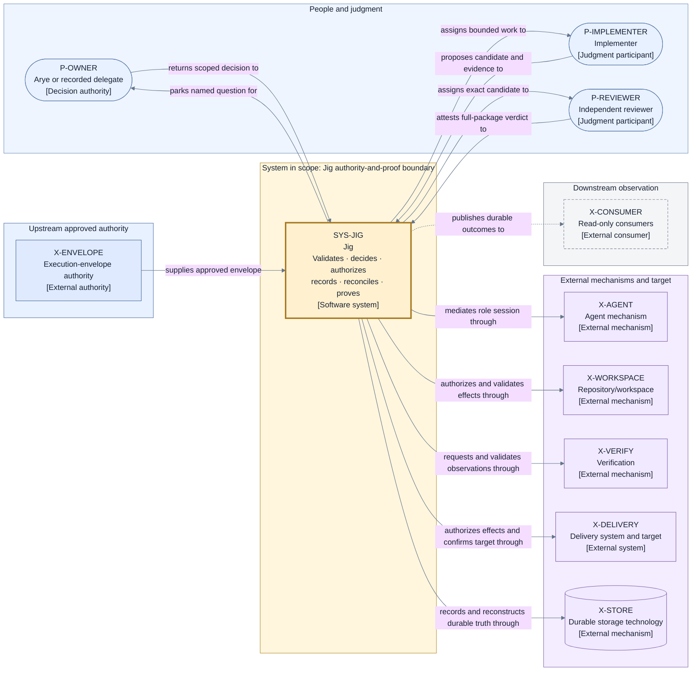
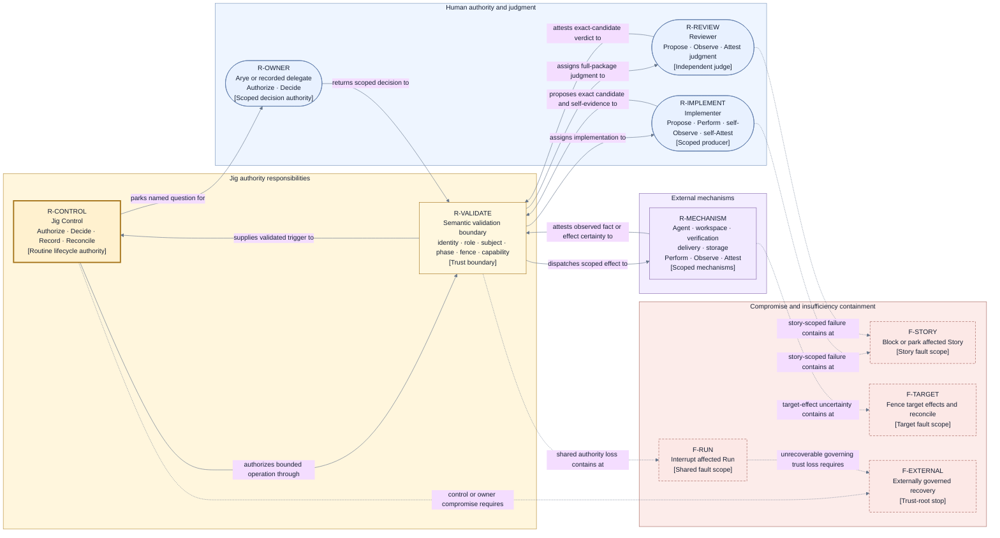

# Jig redesign — Layer 1 high-level architecture

## Document context and authority

| Context field            | Declaration                                                                                                                                                                                                                                                                                      |
| ------------------------ | ------------------------------------------------------------------------------------------------------------------------------------------------------------------------------------------------------------------------------------------------------------------------------------------------ |
| Active layer             | Layer 1 high-level architecture authoring and review.                                                                                                                                                                                                                                            |
| Candidate state          | Proposed final metadata-bearing candidate, pending exact-candidate recheck by the same independent `gpt-5.6-sol` reviewer using `xhigh` reasoning.                                                                                                                                               |
| Enabled decision         | Whether this exact connected two-artifact candidate faithfully reorganizes the already-established Layer 1 owner decisions. An exact `PASS` activates the recorded approval and lock under the bounded editorial/fidelity delegation; it does not select or change architecture.                 |
| Governing input          | The approved [Layer 0 project definition](./project-definition.md), together with the preserved owner decisions D1–D9 and invariants I1–I21.                                                                                                                                                     |
| Decision owner           | Arye Kogan retains all material product and architecture decision ownership. No author or delegated reviewer may infer, replace, or materially change an owner decision.                                                                                                                         |
| Canonical fact ownership | This document proposes the canonical Layer 1 model. The connected [decision record](./high-level-decisions.md) explains alternatives, rationale, consequences, and deferrals without redefining model facts.                                                                                     |
| Product-contract result  | No product promise or external product constraint was imported. There is therefore no product-contract conflict to resolve in this candidate.                                                                                                                                                    |
| Explicit exclusions      | Field schemas, signatures, exhaustive state/event/operation/error catalogs, concrete ports or adapters, algorithms and numeric budgets, technology, packages, source layout, cloud/deployment, persistence technology, implementation, migration, delivery sequencing, and current-state claims. |
| Layer 2 status           | Unauthorized and not started under this execution stop. A same-reviewer exact `PASS` approves and locks Layer 1 but does not authorize Layer 2; after the Layer 1 commit, work stops for Arye.                                                                                                   |

This artifact is reader-complete for Layer 1. Its provenance links are evidence, not prerequisite
reading. Historical proposal labels and review recommendations do not grant authority. The
architecture below faithfully re-expresses established owner decisions; it does not claim that the
architecture is implemented or current.

## Architecture at a glance

Jig owns the deterministic **authority-and-proof boundary** that turns an already-approved
**Execution Envelope** into reviewed, landed work or a deliberate, durable, inspectable non-delivery
outcome. It owns preflight sufficiency, stable identity, lifecycle and concurrency decisions,
operation authorization, authoritative recording, exact-subject validation, reconciliation, landing
proof, escalation, and preservation-safe retirement.

External participants retain their proper expertise and mechanisms retain their proper effects:

- the envelope authority supplies the approved plan, policy, and configuration;
- the implementer produces an exact candidate and attributable evidence;
- the reviewer independently judges the complete exact candidate;
- configured agent, workspace, verification, delivery, and storage mechanisms perform or observe
  scoped work; and
- Arye or an explicitly recorded delegate answers only the decisions within their recorded scope.

Jig validates every input and attestation before it can affect control state. **Jig Control** is the
sole routine lifecycle authority. It records an accepted transition and its operation intents in a
durable ordered ledger before adopting live state or dispatching effects. Recovery fences stale
control, reconstructs that durable truth, and reconciles uncertain effects before another semantic
attempt.

Eligible implementation and review may progress concurrently within explicit scarce-resource
capacity. Target-changing finalization is serialized through one target-scoped authority and a
deterministic total order. A valid reviewer approval of the exact candidate creates `Accepted`;
only authoritative proof that the target contains that accepted result creates `Landed` and releases
dependent work. Business outcome and retirement remain separate, so cleanup cannot reverse landing
or delay dependency release.

## Canonical vocabulary and stable identities

### Source and authority vocabulary

| Term                               | Canonical meaning                                                                                                                                                                                 |
| ---------------------------------- | ------------------------------------------------------------------------------------------------------------------------------------------------------------------------------------------------- |
| **Architecture Authority**         | The approved Layer 0 project definition plus explicit owner decisions.                                                                                                                            |
| **Owner Decision**                 | An explicit selection, import, approval, rejection, stop, exception, or reopen by Arye, or a bounded operational decision by a recorded delegate within scope; never silence or a document label. |
| **Working Contract**               | The applicable `AGENTS.md` and explicit author instructions. It governs behavior and source scope without selecting architecture.                                                                 |
| **Architecture Method**            | The active guidelines. They define how the layer is authored, reviewed, approved, and locked without selecting design.                                                                            |
| **Directional Source**             | The immutable standalone proposal: evidence to preserve, test, reorganize, or reject, not approved architecture.                                                                                  |
| **Review Evidence**                | Immutable archived findings used as adversarial scenarios and questions, not automatic fixes.                                                                                                     |
| **Product Reference**              | A targeted observation that may inform discussion but has no governing force. None was consulted for this candidate.                                                                              |
| **Imported Promise or Constraint** | An exact external statement made governing only by explicit owner import with provenance, rationale, consequences, and affected decisions. None was imported.                                     |
| **Proposed Architecture**          | This coherent final candidate. It becomes the approved, locked Layer 1 foundation only when the same reviewer returns exact-candidate `PASS` under the owner-approved bounded delegation.         |

### Runtime vocabulary

| Term                    | Canonical meaning                                                                                                                                                                 |
| ----------------------- | --------------------------------------------------------------------------------------------------------------------------------------------------------------------------------- |
| **Execution Envelope**  | The already-approved plan, policy, and configuration submitted to Jig as one run basis.                                                                                           |
| **Run**                 | One finite, stably identified evaluation of a frozen Execution Envelope.                                                                                                          |
| **Story**               | One stably identified unit within a Run, with approved requirements, dependencies, ordering facts, and an independent business outcome.                                           |
| **Jig Control**         | The logical authority that validates triggers, makes deterministic lifecycle decisions, authorizes operations, records durable truth, and reconciles interruption or uncertainty. |
| **Transition**          | One stably identified deterministic decision over the current authoritative state and one ordered, validated trigger.                                                             |
| **Operation**           | One stably identified, Jig-authorized request for a scoped external effect or observation.                                                                                        |
| **Candidate**           | One exact committed Story result, bound to its target basis, evidence, and delivery metadata.                                                                                     |
| **Accepted**            | Jig's durable lifecycle decision after valid reviewer approval of the exact Candidate and Jig's structural, identity, authority, evidence, findings, and lifecycle validation.    |
| **Landed**              | The durable business outcome recorded only after the authoritative target is observed to contain the Accepted result.                                                             |
| **Retirement**          | Settlement, fencing, preservation, cleanup, release, or explicit handoff of resources and proof obligations after a business outcome.                                             |
| **Residual Obligation** | A durable, owner-assigned Retirement or proof obligation that could not be completed automatically.                                                                               |

### Identity and binding model

| Stable identity         | Parent scope                                     | What it binds at Layer 1                                                                                                  |
| ----------------------- | ------------------------------------------------ | ------------------------------------------------------------------------------------------------------------------------- |
| Run identity            | Architecture-controlled run scope                | The frozen Execution Envelope, controller generation, ordered history, outcomes, and obligations.                         |
| Story identity          | Run                                              | Requirements, dependencies, immutable ordering facts, Candidate history, business outcome, and Retirement.                |
| Transition identity     | Run and expected prior ledger position           | One deterministic decision and the operation intents it authorizes; it survives an unknown commit acknowledgement.        |
| Operation identity      | Run or Story                                     | One semantic effect, its payload basis, authority fence, external result, and effect certainty.                           |
| Candidate identity      | Story                                            | Exact committed content, target basis, reviewed evidence, delivery metadata, acceptance, and Candidate-sensitive effects. |
| Controller generation   | Run                                              | Current control authority and the rejection of stale pre-interruption dispatchers.                                        |
| Finalization authority  | Configured target and Story                      | The sole current right to align, verify, and request target change for the bound Candidate basis.                         |
| Evidence subject        | Run, Story, Candidate, Operation, or target fact | The exact claim to which attributable evidence may contribute.                                                            |
| Owner decision identity | Named escalation and authority scope             | The exact question, authorized responder, selected action, and later continuation or stop.                                |

Identity representation and schemas are Layer 2 decisions. The binding rule is already fixed: a
stale, duplicate, late, wrong-role, wrong-subject, wrong-basis, or wrong-fence result cannot advance
state.

## System boundary and named external relationships

### Boundary rule

Jig's system boundary follows **authority and proof responsibility**, not packaging. A provider,
library, process, repository mechanism, or storage technology may be bundled with Jig and still
remain outside its decision-authority boundary. Conversely, Jig retains responsibility for a
semantic guarantee even when an external mechanism performs the work.

Jig owns:

- Execution Envelope intake, stable Run identity, deterministic preflight, and frozen Run definition;
- Story eligibility, admission, lifecycle, concurrency, finalization, outcome, and Retirement
  decisions;
- stable Transition and Operation identities, authorization, validation, fencing, and reconciliation;
- authoritative live projection and durable ordered recording;
- implementer and reviewer assignment and result validation;
- acceptance recording, exact-subject evidence binding, and evidence-integrity validation;
- semantic mediation of agent, workspace, verification, delivery, and storage mechanisms;
- landing confirmation, dependency release, preservation, and safe Retirement coordination;
- durable parking, escalation, scoped owner-decision intake, and deterministic continuation; and
- durable attributable outcomes and Residual Obligations.

External participants and systems do not gain those powers merely by returning a result.

| External participant or system | Relationship with Jig                                                                                         | Authority or proof limit                                                                        |
| ------------------------------ | ------------------------------------------------------------------------------------------------------------- | ----------------------------------------------------------------------------------------------- |
| Execution-envelope authority   | Supplies an already-approved plan, policy, and configuration.                                                 | Cannot implicitly mutate an accepted Run.                                                       |
| Arye or recorded delegate      | Receives a named escalation and returns an explicit scoped decision.                                          | Delegation does not imply product or architecture approval authority.                           |
| Implementer                    | Receives a bounded assignment and returns an exact Candidate, self-report, and evidence.                      | Cannot accept its own work, change lifecycle state, or authorize delivery.                      |
| Reviewer                       | Independently judges the exact Candidate and complete delivery package.                                       | Cannot edit the Candidate, perform delivery, or attest future target facts.                     |
| Agent mechanism                | Hosts role-specific work behind Jig's assignment and validation boundary.                                     | Cannot choose role, route, lifecycle, or authority.                                             |
| Repository/workspace mechanism | Performs isolation and repository effects and reports content, basis, cleanliness, and preservation facts.    | Cannot judge acceptance or mutate the authoritative target without separate delivery authority. |
| Verification mechanism         | Executes configured checks on the exact subject and returns observations.                                     | Cannot select required checks, judge overall sufficiency, or authorize delivery.                |
| Delivery system and target     | Performs authorized publication or integration and reports target, gate, effect-certainty, and landing facts. | Cannot choose whether delivery is allowed or declare lifecycle completion.                      |
| Durable storage technology     | Persists Jig-created records and reports durability or integrity.                                             | Cannot select semantic facts, transitions, retries, or recovery outcomes.                       |
| Read-only downstream consumers | Consume durable views, explanations, outcomes, and obligations.                                               | Cannot become an undeclared control path.                                                       |

### View V1 — system context and authority boundary

- **Question:** What is inside Jig's authority-and-proof boundary, and how do people, upstream
  authority, external mechanisms, the target, and downstream consumers relate to it?
- **View type:** System context and authority boundary.
- **Audience and purpose:** Arye, architecture reviewers, engineering, security, and operations;
  establish the system boundary and proof ownership before any detailed decomposition.
- **Scope and exclusions:** People and directly related systems at Layer 1. Internal components,
  ports, transports, deployment, technology, and provider topology are excluded.
- **State:** Proposed final metadata-bearing candidate; recorded Layer 1 approval and lock become
  effective only on the same reviewer's exact-candidate `PASS`.
- **Owner:** Arye Kogan.
- **Sources:** Approved project definition O1–O9 and C1–C14; D1–D3; I1–I3, I20–I21.
- **Related views:** V2 power/trust view, V3 lifecycle/information-flow view, and V4 state through
  finalization view in this document.
- **Stable IDs:** `P-OWNER`, `P-IMPLEMENTER`, `P-REVIEWER`, `X-ENVELOPE`, `SYS-JIG`, `X-AGENT`,
  `X-WORKSPACE`, `X-VERIFY`, `X-DELIVERY`, `X-STORE`, `X-CONSUMER`.
- **Relationship labels:** Every arrow has a directed verb phrase. Solid arrows carry authorized
  input, work, fact, or effect relationships; dashed arrows carry read-only publication.

**V1 legend:** Rounded rectangles are people; ordinary rectangles are authorities, systems,
mechanisms, or consumers; the cylinder is durable storage technology. The thick solid border marks
the one system in scope. A dashed border marks a read-only consumer. Blue `P-*`/`X-ENVELOPE` nodes
are people or upstream authority, yellow `SYS-*` is Jig, purple `X-*` nodes are external mechanisms,
and gray is downstream observation. Color is redundant: every node carries its stable ID and
bracketed type. Solid directed lines are authorized input, assignment, fact, or effect relationships;
the dashed directed line is publication with no control authority. `P` means person, `X` external,
and `SYS` software system; there are no other abbreviations.

## Responsibilities, power, trust, and compromise

### Power vocabulary

| Power         | Meaning                                                                                                        |
| ------------- | -------------------------------------------------------------------------------------------------------------- |
| **Propose**   | Supply a Candidate, recommendation, verdict, or requested action without changing authoritative control state. |
| **Perform**   | Execute work or an external effect.                                                                            |
| **Observe**   | Report a directly observed fact.                                                                               |
| **Attest**    | Return an attributable, contract-valid claim about an observation or judgment.                                 |
| **Authorize** | Permit one bounded Operation under the frozen Run basis and current authority.                                 |
| **Decide**    | Select a lifecycle state, business outcome, escalation, exception, or stop.                                    |
| **Record**    | Create the authoritative durable control fact.                                                                 |
| **Reconcile** | Resolve uncertain, duplicate, interrupted, or late activity from durable and external evidence.                |

### Responsibility and authority matrix

| Participant or responsibility  | Granted powers                              | Owns and may be trusted for                                                                                                                               | Explicitly excluded                                                                    |
| ------------------------------ | ------------------------------------------- | --------------------------------------------------------------------------------------------------------------------------------------------------------- | -------------------------------------------------------------------------------------- |
| Jig Control                    | Authorize, Decide, Record, Reconcile        | Input/result validation, scheduling, lifecycle, identity, authoritative state, recovery, proof obligations.                                               | Implementation/review judgment, provider-specific effects, or invented external facts. |
| Arye or recorded delegate      | Authorize, Decide                           | Architecture approval, policy or authority exceptions, imports, named escalations, stops, reopens, and bounded operational choices within recorded scope. | Routine implementation, verification, delivery, or implicit ambient intervention.      |
| Implementer                    | Propose, Perform, self-Observe, self-Attest | Implementation, exact Candidate, summary, changed scope, and evidence about its own work.                                                                 | Judging its own sufficiency, lifecycle authority, or remote-delivery authority.        |
| Reviewer                       | Propose, Observe, Attest judgment           | Full-package judgment of the exact Candidate and its delivery package.                                                                                    | Editing the Candidate, performing delivery, or directly changing lifecycle state.      |
| Agent mechanism                | Perform, Observe, Attest                    | Role-scoped session work and attributable result transport.                                                                                               | Selecting roles, routes, policy, or authority.                                         |
| Repository/workspace mechanism | Perform, Observe, Attest                    | Isolation and repository/content/basis/cleanliness/preservation facts.                                                                                    | Implementing, accepting, scheduling dependencies, or choosing remote integration.      |
| Verification mechanism         | Perform, Observe, Attest                    | Configured exact-subject check observations.                                                                                                              | Selecting required checks, judging whole-package sufficiency, or authorizing delivery. |
| Delivery mechanism             | Perform, Observe, Attest                    | Authorized publication/integration effects, target facts, remote gates, effect certainty, landing observations.                                           | Choosing whether delivery is allowed or declaring lifecycle completion.                |
| Durable store                  | Perform storage, Attest persistence         | Preservation and integrity of Jig-created authoritative records.                                                                                          | Selecting semantic facts, transitions, retries, or reconciliation outcomes.            |
| Read-only consumers            | Observe                                     | Durable views, explanations, outcomes, and obligations.                                                                                                   | Any undeclared control input.                                                          |

Participants never write authoritative lifecycle history directly. Jig records their validated
attestations and any accepted owner decision as inputs to its next deterministic transition.

### Trust and compromise posture

1. Every external result is validated against request identity, participant role, exact subject,
   current lifecycle position, controller and authority fences, and configured capability.
2. A mechanism is trusted only for its scoped effect or observation. Its output cannot widen its
   power or promote a success claim into an authoritative lifecycle fact.
3. Implementer evidence and reviewer judgment remain attributable inputs. A trusted envelope proves
   provenance, binding, and integrity; it does not make an underlying claim semantically true.
4. Missing, contradictory, stale, malformed, wrong-subject, unauthorized, or integrity-failing
   input creates no claimed fact and authorizes no progress.
5. A participant failure confined to one Story may block or park that Story while unrelated work
   continues with trustworthy authority and sufficient capacity.
6. Uncertainty or compromise of target-scoped authority fences further target effects while safe
   implementation and review may continue.
7. Loss or compromise of shared Jig authority, the ordered ledger, or controller fencing interrupts
   the affected Run. Compromise of Jig Control or owner decision authority is a trust-root failure.
8. Trust-root recovery is externally governed. Jig makes no autonomous safety, reconstruction,
   no-double-effect, or terminal-truth guarantee after the governing history or decision authority
   becomes untrustworthy.

### View V2 — responsibility, power, trust, and external relationships

- **Question:** Who may propose, perform, observe, attest, authorize, decide, record, and reconcile,
  how is external trust validated, and how far does compromise propagate?
- **View type:** Responsibility, power, trust, and external-relationship view.
- **Audience and purpose:** Architecture, security, engineering, and operations reviewers; make
  authority allocation and compromise containment explicit without prescribing components.
- **Scope and exclusions:** Major logical responsibilities, participant powers, validation, and fault
  scopes. Credentials, identity formats, sandboxing, interfaces, and enforcement mechanisms are
  excluded.
- **State:** Proposed final metadata-bearing candidate; recorded Layer 1 approval and lock become
  effective only on the same reviewer's exact-candidate `PASS`.
- **Owner:** Arye Kogan.
- **Sources:** D2, D3, D8; I2–I3, I7, I15, I20; Layer 0 QS6, QS8, and QS11.
- **Related views:** V1 locates participants; V3 shows when powers apply; V4 relates authority to
  durable state and finalization.
- **Stable IDs:** `R-CONTROL`, `R-VALIDATE`, `R-OWNER`, `R-IMPLEMENT`, `R-REVIEW`, `R-MECHANISM`,
  `F-STORY`, `F-TARGET`, `F-RUN`, `F-EXTERNAL`.
- **Relationship labels:** Solid arrows carry normal proposed work, attestations, validation, or
  authorization; dashed arrows carry compromise or insufficiency containment.

**V2 legend:** Rounded rectangles are people; ordinary rectangles are logical responsibilities or
fault outcomes. Thick solid border marks the sole routine lifecycle authority. Dashed borders mark
containment or stop outcomes rather than normal participants. Yellow `R-*` nodes are Jig authority
or validation, blue `R-*` nodes are people, purple is the grouped external mechanism responsibility,
and red `F-*` nodes are fault scopes. Color is supplementary; IDs, bracketed types, shapes, and
borders carry the same meaning. Solid directed lines are normal assignment, authorization,
attestation, validation, or decision flow. Dashed directed lines are failure/compromise propagation.
`R` means responsibility and `F` fault scope; the words in the mechanism node expand its categories.

## Run and Story lifecycle with authoritative information flow

### Run lifecycle

| Run stage                    | Meaning                                                                                                                            | Exit or owned stop                                                                                                                             |
| ---------------------------- | ---------------------------------------------------------------------------------------------------------------------------------- | ---------------------------------------------------------------------------------------------------------------------------------------------- |
| **Received**                 | Jig assigns a stable Run identity to the submitted Execution Envelope. No execution effect has occurred.                           | Proceed to Preflighting.                                                                                                                       |
| **Preflighting**             | Validate the whole envelope, authority, routes, required capabilities, resource feasibility, and policy.                           | Reject durably before Story effects, or freeze the Run definition and activate.                                                                |
| **Active**                   | Derive eligibility, admit work within resource-class capacity, coordinate Story lifecycles, and serialize target finalization.     | Continue while business progress is possible; park or interrupt only at the smallest safe scope.                                               |
| **Parked**                   | A durable named Run- or Story-scoped question awaits Arye or a recorded delegate.                                                  | A valid scoped decision deterministically continues, blocks, or stops; unaffected work continues only when shared authority is not implicated. |
| **Interrupted / Recovering** | Fence stale control, verify and reconstruct durable state, reconcile operations, authorities, target facts, and uncertain effects. | Resume, park, block, or stop only after authoritative state is trustworthy.                                                                    |
| **Settling**                 | No Story can make further business progress; final outcomes and Retirement obligations are being resolved.                         | Complete after all outcomes and obligations are final or explicitly handed off.                                                                |
| **Completed**                | Every Story has a final business outcome and every Retirement obligation is complete or an owner-accepted Residual Obligation.     | Terminal durable Run result.                                                                                                                   |

A preflight rejection is a durable Run-level non-delivery outcome, not `Completed` delivery. An
interrupted Run does not resume from ambient process state; it resumes only from reconstructed and
reconciled authority.

### Story lifecycle

| Story stage                  | Meaning and authority                                                                                                                                                                                            |
| ---------------------------- | ---------------------------------------------------------------------------------------------------------------------------------------------------------------------------------------------------------------- |
| **Pending**                  | Wait for every prerequisite to be confirmed `Landed`; allocate no Story resources.                                                                                                                               |
| **Eligible**                 | Enter deterministic admission ordering when prerequisites and resource-class capacity permit.                                                                                                                    |
| **Preparing**                | Establish isolated resources and a bounded implementer assignment.                                                                                                                                               |
| **Implementing**             | Produce a committed exact Candidate and the evidence required by the frozen Run basis.                                                                                                                           |
| **Reviewing**                | An independent reviewer judges the complete exact Candidate; changes return through separately bounded rework.                                                                                                   |
| **Accepted**                 | Jig durably records valid reviewer approval after identity, authority, exact binding, evidence availability/integrity, findings, and lifecycle validation.                                                       |
| **Waiting for finalization** | Wait in deterministic order without target finalization authority and without repeated target mutation.                                                                                                          |
| **Finalizing**               | Hold the sole target-scoped authority; align to target, renew review after Candidate-changing refresh, perform policy-selected final verification, authorize delivery, reconcile uncertainty, and prove landing. |
| **Business outcome**         | Record `Landed`, directly `Blocked`, or derive `Not run — dependency blocked`.                                                                                                                                   |
| **Retiring**                 | Settle or fence pending operations, release authority, preserve work/evidence, close sessions, and safely retire or hand off resources.                                                                          |
| **Closed**                   | Both business outcome and Retirement obligations are final.                                                                                                                                                      |

These are high-level phases, not an exhaustive state machine. `Parked` and `Interrupted / Recovering`
may suspend a Run or a Story without replacing the Story's underlying phase. Exact substates,
transitions, event types, counters, and cancellation behavior belong to Layer 2.

### Business outcome and Retirement are orthogonal

| Business outcome               | Immediate consequence                                                                                 | Retirement that still follows                                                                                             |
| ------------------------------ | ----------------------------------------------------------------------------------------------------- | ------------------------------------------------------------------------------------------------------------------------- |
| `Landed`                       | Dependents become eligible immediately after authoritative proof. Cleanup cannot reverse the outcome. | Release finalization authority, settle operations, preserve evidence, close sessions, and retire or hand off resources.   |
| Directly `Blocked`             | Transitive dependents become ineligible immediately; independent work may continue.                   | Reconcile uncertainty, preserve work/evidence, apply governing preservation policy, release authority, and retire safely. |
| `Not run — dependency blocked` | Report the complete canonically ordered set of reachable direct blocker roots.                        | No Story resources were allocated, so Retirement is already satisfied.                                                    |

### Authoritative transition ordering

Every accepted trigger follows one invariant sequence:

1. validate its identity, role, exact subject, authority fence, capability, and current authoritative
   lifecycle position;
2. deterministically calculate the next decision, stable Transition identity, and authorized
   Operation identities;
3. conditionally and durably record that decision and the Operation intents against the expected
   prior ledger position;
4. confirm the exact durable commit or reconcile its acknowledgement;
5. only after confirmed commit, adopt the new live projection and dispatch authorized mechanisms;
6. receive attributable mechanism results or effect certainty as later ordered triggers; and
7. validate, record, and decide again. Uncertain persistence or effects enter reconciliation rather
   than assumption or blind retry.

An owner escalation obeys the same order: Jig records a bounded parked question, validates the
responder and delegated scope, records the selected decision, and only then continues or stops.

### View V3 — Run/Story lifecycle and authoritative information flow

- **Question:** How does a Run and each Story progress on the primary success path, where do
  rejection, failure, interruption, and uncertainty branch, and what ordering makes the flow
  authoritative?
- **View type:** Coarse lifecycle and authoritative information-flow view.
- **Audience and purpose:** Product, architecture, engineering, security, and operations; verify one
  complete success and unhappy-path narrative with record-before-adopt/dispatch ordering.
- **Scope and exclusions:** High-level Run/Story phases and durable decision flow. Exhaustive states,
  event/operation catalogs, retry counts, timers, algorithms, and provider mechanics are excluded.
- **State:** Proposed final metadata-bearing candidate; recorded Layer 1 approval and lock become
  effective only on the same reviewer's exact-candidate `PASS`.
- **Owner:** Arye Kogan.
- **Sources:** D4, D5, D8; I4–I7, I15–I19; Layer 0 QS1, QS5–QS9, and QS12.
- **Related views:** V1 supplies the boundary; V2 supplies powers and fault scopes; V4 expands the
  state, acceptance, concurrency, and finalization relationships.
- **Stable IDs:** `RUN-RECEIVED`, `RUN-PREFLIGHT`, `RUN-REJECTED`, `FLOW-VALIDATE`, `FLOW-DECIDE`,
  `FLOW-RECORD`, `FLOW-ADOPT`, `STORY-WORK`, `STORY-REVIEW`, `STORY-ACCEPTED`, `STORY-WAIT`,
  `STORY-FINALIZE`, `OUT-LANDED`, `OUT-BLOCKED`, `OUT-NOTRUN`, `STORY-RETIRE`, `STORY-CLOSED`,
  `RUN-RECOVER`, `RUN-PARK`, `RUN-STOP`.
- **Relationship labels:** Solid arrows are normal authoritative progression. Dashed arrows are
  rejection, failure, interruption, uncertainty, or assumption-loss branches. The numbered labels
  on `FLOW-*` arrows make commit-before-adoption ordering non-visual and explicit.

```mermaid
%%{init: {"theme": "base", "themeVariables": {"fontFamily": "Inter, ui-sans-serif, system-ui", "primaryTextColor": "#172033", "lineColor": "#65758b"}}}%%
flowchart LR
    subgraph Intake["Run intake and authoritative transition"]
        Received["RUN-RECEIVED<br/>Received<br/>[Run phase]"]
        Preflight["RUN-PREFLIGHT<br/>Preflighting<br/>[Run phase]"]
        Rejected["RUN-REJECTED<br/>Durable preflight rejection<br/>[Run outcome]"]
        Validate["FLOW-VALIDATE<br/>1 · Validate trigger and authority<br/>[Decision step]"]
        Decide["FLOW-DECIDE<br/>2 · Calculate deterministic decision<br/>[Decision step]"]
        Record[("FLOW-RECORD<br/>3–4 · Commit ordered decision and intents<br/>[Durable authority]")]
        Adopt["FLOW-ADOPT<br/>5 · Adopt projection and dispatch<br/>[Decision step]"]
    end

    subgraph Story["Primary Story progression"]
        Work["STORY-WORK<br/>Pending · Eligible · Preparing · Implementing<br/>[Story phases]"]
        Review["STORY-REVIEW<br/>Reviewing<br/>[Story phase]"]
        Accepted["STORY-ACCEPTED<br/>Accepted<br/>[Durable lifecycle decision]"]
        Wait["STORY-WAIT<br/>Waiting for finalization<br/>[Story phase]"]
        Finalize["STORY-FINALIZE<br/>Finalizing<br/>[Target authority phase]"]
    end

    subgraph Outcomes["Business outcome and Retirement"]
        Landed["OUT-LANDED<br/>Landed<br/>[Business outcome]"]
        Blocked["OUT-BLOCKED<br/>Directly Blocked<br/>[Business outcome]"]
        NotRun["OUT-NOTRUN<br/>Not run — dependency blocked<br/>[Derived outcome]"]
        Retire["STORY-RETIRE<br/>Retiring<br/>[Obligation phase]"]
        Closed["STORY-CLOSED<br/>Closed<br/>[Story terminal]"]
    end

    subgraph Exceptions["Owned rejection, failure, interruption, and uncertainty"]
        Recover["RUN-RECOVER<br/>Interrupted / Recovering<br/>[Recovery phase]"]
        Park["RUN-PARK<br/>Parked named question<br/>[Authority wait]"]
        Stop["RUN-STOP<br/>Durable named stop<br/>[Run outcome]"]
    end

    Received -->|"begins"| Preflight
    Preflight -.->|"invalid or insufficient envelope rejects before Story effects"| Rejected
    Preflight -->|"freezes valid Run definition and submits trigger to"| Validate
    Validate -->|"1 · supplies ordered validated trigger to"| Decide
    Decide -->|"2 · proposes transition and Operation intents to"| Record
    Record -->|"3–4 · confirms exact durable commit before"| Adopt
    Adopt -->|"5 · dispatches authorized Story work to"| Work
    Work -->|"submits committed exact Candidate to"| Review
    Review -->|"valid exact-Candidate approval permits"| Accepted
    Review -->|"changes required returns through bounded rework to"| Work
    Accepted -->|"enters deterministic order at"| Wait
    Wait -->|"acquires sole target authority for"| Finalize
    Finalize -->|"authoritative target proof records"| Landed
    Landed -->|"releases dependents and begins"| Retire
    Retire -->|"completes or hands off every obligation before"| Closed

    Work -.->|"bounded failure may record"| Blocked
    Review -.->|"unapprovable or exhausted rework may record"| Blocked
    Finalize -.->|"reconciled failure may record"| Blocked
    Blocked -->|"begins preservation-safe"| Retire
    Blocked -->|"makes transitive dependents derive"| NotRun
    Adopt -.->|"interruption or shared authority loss enters"| Recover
    Finalize -.->|"uncertain effect enters"| Recover
    Recover -->|"reconstructs and reconciles before resubmitting to"| Validate
    Recover -.->|"unresolved scoped authority question enters"| Park
    Park -->|"validated owner decision resubmits to"| Validate
    Recover -.->|"trust or liveness assumption failure records"| Stop
    Park -.->|"explicit stop decision records"| Stop

    style Intake fill:#eef5ff,stroke:#7a96bd,color:#172033
    style Story fill:#fff6dd,stroke:#b8903a,color:#172033
    style Outcomes fill:#edf8f0,stroke:#659574,color:#172033
    style Exceptions fill:#fcecea,stroke:#aa6b64,color:#172033
    classDef run fill:#e8f1ff,stroke:#5a78a8,color:#172033
    classDef decision fill:#fff1cf,stroke:#a8781f,color:#172033
    classDef durable fill:#fff1cf,stroke:#a8781f,stroke-width:3px,color:#172033
    classDef story fill:#fff7df,stroke:#a8781f,color:#172033
    classDef outcome fill:#e8f7ed,stroke:#4f8a63,color:#172033
    classDef exception fill:#fce8e6,stroke:#a7615b,stroke-dasharray:5 3,color:#172033
    class Received,Preflight run
    class Validate,Decide,Adopt decision
    class Record durable
    class Work,Review,Accepted,Wait,Finalize story
    class Landed,Blocked,NotRun,Retire,Closed,Rejected outcome
    class Recover,Park,Stop exception
```

**V3 legend:** Rectangles are phases, decision steps, or outcomes; the cylinder is the authoritative
durable commit. Thick border marks the durable authority point. Dashed borders mark exceptional
recovery, authority-wait, or stop states. Blue `RUN-*`/`FLOW-*` nodes cover Run intake and transition
ordering, yellow `STORY-*` nodes cover Story progression, green `OUT-*` nodes and related rectangles
cover outcomes/Retirement, and red nodes cover exceptional paths. Color is redundant because each
node has a stable ID and bracketed type. Solid arrows are the normal path; dashed arrows are explicit
rejection, failure, interruption, uncertainty, or assumption-loss branches. `RUN` means Run,
`FLOW` authoritative transition step, `STORY` Story phase, and `OUT` business or derived outcome.

## Durable, transient, and derived state

### State classification

| Classification                         | Canonical contents                                                                                                                                                                                                                                                                                                                           | Authority rule                                                                                      |
| -------------------------------------- | -------------------------------------------------------------------------------------------------------------------------------------------------------------------------------------------------------------------------------------------------------------------------------------------------------------------------------------------- | --------------------------------------------------------------------------------------------------- |
| **Durable authority**                  | Run identity and frozen envelope; ordered Transition decisions; stable Operation identities and effect certainty; Story business and Retirement states; Candidates, reviews, acceptance, evidence references, target bases, fences, bounds, waits, landing proof, owner decisions, escalations, Residual Obligations, and terminal outcomes. | The ordered ledger is the sole control truth.                                                       |
| **Transient mechanism or cache state** | In-memory projections and indexes; prepared but unrecorded requests; queues and capacity calculations; live provider clients/process handles; local timers; UI/read-model caches; temporary access material; unaccepted observations.                                                                                                        | Replaceable and never independently authoritative.                                                  |
| **Derived and recomputable state**     | Eligibility, dependency-blocked outcomes, total ordering, capacity use, summaries, read-only projections, metrics, and compact completed-Story indexes.                                                                                                                                                                                      | Recompute from durable authority and frozen definition; do not maintain as competing mutable truth. |

An opaque external resource identity is durable when recovery needs it; a live provider object is not.
Credentials and secret values never enter durable authority or durable evidence.

### Durable ordering and uncertain acknowledgement

The durable ordered Transition ledger remains authoritative. A snapshot or materialized current view
may accelerate reconstruction only when its ledger position and integrity are verifiable.

When commit acknowledgement is lost, Jig resolves the stable Transition identity and expected prior
position:

- **confirmed committed:** adopt the recorded Transition exactly once;
- **confirmed absent:** retry the same Transition identity and content; or
- **indeterminate:** halt advancement and enter Recovery.

Jig never dispatches an effect from an indeterminate control commit.

### Operation identity and fencing

- One semantic effect has one durable Operation identity.
- Duplicate-safe redispatch retains the same identity, payload basis, and authority fence.
- A new linked semantic attempt is allowed only after the earlier effect is reconciled.
- Candidate-sensitive work binds the Story, Candidate, target basis, and current finalization
  authority.
- A durable controller generation rejects stale pre-interruption dispatchers.
- Stale, duplicate, mismatched, late, or wrong-fence results never advance state.

### Reconstruction and reconciliation

After interruption, Jig acquires a new controller generation, verifies the ledger, reconstructs
canonical state, enumerates pending and uncertain Operations, reconciles external state, records the
observations, revalidates authorities, and only then resumes.

No irreversible effect is blindly replayed:

- confirmed effect: adopt its factual result;
- confirmed absence: frozen policy may authorize a bounded retry; or
- indeterminate effect: park and escalate without authorizing a second semantic effect.

If the ledger is unavailable, corrupted, rolled back, or compromised beyond trustworthy recovery,
Jig cannot guarantee reconstruction, audit completeness, Operation ownership, no-double-effect
behavior, safe autonomous resume, or trustworthy terminal outcomes. It fails closed and requires
externally governed recovery.

## Reviewer-principal acceptance and trustworthy evidence

### Acceptance authority

The reviewer owns full-package judgment of:

- the implementation;
- requirements and acceptance criteria;
- technical and delivery risk;
- implementer evidence sufficiency, provenance, and relevance;
- findings and unresolved issues; and
- delivery metadata accuracy and completeness.

A valid reviewer approval of the exact Candidate is the acceptance gate and permits finalization.
Jig validates reviewer identity and authority, exact Candidate and lifecycle binding, required
evidence availability and integrity, absence of unresolved findings, and current lifecycle position.
Jig then durably records `Accepted` without independently rejudging the reviewer's sufficiency
assessment.

This model deliberately retains reviewer-judgment and evidence-sufficiency risk. A trusted envelope
can prove provenance, exact binding, and integrity but cannot make a false underlying claim true or
guarantee semantic correctness. That accepted consequence is especially material when final
verification is `none`; it is not an omitted decision.

### Policy-selected final verification

The frozen policy selects exactly one high-level posture:

- **`deterministic`:** run the configured final check set against the exact Accepted Candidate before
  delivery; or
- **`none`:** proceed from reviewer approval and the reviewed implementer evidence.

Configuration and providers may satisfy or exceed policy but cannot lower or silently change it. A
failed required verification prevents delivery. Candidate mutation or changed delivery metadata
invalidates acceptance; a Candidate-changing target refresh requires a new full review.

### Evidence roles

| Evidence source                | Contribution                                                                                                            | Limit                                                                                |
| ------------------------------ | ----------------------------------------------------------------------------------------------------------------------- | ------------------------------------------------------------------------------------ |
| Implementer                    | Candidate, summary, changed scope, self-report, assigned-check evidence, and supporting artifacts.                      | Cannot judge its own sufficiency or authorize lifecycle/delivery.                    |
| Reviewer                       | Full-package judgment and exact-Candidate verdict.                                                                      | Cannot perform delivery or attest future target/effect facts.                        |
| Repository/workspace mechanism | Exact content, branch, target basis, cleanliness, and preservation observations.                                        | Cannot judge acceptance.                                                             |
| Verification mechanism         | Policy-selected exact-Candidate check observations.                                                                     | Cannot choose checks or judge whole-package sufficiency.                             |
| Delivery mechanism             | Remote identity, gate state, effect certainty, and landing observations.                                                | Cannot declare lifecycle completion.                                                 |
| Jig trusted envelope           | Run scope, producer attribution, correlation, recorded time, subject association, completeness, and integrity metadata. | Does not make the underlying claim true merely because it is well formed or durable. |

Large or provider-shaped evidence remains in immutable, bounded supporting artifacts. The ledger
keeps bounded decision facts, manifest completeness, digests, and references. Evidence required by a
decision must be available, authorized, exact-subject-bound, and integrity-valid. Candidate, target
basis, or delivery-metadata mutation invalidates current use of prior acceptance and evidence.

### Landing proof

Delivery success is not landing proof. Jig records `Landed` only after a post-effect observation
establishes that the configured authoritative target contains the Accepted result under the selected
integration method. Publication, pull-request creation, passing checks, a merge request, or an
integration response is insufficient alone. Missing, contradictory, or indeterminate landing
evidence enters reconciliation and cannot release dependencies.

## Concurrency, capacity, deterministic order, and finalization

### Resource-class capacity and progress

Capacity is modeled by actual scarce resource class, not an active-Story count alone. Relevant
classes may include isolation resources, retained session identities, active implementer or reviewer
turns, verification execution, delivery Operations, provider-specific execution capacity, and the
single target finalization authority. This list names high-level capacity classes, not concrete
provider pools or a resource schema.

Frozen policy defines allowed maxima and required progress reserve. Configuration declares hard
available capacity. An optional maximum resolves to the lower supported value. Preflight rejects a
Run when a mandatory class is unavailable, an explicit policy minimum is unsupported, or the
combination cannot preserve a path for admitted work to reach its next mandatory safe point.

When capacity is constrained, Jig advances or retires admitted work before admitting new Stories. A
maximum active-Story ceiling may supplement this posture but cannot replace the resource-class model.

### Deterministic total order

Every Story has three immutable, preflight-validated ordering facts:

1. approved plan priority;
2. immutable plan ordinal; and
3. unique Story identity.

The tuple is the total comparator for otherwise-equal admission, finalization, and blocker
attribution decisions. An admitted Story or current finalization authority holder is not preempted
by a later higher-priority Story.

### Target-scoped finalization authority

- Exactly one Story owns finalization authority for the configured target.
- Accepted Stories wait in deterministic order without authority and do not repeatedly refresh or
  mutate the target.
- The authority fence binds Story, controller generation, Candidate, target basis, and authority
  generation.
- A bounded target refresh may retain Story ownership; Candidate-changing refresh requires renewed
  full review and atomic authority rebinding.
- Ordinary implementation rework releases authority and returns through acceptance.
- Landing, reconciled block, explicit stop, or Recovery-driven transfer releases authority.
- Recovery reconstructs and reconciles authority and target state before resuming or reassigning.

Only confirmed landing releases dependencies. Direct blockers remain durable facts. A Story blocked
by multiple paths reports the complete, canonically ordered set of reachable direct blocker roots.

## Failure containment, bounded progress, liveness, and Retirement

### Smallest-safe failure containment

| Fault scope         | Required posture                                                                                      | Safe continuation                                                                   |
| ------------------- | ----------------------------------------------------------------------------------------------------- | ----------------------------------------------------------------------------------- |
| Preflight           | Reject the Run durably before Story effects.                                                          | No Story starts.                                                                    |
| Story               | Apply bounded retry or rework, then block or park; preserve and retire resources.                     | Independent Stories continue; transitive dependents remain ineligible.              |
| Target/finalization | Fence further target effects and reconcile the current Operation before another finalizer proceeds.   | Safe implementation and review may continue within capacity.                        |
| Shared Run          | Stop new dispatch, interrupt, reconstruct, reconcile, and resume only after authority is trustworthy. | No control transition continues while the ledger or controller authority is unsafe. |
| Trust root          | Fail autonomous progress closed and name the lost guarantee.                                          | Only externally governed recovery may continue.                                     |

A failure remains at the smallest safe scope. It becomes shared only when uncertainty, authority, or
proof crosses Story boundaries.

### Bounded progress and exhaustion

Every retry, rework, target refresh, wait, Recovery attempt, and Retirement path has:

- a named accountable owner;
- a durable reason;
- a wake or completion condition;
- a deadline, attempt, or budget class;
- a next action on success; and
- an explicit exhaustion action.

Durable waits create typed wake triggers; transient timers carry no decision authority. Exhaustion
becomes an explicit retry, block, park, escalation, interruption, stop, or Residual Obligation,
never silent success or an unnamed indefinite wait. A best-effort Operation may fail without blocking
only when frozen policy classifies it as non-gating and Jig records the failure durably.

### Automatic fail-closed behavior and owner authority

Jig automatically fails closed for invalid or insufficient input, identity, authority, fence,
subject, lifecycle position, evidence, durable recording, Candidate approval, effect certainty,
target proof, landing proof, or shared trust.

Arye or a recorded delegate within explicit scope is required to change policy or authority scope,
revise a gate, accept a Residual Obligation, govern trust-root Recovery, choose a risk-bearing
ambiguity, stop or replace a Run definition, approve otherwise unauthorized destructive cleanup, or
import a governing promise. An owner decision may authorize investigation, safe stop, or residual
handoff; it cannot turn missing evidence into a factual effect or landing claim.

### Finite-scope liveness guarantee and assumptions

For a finite frozen Run, Jig guarantees that no accepted scope remains in an unnamed or unbounded
wait. Every Story eventually reaches `Landed`, directly `Blocked`, or derived
`Not run — dependency blocked`; every Retirement obligation eventually completes or becomes an
explicit owner-accepted Residual Obligation.

The guarantee assumes:

1. the accepted evaluated scope remains finite and fixed;
2. the ordered ledger, controller fence, and decision authority remain trustworthy;
3. required configured resource capacity eventually becomes available;
4. participating mechanisms respond or reach a bounded timeout;
5. the target eventually remains stable long enough for bounded finalization; and
6. Arye or an explicitly recorded delegate eventually answers escalations.

If an assumption fails, Jig guarantees a durable named stop condition and explicit loss of guarantee,
not successful delivery or autonomous completion.

### Retirement and Residual Obligations

Retirement settles or fences pending Operations, preserves committed work and evidence, applies
required preservation behavior, releases finalization authority, closes sessions, and safely removes
or hands off resources. Destructive cleanup is never evidence of business success.

When automatic Retirement cannot complete, Jig records a Residual Obligation that identifies the
affected resource or proof obligation, reason, preservation and safety evidence, accountable owner,
accepted handoff decision, and completion or residual status. A Run completes only after every
obligation is retired or explicitly handed off.

### View V4 — state, recovery, acceptance, concurrency, and finalization

- **Question:** How do durable authority, replaceable state, Recovery, exact-Candidate acceptance,
  resource-class concurrency, single-target finalization, landing proof, dependency release, and
  Retirement relate without creating a competing source of truth?
- **View type:** Cross-cutting state, Recovery, acceptance, concurrency, and finalization relationship
  view.
- **Audience and purpose:** Architecture, engineering, security, and operations; expose the complete
  authority and proof chain from durable basis through final outcome while keeping detailed contracts
  deferred.
- **Scope and exclusions:** Layer 1 ownership and dependency relationships. Storage technology,
  schemas, queue/reservation algorithms, exact verification commands, merge methods, and cleanup
  mechanics are excluded.
- **State:** Proposed final metadata-bearing candidate; recorded Layer 1 approval and lock become
  effective only on the same reviewer's exact-candidate `PASS`.
- **Owner:** Arye Kogan.
- **Sources:** D5–D8; I5–I20; Layer 0 QS2–QS9 and QS12.
- **Related views:** V1 locates external systems; V2 owns powers/trust; V3 owns progression and
  record-before-adopt/dispatch ordering.
- **Stable IDs:** `S-LEDGER`, `S-PROJECTION`, `S-DERIVED`, `S-RECOVERY`, `A-CANDIDATE`, `A-EVIDENCE`,
  `A-REVIEW`, `A-ACCEPTED`, `C-CAPACITY`, `C-ORDER`, `C-FINALIZER`, `X-TARGET`, `F-PROOF`,
  `F-RELEASE`, `F-RETIRE`.
- **Relationship labels:** Solid arrows show authoritative derivation, validation, admission, or
  finalization. Dashed arrows show reconstruction/reconciliation or the explicitly separate
  Retirement path. Edge labels state direction and no meaning relies on placement or color.

```mermaid
%%{init: {"theme": "base", "themeVariables": {"fontFamily": "Inter, ui-sans-serif, system-ui", "primaryTextColor": "#172033", "lineColor": "#65758b"}}}%%
flowchart LR
    subgraph State["Authority and replaceable state"]
        Ledger[("S-LEDGER<br/>Ordered Transition ledger<br/>[Durable authority]")]
        Projection["S-PROJECTION<br/>Live projection and mechanism state<br/>[Transient]"]
        Derived["S-DERIVED<br/>Eligibility · ordering · capacity · summaries<br/>[Derived]"]
        Recovery["S-RECOVERY<br/>Fence · reconstruct · reconcile<br/>[Recovery responsibility]"]
    end

    subgraph Acceptance["Exact-Candidate acceptance"]
        Candidate["A-CANDIDATE<br/>Exact committed Candidate and target basis<br/>[Subject]"]
        Evidence["A-EVIDENCE<br/>Attributable exact-subject evidence<br/>[Proof input]"]
        Review(["A-REVIEW<br/>Independent full-package review<br/>[Judgment]"])
        Accepted["A-ACCEPTED<br/>Accepted<br/>[Durable lifecycle decision]"]
    end

    subgraph Concurrency["Concurrency and target authority"]
        Capacity["C-CAPACITY<br/>Scarce resource-class capacity<br/>with progress reserve<br/>[Admission constraint]"]
        Order["C-ORDER<br/>Priority · plan ordinal · Story ID<br/>[Total comparator]"]
        Finalizer["C-FINALIZER<br/>Exactly one target-scoped authority<br/>[Serialized finalization]"]
    end

    subgraph Finalization["Proof, release, and separate Retirement"]
        Target["X-TARGET<br/>Configured authoritative target<br/>[External fact source]"]
        Proof["F-PROOF<br/>Target contains Accepted result<br/>[Landing proof]"]
        Release["F-RELEASE<br/>Record Landed and release dependents<br/>[Business outcome]"]
        Retire["F-RETIRE<br/>Preserve · settle · release · clean or hand off<br/>[Retirement]"]
    end

    Ledger -->|"reconstructs current facts into"| Projection
    Ledger -->|"deterministically derives"| Derived
    Projection -.->|"interruption submits durable facts to"| Recovery
    Recovery -.->|"verifies and reconciles before appending to"| Ledger

    Candidate -->|"binds subject for"| Evidence
    Candidate -->|"is judged exactly by"| Review
    Evidence -->|"is assessed for sufficiency by"| Review
    Review -->|"attests approval for validation into"| Accepted
    Accepted -->|"is recorded in"| Ledger

    Derived -->|"supplies eligible work to"| Capacity
    Capacity -->|"admits work while preserving progress under"| Order
    Order -->|"selects next waiting Accepted Story for"| Finalizer
    Accepted -->|"waits without authority until selected by"| Finalizer
    Finalizer -->|"authorizes exact-basis effect against"| Target
    Target -->|"returns independently observed fact for"| Proof
    Proof -->|"permits durable"| Release
    Release -->|"records business outcome in"| Ledger
    Release -.->|"immediately releases dependents before"| Retire
    Retire -.->|"completes or records Residual Obligation in"| Ledger
    Finalizer -.->|"uncertain effect returns to"| Recovery

    style State fill:#eef5ff,stroke:#7a96bd,color:#172033
    style Acceptance fill:#edf8f0,stroke:#659574,color:#172033
    style Concurrency fill:#fff6dd,stroke:#b8903a,color:#172033
    style Finalization fill:#f3edff,stroke:#8a6eb0,color:#172033
    classDef durable fill:#e8f1ff,stroke:#5a78a8,stroke-width:3px,color:#172033
    classDef transient fill:#f4f5f7,stroke:#7c8798,color:#172033
    classDef recovery fill:#fce8e6,stroke:#a7615b,stroke-dasharray:5 3,color:#172033
    classDef acceptance fill:#e8f7ed,stroke:#4f8a63,color:#172033
    classDef judgment fill:#e8f7ed,stroke:#4f8a63,stroke-width:2px,color:#172033
    classDef concurrency fill:#fff1cf,stroke:#a8781f,color:#172033
    classDef finalization fill:#f1e9ff,stroke:#8061a8,color:#172033
    class Ledger durable
    class Projection,Derived transient
    class Recovery recovery
    class Candidate,Evidence,Accepted acceptance
    class Review judgment
    class Capacity,Order,Finalizer concurrency
    class Target,Proof,Release,Retire finalization
```

**V4 legend:** The cylinder is durable authority; rectangles are subjects, proof inputs, decisions,
constraints, external fact sources, outcomes, or obligations; the rounded rectangle is independent
human judgment. Thick borders mark durable authority or an independently owned judgment. The dashed
border marks Recovery. Blue `S-*` nodes are state responsibilities, green `A-*` nodes are acceptance,
yellow `C-*` nodes are concurrency/finalization authority, and the purple `X-TARGET` external fact
source plus `F-*` nodes are target proof, outcome, and Retirement. Color is redundant because every
node carries a stable ID and bracketed type. Solid lines show authoritative derivation, validation,
admission, selection, effect, or proof. Dashed lines show Recovery/reconciliation or the deliberately
separate Retirement path. `S` means state, `A` acceptance, `C` concurrency, `X` external fact source,
and `F` finalization/outcome.

## Consolidated Layer 1 invariants

Every later design must preserve this exact set:

| ID  | Invariant                                                                                                                                                                          |
| --- | ---------------------------------------------------------------------------------------------------------------------------------------------------------------------------------- |
| I1  | The approved project definition and explicit owner decisions remain Architecture Authority; outside material is non-binding unless explicitly imported.                            |
| I2  | Jig owns the authority-and-proof boundary even when external mechanisms are bundled with or run inside Jig.                                                                        |
| I3  | Jig Control remains the sole routine lifecycle authority; judgment participants and mechanisms retain only their scoped powers.                                                    |
| I4  | The same authoritative state and ordered validated trigger produce the same decision and authorized Operations.                                                                    |
| I5  | The durable ordered Transition ledger remains authoritative and is committed before live-state adoption or effect dispatch.                                                        |
| I6  | Recovery reconstructs durable truth and fences stale control before dispatch resumes.                                                                                              |
| I7  | Candidate-sensitive judgment, evidence, authority, and effects remain bound to the exact subject; stale or mismatched facts fail closed.                                           |
| I8  | Reviewer full-package approval of the exact Candidate remains the acceptance gate; Jig validates but does not independently rejudge sufficiency.                                   |
| I9  | Frozen policy selects final verification `deterministic` or `none`; configuration and providers cannot lower or silently change it.                                                |
| I10 | Capacity remains explicit by scarce resource class, and deterministic scheduling preserves a progress path for admitted work.                                                      |
| I11 | Admission, finalization, and blocker-attribution ties use the immutable total comparator.                                                                                          |
| I12 | Exactly one Story owns target-scoped finalization authority; waiting Stories hold no authority.                                                                                    |
| I13 | Only confirmed landing releases dependencies; approval, publication, checks, integration request/response, or cleanup does not.                                                    |
| I14 | Direct blockers remain durable facts, and multi-root dependency outcomes preserve the complete canonically ordered reachable direct-root set.                                      |
| I15 | Failures remain at the smallest safe scope and fail closed whenever authority or proof is insufficient.                                                                            |
| I16 | Every retry, rework, refresh, wait, Recovery, and Retirement path is bounded and has an explicit exhaustion action.                                                                |
| I17 | A second semantic effect is forbidden until the earlier effect is known absent or reconciled.                                                                                      |
| I18 | Business outcome and Retirement remain separate; cleanup cannot reverse landing or delay dependency release.                                                                       |
| I19 | Work and evidence are preserved before resource destruction; unresolved Retirement becomes a durable owner-assigned Residual Obligation.                                           |
| I20 | The architecture makes no autonomous safety or Recovery guarantee after authoritative-store or decision-authority compromise.                                                      |
| I21 | Layer 1 approval remains distinct from implementation and current-state truth; changing a locked invariant requires explicit reopen, impact statement, and renewed owner approval. |

## Requirement and question traceability

### Ten Layer 1 questions

| Guideline question                                                   | Answer location                                                                       |
| -------------------------------------------------------------------- | ------------------------------------------------------------------------------------- |
| G-Q1 — system scope and external relationships                       | System boundary, named external relationships, and V1.                                |
| G-Q2 — major responsibilities and boundaries                         | Architecture overview, Jig-owned responsibilities, authority matrix, and V2.          |
| G-Q3 — trust, untrusted input, independent verification              | Trust/compromise posture, acceptance/evidence roles, V2, and I7–I9/I15/I20.           |
| G-Q4 — authority for decisions, data, execution, effects, escalation | Power vocabulary, authority matrix, authoritative flow, and V2.                       |
| G-Q5 — lifecycle and information flow                                | Run/Story lifecycle, transition ordering, outcome/Retirement separation, and V3.      |
| G-Q6 — durable, transient, and derived state                         | State classification, ledger ordering, Recovery, and V4.                              |
| G-Q7 — concurrency and serialization                                 | Resource-class capacity, total comparator, target authority, and V4.                  |
| G-Q8 — acceptance and trustworthy evidence                           | Reviewer-principal acceptance, final verification, evidence roles, and landing proof. |
| G-Q9 — failure, stop, liveness, interruption, Recovery               | Failure containment, bounded progress, assumptions/guarantee, Retirement, and V3/V4.  |
| G-Q10 — later-layer invariants                                       | Consolidated I1–I21 and the connected decision record's lock traceability.            |

### Nine approved Layer 0 handoff questions

| Handoff question                                                           | Architectural answer                                                                                  |
| -------------------------------------------------------------------------- | ----------------------------------------------------------------------------------------------------- |
| L0-H1 — responsibilities/boundaries satisfy capabilities/scenarios         | Authority-and-proof boundary, Jig-owned responsibility list, and V1/V2.                               |
| L0-H2 — claim-specific trust and trust failure                             | Trust/compromise posture, evidence roles, and failure-containment table.                              |
| L0-H3 — propose/perform/observe/approve/decide/recover ownership           | Eight-power vocabulary and authority matrix. `Attest` is the canonical approval/judgment claim power. |
| L0-H4 — complete progression/information flow                              | Run and Story lifecycles plus V3.                                                                     |
| L0-H5 — continuity, explanation, duplicate prevention                      | Durable ledger, Transition/Operation identity, fencing, and reconciliation.                           |
| L0-H6 — isolation, deterministic order, progress, serialized target change | Resource-class capacity, immutable comparator, and single target authority.                           |
| L0-H7 — independent exact-result acceptance/evidence                       | Reviewer-principal acceptance and exact-subject evidence model.                                       |
| L0-H8 — failure/liveness/preservation/Recovery                             | Smallest-safe containment, bounded paths, liveness assumptions/guarantee, and Retirement.             |
| L0-H9 — traceable invariants                                               | I1–I21 here and the decision/quality trace in the connected record.                                   |

The approved Layer 0 outcomes O1–O9, capabilities C1–C14, and scenarios QS1–QS12 are also
accounted for in the exhaustive author evidence at `/tmp/jig-layer1-fidelity.md`; that working file is
not canonical architecture.

## Deliberate Layer 2 boundary

Layer 2 may decide only mechanisms that realize this foundation. The complete inventory is canonical
in [high-level decisions](./high-level-decisions.md#consolidated-deliberate-layer-2-deferrals).
Nothing in that inventory defers or reopens system authority, durable truth, exact binding,
reviewer-principal acceptance, policy-selected verification, serialized finalization, confirmed-
landing dependency release, smallest-safe failure containment, bounded liveness,
no-double-effect behavior, preservation, or outcome/Retirement separation.

No Layer 2 work is authorized by this proposal. Field shapes, interfaces, exhaustive machines and
catalogs, algorithms and budgets, technology, provider/deployment choices, implementation,
migration, delivery sequencing, and current-state publication remain outside this candidate.

## Product-conflict, approval, and lock status

- **Product-conflict result:** None. No product reference or external product promise was imported;
  archived review references to outside product/design contracts remain non-governing evidence.
- **Architecture owner:** Arye Kogan.
- **Continuing authority:** Arye retains all material product and architecture decision ownership.
  The bounded review delegation transfers no architecture-selection or change authority.
- **Current state:** Proposed final metadata-bearing candidate. The author has not reviewed or
  approved their own work.
- **First review:** Independent reviewer session `019f625e-f66e-7a40-a9cd-3a7d5abaae30`, using
  `gpt-5.6-sol` with `xhigh` reasoning, returned `CHANGES_REQUIRED` against the recorded baseline and
  hashes. F1–F3 are corrected without material decision impact.
- **Final review:** The same reviewer must recheck this exact final candidate and return `PASS`,
  `CHANGES_REQUIRED`, or `OWNER_DECISION_REQUIRED` within the bounded editorial/fidelity scope.
- **Approval and lock effect:** The recorded approval and lock are not yet effective. The same
  reviewer's exact `PASS` approves faithful organization/re-expression and makes both effective
  without another owner-selection or file-edit step. It does not invent, select, or change
  architecture. Later material change requires explicit owner reopen, impact statement, renewed
  owner decision, and exact-candidate review.
- **Layer 2:** Unauthorized and not started under this execution stop, including after a Layer 1
  `PASS`. After the Layer 1 commit, stop for Arye.

The detailed final metadata-bearing review, approval, and lock record is in the connected
[decision record](./high-level-decisions.md#final-metadata-bearing-review-approval-and-lock-record).
