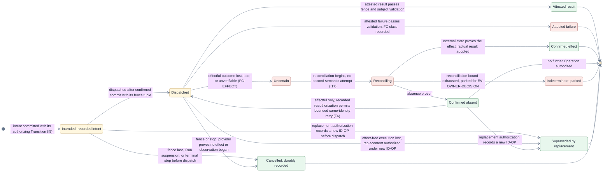

# Lifecycle catalogs — exhaustive states, events, Operations, and failure codes

This page consumes [D9](./decisions/D9-invariants-and-artifact-shape.md) deferral category 3:
exhaustive state machines, event and Operation catalogs, and the failure-code taxonomy. It expands
[V3b](./flows/run-and-story-lifecycle.md#view-v3b--story-phases) and carries the explicit 2026-07-17
owner amendment that adds the `Rejected` Story outcome. It makes the deferred substates and the
Run-level parking, suspension, and recovery overlays explicit. All content is architecture, not
implementation reality.

## View V9 — exhaustive Story state machine

- **Question:** Exactly which states can one Story occupy, and which durable event type triggers
  each transition?
- **View type:** Exhaustive Story state machine; the Layer 2 expansion of V3b.
- **Audience and purpose:** Engineers implementing the transition engine and reviewers checking
  that every path is bounded and every trigger validated.
- **Scope and exclusions:** Story states, rework and refresh substates, and exhaustion transitions.
  Run phases stay in V3a; numeric bounds and timers are policy-supplied classes, not states.
- **State:** Approved (not locked).
- **Owner:** Arye Kogan.
- **Sources:** V3b; D6, D8, D9 category 3; I8, I12, I15–I17;
  [failure and liveness](./failure-and-liveness.md).
- **Related views:** [V3a/V3b](./flows/run-and-story-lifecycle.md) own the Layer 1 phases;
  [V9a](#view-v9a--operation-lifecycle) owns one Operation; [V8](./data-and-identity.md) owns the
  identities minted along these transitions.

```mermaid
%%{init: {"theme": "base", "themeVariables": {"fontFamily": "Inter, ui-sans-serif, system-ui", "primaryTextColor": "#172033", "lineColor": "#65758b"}}}%%
stateDiagram-v2
    direction LR
    state "Pending" as Pending
    state "Eligible" as Eligible
    state "Preparing" as Preparing
    state "Implementing" as Implementing
    state "Reviewing" as Reviewing
    state "Reworking, bounded iteration" as Reworking
    state "Accepted" as Accepted
    state "Waiting for finalization" as Waiting
    state "Finalizing" as Finalizing
    state "Refreshing target, ownership retained" as Refreshing
    state "Refreshing parked, target instability" as RefreshPark
    state "Landed" as Landed
    state "Directly Blocked" as Blocked
    state "Rejected by owner" as Rejected
    state "Not run — dependency blocked" as NotRun
    state "Retiring" as Retiring
    state "Closed" as Closed

    [*] --> Pending: EV-ENVELOPE-SUBMITTED, frozen Run definition admits the Story
    Pending --> Eligible: EV-WAKE-DEPENDENCY, every prerequisite Landed
    Pending --> NotRun: EV-WAKE-DEPENDENCY, reachable direct root Blocked or Rejected
    Eligible --> Preparing: EV-WAKE-CAPACITY, deterministic admission by C-ORDER
    Preparing --> Implementing: EV-SETUP-FACT and EV-WORKSPACE-FACT, fresh setup, isolation, and bounded assignment ready
    Preparing --> Blocked: EV-SESSION-FAULT or EV-WORKSPACE-FACT failure, bound exhausted (FC-MECHANISM, FC-BOUND)
    Implementing --> Reviewing: EV-SESSION-RESULT, committed exact Candidate, new cand ordinal
    Implementing --> Blocked: EV-SESSION-FAULT, implementation bound exhausted (FC-MECHANISM, FC-BOUND)
    Reviewing --> Reworking: EV-SESSION-VERDICT, changes required within the rework bound
    Reworking --> Implementing: EV-WAKE-CAPACITY, bounded rework assignment admitted
    Reviewing --> Accepted: EV-SESSION-VERDICT, valid exact-Candidate approval (I8)
    Reviewing --> Blocked: EV-SESSION-VERDICT, unapprovable or rework bound exhausted (FC-BOUND)
    Accepted --> Waiting: EV-SESSION-VERDICT, the accepting Transition assigns the C-ORDER wait position
    Waiting --> Finalizing: EV-WAKE-AUTHORITY, sole target authority acquired, new auth ordinal (I12)
    Finalizing --> Refreshing: EV-TARGET-FACT, target basis advanced, bounded refresh (D6)
    Refreshing --> Reviewing: EV-WORKSPACE-FACT, aligned. Any basis change invalidates prior verdicts and re-enters full review, with atomic authority rebinding when the Candidate changed (D6, D7)
    Refreshing --> RefreshPark: BND-REFRESH exhausted, park with escalation naming target instability (FC-BOUND)
    Accepted --> Finalizing: EV-SESSION-VERDICT, re-approval while finalization authority is retained after a bounded refresh (D6, I12)
    Finalizing --> Reworking: EV-CHECK-OBSERVATION, policy-required check failed, authority released, bounded rework (I9, D6)
    Finalizing --> Blocked: EV-CHECK-OBSERVATION, required-check failure with rework bound exhausted (FC-BOUND)
    Finalizing --> Landed: EV-LANDING-OBSERVED, authoritative target proof
    Finalizing --> Blocked: EV-EFFECT-CERTAINTY or EV-RECOVERY-OBSERVATION, reconciled failure (FC-EFFECT, FC-MECHANISM)
    Preparing --> Rejected: EV-OWNER-DECISION, exact Story-bound reject-story choice
    Implementing --> Rejected: EV-OWNER-DECISION, exact Story-bound reject-story choice
    Reviewing --> Rejected: EV-OWNER-DECISION, exact Story-bound reject-story choice
    Reworking --> Rejected: EV-OWNER-DECISION, exact Story-bound reject-story choice
    Accepted --> Rejected: EV-OWNER-DECISION, exact Story-bound reject-story choice
    Waiting --> Rejected: EV-OWNER-DECISION, exact Story-bound reject-story choice
    Finalizing --> Rejected: EV-OWNER-DECISION, release authority and reject
    Refreshing --> Rejected: EV-OWNER-DECISION, release authority and reject
    RefreshPark --> Rejected: EV-OWNER-DECISION, release authority and reject
    Landed --> Retiring: EV-LANDING-OBSERVED, same Transition releases dependents first (I13, I18)
    Blocked --> Retiring: recorded with the blocking event, preservation-safe Retirement begins (I19)
    Rejected --> Retiring: recorded with the owner decision, preservation-safe Retirement begins (I19)
    Retiring --> Closed: EV-WORKSPACE-PRESERVED and settlement complete, or EV-OWNER-DECISION accepts a Residual Obligation
    NotRun --> Closed: EV-WAKE-DEPENDENCY derivation, no resources allocated, Retirement satisfied
    Closed --> [*]

    note right of Waiting
        Run Parked, Suspended, or Interrupted/Recovering (V3a) suspends any
        non-terminal Story state as an overlay without replacing it.
        Suspended fires no Story transition. EV-RUN-RESUME-DECISION
        resumes the same state only under a new controller generation
        after RC-RESUME-INTEGRITY; a changed safety basis parks instead.
        EV-SESSION-HUMAN-REQUEST instead creates a durable wait for
        only the originating principal/assignment and Story; independent Stories continue.
        The exact scoped answer follows ID-PARK to the current bound session
        through OPC-SESSION-RESPOND, or closes by cancel-and-reissue lineage.
        EV-RULE-SURFACE-TOUCHED also parks the Run until the exact
        changed rule surface is re-approved and re-evidenced.
    end note

    classDef phase fill:#fff7df,stroke:#a8781f,color:#172033
    classDef substate fill:#fce8e6,stroke:#a7615b,color:#172033
    classDef outcome fill:#e8f7ed,stroke:#4f8a63,color:#172033
    class Pending,Eligible,Preparing,Implementing,Reviewing,Accepted,Waiting,Finalizing phase
    class Reworking,Refreshing,RefreshPark substate
    class Landed,Blocked,Rejected,NotRun,Retiring,Closed outcome
```

**V9 legend:** Every node is a Story state; yellow nodes are the unchanged V3b phases, red nodes the
two Layer 2 substates this page adds (bounded rework iteration and bounded target refresh), and
green nodes business outcomes and Retirement. `RefreshPark` is the non-terminal parked branch
required by `BND-REFRESH`: it retains Story ownership, releases no dependents, and names target
instability in a live Story-bound `ID-PARK`, so the canonical product projection is `parked`. It
does not renew the exhausted bound; further work requires an explicit owner resolution such as
rejection or successor-Run replanning. `Rejected` is legal only for a Jig-originated,
Story-bound parked request that explicitly offered `reject-story`; declining an Agent-provider
permission or question never rejects the Story. The decision records `ID-PARK`, `ID-STORY`, the
underlying state, request and decision reasons, responder principal/grant, authorizing Transition,
and direct non-delivery-root attribution. Color is redundant with the state names. Each
transition label names its durable trigger event type from the catalog below, the condition, and,
for exhaustion paths, the failure-code class in parentheses. Every completed target refresh
re-enters full review, because a basis change alone already changes the review package and
invalidates prior verdicts (D7); what a bounded refresh may retain is the target finalization
authority, so re-approval returns the Story directly from `Accepted` to `Finalizing` without
re-entering the wait order. The note models the suspension
overlay: Run-level `Parked` and `Interrupted / Recovering` suspend a Story without replacing its
state, so they are deliberately not Story states here. A passing `EV-CHECK-OBSERVATION` under the
`deterministic` posture advances work inside `Finalizing` toward delivery authorization without
changing the Story state, which is why only its failure paths appear as transitions; a failed
policy-required check releases finalization authority and returns through bounded rework, and an
exhausted rework bound records directly `Blocked` (I9, I16). `cand` and `auth` ordinals refer to
the identity paths in [data and identity](./data-and-identity.md); `C-ORDER` is the Layer 1 total
comparator.

## Event catalog

Durable trigger event types. An event has no `ID-EVENT`, ordering position, or effect before
boundary validation accepts it and `CP-TRANSITION` commits its `SCH-EVENT` atomically inside the
same `LG-RECORD` as the resulting `SCH-TRANSITION`. That commit mints
`<run>/event/<ledger position>`; **ledger commit order is the sole trigger order** used by I4 and
replay, with no arrival-time, provider-time, or secondary ordering. Mediated port events are
validated by `CP-MEDIATOR`; intake follows its preflight/commit boundary, and controller-derived
wakes follow the same Transition commit path (I7). Wake triggers are typed durable records, never
bare timers.

Every externally produced input at `PORT-INTAKE`, `PORT-SESSION`, `PORT-WORKSPACE`, `PORT-VERIFY`,
`PORT-DELIVERY`, `PORT-SOURCE`, or `PORT-DECIDE` carries a producer-scoped deduplication key
normalized for that family from provider/principal identity, attempt ordinal, exact subject, and
validated content digest. At validation, a duplicate key resolves to the existing event identity
(or the existing pre-Run `ID-SOURCE-REQ` result for `PORT-SOURCE`) and commits nothing new.
Controller-derived wake triggers are deduplicated by their derivation basis: event type, exact
subject, causal ledger positions, and bound/wake-condition digest.

| ID                              | Source group              | Producer                              | Subject kind                 | Validation it must pass                                                                                                                                                                                                                                                                                        |
| ------------------------------- | ------------------------- | ------------------------------------- | ---------------------------- | -------------------------------------------------------------------------------------------------------------------------------------------------------------------------------------------------------------------------------------------------------------------------------------------------------------- |
| `EV-ENVELOPE-SUBMITTED`         | Intake                    | `X-ENVELOPE` via `PORT-INTAKE`        | Run                          | `SCH-ENVELOPE` validity, authority, completeness, preflight feasibility.                                                                                                                                                                                                                                       |
| `EV-SESSION-RESULT`             | Session results           | `X-AGENT` via `PORT-SESSION`          | Story, Candidate             | Session identity, role, exact subject, lifecycle position, fence.                                                                                                                                                                                                                                              |
| `EV-SESSION-VERDICT`            | Session results           | `P-REVIEWER` via `PORT-SESSION`       | Candidate                    | Reviewer principal identity and authority, principal independence from every Candidate contributor, exact review-package digest, findings state (I8).                                                                                                                                                          |
| `EV-SESSION-FAULT`              | Session results           | `X-AGENT` via `PORT-SESSION`          | Story                        | Attribution, session identity, bound accounting.                                                                                                                                                                                                                                                               |
| `EV-SESSION-HUMAN-REQUEST`      | Session interaction       | `X-AGENT` via `PORT-SESSION`          | Session, parked request      | Provider/session/principal identity, `permission` or `question` kind, exact requested scope or prompt, `human-required` outcome, lifecycle position, and fence.                                                                                                                                                |
| `EV-WORKSPACE-FACT`             | Workspace facts           | `X-WORKSPACE` via `PORT-WORKSPACE`    | Story, Candidate, Operation  | Subject binding, content and basis digests, fence.                                                                                                                                                                                                                                                             |
| `EV-SETUP-FACT`                 | Workspace facts           | `X-WORKSPACE` via `PORT-WORKSPACE`    | Story, workspace             | Setup recipe digest, input digest, host fingerprint, receipt freshness, fence.                                                                                                                                                                                                                                 |
| `EV-WORKSPACE-PRESERVED`        | Workspace facts           | `X-WORKSPACE` via `PORT-WORKSPACE`    | Story                        | Preservation-proof completeness before any destruction (I19).                                                                                                                                                                                                                                                  |
| `EV-RULE-SURFACE-TOUCHED`       | Candidate classification  | `CP-TRANSITION`                       | Candidate, rule surface      | Changed-path comparison against the frozen `SCH-RULE-SURFACE`; exact manifest and Candidate digests.                                                                                                                                                                                                           |
| `EV-LIVENESS-OBSERVED`          | Liveness observations     | `CP-MEDIATOR`                         | Session, wait                | Mechanism-observed heartbeat/progress fact, observation time, subject, fence, and applicable bound class.                                                                                                                                                                                                      |
| `EV-CHECK-OBSERVATION`          | Verification observations | `X-VERIFY` via `PORT-VERIFY`          | Candidate                    | Exact-subject digest, policy-selected check set, fence (I9).                                                                                                                                                                                                                                                   |
| `EV-TARGET-FACT`                | Delivery facts            | `X-DELIVERY` via `PORT-DELIVERY`      | Target fact                  | Target identity, basis digest, observation freshness.                                                                                                                                                                                                                                                          |
| `EV-EFFECT-CERTAINTY`           | Delivery facts            | `X-DELIVERY` via `PORT-DELIVERY`      | Operation                    | Operation identity, fence, certainty classification.                                                                                                                                                                                                                                                           |
| `EV-LANDING-OBSERVED`           | Delivery facts            | `X-DELIVERY` via `PORT-DELIVERY`      | Candidate, target fact       | Proof that the target contains the Accepted result under the frozen method.                                                                                                                                                                                                                                    |
| `EV-OWNER-DECISION`             | Human answers             | `P-OWNER` via `PORT-DECIDE`           | Parked request               | Responder identity/current in-scope grant, exact request binding, and reason. Story rejection requires a Jig-originated Story-bound request that offered `reject-story`; provider answers cannot reject a Story, widen session posture, or authorize a Jig Operation.                                          |
| `EV-DELEGATION-GRANT`           | Delegation changes        | `P-OWNER` via `PORT-DECIDE`           | Run and operational scope    | Arye as issuer, delegate, exact per-Run operational event/decision and subject scope, validity window, and revocation or supersession lineage satisfy `SCH-DELEGATION-GRANT`; non-delegable product/architecture import/approval, gate-verdict, layer-reopen, and implicit-subdelegation classes are rejected. |
| `EV-RUN-SUSPEND-DECISION`       | Operator decisions        | `P-OWNER` via `PORT-DECIDE`           | Run                          | Exact Run, `Active` or `Parked` position, responder identity/current grant, and durable reason; the Transition fences dispatch and releases any finalization authority.                                                                                                                                        |
| `EV-RUN-RESUME-DECISION`        | Operator decisions        | `P-OWNER` via `PORT-DECIDE`           | Suspended Run                | Exact Run, responder identity/current grant, reason, new `ID-GEN`, and `RC-RESUME-INTEGRITY`; a changed safety basis parks for exact re-approval.                                                                                                                                                              |
| `EV-RUN-TERMINAL-STOP-DECISION` | Operator decisions        | `P-OWNER` via `PORT-DECIDE`           | Suspended Run                | Exact Run, explicit terminal intent, responder identity/current grant, reason, and confirmation that no resumable transition remains.                                                                                                                                                                          |
| `EV-NOTICE-ACKNOWLEDGED`        | Operator decisions        | `P-OWNER` via `PORT-DECIDE`           | Notice                       | Live matching `ID-NOTICE` and version, responder identity/current grant, and presentation-only acknowledgement state.                                                                                                                                                                                          |
| `EV-NOTICE-SNOOZED`             | Operator decisions        | `P-OWNER` via `PORT-DECIDE`           | Notice                       | Live matching `ID-NOTICE` and version, responder identity/current grant, and an explicit durable wake condition.                                                                                                                                                                                               |
| `EV-WAKE-DEPENDENCY`            | Wake triggers             | `RT-CONTROLLER` durable wake          | Story                        | Derived only from recorded `Landed`, direct `Blocked`, or direct `Rejected` facts.                                                                                                                                                                                                                             |
| `EV-WAKE-CAPACITY`              | Wake triggers             | `RT-CONTROLLER` durable wake          | Story                        | Derived from recorded capacity facts and `C-ORDER`.                                                                                                                                                                                                                                                            |
| `EV-WAKE-AUTHORITY`             | Wake triggers             | `RT-CONTROLLER` durable wake          | Story, target                | Derived from recorded authority release and `C-ORDER`.                                                                                                                                                                                                                                                         |
| `EV-WAKE-TIMER`                 | Wake triggers             | `RT-CONTROLLER` durable wake          | Bounded wait, snoozed notice | Recorded wake condition and its deadline or budget class; ambient clock inspection cannot silently unsnooze a notice.                                                                                                                                                                                          |
| `EV-RECOVERY-OBSERVATION`       | Recovery observations     | `CP-RECOVERY` via the mechanism ports | Operation, Run               | Reconciliation provenance, fence, certainty classification.                                                                                                                                                                                                                                                    |

## Operation catalog

Authorized Operation types per port. Reconciliation obligation classes: **new observation
Operation** (an effect-free observation may be replaced without effect reconciliation, but only by
a newly authorized `ID-OP` over the same exact subject), **identity lookup** (existence is checked
by the durable Operation identity before any repeat), and **certainty reconciliation** (the effect
must resolve to confirmed present or confirmed absent, or park — no second semantic attempt before
reconciliation, I17). Same-identity retry exists only for an effectful Operation after
`ConfirmedAbsent`, under a recorded reauthorization with the current fence.

| ID                    | Port             | Operation                                                         | Effect class                                    | Reconciliation obligation                                                                                                                                                                                                                                                         |
| --------------------- | ---------------- | ----------------------------------------------------------------- | ----------------------------------------------- | --------------------------------------------------------------------------------------------------------------------------------------------------------------------------------------------------------------------------------------------------------------------------------- |
| `OPC-SESSION-OPEN`    | `PORT-SESSION`   | Open a bounded role session                                       | Irreversible effect (resource)                  | Identity lookup, then adopt or retire the found session.                                                                                                                                                                                                                          |
| `OPC-SESSION-ASSIGN`  | `PORT-SESSION`   | Assign bounded role work                                          | Irreversible effect                             | Certainty reconciliation.                                                                                                                                                                                                                                                         |
| `OPC-SESSION-COLLECT` | `PORT-SESSION`   | Collect attributable results and verdicts                         | Effect-free observation                         | A lost or replaced observation is a new authorized Operation over the same exact subject.                                                                                                                                                                                         |
| `OPC-SESSION-RESPOND` | `PORT-SESSION`   | Return one scoped Doorbell answer to its durable provider request | Irreversible session interaction                | Lookup by `ID-PARK`, then resolve the session currently bound to the originating principal/assignment. Delivery is idempotent by request/answer identity; same-session resume, same-principal replacement, and cancel-and-reissue lineage are explicit, and posture cannot widen. |
| `OPC-SESSION-CLOSE`   | `PORT-SESSION`   | Close a session                                                   | Irreversible effect                             | Identity lookup; idempotent by session identity.                                                                                                                                                                                                                                  |
| `OPC-WS-PROVISION`    | `PORT-WORKSPACE` | Provision isolated workspace resources                            | Irreversible effect (resource)                  | Identity lookup.                                                                                                                                                                                                                                                                  |
| `OPC-WS-SETUP`        | `PORT-WORKSPACE` | Apply the frozen setup recipe when stale                          | Irreversible workspace effect                   | Identity lookup by recipe/input/host fingerprint; an exact fresh receipt makes the Operation a no-op.                                                                                                                                                                             |
| `OPC-WS-OBSERVE`      | `PORT-WORKSPACE` | Observe content, basis, cleanliness                               | Effect-free observation                         | A lost or replaced observation is a new authorized Operation over the same exact subject.                                                                                                                                                                                         |
| `OPC-WS-PRESERVE`     | `PORT-WORKSPACE` | Preserve work and evidence                                        | Irreversible effect                             | Identity lookup; required before any destruction (I19).                                                                                                                                                                                                                           |
| `OPC-WS-RETIRE`       | `PORT-WORKSPACE` | Retire or hand off resources                                      | Irreversible effect (destructive)               | Certainty reconciliation; never dispatched before preservation.                                                                                                                                                                                                                   |
| `OPC-VERIFY-EXECUTE`  | `PORT-VERIFY`    | Execute policy-selected checks on exact subject                   | Effect-free by enforced contract                | A lost or replaced check is a new authorized Operation over the same exact subject. A check needing an external effect is outside `PORT-VERIFY` and must be a separately authorized workspace/delivery Operation or a future decision.                                            |
| `OPC-REV-PUBLISH`     | `PORT-DELIVERY`  | Publish the exact Candidate to a dedicated review ref             | Irreversible external effect                    | Certainty reconciliation by Operation identity, exact review ref, and Candidate digest.                                                                                                                                                                                           |
| `OPC-REV-REQUEST`     | `PORT-DELIVERY`  | Open or update a draft, non-mergeable integration request         | Irreversible external effect                    | Identity lookup by stable Jig request marker plus source/target refs; the request must remain draft and non-mergeable.                                                                                                                                                            |
| `OPC-REV-STATUS`      | `PORT-DELIVERY`  | Create or update Jig review status                                | Irreversible external effect                    | Identity lookup by request and stable Jig status context; updates are idempotent.                                                                                                                                                                                                 |
| `OPC-REV-COMMENT`     | `PORT-DELIVERY`  | Create or update the redacted Jig review explanation              | Irreversible external effect                    | Identity lookup by request and stable Jig marker; edit the existing block rather than append duplicates.                                                                                                                                                                          |
| `OPC-DEL-ANCHOR`      | `PORT-DELIVERY`  | Create the target lineage anchor                                  | Irreversible effect (atomic conditional-create) | Re-observation of the anchor: present with this grant's registry succeeds, present with another registry parks (FC-AUTHORITY), absent permits bounded retry.                                                                                                                      |
| `OPC-DEL-PUBLISH`     | `PORT-DELIVERY`  | Publish Candidate content                                         | Irreversible effect                             | Certainty reconciliation (I17).                                                                                                                                                                                                                                                   |
| `OPC-DEL-REQUEST`     | `PORT-DELIVERY`  | Open an integration request                                       | Irreversible effect                             | Certainty reconciliation via identity lookup.                                                                                                                                                                                                                                     |
| `OPC-DEL-STATUS`      | `PORT-DELIVERY`  | Create or update the Jig status on a request                      | Irreversible external effect                    | Identity lookup by request and stable Jig status context; updates are idempotent.                                                                                                                                                                                                 |
| `OPC-DEL-COMMENT`     | `PORT-DELIVERY`  | Create or update the Jig explanation block                        | Irreversible external effect                    | Identity lookup by request and stable Jig marker; edit the existing block rather than append duplicates.                                                                                                                                                                          |
| `OPC-DEL-MERGE`       | `PORT-DELIVERY`  | Request target integration or merge                               | Irreversible effect                             | Certainty reconciliation; indeterminate parks.                                                                                                                                                                                                                                    |
| `OPC-DEL-OBSERVE`     | `PORT-DELIVERY`  | Observe target, gates, and landing                                | Effect-free observation                         | A lost or replaced observation is a new authorized Operation over the same exact subject.                                                                                                                                                                                         |
| `OPC-ART-PUT`         | `PORT-ARTIFACT`  | Put an immutable evidence or audit artifact                       | Irreversible effect (idempotent by digest)      | Identity lookup by digest.                                                                                                                                                                                                                                                        |
| `OPC-ART-GET`         | `PORT-ARTIFACT`  | Digest-verified artifact read                                     | Effect-free observation                         | A lost or replaced read is a new authorized Operation over the same exact artifact subject.                                                                                                                                                                                       |

Entering `Reviewing` may authorize the initial `OPC-REV-*` intents, and a Transition recording
`Blocked` may authorize safe surfacing intents for an existing exact Candidate. Publication success
does not change Story state, create acceptance, release dependencies, or grant `ID-AUTH`.

`PORT-LEDGER` deliberately has **no rows in this catalog**. The conditional append and verified
read are the **commit primitive** that records Transitions and their Operation intents; cataloging
them as Operations would be circular, because an Operation intent exists only inside a recorded
Transition (I5). The commit primitive's contract and its own unknown-acknowledgement recovery are
owned by [persistence and projections](./persistence-and-projections.md), and its identity,
position, and digest validation is performed by the transition engine's commit protocol rather
than by `CP-MEDIATOR`.

## View V9a — Operation lifecycle

- **Question:** What states does one authorized Operation pass through, and where does uncertainty
  leave the normal path?
- **View type:** Operation lifecycle state machine.
- **Audience and purpose:** Engineers implementing `CP-MEDIATOR` and `CP-RECOVERY`; verify that no
  second semantic attempt precedes reconciliation.
- **Scope and exclusions:** One Operation's states only. Provider-specific lookup and compensation
  mechanics are excluded (D9 category 7).
- **State:** Approved (not locked).
- **Owner:** Arye Kogan.
- **Sources:** D5, D8; I5, I15, I17; [state and recovery](./state-and-recovery.md).
- **Related views:** [V9](#view-v9--exhaustive-story-state-machine) owns the Story states that
  dispatch Operations; [V3c](./flows/run-and-story-lifecycle.md#view-v3c--authoritative-transition-ordering)
  owns the transition cycle each state change records through.

**V9a legend:** Yellow nodes are the normal dispatch path, green nodes settled outcomes (an attested
result, a reconciled confirmed effect or absence, durable supersession, or durable cancellation),
and red nodes failure and uncertainty handling. `Superseded` means a recorded replacement
authorization created a new `ID-OP`; `Cancelled` means fencing or a Run suspend/terminal-stop
durably ended an Operation before dispatch or while a provider proved it was still recoverably
pending. Silence is neither state. Color is redundant with the state names. Transition labels name
the condition and, in parentheses, the governing invariant, decision, or failure-code class. Only
an effectful Operation may retry after confirmed absence under the same identity and payload basis,
and only under a newly recorded reauthorization whose fence refreshes current `ID-GEN` and, where
reacquired, `ID-AUTH`/`ID-REGISTRY`. An effect-free observation replacement always uses a new
identity. Retaining a stale fence is `FC-FENCE`, never a legal redispatch. `FC` abbreviates the
failure-code classes below.

## Failure-code taxonomy

Codes are **classes**: exact enumerations grow within a class without an architecture change.
Containment scopes are the Layer 1 [failure and liveness](./failure-and-liveness.md) fault scopes.

| ID             | Failure class                               | Containment scope                                        | Default exhaustion action                                    |
| -------------- | ------------------------------------------- | -------------------------------------------------------- | ------------------------------------------------------------ |
| `FC-INPUT`     | Invalid or insufficient input               | Trigger or Preflight; rejected before any effect         | Durable preflight rejection or rejected trigger.             |
| `FC-AUTHORITY` | Authority or role violation                 | Trigger; repeated violations escalate the affected Story | Fail closed; park for the owner.                             |
| `FC-SUBJECT`   | Wrong subject or basis                      | Trigger; result discarded, Story continues               | Fail closed; bounded re-collection, then block.              |
| `FC-FENCE`     | Fence mismatch or stale generation          | Trigger; stale dispatcher fenced                         | Discard; Recovery reconciles if the fence loss is shared.    |
| `FC-EVIDENCE`  | Evidence unavailable or integrity failure   | Story                                                    | Block or park; never silent acceptance.                      |
| `FC-MECHANISM` | Mechanism fault or timeout                  | Story or Operation                                       | Bounded retry, then directly `Blocked`.                      |
| `FC-EFFECT`    | Effect uncertainty                          | Operation; Target/finalization when target-scoped        | Reconcile; indeterminate parks (I17).                        |
| `FC-CAPACITY`  | Required capacity unavailable               | Run admission at preflight, or a bounded Story wait      | Preflight rejection, or bounded wait then park.              |
| `FC-LIVENESS`  | Stuck, dead, or human-input-overdue subject | Session, Story, or parked wait                           | Park or escalate under the named liveness bound.             |
| `FC-RULES`     | Frozen rule-governing surface was touched   | Candidate and Run                                        | Park; invalidate acceptance and require exact re-approval.   |
| `FC-BOUND`     | Bound exhausted                             | Story                                                    | The path's explicit exhaustion action: block, park, or stop. |
| `FC-TRUST`     | Trust-root failure                          | Shared Run / trust root                                  | Durable named stop; externally governed recovery only (I20). |

## Exclusions — owned by sibling pages

- Numeric budgets, retry/wait algorithms, and bound classes (D9 category 4): the scheduling and
  capacity page.
- Record schemas and identity representation (`SCH-*`, `ID-*`):
  [data and identity](./data-and-identity.md).
- Provider-specific idempotency, lookup, and compensation (`MC-*`):
  [mechanism and provider contracts](./mechanism-and-provider-contracts.md).
- The ledger commit primitive and its realization (`LG-*`):
  [persistence and projections](./persistence-and-projections.md).

## Where to go next

- The identities and fence tuple these states mint and validate:
  [data and identity](./data-and-identity.md).
- The Layer 1 phases and transition ordering this page expands:
  [Run and Story lifecycle](./flows/run-and-story-lifecycle.md).
- The containment and bounded-progress contract behind the failure codes:
  [failure and liveness](./failure-and-liveness.md).
- The runtime units and ports that carry these events and Operations:
  [runtime architecture](./runtime.md).
