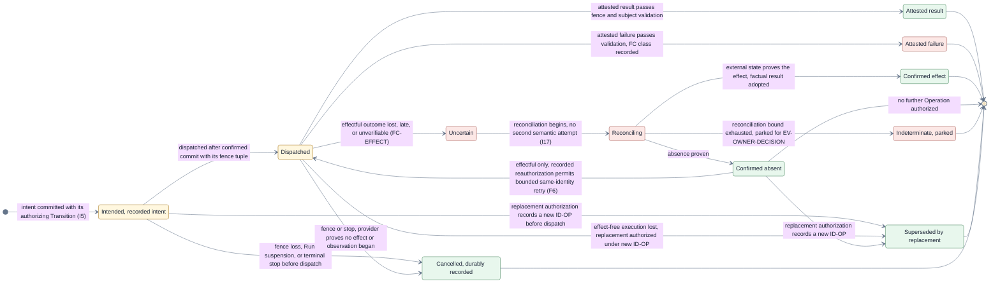

# Lifecycle catalogs — exhaustive states, events, Operations, and failure codes

This page consumes [D9](./decisions/D9-invariants-and-artifact-shape.md) deferral category 3:
exhaustive state machines, event and Operation catalogs, and the failure-code taxonomy. It expands
[V3b](./flows/run-and-story-lifecycle.md#view-v3b--story-phases) and carries the explicit 2026-07-17
owner amendment that adds the `Rejected` Story outcome. It makes the deferred substates and the
Run-level parking, suspension, and recovery overlays explicit. All content is architecture, not
implementation reality.

## View V9 — exhaustive Story state machine

- **Question:** Exactly which states can one Story occupy, and which durable event type triggers
  each transition?
- **View type:** Exhaustive Story state machine; the Layer 2 expansion of V3b.
- **Audience and purpose:** Engineers implementing the transition engine and reviewers checking
  that every path is bounded and every trigger validated.
- **Scope and exclusions:** Story states, rework and refresh substates, and exhaustion transitions.
  Run phases stay in V3a; numeric bounds and timers are policy-supplied classes, not states.
- **State:** Approved (not locked).
- **Owner:** Arye Kogan.
- **Sources:** V3b; D6, D8, D9 category 3; I8, I12, I15–I17;
  [failure and liveness](./failure-and-liveness.md).
- **Related views:** [V3a/V3b](./flows/run-and-story-lifecycle.md) own the Layer 1 phases;
  [V9a](#view-v9a--operation-lifecycle) owns one Operation; [V8](./data-and-identity.md) owns the
  identities minted along these transitions.

```mermaid
%%{init: {"theme": "base", "themeVariables": {"fontFamily": "Inter, ui-sans-serif, system-ui", "primaryTextColor": "#172033", "lineColor": "#65758b"}}}%%
stateDiagram-v2
    direction LR
    state "Pending" as Pending
    state "Eligible" as Eligible
    state "Preparing" as Preparing
    state "Implementing" as Implementing
    state "Reviewing" as Reviewing
    state "Reworking, bounded iteration" as Reworking
    state "Accepted" as Accepted
    state "Waiting for finalization" as Waiting
    state "Finalizing" as Finalizing
    state "Refreshing target, ownership retained" as Refreshing
    state "Refreshing parked, target instability" as RefreshPark
    state "Landed" as Landed
    state "Directly Blocked" as Blocked
    state "Rejected by owner" as Rejected
    state "Not run — dependency blocked" as NotRun
    state "Retiring" as Retiring
    state "Closed" as Closed

    [*] --> Pending: EV-ENVELOPE-SUBMITTED, frozen Run definition admits the Story
    Pending --> Eligible: EV-WAKE-DEPENDENCY, every prerequisite Landed
    Pending --> NotRun: EV-WAKE-DEPENDENCY, reachable direct root Blocked or Rejected
    Eligible --> Preparing: EV-WAKE-CAPACITY, deterministic admission by C-ORDER
    Preparing --> Implementing: EV-WORKSPACE-FACT, prior setup fact plus isolation and bounded assignment ready
    Preparing --> Blocked: EV-SESSION-FAULT, session bound exhausted (FC-MECHANISM, FC-BOUND)
    Preparing --> Blocked: EV-WORKSPACE-FACT, workspace failure bound exhausted (FC-MECHANISM, FC-BOUND)
    Implementing --> Reviewing: EV-SESSION-RESULT, committed exact Candidate, new cand ordinal
    Implementing --> Blocked: EV-SESSION-FAULT, implementation bound exhausted (FC-MECHANISM, FC-BOUND)
    Reviewing --> Reworking: EV-SESSION-VERDICT, changes required within the rework bound
    Reworking --> Implementing: EV-WAKE-CAPACITY, bounded rework assignment admitted
    Reviewing --> Accepted: EV-SESSION-VERDICT, valid exact-Candidate approval (I8)
    Reviewing --> Blocked: EV-SESSION-VERDICT, unapprovable or rework bound exhausted (FC-BOUND)
    Accepted --> Reviewing: EV-OWNER-DECISION, closes exact invalidating park; invalidate acceptance and create fresh RP-PACKAGE
    Accepted --> Waiting: EV-WAKE-FINALIZATION, accepted fact assigns the C-ORDER wait position
    Waiting --> Reviewing: EV-OWNER-DECISION, closes exact invalidating park; invalidate acceptance and create fresh RP-PACKAGE
    Waiting --> Finalizing: EV-WAKE-AUTHORITY, sole target authority acquired, new auth ordinal (I12)
    Finalizing --> Refreshing: EV-TARGET-FACT, target basis advanced, bounded refresh (D6)
    Refreshing --> Reviewing: EV-WORKSPACE-FACT, aligned new Candidate from bounded refresh assignment; full review and atomic rebind when changed (D6, D7)
    Refreshing --> RefreshPark: EV-BOUND-EXHAUSTED, BND-REFRESH parks naming target instability (FC-BOUND)
    Accepted --> Finalizing: EV-WAKE-AUTHORITY, re-approved Candidate retains finalization authority after bounded refresh (D6, I12)
    Finalizing --> Reviewing: EV-OWNER-DECISION, closes exact invalidating park; release only after reconciliation prerequisite, invalidate acceptance, and create fresh RP-PACKAGE
    Finalizing --> Reworking: EV-CHECK-OBSERVATION, policy-required check failed; release only after reconciliation prerequisite, bounded rework (I9, D6)
    Finalizing --> Blocked: EV-CHECK-OBSERVATION, required-check failure with rework bound exhausted (FC-BOUND)
    Finalizing --> Landed: EV-LANDING-OBSERVED, authoritative target proof
    Finalizing --> Blocked: EV-EFFECT-CERTAINTY, reconciled effect failure (FC-EFFECT)
    Finalizing --> Blocked: EV-RECOVERY-OBSERVATION, reconciled mechanism failure (FC-MECHANISM)
    Preparing --> Rejected: EV-OWNER-DECISION, exact Story-bound reject-story choice
    Implementing --> Rejected: EV-OWNER-DECISION, exact Story-bound reject-story choice
    Reviewing --> Rejected: EV-OWNER-DECISION, exact Story-bound reject-story choice
    Reworking --> Rejected: EV-OWNER-DECISION, exact Story-bound reject-story choice
    Accepted --> Rejected: EV-OWNER-DECISION, exact Story-bound reject-story choice
    Waiting --> Rejected: EV-OWNER-DECISION, exact Story-bound reject-story choice
    Finalizing --> Rejected: EV-OWNER-DECISION, reject; release only after reconciliation prerequisite
    Refreshing --> Rejected: EV-OWNER-DECISION, reject; release only after reconciliation prerequisite
    RefreshPark --> Rejected: EV-OWNER-DECISION, reject; release only after reconciliation prerequisite
    Landed --> Retiring: EV-WAKE-SETTLEMENT, landing already released dependents (I13, I18)
    Blocked --> Retiring: EV-WAKE-SETTLEMENT, preservation-safe Retirement begins (I19)
    Rejected --> Retiring: EV-WAKE-SETTLEMENT, preservation-safe Retirement begins (I19)
    Retiring --> Closed: EV-WAKE-SETTLEMENT, Story-scoped derivation, last duty completed or already accepted-handoff
    Retiring --> Closed: EV-OWNER-DECISION, final open obligation becomes accepted-handoff; all duties settled
    NotRun --> Closed: EV-WAKE-DEPENDENCY derivation, no resources allocated, Retirement satisfied

    note right of Waiting
        Run Parked, Suspended, or Interrupted/Recovering (V3a) suspends any
        non-terminal Story state as an overlay without replacing it.
        Suspended fires no Story transition. EV-RUN-RESUME-DECISION
        resumes the same state only under a new controller generation
        after RC-RESUME-INTEGRITY; a changed safety basis parks instead.
        EV-SESSION-HUMAN-REQUEST instead creates a durable wait for
        only the originating principal/assignment and Story; independent Stories continue.
        The exact scoped answer follows ID-PARK to the current bound session
        through OPC-SESSION-RESPOND, or closes by cancel-and-reissue lineage.
        EV-RULE-SURFACE-TOUCHED also parks the Run until the exact
        changed rule surface is re-approved and re-evidenced. An
        EV-OWNER-DECISION that closes that invalidating park takes each
        affected Accepted, Waiting, or Finalizing Story through its explicit
        Reviewing edge; it durably invalidates its prior verdict and acceptance,
        releases held finalization authority only after the reconciliation prerequisite,
        and requires a fresh complete
        RP-PACKAGE even when Candidate bytes are unchanged.
    end note

    classDef phase fill:#fff7df,stroke:#a8781f,color:#172033
    classDef substate fill:#fce8e6,stroke:#a7615b,color:#172033
    classDef outcome fill:#e8f7ed,stroke:#4f8a63,color:#172033
    class Pending,Eligible,Preparing,Implementing,Reviewing,Accepted,Waiting,Finalizing phase
    class Reworking,Refreshing,RefreshPark substate
    class Landed,Blocked,Rejected,NotRun,Retiring,Closed outcome
```

**Authority-release prerequisite:** Every V9 edge that releases finalization authority first
requires every in-flight target-changing Operation of the holding Story to resolve as a confirmed
effect, confirmed absence, or cancellation with proof of no effect. An `Uncertain` Operation
parked under `BND-RECOVERY` keeps the authority fenced until reconciliation or an explicit terminal
governance disposition preserves or externally transfers that target fence; it never permits another
Story or Run to acquire it. Until then the Story transition still records its destination state, but
the authority is retained-but-fenced; the existing reconciliation-completing Transition releases it
durably. This condition is vacuously satisfied only where the edge structurally cannot have an
in-flight target-changing Operation.

**V9 legend:** Every node is a Story state; yellow nodes are the unchanged V3b phases, red nodes the
two Layer 2 substates this page adds (bounded rework iteration and bounded target refresh), and
green nodes business outcomes and Retirement. `RefreshPark` is the non-terminal parked branch
required by `BND-REFRESH`: it retains Story ownership, releases no dependents, and names target
instability in a live Story-bound `ID-PARK`, so the canonical product projection is `parked`. It
does not renew the exhausted bound; further work requires an explicit owner resolution such as
rejection or successor-Run replanning. `Rejected` is legal only for a Jig-originated,
Story-bound parked request that explicitly offered `reject-story`; declining an Agent-provider
permission or question never rejects the Story. The decision records `ID-PARK`, `ID-STORY`, the
underlying state, request and decision reasons, responder principal/grant, authorizing Transition,
and direct non-delivery-root attribution. Color is redundant with the state names. Each
transition label names its durable trigger event type from the catalog below, the condition, and,
for exhaustion paths, the failure-code class in parentheses. Every completed target refresh
uses bounded `OPC-SESSION-ASSIGN` to create the aligned new Candidate and `EV-WORKSPACE-FACT` to
attest its advanced basis, then re-enters full review because a basis change alone already changes the review package and
invalidates prior verdicts (D7); what a bounded refresh may retain is the target finalization
authority, so re-approval returns the Story directly from `Accepted` to `Finalizing` without
re-entering the wait order. The note models the suspension
overlay: Run-level `Parked` and `Interrupted / Recovering` suspend a Story without replacing its
state, so they are deliberately not Story states here. A passing `EV-CHECK-OBSERVATION` under the
`deterministic` posture advances work inside `Finalizing` toward delivery authorization without
changing the Story state, which is why only its failure paths appear as transitions; a failed
policy-required check releases finalization authority only after the authority-release prerequisite
and returns through bounded rework, and an
exhausted rework bound records directly `Blocked` (I9, I16). `cand` and `auth` ordinals refer to
the identity paths in [data and identity](./data-and-identity.md); `C-ORDER` is the Layer 1 total
comparator.

### Story-state closure inventory

This table is the R1.4 closure surface for every V9 Story state. It enumerates entry and exit over
the existing edges above; it adds no state or Transition. A business-terminal root still enters
Retirement. Only `Closed` is lifecycle-terminal.

| Story state    | Existing entry                                                       | Existing exit or legal post-terminal append                                                                                                                                                    |
| -------------- | -------------------------------------------------------------------- | ---------------------------------------------------------------------------------------------------------------------------------------------------------------------------------------------- |
| `Pending`      | Frozen-Run admission                                                 | `Eligible` or `NotRun`.                                                                                                                                                                        |
| `Eligible`     | `Pending` after every prerequisite lands                             | `Preparing`.                                                                                                                                                                                   |
| `Preparing`    | `Eligible`                                                           | `Implementing`, `Blocked`, or `Rejected`.                                                                                                                                                      |
| `Implementing` | `Preparing` or `Reworking`                                           | `Reviewing`, `Blocked`, or `Rejected`.                                                                                                                                                         |
| `Reviewing`    | `Implementing`, `Refreshing`, or exact invalidation of accepted work | `Reworking`, `Accepted`, `Blocked`, or `Rejected`.                                                                                                                                             |
| `Reworking`    | `Reviewing`, or `Finalizing` after a failed required check           | `Implementing` or `Rejected`.                                                                                                                                                                  |
| `Accepted`     | `Reviewing`                                                          | `Reviewing`, `Waiting`, `Finalizing`, or `Rejected`.                                                                                                                                           |
| `Waiting`      | `Accepted`                                                           | `Reviewing`, `Finalizing`, or `Rejected`.                                                                                                                                                      |
| `Finalizing`   | `Waiting` or retained-authority `Accepted`                           | `Refreshing`, `Reviewing`, `Reworking`, `Landed`, `Blocked`, or `Rejected`.                                                                                                                    |
| `Refreshing`   | `Finalizing`                                                         | `Reviewing`, `RefreshPark`, or `Rejected`.                                                                                                                                                     |
| `RefreshPark`  | `Refreshing`                                                         | `Rejected`; successor-Run replanning is a separate Run, not a Story-state append.                                                                                                              |
| `Landed`       | `Finalizing`                                                         | `Retiring` only.                                                                                                                                                                               |
| `Blocked`      | `Preparing`, `Implementing`, `Reviewing`, or `Finalizing`            | `Retiring` only.                                                                                                                                                                               |
| `Rejected`     | Exact owner decision at a permitted non-terminal state               | `Retiring` only.                                                                                                                                                                               |
| `NotRun`       | `Pending` after a prerequisite's direct non-delivery root            | `Closed`.                                                                                                                                                                                      |
| `Retiring`     | `Landed`, `Blocked`, or `Rejected`                                   | `Closed`.                                                                                                                                                                                      |
| `Closed`       | `Retiring` or `NotRun`                                               | No Story-state append. Later Run post-terminal administration may accept handoff of or resolve an obligation, or dispose evidence, but cannot alter Story state, outcome, or dependency facts. |

### Residual Obligation lifecycle

`SCH-OBLIGATION` is a schema lifecycle, not another Run or Story state. Its closed transition set
allows a duty that later completes to resolve without forcing a handoff, and duplicate validation
is idempotent:

| From → to                       | Cataloged trigger or creation basis                                                                                                     | Guard and durable result                                                                                                                                                                                                                                                                                      |
| ------------------------------- | --------------------------------------------------------------------------------------------------------------------------------------- | ------------------------------------------------------------------------------------------------------------------------------------------------------------------------------------------------------------------------------------------------------------------------------------------------------------- |
| absent → `open`                 | The Transition processing an automatic Retirement, preservation, surfacing, or post-terminal export duty proves that it cannot complete | Mint one `ID-OBLIGATION` with exact resource/proof subject, origin, reason, preservation evidence, accountable owner, and completion criteria. Creation alone does not satisfy the duty.                                                                                                                      |
| `open` → `accepted-handoff`     | `EV-OWNER-DECISION` during settlement or as a post-terminal administrative Transition                                                   | Arye's authenticated configured principal accepts the exact live obligation and its completion criteria. No grant or provider answer may substitute. During settlement this status alone may satisfy the otherwise incomplete duty; after the terminal cut it records handoff without revising settled facts. |
| `open` → `resolved`             | `EV-OBLIGATION-RESOLVED` during settlement or as a post-terminal administrative Transition                                              | The duty later completed before handoff; validate responder/current grant, completion criteria, and digest-verified evidence. `resolved` proves completion. Before the terminal cut, re-evaluate settlement; after it, retain prior Run/Story/business-final facts unchanged.                                 |
| `accepted-handoff` → `resolved` | `EV-OBLIGATION-RESOLVED` during settlement or as a post-terminal administrative Transition                                              | Validate the exact identity, accepted-handoff provenance, responder/current grant, completion criteria, and digest-verified resolution evidence. Before the terminal cut, re-evaluate settlement; after it, retain prior Run/Story/business-final facts unchanged.                                            |
| `resolved` → terminal           | none                                                                                                                                    | No later status append is legal. Exact replay of any transition input returns the existing status record and appends nothing.                                                                                                                                                                                 |

## Event catalog

Durable trigger event types. An event has no `ID-EVENT`, ordering position, or effect before
boundary validation accepts it and `CP-TRANSITION` commits its `SCH-EVENT` atomically inside the
same `LG-RECORD` as the resulting `SCH-TRANSITION`. That commit mints
`<run>/event/<ledger position>`; **ledger commit order is the sole trigger order** used by I4 and
replay, with no arrival-time, provider-time, or secondary ordering. Mediated mechanism-port events
are validated by `CP-MEDIATOR`; intake by `CP-INTAKE`; decision events by `CP-ESCALATION`; and
controller-derived wakes by deterministic derivation validation before all follow the same
Transition commit path (I7). Wake triggers are typed durable records, never
bare timers.

Every externally produced input at `PORT-INTAKE`, `PORT-SESSION`, `PORT-WORKSPACE`, `PORT-VERIFY`,
`PORT-DELIVERY`, `PORT-ARTIFACT`, `PORT-SOURCE`, or `PORT-DECIDE` carries a producer-scoped deduplication key
normalized for that family from provider/principal identity, attempt ordinal, exact subject, and
validated content digest. At validation, a duplicate key resolves to the existing event identity
(or the existing pre-Run `ID-SOURCE-REQ` result for `PORT-SOURCE`) and commits nothing new.
Controller-derived wake triggers are deduplicated by their derivation basis: event type, exact
subject, causal ledger positions, and bound/wake-condition digest.

After the terminal-settlement position, a **post-terminal administrative Transition** is the sole
cataloged administrative append class. It is limited to settlement-authorized audit export and its
receipt/failure fact, obligation handoff acceptance or resolution, and owner-authorized evidence disposal. It cannot
alter a Run phase, Story state, business-final cut, outcome, authority, or dependency result.

| Administrative Transition              | Cataloged trigger        | Guard and permitted result                                                                                                                                                                                                                              |
| -------------------------------------- | ------------------------ | ------------------------------------------------------------------------------------------------------------------------------------------------------------------------------------------------------------------------------------------------------- |
| Audit-export receipt or failure        | `EV-ARTIFACT-FACT`       | Exact create-once `ID-EXPORT` subject and terminal-cut basis match. Record only the receipt, certainty/failure fact, and any resulting `open` export obligation; do not alter the covered range or terminal facts.                                      |
| Residual Obligation handoff acceptance | `EV-OWNER-DECISION`      | Exact live status is `open`, and Arye's authenticated configured principal accepts the exact obligation and completion criteria. Record `accepted-handoff` without changing settlement, Run, Story, outcome, authority, or dependency facts.            |
| Residual Obligation resolution         | `EV-OBLIGATION-RESOLVED` | Exact live status is `open` or `accepted-handoff`; responder/current grant, completion criteria, and digest-verified evidence pass. Record `resolved` terminal status without changing settlement, Run, Story, outcome, authority, or dependency facts. |
| Evidence-disposal authorization        | `EV-OWNER-DECISION`      | Arye alone authorizes one exact artifact digest after preservation, retention, obligation, audit-hold, protected-reference, and exhaustive deployment-wide live-pin guards pass. Record only the disposal intent.                                       |
| Evidence-disposal receipt or failure   | `EV-ARTIFACT-FACT`       | Exact authorized disposal subject and Operation fence match. Record only the digest-verified receipt, certainty, or failure; no receipt may retroactively satisfy a failed authorization guard.                                                         |

The remaining control-administrative events also commit through `CP-TRANSITION`; they alter neither
Run, Story, nor obligation status and authorize no Operation:

| Control-administrative Transition | Cataloged trigger        | Guard and permitted result                                                                                                                                            |
| --------------------------------- | ------------------------ | --------------------------------------------------------------------------------------------------------------------------------------------------------------------- |
| Delegation-grant maintenance      | `EV-DELEGATION-GRANT`    | `CP-ESCALATION` validates issuer, delegate, exact scope, lineage, and currency; record only the resulting `SCH-DELEGATION-GRANT` issue, revoke, or supersession fact. |
| Notice acknowledgement            | `EV-NOTICE-ACKNOWLEDGED` | Exact live notice, responder/current grant, and acknowledgement basis match; record only the acknowledgement presentation fact.                                       |
| Notice snooze                     | `EV-NOTICE-SNOOZED`      | Exact live notice, responder/current grant, and bounded wake condition match; record only the snooze and its durable wake basis.                                      |
| Notice wake                       | `EV-WAKE-TIMER`          | The exact snooze wake condition is durably satisfied; record only re-exposure of that notice, leaving its underlying durable condition unchanged.                     |

The 32-event catalog is consumer-closed: all 32 distinct event IDs are named by the V9, V3,
phase-preserving, post-terminal administrative, or control-administrative Transition tables, and
every such trigger is cataloged. The 26 events that advance lifecycle or obligation status appear
on state-changing Transition rows; the other six trigger only phase-preserving or administrative
Transitions.

For `PORT-ARTIFACT`, the producer key is store/provider identity, artifact Operation and attempt,
exact artifact subject, and validated result digest. Repeated put/get/dispose attestations for that tuple
therefore resolve to the existing `EV-ARTIFACT-FACT` rather than creating another adoption fact.

| ID                              | Source group              | Producer                                                               | Subject kind                                            | Validation it must pass                                                                                                                                                                                                                                                                                                                                                                                                                                                                                                                                                                                                                                                                                                                                                                                                                                                                                            |
| ------------------------------- | ------------------------- | ---------------------------------------------------------------------- | ------------------------------------------------------- | ------------------------------------------------------------------------------------------------------------------------------------------------------------------------------------------------------------------------------------------------------------------------------------------------------------------------------------------------------------------------------------------------------------------------------------------------------------------------------------------------------------------------------------------------------------------------------------------------------------------------------------------------------------------------------------------------------------------------------------------------------------------------------------------------------------------------------------------------------------------------------------------------------------------ |
| `EV-ENVELOPE-SUBMITTED`         | Intake                    | `X-ENVELOPE` via `PORT-INTAKE`                                         | Run                                                     | `SCH-ENVELOPE` validity, authority, completeness, preflight feasibility.                                                                                                                                                                                                                                                                                                                                                                                                                                                                                                                                                                                                                                                                                                                                                                                                                                           |
| `EV-SESSION-RESULT`             | Session results           | Qualified session mechanism hosting `P-IMPLEMENTER` via `PORT-SESSION` | Story, Candidate                                        | Session identity, role, exact subject, lifecycle position, fence.                                                                                                                                                                                                                                                                                                                                                                                                                                                                                                                                                                                                                                                                                                                                                                                                                                                  |
| `EV-SESSION-VERDICT`            | Session results           | `P-REVIEWER` via `PORT-SESSION`                                        | Candidate                                               | Reviewer principal identity and authority, principal independence from every Candidate contributor, exact review-package digest, findings state (I8).                                                                                                                                                                                                                                                                                                                                                                                                                                                                                                                                                                                                                                                                                                                                                              |
| `EV-SESSION-FAULT`              | Session results           | Qualified session mechanism via `PORT-SESSION`                         | Story                                                   | Attribution, session identity, bound accounting.                                                                                                                                                                                                                                                                                                                                                                                                                                                                                                                                                                                                                                                                                                                                                                                                                                                                   |
| `EV-SESSION-HUMAN-REQUEST`      | Session interaction       | `X-AGENT` via `PORT-SESSION`                                           | Session, parked request                                 | Provider/session/principal identity, `permission` or `question` kind, exact requested scope or prompt, `human-required` outcome, lifecycle position, and fence.                                                                                                                                                                                                                                                                                                                                                                                                                                                                                                                                                                                                                                                                                                                                                    |
| `EV-SESSION-FACT`               | Session facts             | Session mechanism via `PORT-SESSION` through `CP-MEDIATOR`             | Session, assignment                                     | Exact session, principal, assignment, provider binding, lifecycle position, fence, and one of: open attestation, bind attestation, assignment acknowledgement, reconnect observation, replacement attestation with successor lineage, cancellation record, loss attestation, or close result.                                                                                                                                                                                                                                                                                                                                                                                                                                                                                                                                                                                                                      |
| `EV-WORKSPACE-FACT`             | Workspace facts           | `X-WORKSPACE` via `PORT-WORKSPACE`                                     | Story, Candidate, Operation                             | Subject binding, content and basis digests, fence.                                                                                                                                                                                                                                                                                                                                                                                                                                                                                                                                                                                                                                                                                                                                                                                                                                                                 |
| `EV-SETUP-FACT`                 | Workspace facts           | `X-WORKSPACE` via `PORT-WORKSPACE`                                     | Story, workspace                                        | Setup recipe digest, input digest, host fingerprint, receipt freshness, fence.                                                                                                                                                                                                                                                                                                                                                                                                                                                                                                                                                                                                                                                                                                                                                                                                                                     |
| `EV-WORKSPACE-PRESERVED`        | Workspace facts           | `X-WORKSPACE` via `PORT-WORKSPACE`                                     | Story                                                   | Preservation-proof completeness before any destruction (I19).                                                                                                                                                                                                                                                                                                                                                                                                                                                                                                                                                                                                                                                                                                                                                                                                                                                      |
| `EV-ARTIFACT-FACT`              | Artifact facts            | `X-STORE` via `PORT-ARTIFACT` through `CP-MEDIATOR`                    | Evidence or export artifact subject, artifact Operation | `OPC-ART-PUT`/`OPC-ART-GET` result, certainty, or failure; or `OPC-ART-DISPOSE` digest-verified disposal result, certainty, or failure after owner decision, preservation, retention, obligation, audit-hold, protected-reference, and exhaustive deployment-wide reverse-reference/pin guards pass. Each typed artifact address registers its pin before adoption, atomically against disposal; any live pin or byte-identical protected pre-Run reference fails disposal closed and names its holder. Exact subject binding, artifact/content digest, Operation fence, and producer capability are required. A put is adopted into a manifest only after this event commits. Configuration-artifact verification instead uses pre-ack `SCH-INTAKE-ACK` start/result variants through the intake-scoped `PORT-ARTIFACT` exchange and their terminal-ack binding; it is not a Run Operation or `EV-ARTIFACT-FACT`. |
| `EV-RULE-SURFACE-TOUCHED`       | Candidate classification  | `CP-TRANSITION`                                                        | Candidate, rule surface                                 | Changed-path comparison against the frozen `SCH-RULE-SURFACE`; exact manifest and Candidate digests.                                                                                                                                                                                                                                                                                                                                                                                                                                                                                                                                                                                                                                                                                                                                                                                                               |
| `EV-LIVENESS-OBSERVED`          | Liveness observations     | `CP-MEDIATOR`                                                          | Session, wait                                           | Mechanism-observed heartbeat/progress fact, observation time, subject, fence, and applicable bound class.                                                                                                                                                                                                                                                                                                                                                                                                                                                                                                                                                                                                                                                                                                                                                                                                          |
| `EV-CHECK-OBSERVATION`          | Verification observations | `X-VERIFY` via `PORT-VERIFY`                                           | Candidate                                               | Exact-subject digest, policy-selected check set, fence (I9).                                                                                                                                                                                                                                                                                                                                                                                                                                                                                                                                                                                                                                                                                                                                                                                                                                                       |
| `EV-TARGET-FACT`                | Delivery facts            | `X-DELIVERY` via `PORT-DELIVERY`                                       | Target fact                                             | Target identity, basis digest, observation freshness.                                                                                                                                                                                                                                                                                                                                                                                                                                                                                                                                                                                                                                                                                                                                                                                                                                                              |
| `EV-EFFECT-CERTAINTY`           | Delivery facts            | `X-DELIVERY` via `PORT-DELIVERY`                                       | Operation                                               | Operation identity, fence, certainty classification. For a retained-but-fenced authority in `Suspended`, only a fact that resolves the last target-changing Operation as confirmed effect, confirmed absence, or cancellation with proof of no effect triggers the phase-preserving `Suspended` → `Suspended` Transition that records durable authority release; an `Uncertain` result continues the fence and dispatches no Operation.                                                                                                                                                                                                                                                                                                                                                                                                                                                                            |
| `EV-LANDING-OBSERVED`           | Delivery facts            | `X-DELIVERY` via `PORT-DELIVERY`                                       | Candidate, target fact                                  | Proof that the target contains the Accepted result under the frozen method.                                                                                                                                                                                                                                                                                                                                                                                                                                                                                                                                                                                                                                                                                                                                                                                                                                        |
| `EV-OWNER-DECISION`             | Human answers             | `P-OWNER` via `PORT-DECIDE`                                            | Parked request, Residual Obligation, evidence artifact  | Responder identity/current in-scope grant, exact request binding where applicable, and reason. Obligation-handoff acceptance is owner-only, binds one exact live `open` `ID-OBLIGATION`, and records `accepted-handoff`; after the terminal cut it is a post-terminal administrative Transition that changes no settled fact. Disposal authorization is owner-only and binds one exact evidence-artifact digest. Neither may authorize another subject or widen provider posture. Story rejection requires a Jig-originated Story-bound request that offered `reject-story`; provider answers cannot reject a Story or authorize a Jig Operation.                                                                                                                                                                                                                                                                  |
| `EV-DELEGATION-GRANT`           | Delegation changes        | `P-OWNER` via `PORT-DECIDE`                                            | Run and operational scope                               | Arye as issuer, delegate, exact per-Run operational event/decision and subject scope, validity window, and revocation or supersession lineage satisfy `SCH-DELEGATION-GRANT`; non-delegable product/architecture import/approval, gate-verdict, layer-reopen, and implicit-subdelegation classes are rejected.                                                                                                                                                                                                                                                                                                                                                                                                                                                                                                                                                                                                     |
| `EV-RUN-SUSPEND-DECISION`       | Operator decisions        | `P-OWNER` via `PORT-DECIDE`                                            | Run                                                     | Exact Run, `Active` or `Parked` position, responder identity/current grant, and durable reason; the Transition fences dispatch immediately. It releases finalization authority only after every in-flight target-changing Operation resolves as confirmed effect, confirmed absence, or cancellation with proof of no effect. An `Uncertain` Operation under `BND-RECOVERY` keeps authority retained-but-fenced until reconciliation or an explicit terminal governance disposition preserves or externally transfers that target fence; it cannot make the authority acquirable by another Story or Run.                                                                                                                                                                                                                                                                                                          |
| `EV-RUN-RESUME-DECISION`        | Operator decisions        | `P-OWNER` via `PORT-DECIDE`                                            | Suspended Run                                           | Exact Run, responder identity/current grant, reason, new `ID-GEN`, and `RC-RESUME-INTEGRITY`, including an `LG-INTAKE` check that no accepted successor names this Run as predecessor; a changed safety basis parks for exact re-approval.                                                                                                                                                                                                                                                                                                                                                                                                                                                                                                                                                                                                                                                                         |
| `EV-RUN-TERMINAL-STOP-DECISION` | Operator decisions        | `P-OWNER` via `PORT-DECIDE`                                            | Suspended Run                                           | Exact Run, explicit terminal intent, responder identity/current grant, reason, and confirmation that no resumable transition remains.                                                                                                                                                                                                                                                                                                                                                                                                                                                                                                                                                                                                                                                                                                                                                                              |
| `EV-NOTICE-ACKNOWLEDGED`        | Operator decisions        | `P-OWNER` via `PORT-DECIDE`                                            | Notice                                                  | Live matching `ID-NOTICE` and version, responder identity/current grant, and presentation-only acknowledgement state.                                                                                                                                                                                                                                                                                                                                                                                                                                                                                                                                                                                                                                                                                                                                                                                              |
| `EV-NOTICE-SNOOZED`             | Operator decisions        | `P-OWNER` via `PORT-DECIDE`                                            | Notice                                                  | Live matching `ID-NOTICE` and version, responder identity/current grant, and an explicit durable wake condition.                                                                                                                                                                                                                                                                                                                                                                                                                                                                                                                                                                                                                                                                                                                                                                                                   |
| `EV-OBLIGATION-RESOLVED`        | Operator decisions        | `P-OWNER` via `PORT-DECIDE`                                            | Residual Obligation                                     | Exact live status is `open` or `accepted-handoff`; responder identity/current grant, completion criteria, and digest-verified resolution-evidence reference pass. Before the terminal cut, resolution is a settlement Transition proving completion and re-evaluating remaining duties; after the cut, resolution from either non-terminal status is a post-terminal administrative Transition. Both retain the obligation identity and record its position; neither alters Run phase, Story state, business-final cut, outcome, authority, or dependency facts. Exact replay resolves to the existing `resolved` record and appends nothing.                                                                                                                                                                                                                                                                      |
| `EV-WAKE-DEPENDENCY`            | Wake triggers             | `RT-CONTROLLER` durable wake                                           | Story                                                   | Derived only from recorded `Landed`, direct `Blocked`, or direct `Rejected` facts.                                                                                                                                                                                                                                                                                                                                                                                                                                                                                                                                                                                                                                                                                                                                                                                                                                 |
| `EV-WAKE-CAPACITY`              | Wake triggers             | `RT-CONTROLLER` durable wake                                           | Story                                                   | Derived from recorded capacity facts and `C-ORDER`.                                                                                                                                                                                                                                                                                                                                                                                                                                                                                                                                                                                                                                                                                                                                                                                                                                                                |
| `EV-WAKE-AUTHORITY`             | Wake triggers             | `RT-CONTROLLER` durable wake                                           | Story, target                                           | Derived from recorded authority release plus the selected eligible `SCH-REGISTRY-RECORD` waiter under `C-ORDER`, or from exact re-approval while the same Story's refreshed finalization authority remains valid. For a queued waiter, the registry record preserves the continuous-starvation start governed by `BND-WAIT-CAPACITY`; release, loss of eligibility, or bound exhaustion closes that wait without resetting it through re-evaluation.                                                                                                                                                                                                                                                                                                                                                                                                                                                               |
| `EV-WAKE-FINALIZATION`          | Wake triggers             | `RT-CONTROLLER` durable wake                                           | Accepted Story, target                                  | Derived from the committed exact-Candidate acceptance fact and target scope; records the immutable `C-ORDER` finalization wait position without granting authority.                                                                                                                                                                                                                                                                                                                                                                                                                                                                                                                                                                                                                                                                                                                                                |
| `EV-WAKE-TIMER`                 | Wake triggers             | `RT-CONTROLLER` durable wake                                           | Bounded wait, snoozed notice                            | Recorded wake condition and its deadline or budget class; ambient clock inspection cannot silently unsnooze a notice.                                                                                                                                                                                                                                                                                                                                                                                                                                                                                                                                                                                                                                                                                                                                                                                              |
| `EV-BOUND-EXHAUSTED`            | Wake triggers             | `RT-CONTROLLER` durable wake                                           | Story, exact bounded path                               | Derived from recorded bound class, consumption facts, subject, and fixed exhaustion selector. `BND-REFRESH` exhaustion parks with target-instability escalation and releases no dependent.                                                                                                                                                                                                                                                                                                                                                                                                                                                                                                                                                                                                                                                                                                                         |
| `EV-WAKE-SETTLEMENT`            | Wake triggers             | `RT-CONTROLLER` durable wake                                           | Run, terminal/retiring Story                            | Story-scoped derivation begins Retirement from one committed business-terminal root and re-evaluates on every duty-completing durable fact — preservation, session close, authority release, or exact obligation transition to `resolved` or `accepted-handoff` — so `Retiring` closes when the last duty completes regardless of order; `EV-WORKSPACE-PRESERVED` remains a valid trigger when it is last. Run-scoped derivation enters `Settling` when all Stories are terminal/retiring and, for `Settling` and `Stopped`, commits the business-final terminal-settlement position once every duty is complete or represented by status `accepted-handoff`.                                                                                                                                                                                                                                                      |
| `EV-RECOVERY-OBSERVATION`       | Recovery observations     | `CP-RECOVERY` via the mechanism ports                                  | Operation, Run                                          | Reconciliation provenance, fence, certainty classification. For a retained-but-fenced authority in `Suspended`, only a fact that resolves the last target-changing Operation as confirmed effect, confirmed absence, or cancellation with proof of no effect triggers the phase-preserving `Suspended` → `Suspended` Transition that records durable authority release. An `Uncertain` result continues the fence; it dispatches no Operation.                                                                                                                                                                                                                                                                                                                                                                                                                                                                     |

## Operation catalog

Authorized Operation types per port. Reconciliation obligation classes: **new observation
Operation** (an effect-free observation may be replaced without effect reconciliation, but only by
a newly authorized `ID-OP` over the same exact subject), **identity lookup** (existence is checked
by the durable Operation identity before any repeat), and **certainty reconciliation** (the effect
must resolve to confirmed present or confirmed absent, or park — no second semantic attempt before
reconciliation, I17). Same-identity retry exists only for an effectful Operation after
`ConfirmedAbsent`, under a recorded reauthorization with the current fence.

| ID                       | Port             | Operation                                                         | Effect class                                    | Reconciliation obligation                                                                                                                                                                                                                                                                                                                                                                                                                                                                                                                                                                                   |
| ------------------------ | ---------------- | ----------------------------------------------------------------- | ----------------------------------------------- | ----------------------------------------------------------------------------------------------------------------------------------------------------------------------------------------------------------------------------------------------------------------------------------------------------------------------------------------------------------------------------------------------------------------------------------------------------------------------------------------------------------------------------------------------------------------------------------------------------------- |
| `OPC-SESSION-OPEN`       | `PORT-SESSION`   | Open a bounded role session                                       | Irreversible effect (resource)                  | Identity lookup, then adopt or retire the found session.                                                                                                                                                                                                                                                                                                                                                                                                                                                                                                                                                    |
| `OPC-SESSION-ASSIGN`     | `PORT-SESSION`   | Assign bounded role work, including Refreshing alignment          | Irreversible effect                             | Certainty reconciliation. A Refreshing assignment binds the exact Story, advanced target basis, and prior Candidate; its committed new Candidate result consumes `BND-REFRESH`.                                                                                                                                                                                                                                                                                                                                                                                                                             |
| `OPC-SESSION-COLLECT`    | `PORT-SESSION`   | Collect attributable results and verdicts                         | Effect-free observation                         | A lost or replaced observation is a new authorized Operation over the same exact subject.                                                                                                                                                                                                                                                                                                                                                                                                                                                                                                                   |
| `OPC-SESSION-RESPOND`    | `PORT-SESSION`   | Return one scoped Doorbell answer to its durable provider request | Irreversible session interaction                | Lookup by `ID-PARK`, then resolve the session currently bound to the originating principal/assignment. Delivery is idempotent by request/answer identity; same-session resume, same-principal replacement, and cancel-and-reissue lineage are explicit, and posture cannot widen.                                                                                                                                                                                                                                                                                                                           |
| `OPC-SESSION-CLOSE`      | `PORT-SESSION`   | Close a session                                                   | Irreversible effect                             | Identity lookup; idempotent by session identity.                                                                                                                                                                                                                                                                                                                                                                                                                                                                                                                                                            |
| `OPC-WS-PROVISION`       | `PORT-WORKSPACE` | Provision isolated workspace resources                            | Irreversible effect (resource)                  | Identity lookup.                                                                                                                                                                                                                                                                                                                                                                                                                                                                                                                                                                                            |
| `OPC-WS-SETUP`           | `PORT-WORKSPACE` | Apply the frozen setup recipe when stale                          | Irreversible workspace effect                   | Identity lookup by recipe/input/host fingerprint; an exact fresh receipt makes the Operation a no-op.                                                                                                                                                                                                                                                                                                                                                                                                                                                                                                       |
| `OPC-WS-OBSERVE`         | `PORT-WORKSPACE` | Observe content, basis, cleanliness                               | Effect-free observation                         | A lost or replaced observation is a new authorized Operation over the same exact subject.                                                                                                                                                                                                                                                                                                                                                                                                                                                                                                                   |
| `OPC-WS-PRESERVE`        | `PORT-WORKSPACE` | Preserve work and evidence                                        | Irreversible effect                             | Identity lookup; required before any destruction (I19).                                                                                                                                                                                                                                                                                                                                                                                                                                                                                                                                                     |
| `OPC-WS-RETIRE`          | `PORT-WORKSPACE` | Retire or hand off resources                                      | Irreversible effect (destructive)               | Certainty reconciliation; never dispatched before preservation.                                                                                                                                                                                                                                                                                                                                                                                                                                                                                                                                             |
| `OPC-VERIFY-EXECUTE`     | `PORT-VERIFY`    | Execute policy-selected checks on exact subject                   | Effect-free by enforced contract                | A lost or replaced check is a new authorized Operation over the same exact subject. A check needing an external effect is outside `PORT-VERIFY` and must be a separately authorized workspace/delivery Operation or a future decision.                                                                                                                                                                                                                                                                                                                                                                      |
| `OPC-REV-PUBLISH`        | `PORT-DELIVERY`  | Publish the exact Candidate to a dedicated review ref             | Irreversible external effect                    | Certainty reconciliation by Operation identity, exact review ref, and Candidate digest.                                                                                                                                                                                                                                                                                                                                                                                                                                                                                                                     |
| `OPC-REV-REQUEST`        | `PORT-DELIVERY`  | Open or update a draft, non-mergeable integration request         | Irreversible external effect                    | Identity lookup by stable Jig request marker plus source/target refs; the request must remain draft and non-mergeable.                                                                                                                                                                                                                                                                                                                                                                                                                                                                                      |
| `OPC-REV-STATUS`         | `PORT-DELIVERY`  | Create or update Jig review status                                | Irreversible external effect                    | Identity lookup by request and stable Jig status context; updates are idempotent.                                                                                                                                                                                                                                                                                                                                                                                                                                                                                                                           |
| `OPC-REV-COMMENT`        | `PORT-DELIVERY`  | Create or update the redacted Jig review explanation              | Irreversible external effect                    | Identity lookup by request and stable Jig marker; edit the existing block rather than append duplicates.                                                                                                                                                                                                                                                                                                                                                                                                                                                                                                    |
| `OPC-REV-RETIRE-REF`     | `PORT-DELIVERY`  | Retire the dedicated review ref after terminal Story outcome      | Irreversible external effect                    | Certainty reconciliation by stable Jig ref marker and terminal Story fact; preservation precedes deletion.                                                                                                                                                                                                                                                                                                                                                                                                                                                                                                  |
| `OPC-REV-RETIRE-REQUEST` | `PORT-DELIVERY`  | Close the draft review request without merge                      | Irreversible external effect                    | Identity lookup by stable Jig request marker; closure is idempotent and cannot invoke integration.                                                                                                                                                                                                                                                                                                                                                                                                                                                                                                          |
| `OPC-REV-RETIRE-STATUS`  | `PORT-DELIVERY`  | Retire or finalize the Jig review status marker                   | Irreversible external effect                    | Identity lookup by request and stable Jig status context; updates are idempotent.                                                                                                                                                                                                                                                                                                                                                                                                                                                                                                                           |
| `OPC-REV-RETIRE-COMMENT` | `PORT-DELIVERY`  | Retire or final-state the redacted Jig review explanation         | Irreversible external effect                    | Identity lookup by request and stable Jig marker; update the existing block rather than append duplicates.                                                                                                                                                                                                                                                                                                                                                                                                                                                                                                  |
| `OPC-DEL-ANCHOR`         | `PORT-DELIVERY`  | Create the target lineage anchor                                  | Irreversible effect (atomic conditional-create) | Re-observation of the anchor: present with this grant's registry succeeds, present with another registry parks (FC-AUTHORITY), absent permits bounded retry.                                                                                                                                                                                                                                                                                                                                                                                                                                                |
| `OPC-DEL-PUBLISH`        | `PORT-DELIVERY`  | Publish Candidate content                                         | Irreversible effect                             | Certainty reconciliation (I17).                                                                                                                                                                                                                                                                                                                                                                                                                                                                                                                                                                             |
| `OPC-DEL-REQUEST`        | `PORT-DELIVERY`  | Open an integration request                                       | Irreversible effect                             | Certainty reconciliation via identity lookup.                                                                                                                                                                                                                                                                                                                                                                                                                                                                                                                                                               |
| `OPC-DEL-STATUS`         | `PORT-DELIVERY`  | Create or update the Jig status on a request                      | Irreversible external effect                    | Identity lookup by request and stable Jig status context; updates are idempotent.                                                                                                                                                                                                                                                                                                                                                                                                                                                                                                                           |
| `OPC-DEL-COMMENT`        | `PORT-DELIVERY`  | Create or update the Jig explanation block                        | Irreversible external effect                    | Identity lookup by request and stable Jig marker; edit the existing block rather than append duplicates.                                                                                                                                                                                                                                                                                                                                                                                                                                                                                                    |
| `OPC-DEL-MERGE`          | `PORT-DELIVERY`  | Request target integration or merge                               | Irreversible effect                             | Certainty reconciliation; indeterminate parks.                                                                                                                                                                                                                                                                                                                                                                                                                                                                                                                                                              |
| `OPC-DEL-OBSERVE`        | `PORT-DELIVERY`  | Observe target, gates, and landing                                | Effect-free observation                         | A lost or replaced observation is a new authorized Operation over the same exact subject.                                                                                                                                                                                                                                                                                                                                                                                                                                                                                                                   |
| `OPC-ART-PUT`            | `PORT-ARTIFACT`  | Put an immutable evidence or audit artifact                       | Irreversible effect (idempotent by digest)      | Identity lookup by digest.                                                                                                                                                                                                                                                                                                                                                                                                                                                                                                                                                                                  |
| `OPC-ART-GET`            | `PORT-ARTIFACT`  | Digest-verified artifact read                                     | Effect-free observation                         | A lost or replaced read is a new authorized Operation over the same exact artifact subject.                                                                                                                                                                                                                                                                                                                                                                                                                                                                                                                 |
| `OPC-ART-DISPOSE`        | `PORT-ARTIFACT`  | Dispose one digest-identified evidence artifact                   | Irreversible destructive effect                 | Certainty reconciliation. Dispatch requires an exact owner `EV-OWNER-DECISION`, completed preservation and retention eligibility, no open obligation or audit hold, no protected pre-Run holder, and a verified deployment-wide reverse-reference/pin guard over the exhaustive typed holder set in data and identity. Pin registration precedes adoption and is atomic against disposal; a live pin or byte-identical protected reference fails closed and names its holder. The authorization's self-reference is not a blocking pin. After settlement this is a post-terminal administrative Transition. |

### Cataloged phase-preserving authorization transitions

V9's diagram renders state-changing edges. The following self-loop Transitions are equally
normative: each consumes one cataloged event, commits a `SCH-TRANSITION` with the stated guard and
persisted fact, and may record only the listed next-operation intents. If the guard does not hold,
the Transition authorizes nothing. These rows make phase-preserving dispatch explicit without a new
state, event, or Operation.

| Story position                  | Cataloged trigger and guard                                                                                                                                                    | Persisted fact and permitted authorization                                                                                                                                                                               |
| ------------------------------- | ------------------------------------------------------------------------------------------------------------------------------------------------------------------------------ | ------------------------------------------------------------------------------------------------------------------------------------------------------------------------------------------------------------------------ |
| `Preparing` → `Preparing`       | `EV-WORKSPACE-FACT`, `EV-SETUP-FACT`, or `EV-SESSION-FACT` validates the exact prior provision/setup/open/bind/assignment result and the Story remains within its bound.       | Commit the validated preparation fact; authorize setup/observation when its prerequisite holds, assignment only after the session is `bound`, or collection only after its assignment acknowledgement makes it `active`. |
| `Implementing` → `Implementing` | `EV-SESSION-FACT` validates an active assignment/reconnect, or `EV-ARTIFACT-FACT` validates an exact implementation artifact result, under the current Candidate/fence basis.  | Commit the validated active-session/artifact fact; authorize only the next bounded collection or exact-manifest artifact intent.                                                                                         |
| `Reviewing` → `Reviewing`       | `EV-SESSION-FACT`, `EV-TARGET-FACT`, or `EV-ARTIFACT-FACT` validates the preceding reviewer-session, review-publication, or exact-package artifact result.                     | Commit that exact-Candidate fact; authorize reviewer assignment only after `bound`, collection only after `active`, or the next required review-publication/package-artifact intent.                                     |
| Any nonterminal state → itself  | `EV-OWNER-DECISION` answers the exact live session-originated `ID-PARK`, passes responder/grant validation, and selects no state-changing owner action.                        | Commit the scoped answer and authorize exactly one `OPC-SESSION-RESPOND` to the currently bound originating principal/assignment.                                                                                        |
| `Refreshing` → `Refreshing`     | `EV-SESSION-FACT` or non-completing `EV-WORKSPACE-FACT` validates the preceding bounded alignment session/observation under retained authority and the advanced basis.         | Commit the alignment fact; authorize assignment only after `bound`, collection only after `active`, or the next observation/exact-artifact intent required to produce the aligned Candidate.                             |
| `Finalizing` → `Finalizing`     | A passing `EV-CHECK-OBSERVATION`, non-landing `EV-TARGET-FACT`, `EV-ARTIFACT-FACT`, `EV-EFFECT-CERTAINTY`, or `EV-RECOVERY-OBSERVATION` validates the prior finalization step. | Commit the verified check/target/artifact/certainty fact; authorize only the next policy-required verification, delivery, observation, or exact-artifact intent under `ID-AUTH`.                                         |
| `Retiring` → `Retiring`         | `EV-WAKE-SETTLEMENT` or a duty-completing `EV-WORKSPACE-PRESERVED`, `EV-SESSION-FACT`, `EV-TARGET-FACT`, or `EV-ARTIFACT-FACT` leaves at least one settlement duty open.       | Commit the completed-duty fact and remaining-duty set; authorize only the next preservation, close, review-publication retirement, workspace retirement, or handoff intent.                                              |

The same triggers take their already-cataloged state-changing edge when that edge's guard holds;
for example, the last settlement duty takes `Retiring` → `Closed`, and authoritative landing takes
`Finalizing` → `Landed`. No self-loop may mask such a satisfied state-changing guard.

### Exhaustive authorizing-transition mapping

Every one of the 29 cataloged Operations maps to at least one existing V9/V3 Transition that records
its intent. Each intent is inside that Transition's `SCH-TRANSITION`; the later port fact is
validated and committed as the next trigger, never treated as ambient dispatch. Phase-preserving
work uses the exact trigger/guard row above and therefore does not rely on a hidden lifecycle edge.

| Operation                | Existing authorizing Transition and resulting fact                                                                                                                                                                                                                                                |
| ------------------------ | ------------------------------------------------------------------------------------------------------------------------------------------------------------------------------------------------------------------------------------------------------------------------------------------------- |
| `OPC-SESSION-OPEN`       | V9 `Eligible` → `Preparing` records implementer-session open; every existing entry into `Reviewing` records reviewer-session open. `EV-SESSION-FACT` returns the exact open binding.                                                                                                              |
| `OPC-SESSION-ASSIGN`     | The cataloged `Preparing`, `Reviewing`, or `Refreshing` self-loop on the exact session's `EV-SESSION-FACT` bind attestation records assignment only after that session is `bound`. Assignment acknowledgement returns as `EV-SESSION-FACT` and makes it `active`.                                 |
| `OPC-SESSION-COLLECT`    | The cataloged `Preparing`, `Implementing`, `Reviewing`, or `Refreshing` self-loop on the exact session's assignment-acknowledgement `EV-SESSION-FACT` records collection only after that session is `active`. `EV-SESSION-RESULT` or `EV-SESSION-VERDICT` then commits the applicable Story edge. |
| `OPC-SESSION-RESPOND`    | The cataloged nonterminal-state self-loop on the exact scoped `EV-OWNER-DECISION` for its live `ID-PARK` records one response intent to the currently bound session; the validated answer returns through `EV-SESSION-FACT`.                                                                      |
| `OPC-SESSION-CLOSE`      | V9 `Landed`/`Blocked`/`Rejected` → `Retiring` records the terminal-duty close intent; its completion is the `EV-SESSION-FACT` close result consumed by settlement.                                                                                                                                |
| `OPC-WS-PROVISION`       | V9 `Eligible` → `Preparing` on `EV-WAKE-CAPACITY` records provision intent; `EV-WORKSPACE-FACT` supplies the existing preparation fact.                                                                                                                                                           |
| `OPC-WS-SETUP`           | The cataloged `Preparing` → `Preparing` Transition on the provision/observation `EV-WORKSPACE-FACT` records setup intent when the frozen receipt is stale; `EV-SETUP-FACT` supplies the resulting freshness fact.                                                                                 |
| `OPC-WS-OBSERVE`         | V9 `Eligible` → `Preparing` or `Finalizing` → `Refreshing`, and the cataloged `Preparing`/`Refreshing` self-loop after the preceding setup/alignment fact, records observation intent; `EV-WORKSPACE-FACT` supplies the readiness/alignment fact.                                                 |
| `OPC-WS-PRESERVE`        | V9 `Landed`/`Blocked`/`Rejected` → `Retiring` records preservation intent; `EV-WORKSPACE-PRESERVED` is the duty-completing fact.                                                                                                                                                                  |
| `OPC-WS-RETIRE`          | The cataloged `Retiring` → `Retiring` Transition on `EV-WORKSPACE-PRESERVED` or `EV-WAKE-SETTLEMENT` records retire-or-handoff intent only after preservation; `EV-WORKSPACE-FACT` is re-evaluated by settlement.                                                                                 |
| `OPC-VERIFY-EXECUTE`     | V9 `Waiting` → `Finalizing`, or retained-authority `Accepted` → `Finalizing`, records the exact policy-selected verification intent. `EV-CHECK-OBSERVATION` advances within `Finalizing` or takes an existing failure edge.                                                                       |
| `OPC-REV-PUBLISH`        | Any existing entry into `Reviewing` records exact-Candidate review-publication intent; `EV-TARGET-FACT` records the validated result.                                                                                                                                                             |
| `OPC-REV-REQUEST`        | Any existing entry into `Reviewing` records the draft, non-mergeable request intent; `EV-TARGET-FACT` records the validated result.                                                                                                                                                               |
| `OPC-REV-STATUS`         | Any existing entry into `Reviewing` records the stable-marker status intent; `EV-TARGET-FACT` records the validated result.                                                                                                                                                                       |
| `OPC-REV-COMMENT`        | Any existing entry into `Reviewing` records the stable-marker explanation intent; `EV-TARGET-FACT` records the validated result.                                                                                                                                                                  |
| `OPC-REV-RETIRE-REF`     | V9 `Landed`/`Blocked`/`Rejected` → `Retiring` records review-ref retirement intent only for the bound venue; `EV-TARGET-FACT` records the result.                                                                                                                                                 |
| `OPC-REV-RETIRE-REQUEST` | V9 `Landed`/`Blocked`/`Rejected` → `Retiring` records draft-request retirement intent; `EV-TARGET-FACT` records the result.                                                                                                                                                                       |
| `OPC-REV-RETIRE-STATUS`  | V9 `Landed`/`Blocked`/`Rejected` → `Retiring` records review-status retirement intent; `EV-TARGET-FACT` records the result.                                                                                                                                                                       |
| `OPC-REV-RETIRE-COMMENT` | V9 `Landed`/`Blocked`/`Rejected` → `Retiring` records review-comment retirement intent; `EV-TARGET-FACT` records the result.                                                                                                                                                                      |
| `OPC-DEL-ANCHOR`         | V9 `Waiting` → `Finalizing`, or retained-authority `Accepted` → `Finalizing`, records lineage-anchor intent under current `ID-AUTH`; `EV-TARGET-FACT` records the result.                                                                                                                         |
| `OPC-DEL-PUBLISH`        | V9 `Waiting` → `Finalizing` or retained-authority `Accepted` → `Finalizing`, or the cataloged `Finalizing` self-loop after a passing check/target/certainty fact, records publish intent under current authority; `EV-TARGET-FACT` or `EV-EFFECT-CERTAINTY` records the result.                   |
| `OPC-DEL-REQUEST`        | The same two finalization-entry Transitions or cataloged `Finalizing` self-loop records integration-request intent after its prerequisites hold; `EV-TARGET-FACT` or `EV-EFFECT-CERTAINTY` records the result.                                                                                    |
| `OPC-DEL-STATUS`         | The same two finalization-entry Transitions or cataloged `Finalizing` self-loop records status intent after its prerequisites hold; `EV-TARGET-FACT` or `EV-EFFECT-CERTAINTY` records the result.                                                                                                 |
| `OPC-DEL-COMMENT`        | The same two finalization-entry Transitions or cataloged `Finalizing` self-loop records explanation intent after its prerequisites hold; `EV-TARGET-FACT` or `EV-EFFECT-CERTAINTY` records the result.                                                                                            |
| `OPC-DEL-MERGE`          | The cataloged `Finalizing` → `Finalizing` Transition on a passing `EV-CHECK-OBSERVATION` or validated non-landing `EV-TARGET-FACT` records merge/integration intent only after all delivery guards pass; `EV-TARGET-FACT`, `EV-LANDING-OBSERVED`, or `EV-EFFECT-CERTAINTY` records the outcome.   |
| `OPC-DEL-OBSERVE`        | The two finalization-entry Transitions or cataloged `Finalizing` self-loop records target-observation intent; `EV-TARGET-FACT` or `EV-LANDING-OBSERVED` records the result.                                                                                                                       |
| `OPC-ART-PUT`            | The Transition that first adopts the artifact into its exact manifest records the immutable put: Candidate/evidence adoption, Retirement preservation, or terminal-settlement audit export. `EV-ARTIFACT-FACT` records the result.                                                                |
| `OPC-ART-GET`            | Any entry into `Reviewing`, either entry into `Finalizing`, or the cataloged state-preserving exact-package/finalization Transition records the digest-verified read; `EV-ARTIFACT-FACT` records the result.                                                                                      |
| `OPC-ART-DISPOSE`        | The post-terminal administrative Transition records disposal intent only after terminal settlement and the exact owner, preservation, retention, obligation, audit-hold, protected-reference, and exhaustive deployment-wide live-pin guards; `EV-ARTIFACT-FACT` records the result.              |

Entering `Reviewing` may authorize the initial publication `OPC-REV-*` intents, and a Transition
recording `Blocked` may authorize safe surfacing intents for an existing exact Candidate. A
terminal Story Transition may authorize the four `OPC-REV-RETIRE-*` intents, but only over that
Story's D15-bound review venue and markers; they cannot merge, change the target, or acquire
`ID-AUTH`. A retirement failure preserves the venue and records an `ID-OBLIGATION` instead of
weakening the terminal outcome. Publication success does not change Story state, create
acceptance, release dependencies, or grant `ID-AUTH`.

`PORT-LEDGER` deliberately has **no rows in this catalog**. The conditional append and verified
read are the **commit primitive** that records Transitions and their Operation intents; cataloging
them as Operations would be circular, because an Operation intent exists only inside a recorded
Transition (I5). The commit primitive's contract and its own unknown-acknowledgement recovery are
owned by [persistence and projections](./persistence-and-projections.md), and its identity,
position, and digest validation is performed by the transition engine's commit protocol rather
than by `CP-MEDIATOR`.

## View V9a — Operation lifecycle

- **Question:** What states does one authorized Operation pass through, and where does uncertainty
  leave the normal path?
- **View type:** Operation lifecycle state machine.
- **Audience and purpose:** Engineers implementing `CP-MEDIATOR` and `CP-RECOVERY`; verify that no
  second semantic attempt precedes reconciliation.
- **Scope and exclusions:** One Operation's states only. Provider-specific lookup and compensation
  mechanics are excluded (D9 category 7).
- **State:** Approved (not locked).
- **Owner:** Arye Kogan.
- **Sources:** D5, D8; I5, I15, I17; [state and recovery](./state-and-recovery.md).
- **Related views:** [V9](#view-v9--exhaustive-story-state-machine) owns the Story states that
  dispatch Operations; [V3c](./flows/run-and-story-lifecycle.md#view-v3c--authoritative-transition-ordering)
  owns the transition cycle each state change records through.



**V9a legend:** Yellow nodes are the normal dispatch path, green nodes settled outcomes (an attested
result, a reconciled confirmed effect or absence, durable supersession, or durable cancellation),
and red nodes failure and uncertainty handling. `Superseded` means a recorded replacement
authorization created a new `ID-OP`; `Cancelled` means fencing or a Run suspend/terminal-stop
durably ended an Operation before dispatch or while a provider proved it was still recoverably
pending. Silence is neither state. Color is redundant with the state names. Transition labels name
the condition and, in parentheses, the governing invariant, decision, or failure-code class. Only
an effectful Operation may retry after confirmed absence under the same identity and payload basis,
and only under a newly recorded reauthorization whose fence refreshes current `ID-GEN` and, where
reacquired, `ID-AUTH`/`ID-REGISTRY`. An effect-free observation replacement always uses a new
identity. Retaining a stale fence is `FC-FENCE`, never a legal redispatch. `FC` abbreviates the
failure-code classes below.

The seven terminal Operation outcomes — `Result`, `Failure`, `ConfirmedEffect`,
`ConfirmedAbsent` after no further reauthorization, `Indeterminate`, `Superseded`, and `Cancelled`
— permit no Operation-state append. Any later observation, replacement, or semantic attempt is a
separately authorized Operation or a new recorded reauthorization on the one existing
`ConfirmedAbsent` edge; it is never an ambient continuation of a terminal Operation.

V9a states are derived projections of durable facts; no edge is inferred from provider silence or
ambient process state. The following map binds every diagram edge to its exact committing record or
cataloged fact. Every named event is committed as `SCH-EVENT` in the same `LG-RECORD` as the
resulting `SCH-TRANSITION`; an Operation's dispatched attempt, result, failure, or certainty is
recorded in its `SCH-OPERATION` within that committed authority.

| V9a edge                                                                                                            | Exact committing record or cataloged fact                                                                                                                                                                            |
| ------------------------------------------------------------------------------------------------------------------- | -------------------------------------------------------------------------------------------------------------------------------------------------------------------------------------------------------------------- |
| entry → `Intended`                                                                                                  | The authorizing `SCH-TRANSITION` commits the `SCH-OPERATION` intent and its `ID-OP`.                                                                                                                                 |
| `Intended` → `Dispatched`                                                                                           | The recorded dispatch-attempt fact in that `SCH-OPERATION`, after its authorizing `SCH-TRANSITION` commit is confirmed.                                                                                              |
| `Intended` → `Superseded`                                                                                           | The replacement authorizing `SCH-TRANSITION` commits a new `ID-OP` and records the former Operation's supersession.                                                                                                  |
| `Intended` → `Cancelled`                                                                                            | The `SCH-TRANSITION` triggered by `EV-RUN-SUSPEND-DECISION` or `EV-RUN-TERMINAL-STOP-DECISION` records cancellation before dispatch.                                                                                 |
| `Dispatched` → `Result` or `Failure`                                                                                | The applicable validated port fact: `EV-SESSION-RESULT`, `EV-WORKSPACE-FACT`, `EV-ARTIFACT-FACT`, `EV-CHECK-OBSERVATION`, `EV-TARGET-FACT`, or `EV-EFFECT-CERTAINTY`, commits the result/failure in `SCH-OPERATION`. |
| `Dispatched` → `Uncertain`                                                                                          | `EV-EFFECT-CERTAINTY` commits the lost, late, or unverifiable effect classification in `SCH-OPERATION`.                                                                                                              |
| `Dispatched` → `Superseded`                                                                                         | The replacement authorizing `SCH-TRANSITION` records the new `ID-OP` and supersession of the lost effect-free observation.                                                                                           |
| `Dispatched` → `Cancelled`                                                                                          | The suspend/terminal-stop `SCH-TRANSITION`, triggered by `EV-RUN-SUSPEND-DECISION` or `EV-RUN-TERMINAL-STOP-DECISION`, records the provider's no-effect/no-observation cancellation proof.                           |
| `Uncertain` → `Reconciling`                                                                                         | `EV-RECOVERY-OBSERVATION` commits the reconciliation start and current fence in `SCH-OPERATION`.                                                                                                                     |
| `Reconciling` → `ConfirmedEffect` or `ConfirmedAbsent`                                                              | `EV-EFFECT-CERTAINTY` or `EV-RECOVERY-OBSERVATION` commits the proved present/absent certainty and result in `SCH-OPERATION`.                                                                                        |
| `Reconciling` → `Indeterminate`                                                                                     | `EV-BOUND-EXHAUSTED` commits the parked `ID-PARK`/`SCH-TRANSITION` after the reconciliation bound is exhausted.                                                                                                      |
| `ConfirmedAbsent` → `Dispatched`                                                                                    | The new recorded reauthorization `SCH-TRANSITION`, based on the committed absent certainty, refreshes the fence; its `SCH-OPERATION` records the effectful same-identity dispatch attempt.                           |
| `ConfirmedAbsent` → `Superseded`                                                                                    | The replacement authorizing `SCH-TRANSITION` commits the new `ID-OP` and former Operation supersession.                                                                                                              |
| `Result`, `Failure`, `ConfirmedEffect`, `ConfirmedAbsent`, `Indeterminate`, `Superseded`, or `Cancelled` → terminal | The fact named on the incoming edge is the final committed `SCH-OPERATION`/`SCH-TRANSITION` fact; the terminal marker adds no record.                                                                                |

## Failure-code taxonomy

Codes are **classes**: exact enumerations grow within a class without an architecture change.
Containment scopes are the Layer 1 [failure and liveness](./failure-and-liveness.md) fault scopes.

| ID             | Failure class                               | Containment scope                                               | Default exhaustion action                                                                                                                                                                                                           |
| -------------- | ------------------------------------------- | --------------------------------------------------------------- | ----------------------------------------------------------------------------------------------------------------------------------------------------------------------------------------------------------------------------------- |
| `FC-INPUT`     | Invalid or insufficient input               | Trigger or Preflight; rejected before any effect                | Durable preflight rejection or rejected trigger.                                                                                                                                                                                    |
| `FC-AUTHORITY` | Authority or role violation                 | Trigger; repeated violations escalate the affected Story        | Fail closed; park for the owner.                                                                                                                                                                                                    |
| `FC-SUBJECT`   | Wrong subject or basis                      | Trigger; result discarded, Story continues                      | Fail closed; bounded re-collection, then block.                                                                                                                                                                                     |
| `FC-FENCE`     | Fence mismatch or stale generation          | Trigger; stale dispatcher fenced                                | Discard; Recovery reconciles if the fence loss is shared.                                                                                                                                                                           |
| `FC-EVIDENCE`  | Evidence unavailable or integrity failure   | Story                                                           | Park only when a recorded owner action can supply or re-authorize the evidence; otherwise directly `Blocked`.                                                                                                                       |
| `FC-MECHANISM` | Mechanism fault or timeout                  | Story or Operation                                              | Bounded retry, then directly `Blocked`.                                                                                                                                                                                             |
| `FC-EFFECT`    | Effect uncertainty                          | Operation; Target/finalization when target-scoped               | Reconcile; indeterminate parks (I17).                                                                                                                                                                                               |
| `FC-CAPACITY`  | Required capacity unavailable               | Run admission at preflight, or a `BND-WAIT-CAPACITY` Story wait | Preflight rejection, or `BND-WAIT-CAPACITY` exhaustion parks the Story with escalation naming capacity starvation.                                                                                                                  |
| `FC-LIVENESS`  | Stuck, dead, or human-input-overdue subject | Session, Story, or parked wait                                  | Park when an owner answer, session replacement, or changed assumption can advance it; otherwise directly `Blocked`.                                                                                                                 |
| `FC-RULES`     | Frozen rule-governing surface was touched   | Candidate and Run                                               | Park; invalidate acceptance and require exact re-approval through the explicit `Accepted`/`Waiting`/`Finalizing` to `Reviewing` `EV-OWNER-DECISION` transitions.                                                                    |
| `FC-BOUND`     | Bound exhausted                             | Story                                                           | Refresh, capacity, target, and human-action waits park because a recorded owner action or changed external fact can advance them; exhausted implementation, review/rework, and required-check paths directly `Blocked`.             |
| `FC-TRUST`     | Trust-root failure                          | Shared Run / trust root                                         | Immediately fence and halt dispatch/adoption, surface the stop condition, and require externally governed recovery. A durable `Stopped` record follows only on a trustworthy witnessed append basis or through that recovery (I20). |

The selector is mechanical, not operator discretion: failure code plus the durable subject facts
determine whether an authorized future action can change the outcome. If one can, the Transition
records the named parked request and wake condition; if none can, it records `Blocked`. The only
separate terminal selector is `FC-TRUST`, whose fixed result is the trust-root stop; its durable
terminal record follows the two-phase trusted-append rule rather than being assumed appendable.

## Exclusions — owned by sibling pages

- Numeric budgets, retry/wait algorithms, and bound classes (D9 category 4): the scheduling and
  capacity page.
- Record schemas and identity representation (`SCH-*`, `ID-*`):
  [data and identity](./data-and-identity.md).
- Provider-specific idempotency, lookup, and compensation (`MC-*`):
  [mechanism and provider contracts](./mechanism-and-provider-contracts.md).
- The ledger commit primitive and its realization (`LG-*`):
  [persistence and projections](./persistence-and-projections.md).

## Where to go next

- The identities and fence tuple these states mint and validate:
  [data and identity](./data-and-identity.md).
- The Layer 1 phases and transition ordering this page expands:
  [Run and Story lifecycle](./flows/run-and-story-lifecycle.md).
- The containment and bounded-progress contract behind the failure codes:
  [failure and liveness](./failure-and-liveness.md).
- The runtime units and ports that carry these events and Operations:
  [runtime architecture](./runtime.md).
