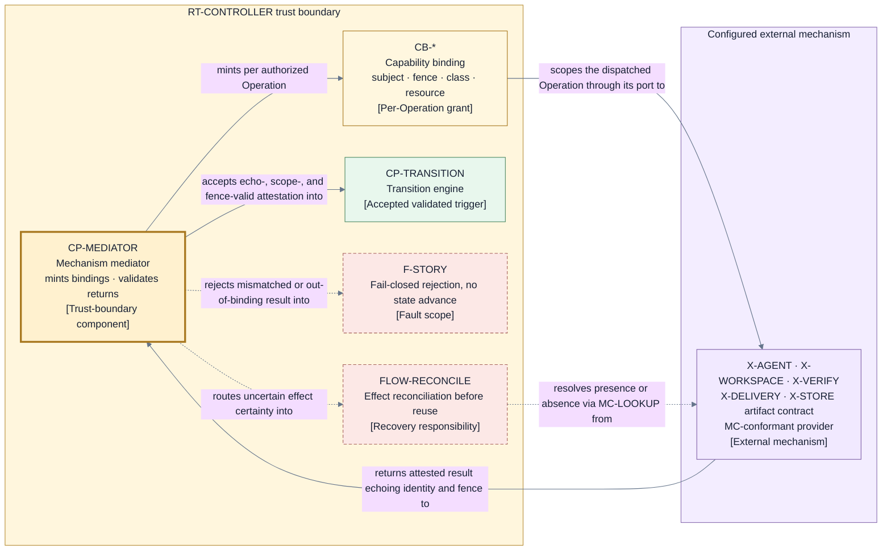

# Mechanism and provider contracts — capability-scoped, attested, conformance-gated

Every external mechanism from the [runtime port table](./runtime.md) — `X-AGENT`, `X-WORKSPACE`,
`X-VERIFY`, `X-DELIVERY`, and `X-STORE` — is reached only through its named port and only under this
contract. The page consumes [D9](./decisions/D9-invariants-and-artifact-shape.md) categories 7
(provider-specific idempotency, lookup, reconciliation, compensation, reconnection, and session
replacement) and 11 (credential resolution, delegation enforcement, sandboxing, network boundaries,
capability binding, and mechanism conformance) under the proposed
[D12](./decisions/D12-mechanism-contract-model.md) direction. The validating component is
`CP-MEDIATOR` in the [control plane](./components/control-plane.md) for every mediated Operation
port; the `PORT-LEDGER` commit primitive is the one recorded exception, validated equivalently
inside the transition engine's commit protocol (below). The trust posture enforced either way is
the Layer 1 [authority-and-trust perspective](./perspectives/authority-and-trust.md) (V2,
`R-VALIDATE`).

## Common mechanism contract (`MC-*`)

Every configured mechanism behind every port — including both storage ports — must satisfy every
clause. A result that violates any clause is rejected at the boundary, creates no claimed fact,
and authorizes no progress (I7). Where validation happens differs by port kind: mediated Operation
ports (`PORT-SESSION`, `PORT-WORKSPACE`, `PORT-VERIFY`, `PORT-DELIVERY`, `PORT-ARTIFACT`) are
validated by `CP-MEDIATOR`; the `PORT-LEDGER` commit primitive is not an Operation
([persistence](./persistence-and-projections.md)), so its `CB-STORE` binding is minted and validated
by the transition engine's commit protocol for every commit or verified read. `CP-RECOVERY` invokes
that facility for its reads; it is not a second validator. The protocol validates responses through
the `LG-*` clauses — an equivalent, differently located validation, never a weaker one.

| Clause          | Requirement                                                                                                                                                                                                                                                                                                                                                                                                                                                                          |
| --------------- | ------------------------------------------------------------------------------------------------------------------------------------------------------------------------------------------------------------------------------------------------------------------------------------------------------------------------------------------------------------------------------------------------------------------------------------------------------------------------------------ |
| `MC-IDENTITY`   | Every attestation carries an attributable mechanism and provider identity, and every role session additionally carries its participant principal (`ID-PRINCIPAL`) binding; anonymous or ambiguously attributed results are rejected. A registry storage mechanism additionally attests its canonical realization descriptor — provider identity, immutable backend instance/namespace identity, and normalized non-secret authority endpoint — from which Jig derives `ID-REGISTRY`. |
| `MC-ECHO`       | Every result echoes the exact request Operation identity and fence tuple it answers; a result that echoes nothing, or echoes a different Operation or fence, cannot advance state.                                                                                                                                                                                                                                                                                                   |
| `MC-SCOPE`      | The mechanism acts only within the capability binding presented with the Operation; it must not touch subjects, resources, or operation classes outside that binding.                                                                                                                                                                                                                                                                                                                |
| `MC-ATTEST`     | Results are structured attestations that keep directly observed facts distinct from the provider's own success claims; a bare success claim is never itself an observed fact.                                                                                                                                                                                                                                                                                                        |
| `MC-IDEMPOTENT` | An irreversible effect must be either idempotent under the Operation identity or discoverable by lookup under it, so a repeated dispatch cannot silently create a second effect.                                                                                                                                                                                                                                                                                                     |
| `MC-LOOKUP`     | The mechanism exposes a reconciliation lookup interface answering "did effect X happen" by Operation identity or by a provider correlation key it returned.                                                                                                                                                                                                                                                                                                                          |
| `MC-COMPENSATE` | Compensation happens only as new Jig-authorized Operations; a mechanism never reverses, retries, or cleans up an earlier effect autonomously.                                                                                                                                                                                                                                                                                                                                        |
| `MC-RECONNECT`  | A session mechanism either resumes an interrupted session by its identity or replaces it with an attested loss report, so Jig — not the provider — decides rework. The replacement session binds to the same participant principal (`ID-PRINCIPAL`) with recorded provenance, so reconnection never launders a principal's contribution history.                                                                                                                                     |
| `MC-HONESTY`    | A mechanism attests its actual posture, including a weak posture, rather than claiming strength it lacks; an honest `weak` attestation is valid input, a false `strong` one is a breach.                                                                                                                                                                                                                                                                                             |

A mechanism's output cannot widen its power or promote a success claim into an authoritative
lifecycle fact; Jig validates every result and records its own durable truth (I3, I5).

## Capability binding (`CB-*`)

Each authorized Operation carries exactly one capability binding: a per-Operation grant that scopes
the mechanism to a subject, a fence tuple, an operation class, and a resource scope — for example
one workspace path, one repository, or one target ref. Binding kinds follow the effect ports:

| Kind           | Port                          | Resource scope it binds                                                                                                                                                                                                                                                                                                                                                                                                                                                                                                                                                     |
| -------------- | ----------------------------- | --------------------------------------------------------------------------------------------------------------------------------------------------------------------------------------------------------------------------------------------------------------------------------------------------------------------------------------------------------------------------------------------------------------------------------------------------------------------------------------------------------------------------------------------------------------------------- |
| `CB-SESSION`   | `PORT-SESSION`                | One role assignment, its bounded inputs, and one session on one configured agent mechanism.                                                                                                                                                                                                                                                                                                                                                                                                                                                                                 |
| `CB-WORKSPACE` | `PORT-WORKSPACE`              | One workspace path and one repository at one declared basis.                                                                                                                                                                                                                                                                                                                                                                                                                                                                                                                |
| `CB-VERIFY`    | `PORT-VERIFY`                 | One exact evidence subject and the configured checks over that subject only, executed effect-free by enforced contract: read-only subject view, discarded scratch area, zero network egress by default; a check class with a declared external-effect need is bound and reconciled as an irreversible-effect Operation instead.                                                                                                                                                                                                                                             |
| `CB-DELIVERY`  | `PORT-DELIVERY`               | One repository, one target ref, and one Candidate basis for publication or integration.                                                                                                                                                                                                                                                                                                                                                                                                                                                                                     |
| `CB-STORE`     | `PORT-LEDGER`/`PORT-ARTIFACT` | For `PORT-ARTIFACT`: one named artifact write and its digest-verified reads, minted per Operation and validated by `CP-MEDIATOR`. For the `PORT-LEDGER` commit primitive: one Run's ledger positions, one realization-bound `ID-REGISTRY` and canonical target's registry line, or the corresponding witness heads, minted per commit or verified read by the transition engine's commit protocol — the single ledger-primitive validator, which recovery uses for its reads — with the Operation-bound clause vocabulary satisfied through the ledger substitutions below. |

Delegation enforcement is symmetric: the minting component (`CP-MEDIATOR` for mediated Operation
ports; the transition engine for the ledger commit primitive) mints the binding at dispatch and
validates it again on return. A result presented under a
different binding — or under no binding — fails closed and creates no fact (I7). A binding confers
no standing authority: it is bound to the Operation identity and fence tuple, so it cannot be
reused for a later Operation, a different subject, or a superseded controller generation.

### Ledger-primitive substitutions

The `MC-*` clauses are written in Operation vocabulary, and the `PORT-LEDGER` commit primitive is
not an Operation. The clauses still bind its storage mechanism — through these recorded
substitutions, not verbatim:

| Operation-vocabulary clause                       | Ledger-primitive substitution                                                                                                                                                                                                                                                |
| ------------------------------------------------- | ---------------------------------------------------------------------------------------------------------------------------------------------------------------------------------------------------------------------------------------------------------------------------- |
| Operation identity echo (`MC-ECHO`)               | The qualified Transition identity (position plus proposing generation plus record digest), or the registry line / witness head key.                                                                                                                                          |
| Scope (`MC-SCOPE`, `CB-STORE`)                    | One Run's ledger positions, one realization-bound `ID-REGISTRY` and canonical target's registry line, or the corresponding witness heads.                                                                                                                                    |
| Idempotency (`MC-IDEMPOTENT`)                     | The conditional append decided by expected position (`LG-APPEND`): a duplicate submission cannot double-commit.                                                                                                                                                              |
| Reconciliation lookup (`MC-LOOKUP`)               | The strict positional readback (`LG-READ`) and its five-way classification in [persistence](./persistence-and-projections.md): own commit, empty-position absence, competing commit, integrity failure, or indeterminate.                                                    |
| Binding identity and fence (`CB-*` bound-to rule) | The binding is bound to the store line (one Run's ledger, one registry line, or the witness heads), the expected position, and the proposing controller generation — the ledger's identity-and-fence substitute; it is unusable for any other line, position, or generation. |
| Compensation (`MC-COMPENSATE`)                    | None: the store is append-only; repair happens only through new records, never mutation.                                                                                                                                                                                     |
| Reconnection (`MC-RECONNECT`)                     | Not applicable: store calls are stateless; there is no session to resume or replace.                                                                                                                                                                                         |

Validation and minting have one owner: the transition engine's commit protocol is the single
ledger-primitive validator and binding minter, and `CP-RECOVERY` performs its verified reads
through that same protocol facility rather than through a second validator. Everything else is
validated by `CP-MEDIATOR`.

## Credential resolution and secrecy

- Credentials resolve from the environment at process start, per configured mechanism;
  configuration names only the environment key, never a value.
- Resolved credentials live only in controller and mechanism process memory for the life of the
  process.
- Credential and secret values are never written to the ledger, evidence artifacts, logs, or
  schemas (project brief QS10).
- Durable records reference credentials only by configuration key name, so attribution and proof
  survive without exposure.

## Sandboxing and network boundaries

Mechanism sessions run under least-privilege declared scopes: a filesystem allowlist derived from
the workspace binding and a network allowlist derived from the configured provider's declared
needs. Verification sessions are stricter still: `CB-VERIFY` defaults to zero network egress and a
read-only subject view, because effect-freedom is what licenses re-issuing a lost check response
without reconciliation (I17). The enforcement strength is itself attested at compose time — an honest `weak` or `strong`
posture per `MC-HONESTY` — so frozen policy can require a minimum posture and a Run whose
configured mechanisms cannot meet it fails closed before Story effects. Posture cannot be silently
downgraded: configuration may exceed the policy minimum but never lower it, the same
configuration-cannot-weaken-policy rule pattern as I9.

## Provider-specific realization duties

What the category 7 duties mean per port family; each duty is exercised by that port's conformance
suite before a provider becomes configurable.

| Port family                             | Idempotency and lookup                                                                                                                                                                                                                                                                                                                                             | Reconciliation and compensation                                                                                                     | Reconnection and replacement                                                                                                                           |
| --------------------------------------- | ------------------------------------------------------------------------------------------------------------------------------------------------------------------------------------------------------------------------------------------------------------------------------------------------------------------------------------------------------------------ | ----------------------------------------------------------------------------------------------------------------------------------- | ------------------------------------------------------------------------------------------------------------------------------------------------------ |
| Session (`PORT-SESSION`)                | Assignment delivery is idempotent under the Operation identity; an existing session is discoverable by that identity.                                                                                                                                                                                                                                              | An abandoned or duplicate session is settled only by a new authorized Operation; the provider never re-runs work on its own.        | Resume the same session by identity where supported; otherwise attest the loss so Jig decides rework (`MC-RECONNECT`).                                 |
| Workspace (`PORT-WORKSPACE`)            | Isolation and repository effects are idempotent under the Operation identity; workspace, branch, and basis are queryable.                                                                                                                                                                                                                                          | Content, basis, and cleanliness facts answer reconciliation; cleanup and preservation run only as new authorized Operations.        | A lost workspace process is replaced against the durable workspace; the binding pins the path and basis the replacement may use.                       |
| Verification (`PORT-VERIFY`)            | Checks are observations, repeatable on the exact subject; a prior observation is retrievable by Operation identity.                                                                                                                                                                                                                                                | Uncertainty is resolved by re-observing the exact subject; there is no effect to compensate.                                        | A lost check execution is replaced by a new authorized Operation over the same exact subject.                                                          |
| Delivery (`PORT-DELIVERY`)              | Publication and integration effects are idempotent under the Operation identity or discoverable by a provider correlation key; the target lineage anchor is created by an atomic conditional-create the provider must support and attest, and a provider that cannot fails preflight for finalizing Runs.                                                          | An uncertain irreversible effect is looked up before any second semantic attempt (I17); reversal only as new authorized Operations. | Connection loss never re-fires an effect; the replacement dispatch must first reconcile the earlier Operation's certainty.                             |
| Storage (`PORT-LEDGER`/`PORT-ARTIFACT`) | Conditional appends are decided by expected position; an unknown commit acknowledgement is resolved by reading the position. Registry storage attests the canonical realization descriptor used to derive `ID-REGISTRY`, and a mismatch fails preflight. Witness lines advance durably before append acknowledgement and are readable independently of the ledger. | Digest-verified reads answer whether a record or artifact exists; repair or migration only as new authorized Operations.            | A storage reconnection replays no writes; the append condition, content digests, and witness heads make duplicate application and rollback detectable. |

## Conformance gating

A provider becomes configurable behind a port only after passing that port's conformance suite in
the [architecture conformance catalog](./architecture-conformance.md). A conformance claim is
recorded evidence — the suite version and the exact subject digest of what passed — not trust by
assertion, and configuration cannot substitute a claim for the recorded pass.

## View V12 — capability-scoped mechanism mediation

- **Question:** How does one authorized Operation cross the trust boundary to a configured
  mechanism and return as a validated trigger, a fail-closed rejection, or a reconciliation case?
- **View type:** Component-to-mechanism interaction view across the trust boundary.
- **Audience and purpose:** Engineers and security reviewers; see where bindings are minted,
  where returns are validated, and where uncertainty exits before writing provider code.
- **Scope and exclusions:** One Operation's mediation path. Port transports, schemas, retry
  bounds, and provider internals are excluded, as is the PORT-LEDGER commit primitive, which is
  not an Operation and is validated inside the transition engine's commit protocol.
- **State:** Approved (not locked).
- **Owner:** Arye Kogan.
- **Sources:** D3, D9 categories 7 and 11, D10, D12; I3, I7, I15, I17; [V2](./perspectives/authority-and-trust.md);
  [V6](./runtime.md).
- **Related views:** [V6](./runtime.md) names the ports; [V7](./components/control-plane.md) owns
  `CP-MEDIATOR`'s siblings; [V17](./architecture-conformance.md) gates the providers shown here.

**V12 legend:** Rectangles are components, grants, outcomes, or mechanisms. The thick yellow border
marks `CP-MEDIATOR`, the trust-boundary component acting for the sole lifecycle authority; the
light-yellow node is the per-Operation capability binding (`CB-*` stands for the five kinds
`CB-SESSION`, `CB-WORKSPACE`, `CB-VERIFY`, `CB-DELIVERY`, `CB-STORE`). Green marks the accepted
outcome (a validated trigger entering `CP-TRANSITION`); red dashed-border nodes and dashed lines
carry failure and uncertainty: fail-closed rejection contained at the Story fault scope (`F-STORY`
from V2) and the uncertain-effect path into `FLOW-RECONCILE`, whose `MC-LOOKUP` query is itself a
new authorized Operation. Purple is the configured external mechanism, grouped to keep one level;
each mechanism keeps its own V1 identity and port. Solid lines are the normal mint-dispatch-return
path; color is redundant with the stable IDs and bracketed types. The `X-STORE` ledger contract
is deliberately absent from this view: the commit primitive is not an Operation, and its binding
and validation follow the ledger-primitive substitutions above inside the transition engine. `MC`
means mechanism-contract clause and `CB` capability binding.

## Exclusions

- Wire formats, transports, and encodings per port (a D10 deferral, decided with realization).
- Credential token mechanics beyond the resolution and secrecy rules above (D12 deferral).
- Per-provider sandbox implementations; only the declared scopes and attested posture are owned
  here.
- Failure codes, retry bounds, and budget classes — owned by the failure taxonomy and its bound
  classes, per [failure and liveness](./failure-and-liveness.md) obligations.
- Repository, merge, and landing-proof algorithms (D9 category 10, a sibling page's subject).

## Where to go next

- The validating component and its siblings: [control plane components](./components/control-plane.md).
- The suites that gate providers and realizations:
  [architecture conformance](./architecture-conformance.md).
- Identity, fence, and schema shapes crossing the ports: [data and identity](./data-and-identity.md).
- Why this contract model was selected, with rejected alternatives:
  [D12 — mechanism contract model](./decisions/D12-mechanism-contract-model.md).
