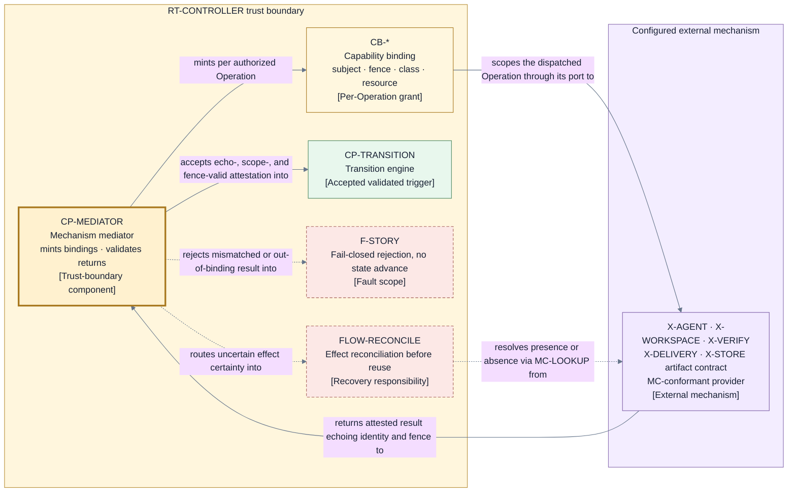

# Mechanism and provider contracts — capability-scoped, attested, conformance-gated

Every external mechanism from the [runtime port table](./runtime.md) — `X-AGENT`, `X-WORKSPACE`,
`X-VERIFY`, `X-DELIVERY`, and `X-STORE` — is reached only through its named port and only under this
contract. The Work Source provider behind the Envelope Builder's `PORT-SOURCE` follows the same
identity, manifest, attestation, freshness, and conformance clauses without receiving active-Run
authority. The page consumes [D9](./decisions/D9-invariants-and-artifact-shape.md) categories 7
(provider-specific idempotency, lookup, reconciliation, compensation, reconnection, and session
replacement) and 11 (credential resolution, delegation enforcement, sandboxing, network boundaries,
capability binding, and mechanism conformance) under the proposed
[D12](./decisions/D12-mechanism-contract-model.md) direction. The validating component is
`CP-MEDIATOR` in the [control plane](./components/control-plane.md) for every mediated Operation
port; the `PORT-LEDGER` commit primitive is the recorded exception, validated equivalently where
each authority structure is used: `CP-INTAKE` for `LG-INTAKE`, and the transition engine's commit
protocol for Run-ledger, registry, and witness access (below). The trust posture enforced either way is
the Layer 1 [authority-and-trust perspective](./perspectives/authority-and-trust.md) (V2,
`R-VALIDATE`).

## Common mechanism contract (`MC-*`)

Every configured mechanism behind every port — including both storage ports — must satisfy every
clause. A result that violates any clause is rejected at the boundary, creates no claimed fact,
and authorizes no progress (I7). Where validation happens differs by port kind: mediated Operation
ports (`PORT-SESSION`, `PORT-WORKSPACE`, `PORT-VERIFY`, `PORT-DELIVERY`, `PORT-ARTIFACT`) are
validated by `CP-MEDIATOR`; the `PORT-LEDGER` commit primitive is not an Operation
([persistence](./persistence-and-projections.md)). `CP-INTAKE` mints and validates the deployment-
scoped intake-key binding for its conditional-create/read; the transition engine's commit protocol
does so for Run-ledger, registry, and witness commits/reads, and `CP-RECOVERY` invokes that facility
for its reads. The protocols validate responses through
the `LG-*` clauses — an equivalent, differently located validation, never a weaker one.

| Clause          | Requirement                                                                                                                                                                                                                                                                                                                                                                                                                                                                                           |
| --------------- | ----------------------------------------------------------------------------------------------------------------------------------------------------------------------------------------------------------------------------------------------------------------------------------------------------------------------------------------------------------------------------------------------------------------------------------------------------------------------------------------------------- |
| `MC-IDENTITY`   | Every attestation carries an attributable mechanism and provider identity, and every role session additionally carries its `ID-SESSION` and participant principal (`ID-PRINCIPAL`) binding; anonymous or ambiguously attributed results are rejected. A registry storage mechanism additionally attests its canonical realization descriptor — provider identity, immutable backend instance/namespace identity, and normalized non-secret authority endpoint — from which Jig derives `ID-REGISTRY`. |
| `MC-ECHO`       | Every result echoes the exact request Operation identity and the dispatch attempt's current fence; a result that echoes nothing, another Operation, a prior-attempt stale fence, or a different current fence cannot advance state.                                                                                                                                                                                                                                                                   |
| `MC-SCOPE`      | The mechanism acts only within the capability binding presented with the Operation; it must not touch subjects, resources, or operation classes outside that binding.                                                                                                                                                                                                                                                                                                                                 |
| `MC-ATTEST`     | Results are structured attestations that keep directly observed facts distinct from the provider's own success claims; a bare success claim is never itself an observed fact.                                                                                                                                                                                                                                                                                                                         |
| `MC-IDEMPOTENT` | An irreversible effect must be either idempotent under the Operation identity or discoverable by lookup under it, so a repeated dispatch cannot silently create a second effect.                                                                                                                                                                                                                                                                                                                      |
| `MC-LOOKUP`     | The mechanism exposes a reconciliation lookup interface answering "did effect X happen" by Operation identity or by a provider correlation key it returned.                                                                                                                                                                                                                                                                                                                                           |
| `MC-COMPENSATE` | Compensation happens only as new Jig-authorized Operations; a mechanism never reverses, retries, or cleans up an earlier effect autonomously.                                                                                                                                                                                                                                                                                                                                                         |
| `MC-RECONNECT`  | A session mechanism resumes by `ID-SESSION` or attests loss. A replacement receives a new `ID-SESSION`, binds the same `ID-PRINCIPAL` and assignment, and records predecessor/successor provenance. Pending `ID-PARK` requests survive and answers follow the rebound session; if context cannot be restored, Jig records cancel-and-reissue with lineage. Reconnection never launders contribution history or silently drops a request.                                                              |
| `MC-HONESTY`    | A mechanism attests its actual posture, including a weak posture, rather than claiming strength it lacks; an honest `weak` attestation is valid input, a false `strong` one is a breach.                                                                                                                                                                                                                                                                                                              |
| `MC-AUTHORITY`  | The provider acts only within its exact `SCH-PROVIDER-AUTHORITY` digest/scope approved by Arye through the distinct **Approve exact provider authority manifest** verb on `PORT-CONSUMER`. Runtime, filesystem, network, credential, subprocess, or external-service authority absent from that exact binding is unavailable; a changed manifest or scope is a new unapproved subject. Provider conformance and later `EP-APPROVE` proposal approval cannot substitute for this binding.              |
| `MC-LIVENESS`   | Session and long-running mechanisms expose attributable heartbeat, qualifying-progress, silence, termination, and approval-wait observations for deterministic classification; a provider's bare "healthy" claim is not itself a fact.                                                                                                                                                                                                                                                                |
| `MC-PERMISSION` | An Agent provider launches the session under the exact owner-selected native permission posture bound in the envelope and never changes it at the worker's request. Actions allowed, automatically reviewed, or rejected inside that posture remain provider-internal. Only a permission or question that requires a human is emitted as a session-bound request; the provider later enforces or consumes the exact Doorbell answer.                                                                  |

A mechanism's output cannot widen its power or promote a success claim into an authoritative
lifecycle fact; Jig validates every result and records its own durable truth (I3, I5).

The two pre-Run exchange families use one shared durability rule before a request crosses a
mechanism boundary. For either a configuration-artifact read or a capability-proof attempt,
`LG-PREFLIGHT-ATTEMPT` derives separate deterministic start and result variant keys from one
exchange-attempt key, then conditionally creates or reads back the corresponding immutable bytes.
Exact same-variant-key bytes replay. A same-variant-key byte mismatch, missed deadline rule, missing or
invalid predecessor, or digest/integrity failure fails closed. The primitive records bounded
mechanism evidence only: it creates no event, Operation, Run, authority, Transition, dispatch, or
second ledger authority.

## Capability binding (`CB-*`)

Each authorized Operation carries exactly one capability binding: a per-Operation grant that scopes
the mechanism to a subject, a fence tuple, an operation class, and a resource scope — for example
one workspace path, one repository, or one target ref. Binding kinds follow the effect ports:

| Kind                    | Port                          | Resource scope it binds                                                                                                                                                                                                                                                                                                                                                                                                                                                                                                                                                                                                                                                                                                                                                                                                                                                                                                                                                                                                                                                                                                                                                                                                                                                                                                                                                                                                                                                                                                                                                                               |
| ----------------------- | ----------------------------- | ----------------------------------------------------------------------------------------------------------------------------------------------------------------------------------------------------------------------------------------------------------------------------------------------------------------------------------------------------------------------------------------------------------------------------------------------------------------------------------------------------------------------------------------------------------------------------------------------------------------------------------------------------------------------------------------------------------------------------------------------------------------------------------------------------------------------------------------------------------------------------------------------------------------------------------------------------------------------------------------------------------------------------------------------------------------------------------------------------------------------------------------------------------------------------------------------------------------------------------------------------------------------------------------------------------------------------------------------------------------------------------------------------------------------------------------------------------------------------------------------------------------------------------------------------------------------------------------------------- |
| `CB-SESSION`            | `PORT-SESSION`                | One role assignment, its bounded inputs, and one `ID-SESSION` on one configured session mechanism. An Agent-provider session binds its exact native permission-posture reference and only the authority allowed by its approved manifest. A human-client session mechanism is configurable only after passing `CF-MECH-SESSION`, binds one authenticated human `ID-PRINCIPAL` per session, and carries results, verdicts, and liveness through the identical validation rows. Forge and privileged-delivery credential classes are structurally unrepresentable; manifest approval or binding validation naming either rejects `FC-AUTHORITY`. A response binding pins `ID-PARK`, originating `ID-PRINCIPAL`/assignment, current same-principal session, exact answer, and replacement or cancel-and-reissue lineage.                                                                                                                                                                                                                                                                                                                                                                                                                                                                                                                                                                                                                                                                                                                                                                                 |
| `CB-WORKSPACE`          | `PORT-WORKSPACE`              | One workspace path and one repository at one declared basis. A setup binding additionally pins the recipe digest, freshness-input digest, and separately approved setup effects.                                                                                                                                                                                                                                                                                                                                                                                                                                                                                                                                                                                                                                                                                                                                                                                                                                                                                                                                                                                                                                                                                                                                                                                                                                                                                                                                                                                                                      |
| `CB-VERIFY`             | `PORT-VERIFY`                 | One exact evidence subject and configured checks over that subject, effect-free by enforced contract: read-only subject, discarded scratch, and zero external effects or network egress. Any effect attempt is out of scope and fails closed.                                                                                                                                                                                                                                                                                                                                                                                                                                                                                                                                                                                                                                                                                                                                                                                                                                                                                                                                                                                                                                                                                                                                                                                                                                                                                                                                                         |
| `CB-REVIEW-PUBLICATION` | `PORT-DELIVERY`               | One repository, exact `SCH-CANDIDATE` content digest/basis, dedicated review ref, draft non-mergeable request identity/marker, stable status context/comment marker, and redacted explanation digest. Target ref is read-only context; only `OPC-REV-*` is admitted, with no `ID-AUTH`, anchor, target mutation, merge, landing, or finalization.                                                                                                                                                                                                                                                                                                                                                                                                                                                                                                                                                                                                                                                                                                                                                                                                                                                                                                                                                                                                                                                                                                                                                                                                                                                     |
| `CB-DELIVERY`           | `PORT-DELIVERY`               | One repository, target ref, Accepted `SCH-CANDIDATE` binding values, current `ID-AUTH`/registry lineage, and only finalization/landing `OPC-DEL-*` classes. Review-publication classes are excluded.                                                                                                                                                                                                                                                                                                                                                                                                                                                                                                                                                                                                                                                                                                                                                                                                                                                                                                                                                                                                                                                                                                                                                                                                                                                                                                                                                                                                  |
| `CB-STORE`              | `PORT-LEDGER`/`PORT-ARTIFACT` | For Run-scoped `PORT-ARTIFACT`, one exact artifact Operation validated by `CP-MEDIATOR`: `OPC-ART-PUT` binds put-or-verify plus the exact temporary-event/intended-holder two-pin set; `OPC-ART-GET` binds one digest-verified read; and `OPC-ART-DISPOSE` binds exactly one tuple and `release-pin` or `dispose-bytes` mode, so release cannot delete bytes. Existing holder class selects and the approved artifact-provider manifest/resource scope binds the protected configuration/intake or disposable evidence context; this adds no persisted identity or schema operand, and changed, missing, or unverifiable binding fails closed. The pre-Run configuration-artifact exception binds the protected context, exact artifact subject/digest, envelope composition digest, exchange-attempt and variant keys, ordinal, start/deadline/result, predecessor, and `BND-WAIT-MECHANISM`/`BND-RETRY`; `LG-PREFLIGHT-ATTEMPT` conditionally creates or reads back immutable `SCH-INTAKE-ACK` variants, and no Operation, event, Run, intake authority, Transition, or dispatch exists. Capability-proof attempts use the same primitive and protected context inside the provider's configured exchange. For `PORT-LEDGER`, the binding covers one intake composition-digest key, one Run's positions, one realization-bound registry line, or a corresponding witness head. Those heads include exactly one artifact-reference-index line keyed by the approved disposable evidence resource scope; `CP-TRANSITION` advances it only from a validated mode-bound `EV-ARTIFACT-FACT` lookup head. |

Delegation enforcement is symmetric: the minting component (`CP-MEDIATOR` for mediated Operation
ports; the transition engine for the ledger commit primitive) mints the binding at dispatch and
validates it again on return. A result presented under a
different binding — or under no binding — fails closed and creates no fact (I7). A binding confers
no standing authority: it is bound to the Operation identity and fence tuple, so it cannot be
reused for a later Operation, a different subject, or a superseded controller generation.
Every binding is a narrowing of the provider's approved authority manifest, never an extension of
it. `CP-MEDIATOR` rejects dispatch outside `ID-MANIFEST` and rejects a return that echoes a
different manifest identity than the recorded fence.

The local deployment trust root is the user-run local OS execution context plus its configured
participant key. Transport authentication and hardening beyond that local-first binding are
mechanism-contract choices: the configured provider must deliver an authenticated caller binding
for Jig to validate, and an unbindable caller fails closed. Conformance probes exercise forged
caller and read-scope-widening attempts; this contract does not claim to implement remote transport
security itself.

### Ledger-primitive substitutions

The `MC-*` clauses are written in Operation vocabulary, and the `PORT-LEDGER` commit primitive is
not an Operation. The clauses still bind its storage mechanism — through these recorded
substitutions, not verbatim:

| Operation-vocabulary clause                       | Run ledger, registry, and witness substitution                                                                                                                                                                                                                               | Intake substitution                                                                                                                                                                                                                                        |
| ------------------------------------------------- | ---------------------------------------------------------------------------------------------------------------------------------------------------------------------------------------------------------------------------------------------------------------------------- | ---------------------------------------------------------------------------------------------------------------------------------------------------------------------------------------------------------------------------------------------------------- |
| Operation identity echo (`MC-ECHO`)               | The qualified Transition identity (position plus proposing generation plus record digest), or the registry line / witness head key.                                                                                                                                          | The composition acknowledgement key and, for an accepted successor, the full predecessor-cut claim key plus both immutable content digests. Any mismatched key, winner, digest, or shared position is rejected.                                            |
| Scope (`MC-SCOPE`, `CB-STORE`)                    | One Run's ledger positions, one realization-bound `ID-REGISTRY` and canonical target's registry line, or the corresponding witness heads.                                                                                                                                    | One acknowledgement key and, only for accepted successor intake, its one derived cut-claim key in the same `LG-INTAKE` atomic commit. The binding cannot access unrelated keys.                                                                            |
| Idempotency (`MC-IDEMPOTENT`)                     | The conditional append decided by expected position (`LG-APPEND`): a duplicate submission cannot double-commit.                                                                                                                                                              | Same-digest replay returns the existing result. Accepted successor creation succeeds only when both acknowledgement and cut-claim keys are absent; a different digest naming the occupied cut deterministically loses and cannot create an accepted entry. |
| Reconciliation lookup (`MC-LOOKUP`)               | The strict positional readback (`LG-READ`) and its five-way classification in [persistence](./persistence-and-projections.md): own commit, empty-position absence, competing commit, integrity failure, or indeterminate.                                                    | Readback classifies absent pair, exact same-position pair, occupied-cut winner, exact rejected contender, integrity failure, or indeterminate storage. Only the witnessed complete pair establishes accepted successor commitment.                         |
| Binding identity and fence (`CB-*` bound-to rule) | The binding is bound to the store line (one Run's ledger, one registry line, or the witness heads), the expected position, and the proposing controller generation — the ledger's identity-and-fence substitute; it is unusable for any other line, position, or generation. | Intake is pre-Run and pre-generation. Its binding is the exact acknowledgement key plus optional cut-claim key, staged content digests, and one shared conditional-commit attempt; no other cut or composition can inherit it.                             |
| Compensation (`MC-COMPENSATE`)                    | None: the store is append-only; repair happens only through new records, never mutation.                                                                                                                                                                                     | None: an acknowledgement is immutable. Recovery recreates derived Run-ledger/projection consequences from an accepted acknowledgement; it never mutates or compensates the intake entry.                                                                   |
| Reconnection (`MC-RECONNECT`)                     | Not applicable: store calls are stateless; there is no session to resume or replace.                                                                                                                                                                                         | Not applicable: conditional-create/read calls are stateless; a lost caller or acknowledgement repeats the same-digest readback protocol.                                                                                                                   |

For `LG-PREFLIGHT-ATTEMPT`, the corresponding substitutions are the deterministic exchange-attempt
key, derived variant key, and immutable variant digest for identity echo; exactly one
configuration-read or capability-proof subject/basis/ordinal and predecessor chain for scope;
byte-equivalent conditional-create/readback for idempotency; and strict same-variant-key readback
for reconciliation. Readback distinguishes absence,
the one byte-equivalent value, key/content mismatch or integrity failure, and indeterminate storage.
Only the byte-equivalent value preserves consumed bounds, and no replay may advance an ordinal
without the valid predecessor result or elapsed recorded deadline. There is no compensation,
session replacement, semantic-effect retry, or authority carried by this evidence primitive.

Validation and minting have one owner per authority structure: `CP-INTAKE` for the sole
`LG-INTAKE` key operation, and the transition engine's commit protocol for Run ledger, registry,
and witness access. `CP-RECOVERY` performs its verified reads through the latter facility rather
than through a second validator. For `LG-PREFLIGHT-ATTEMPT`, `CP-MEDIATOR` validates the
configuration-read use and `EP-PROVIDERS` validates the capability-proof use; remaining mediated
Operations are validated by `CP-MEDIATOR`.

## Provider authority manifests

Every selected provider carries one `SCH-PROVIDER-AUTHORITY` manifest identified as `ID-MANIFEST`.
Its exact canonical digest and scope are approved only through the distinct **Approve exact
provider authority manifest** action on `PORT-CONSUMER`
that authenticates the caller as Arye's configured `ID-PRINCIPAL` and validates or returns the
immutable approval binding. `EP-PROVIDERS` consumes that exact binding. This is not
`EP-APPROVE`: manifest approval creates no Run, grant, event, Transition, dispatch, proposal
approval, or capability proof. A changed manifest or scope requires a fresh manifest-approval
invocation. The declaration is exhaustive and deny-by-default
across runtime and subprocess classes, filesystem roots and access modes, network destinations and
protocols, credential key names and their resolving process, external systems/effect classes, and
the native permission postures the provider supports. For an Agent provider, the envelope selects
one exact native posture reference and records its declared filesystem, command, approval-review,
and network semantics. That selection narrows the manifest; it never extends it.

The manifest is part of envelope composition, conformance subject identity, every relevant
capability fence, and compose-time attestation. A byte change, provider-build change, or changed
authority endpoint invalidates the approval and conformance qualification before any Story effect;
the provider cannot ask an active Run to accept wider authority. The Work Source provider follows
the same rule in the Envelope Builder even though it holds no active-Run capability binding.

For an Agent provider, manifest parsing and owner approval reject any declared forge or
privileged-delivery credential class before composition. `CB-SESSION` has no field capable of
carrying either class, and return-path validation rejects an attestation that claims one. The
exclusion is structural at schema and binding boundaries, not a promise that a worker will abstain.

## Role-session lifecycle

Every role session is a durable `SCH-SESSION` projection with this exhaustive lifecycle:

| From                      | Trigger and guard                                                                                                                                                           | To and persisted fact                                                                                                         |
| ------------------------- | --------------------------------------------------------------------------------------------------------------------------------------------------------------------------- | ----------------------------------------------------------------------------------------------------------------------------- |
| none                      | Recorded `OPC-SESSION-OPEN` intent and provider open attestation for one Story/role/deterministic assignment basis, turn ordinal, provider manifest, posture, and principal | `open`; mint fresh `ID-SESSION` and `EV-SESSION-FACT` records the exact open binding basis and separate provider correlation. |
| `open`                    | Provider attests the exact session and `CB-SESSION` passes                                                                                                                  | `bound`; `EV-SESSION-FACT` bind attestation records provider correlation and current fence.                                   |
| `bound`                   | Recorded assignment dispatch is acknowledged under the same binding                                                                                                         | `active`; `EV-SESSION-FACT` assignment acknowledgement records activation position.                                           |
| `active`                  | Same logical session and assignment resume by identity                                                                                                                      | `active`; `EV-SESSION-FACT` reconnect observation records no identity change. A later rework assignment is never a reconnect. |
| `active`                  | Provider attests context loss and replacement is allowed for the same principal/assignment                                                                                  | `replaced`, then terminal; `EV-SESSION-FACT` records successor `ID-SESSION`. The successor separately enters `open`.          |
| `open`, `bound`, `active` | Run/Story stop or recorded cancellation fences further dispatch                                                                                                             | `cancelled`, then terminal; `EV-SESSION-FACT` records reason and pending-result disposition.                                  |
| `open`, `bound`, `active` | Provider attests irrecoverable loss and no replacement is adopted                                                                                                           | `lost-attested`, then terminal; `EV-SESSION-FACT` records the attestation and any `ID-PARK` cancel-and-reissue lineage.       |
| `active`                  | Bounded work and result collection complete, followed by recorded close                                                                                                     | terminal; `EV-SESSION-FACT` records completion and close result.                                                              |

Every result retains both producing `ID-SESSION` and `ID-PRINCIPAL`. Replacement may continue the
same assignment, but never rewrites prior contribution or verdict attribution; collected result
lineage links predecessor and successor sessions explicitly.

Every rework turn follows a fresh logical `none` → `open` → `bound` → `active` → terminal
lifecycle under a new deterministic assignment basis and first `ID-SESSION`, even when the provider
reuses a process or connection. Provider correlation is therefore observation metadata, never Jig
session identity or authority. A replacement within the same assignment retains its assignment
basis and rework ordinal while minting successor session lineage; the next rework assignment uses
next-assignment lineage. The previous same-role assignment must be terminal and every in-flight
effect reconciled, fenced, or parked before the later assignment can dispatch. A stale prior
assignment acknowledgement or result fails closed even when it comes from the reused provider
process. `completed-close` fences the logical capability but need not terminate that process.

The lifecycle's named `terminal` value is the one closed session disposition; the four terminal
causes are `replaced`, `cancelled`, `lost-attested`, and `completed-close`. Cause is immutable
provenance, not a separate state. The following R1.4 inventory makes every entry, exit, and legal
post-terminal append explicit without adding a session state:

| Session state or terminal cause | Existing entry                                                  | Existing exit or legal post-terminal append                                                                                                                                                                            |
| ------------------------------- | --------------------------------------------------------------- | ---------------------------------------------------------------------------------------------------------------------------------------------------------------------------------------------------------------------- |
| `open`                          | Validated `OPC-SESSION-OPEN` attestation                        | `bound`, terminal `cancelled`, or terminal `lost-attested`.                                                                                                                                                            |
| `bound`                         | Validated exact-session bind attestation                        | `active`, terminal `cancelled`, or terminal `lost-attested`.                                                                                                                                                           |
| `active`                        | Assignment acknowledgement under the same binding               | Phase-preserving reconnect, or terminal `replaced`, `cancelled`, `lost-attested`, or `completed-close`.                                                                                                                |
| terminal `replaced`             | Attested context loss plus permitted same-principal replacement | No append to the terminal session. The successor independently enters `open` and links back to this session.                                                                                                           |
| terminal `cancelled`            | Stop or cancellation fence                                      | No further dispatch or session-state append. A late result, fault, reconnect, or close attestation is rejected as state-mutating input; a duplicate terminal fact resolves to the existing record and appends nothing. |
| terminal `lost-attested`        | Irrecoverable-loss attestation with no adopted replacement      | No append to the terminal session; any cancel-and-reissue path starts a separately identified successor.                                                                                                               |
| terminal `completed-close`      | Bounded result collection plus validated close result           | No further session-state append. Run-level export, obligation, or disposal administration may reference the closed session but cannot mutate it.                                                                       |

## Credential resolution and secrecy

- Credentials resolve from the environment at process start, per configured mechanism;
  configuration names only the environment key, never a value.
- Resolved credentials live only in controller and mechanism process memory for the life of the
  process.
- Credential and secret values are never written to the ledger, evidence artifacts, logs, or
  schemas (project brief QS10).
- Durable records reference credentials only by configuration key name, so attribution and proof
  survive without exposure.

## Provider permission and network boundaries

Agent sessions run under the exact provider-native permission posture frozen in the envelope. The
Agent provider and its Execution Host enforce that posture, including its filesystem, command,
approval-review, and network semantics. Jig verifies that the configured provider accepted the
selected posture reference and that the selection is unchanged across resume; it does not
intercept individual worker actions or independently prove the provider's sandbox or egress
implementation. Policy and repo floors may reject a declared posture before launch, but cannot
silently rewrite it after launch.

Provider-internal permission outcomes remain inside the session. An allowed or automatically
approved action executes under the provider posture; a rejected action does not execute. Only a
permission or question the provider marks `human-required` crosses `PORT-SESSION`. Jig durably
parks that exact request at the Doorbell and returns the scoped answer by `ID-PARK` to the session
currently bound to the originating principal/assignment. The original session is reused where
supported; attested loss rebinds a same-principal replacement, or an unrestorable context closes and
reissues the request with lineage. The provider, not Jig, enforces or consumes the answer.

Verification sessions remain stricter because they are Jig-authorized verification mechanisms,
not worker-runtime actions: `CB-VERIFY` enforces zero external effects/network egress, a read-only
subject view, and discarded scratch. Effect-freedom means no effect reconciliation is needed, but a
lost or replaced check is always a **new authorized Operation with a new `ID-OP`** over the same
exact subject; same-identity retry is reserved for effectful Operations after confirmed absence
under recorded reauthorization. A check requiring external effects is outside `PORT-VERIFY`.

## Provider-specific realization duties

For disposable evidence, `PORT-ARTIFACT` is Operation-only. `OPC-ART-PUT` puts or verifies bytes
and registers the exact temporary-event/intended-holder two-pin set before adoption; its payload
basis and `CB-STORE` bind digest, context/provider scope, both complete tuples, and set mutation.
Existing bytes succeed only with both pins. `OPC-ART-DISPOSE` is mode-bound:
post-retirement `release-pin` cannot delete bytes and preserves/reconciles a pin on uncertainty,
while `dispose-bytes` alone may delete after owner, settlement, retention, preservation, no-live-pin,
and witness guards. Both return `EV-ARTIFACT-FACT` with lookup position/head; `CP-TRANSITION`
advances `LG-WITNESS` through `PORT-LEDGER` before acknowledgement. Receipt heads are comparison
evidence, never addresses or recursive pins.

What the category 7 duties mean per port family; each duty is exercised by that port's conformance
suite before a provider becomes configurable.

| Port family                  | Idempotency and lookup                                                                                                                                                                                                                                                                                                                                                                                                                                                                                                                                                                                                                                                                                                    | Reconciliation and compensation                                                                                                                                                                                                                                                                                                                                                                                                                                                                                                                                                                                                                                                      | Reconnection and replacement                                                                                                                                                                                                                                                                                                                                                                                                                                                                                                                                                                             |
| ---------------------------- | ------------------------------------------------------------------------------------------------------------------------------------------------------------------------------------------------------------------------------------------------------------------------------------------------------------------------------------------------------------------------------------------------------------------------------------------------------------------------------------------------------------------------------------------------------------------------------------------------------------------------------------------------------------------------------------------------------------------------- | ------------------------------------------------------------------------------------------------------------------------------------------------------------------------------------------------------------------------------------------------------------------------------------------------------------------------------------------------------------------------------------------------------------------------------------------------------------------------------------------------------------------------------------------------------------------------------------------------------------------------------------------------------------------------------------ | -------------------------------------------------------------------------------------------------------------------------------------------------------------------------------------------------------------------------------------------------------------------------------------------------------------------------------------------------------------------------------------------------------------------------------------------------------------------------------------------------------------------------------------------------------------------------------------------------------- |
| Session (`PORT-SESSION`)     | Assignment and answer delivery are idempotent; sessions and `ID-PARK` requests are discoverable. The provider posture is fixed.                                                                                                                                                                                                                                                                                                                                                                                                                                                                                                                                                                                           | An abandoned/duplicate session is settled only by a new Operation; an answer binds one request and cannot widen posture.                                                                                                                                                                                                                                                                                                                                                                                                                                                                                                                                                             | Resume the same session where supported; otherwise attest loss, rebind the same principal/assignment, and deliver the pending answer, or record context-not-restorable cancel-and-reissue lineage.                                                                                                                                                                                                                                                                                                                                                                                                       |
| Workspace (`PORT-WORKSPACE`) | Isolation and repository effects are idempotent under the Operation identity; workspace, branch, basis, setup recipe, and freshness receipt are queryable. Setup executes only when the declared recipe/input/host fingerprint is stale.                                                                                                                                                                                                                                                                                                                                                                                                                                                                                  | Content, basis, cleanliness, and setup-receipt facts answer reconciliation; setup, cleanup, and preservation run only as new authorized Operations.                                                                                                                                                                                                                                                                                                                                                                                                                                                                                                                                  | A lost workspace process is replaced against the durable workspace; the binding pins the path, basis, recipe, and manifest authority the replacement may use.                                                                                                                                                                                                                                                                                                                                                                                                                                            |
| Verification (`PORT-VERIFY`) | Checks are effect-free observations, repeatable on the exact subject; a prior observation is retrievable by Operation identity.                                                                                                                                                                                                                                                                                                                                                                                                                                                                                                                                                                                           | Uncertainty is resolved by re-observing; any external effect attempt is rejected, never compensated here.                                                                                                                                                                                                                                                                                                                                                                                                                                                                                                                                                                            | A lost check execution is replaced by a new authorized Operation over the same exact subject.                                                                                                                                                                                                                                                                                                                                                                                                                                                                                                            |
| Delivery (`PORT-DELIVERY`)   | Review and landing effects are idempotent/discoverable; request status and explanations use stable markers; the target lineage anchor is atomic conditional-create.                                                                                                                                                                                                                                                                                                                                                                                                                                                                                                                                                       | Every uncertain effect is looked up before another semantic attempt; surfacing failure preserves the outcome. A review binding requesting merge, anchor access, target mutation, `ID-AUTH`, landing, or `OPC-DEL-*` is rejected.                                                                                                                                                                                                                                                                                                                                                                                                                                                     | Connection loss never re-fires an effect; replacement dispatch reconciles first and cannot cross from `CB-REVIEW-PUBLICATION` to `CB-DELIVERY`.                                                                                                                                                                                                                                                                                                                                                                                                                                                          |
| Ledger (`PORT-LEDGER`)       | Conditional appends are decided by expected position; an unknown commit acknowledgement is resolved by reading the position. Registry storage attests the canonical realization descriptor used to derive `ID-REGISTRY`, and a mismatch fails preflight. This is the only port path that advances or reads witness lines; the transition engine's existing commit protocol validates each exact witness line/head binding, and the advance is durable before the enclosing action's acknowledgement.                                                                                                                                                                                                                      | Strict readback classifies the exact proposed record/position; registry-first repair and migration use new records, never mutation.                                                                                                                                                                                                                                                                                                                                                                                                                                                                                                                                                  | Reconnection replays no writes; append conditions, staged record digests, and witness heads expose duplicate application and rollback.                                                                                                                                                                                                                                                                                                                                                                                                                                                                   |
| Artifact (`PORT-ARTIFACT`)   | Run-scoped access is Operation-bound. `OPC-ART-PUT` atomically puts or verifies immutable bytes and registers the exact temporary-event/intended-holder two-pin set under a payload basis containing digest, context/provider scope, both complete tuples, and set mutation; digest-only or partial-set replay is insufficient. `OPC-ART-GET` is an effect-free digest-verified read. `OPC-ART-DISPOSE` is bound to either post-retirement `release-pin`, which never deletes bytes, or owner-authorized `dispose-bytes`. The five pre-Run holder classes instead use the protected context, which rejects disposal, move, and aliasing; configuration reads use `LG-PREFLIGHT-ATTEMPT` without a Run Operation or event. | Every Run result returns through validated `EV-ARTIFACT-FACT`. A registration or release result carries the exact lookup position/head; `CP-TRANSITION` advances its independent `LG-WITNESS` line through `PORT-LEDGER` before holder adoption or release acknowledgement. Adoption mutates no lookup: the adopting Transition retires the temporary tuple and authorizes its post-commit release; rejection retires and releases both tuples. Only `dispose-bytes` requires terminal settlement, exact owner decision, preservation, retention, obligation/audit-hold, no-live-pin, and current-witness guards. Pin-set registration and byte disposal are atomic in the provider. | Reconnection never replays an effect blindly. Start/restart/restore verifies the lookup chain and witnessed head before disposable adoption, release, or byte disposal; behind, forked, mismatched, missing, or unverifiable state is `FC-TRUST`. `OPC-ART-PUT` reconciles by exact Operation identity and set, while both `OPC-ART-DISPOSE` modes reconcile by exact Operation identity and mode; uncertain release preserves the pin, and uncertain byte disposal permits neither another disposal nor adoption until reconciled. Protected-context continuity remains non-disposable and fail-closed. |
| Work Source (`PORT-SOURCE`)  | `ID-SOURCE-REQ`, request basis, item key, cursor/revision, content digest, and provenance are repeatably discoverable; same-request retries retain identity.                                                                                                                                                                                                                                                                                                                                                                                                                                                                                                                                                              | A changed revision/content tuple creates a new result and envelope candidate; mutation is forbidden. Each attempt is bounded by `BND-WAIT-MECHANISM`; retry consumes `BND-RETRY`, whose exhaustion fails envelope production before any Run exists.                                                                                                                                                                                                                                                                                                                                                                                                                                  | Reconnection resumes from the recorded cursor/revision or reports loss; no source session reaches active-Run state.                                                                                                                                                                                                                                                                                                                                                                                                                                                                                      |

The Artifact row's disposable pin sequence is one composed use of the two existing storage ports.
The set-bound `OPC-ART-PUT` or mode-bound `OPC-ART-DISPOSE` result returns as
`EV-ARTIFACT-FACT` with the durably flushed lookup head. `CP-TRANSITION` advances that head through the witness-line
`PORT-LEDGER` path before adoption or release acknowledgement. `PORT-ARTIFACT` never writes
`RT-WITNESS`, and the witness step grants no authority.
The protected configuration/intake context needs no such crossing because the port cannot
dispose, move, or alias any of its five pre-Run holder classes. It also has no autonomous
replacement or restore: the provider must preserve the exact append-only resource scope and
readback continuity, and any changed or unverifiable continuity is `FC-TRUST` before an attempt key
or holder is consumed.

### Execution Host inside the workspace provider family

The workspace provider realizes the independently swappable **Execution Host** seam in v1; this is
an explicit provider-family seam inside `PORT-WORKSPACE`, not a new port or runtime authority. Its
contract adds these host duties:

- **Host identity:** every setup and workspace attestation carries the workspace/host identity and
  host fingerprint already bound by `SCH-SETUP-RECEIPT`; process replacement preserves that exact
  durable workspace/host identity and fingerprint. A different host identity is a provider-manifest
  swap that must requalify, not a replacement hidden under the existing receipt.
- **Native-posture enforcement:** the host enforces the Agent provider's exact selected native
  permission posture — filesystem, command, approval-review, network, and subprocess semantics —
  as declared in the frozen manifest. A host unable to enforce it fails preflight closed (SEC-2).
- **Process and replacement:** the host starts and supervises the declared mechanism processes. A
  lost host process is replaced against the durable workspace, revalidating basis, setup freshness,
  manifest, and posture before any dispatch; loss never creates a second workspace or authority.
- **Manifest-level swappability:** a different Execution Host provider is a different
  `ID-MANIFEST` subject and becomes configurable only after passing the same workspace/host
  conformance suite. No design, port, or controller change is permitted for the swap.

The workspace provider manifest therefore names both workspace mechanics and the exact Execution
Host realization. Bundling them in one provider family does not collapse their independently
reviewable duties or let host identity become ambient configuration.

## Conformance gating

A provider becomes configurable behind a port only after passing that port's conformance suite in
the [architecture conformance catalog](./architecture-conformance.md). A conformance claim is
recorded evidence — the suite and adversarial-probe versions and the exact subject digest of what
passed — not trust by assertion, and configuration cannot substitute a claim for the recorded pass.

Proof freshness has two layers. Reusable conformance remains valid only for the exact provider
build, suite version, authority-manifest digest, and declared environment class. Before proof
acquisition, `EP-PROVIDERS` requires the exact Arye-only `PORT-CONSUMER` manifest-approval binding;
neither a conformance pass nor `EP-APPROVE` can supply it. The Envelope Builder then produces
immutable attempt-start/result bytes through the provider's own configured mechanism-port exchange;
the validated result carries the `SCH-CAPABILITY-PROOF` fields. `LG-PREFLIGHT-ATTEMPT`
conditionally creates or reads back each deterministic variant key and exact basis, ordinal,
start/deadline, predecessor, result, and `BND-WAIT-MECHANISM`/`BND-RETRY` consumption. Same-key
byte-equivalent replay returns the existing record; mismatched bytes, an invalid
deadline/predecessor, or digest/integrity failure fails closed.
Recovery queries the same key before advancing, so loss or crash cannot reset a wait; exhaustion
leaves no positive proof and fails proposal/intake before any Run. This evidence primitive creates
no event, Operation, Run, authority, Transition, or dispatch. The builder records only the
successful exact-subject proof by envelope reference. Every Run
also requires that positive compose-time proof to bind the exact provider identity and build,
approved `ID-MANIFEST`, environment fingerprint, requested capability, policy minimum, result,
proof-basis/evidence reference, and production position/age basis. `PORT-INTAKE` independently
revalidates proof freshness and subject binding at preflight. Any changed subject invalidates the
proof; policy may additionally set a maximum evidence age for environment-sensitive capabilities.
The **owner-reviewable default** maximum age is 24 hours, configurable from five minutes through
30 days; a policy may require a fresh compose-time proof instead. A missing, stale, negative, or
subject-mismatched, timed-out, or exhausted proof reduces autonomy only where the product guarantee remains preserved;
otherwise preflight fails closed. A lost proof remains missing immutable evidence, not a positive
result: recovery discovers the same keyed attempt records under the same `BND-WAIT-MECHANISM` and
`BND-RETRY` discipline as other pre-Run exchanges.

For Agent providers, conformance proves the protocol Jig depends on: stable posture selection,
unchanged posture identity, attributable liveness, resumable human-needed requests, exact answer
binding, and the absence of undeclared Jig control paths. It does not claim to prove that an
arbitrary provider has no hidden sandbox defect or phone-home path; D14 makes the provider and
Execution Host the trusted runtime-permission boundary.

## View V12 — capability-scoped mechanism mediation

- **Question:** How does one authorized Operation cross the trust boundary to a configured
  mechanism and return as a validated trigger, a fail-closed rejection, or a reconciliation case?
- **View type:** Component-to-mechanism interaction view across the trust boundary.
- **Audience and purpose:** Engineers and security reviewers; see where bindings are minted,
  where returns are validated, and where uncertainty exits before writing provider code.
- **Scope and exclusions:** One Operation's mediation path. Port transports, schemas, retry
  bounds, and provider internals are excluded, as is the PORT-LEDGER commit primitive, which is
  not an Operation and is validated by `CP-INTAKE` for `LG-INTAKE` or inside the transition
  engine's commit protocol for Run ledger, registry, and witness access.
- **State:** Approved (not locked).
- **Owner:** Arye Kogan.
- **Sources:** D3, D9 categories 7 and 11, D10, D12; I3, I7, I15, I17; [V2](./perspectives/authority-and-trust.md);
  [V6](./runtime.md).
- **Related views:** [V6](./runtime.md) names the ports; [V7](./components/control-plane.md) owns
  `CP-MEDIATOR`'s siblings; [V17](./architecture-conformance.md) gates the providers shown here.

**V12 legend:** Rectangles are components, grants, outcomes, or mechanisms. The thick yellow border
marks `CP-MEDIATOR`, the trust-boundary component acting for the sole lifecycle authority; the
light-yellow node is the per-Operation capability binding (`CB-*` stands for the six kinds
`CB-SESSION`, `CB-WORKSPACE`, `CB-VERIFY`, `CB-REVIEW-PUBLICATION`, `CB-DELIVERY`, `CB-STORE`). Green marks the accepted
outcome (a validated trigger entering `CP-TRANSITION`); red dashed-border nodes and dashed lines
carry failure and uncertainty: fail-closed rejection contained at the Story fault scope (`F-STORY`
from V2) and the uncertain-effect path into `FLOW-RECONCILE`, whose `MC-LOOKUP` query is itself a
new authorized Operation. Purple is the configured external mechanism, grouped to keep one level;
each mechanism keeps its own V1 identity and port. Solid lines are the normal mint-dispatch-return
path; color is redundant with the stable IDs and bracketed types. The `X-STORE` ledger contract
is deliberately absent from this view: the commit primitive is not an Operation, and its binding
and validation follow the ledger-primitive substitutions above inside the transition engine. `MC`
means mechanism-contract clause and `CB` capability binding.

## Exclusions

- Wire formats, transports, and encodings per port (a D10 deferral, decided with realization).
- Credential token mechanics beyond the resolution and secrecy rules above (D12 deferral).
- Per-provider sandbox implementations; only the declared scopes and attested posture are owned
  here.
- Failure codes, retry bounds, and budget classes — owned by the failure taxonomy and its bound
  classes, per [failure and liveness](./failure-and-liveness.md) obligations.
- Repository, merge, and landing-proof algorithms (D9 category 10, a sibling page's subject).

## Where to go next

- The validating component and its siblings: [control plane components](./components/control-plane.md).
- The suites that gate providers and realizations:
  [architecture conformance](./architecture-conformance.md).
- Identity, fence, and schema shapes crossing the ports: [data and identity](./data-and-identity.md).
- Why this contract model was selected, with rejected alternatives:
  [D12 — mechanism contract model](./decisions/D12-mechanism-contract-model.md).
