# Operations and observability — escalation, operator tooling, read models, and alerts

This page consumes
[D9 category 12](./decisions/D9-invariants-and-artifact-shape.md#consolidated-deliberate-layer-2-deferrals)
(escalation interfaces, notifications, operator tooling, cleanup runbooks, read models, metrics,
exports, alerts, and service objectives). Fixed inputs: D3's read-only-observer rule and sole
lifecycle authority (I3), D8's bounded waits and explicit exhaustion (I16), and the
outcome/Retirement and preservation rules (I18, I19). Everything here observes or proposes;
nothing here decides.

## Escalation interface

A parked request is a durable record, not a message. It may originate from Jig's lifecycle or from
an Agent provider that requires a human permission or answer. It carries its identity, origin,
exact question or requested scope, originating principal/assignment and session provenance where
applicable, authorized responder/current grant, wake condition, and bound
([failure and liveness](./failure-and-liveness.md)). Provider-internal
allowed, automatically reviewed, or rejected runtime requests never enter this interface.

The parked request surfaces through the operator interface and notification channels, but
notifications are non-authoritative mirrors: only a validated answer entering through
`PORT-DECIDE` changes anything (D3). Answer intake validates responder identity, exact request
binding, and current `ID-GRANT` in `CP-ESCALATION`. For an Agent-provider request, Jig returns the
scoped answer by `ID-PARK` to the session currently bound to the originating principal/assignment;
same-session resume, provenance-linked replacement, or cancel-and-reissue is explicit. The provider
enforces or consumes the answer. Replying on an unvalidated notification channel remains rejected.

## Operator tooling

Generic operator commands are thin verbs over durable records and read models, run by
`RT-OPERATOR` through the private `PORT-CONSUMER` facade as short-lived processes with no lifecycle
authority ([runtime](./runtime.md)):

- **submit** an envelope; **answer**, **override**, or **hand off** a parked request; **stop** a Run
  into `Suspended`, **resume** it, or explicitly stop it terminally; and **acknowledge** or
  **snooze** a notice — each becomes its cataloged, grant-aware event through `PORT-DECIDE`, never
  a direct state change;
- **inspect**, **watch**, and **explain** — each answers from recorded Transitions and evidence;
  "why is this Story here" is the recorded decision trail, never live controller memory; and
- **export** — a durable, redacted snapshot of read models (below).

A stateful operator service with its own database was rejected: it would grow a competing source
of truth against the ledger (I5).

## Read models

Every observation surface is a derived projection rebuilt from the ledger by `CP-PROJECTION`
(`S-DERIVED` in [state and recovery](./state-and-recovery.md)); none is authoritative.

| ID                | Surface            | Answers                                                                                                            |
| ----------------- | ------------------ | ------------------------------------------------------------------------------------------------------------------ |
| `OBS-RUN-STATUS`  | Run status         | The Run's phase, gate state, and headline outcome so far.                                                          |
| `OBS-STORY-BOARD` | Story board        | Per-Story phase, business outcome, and blockers with their complete canonically ordered direct-root sets (I14).    |
| `OBS-CAPACITY`    | Capacity           | Resource-class usage against declared capacity and what is waiting for admission (I10).                            |
| `OBS-WAITS`       | Waits              | Every live wait, including Agent-provider human input, with its owner, reason, deadline, and exhaustion action.    |
| `OBS-OBLIGATIONS` | Obligations        | Residual Obligations, their accountable owners, and their completion or handoff status (I19).                      |
| `OBS-EVIDENCE`    | Evidence coverage  | Manifest completeness per decision: which required evidence is present, missing, or integrity-failing.             |
| `OBS-NOTICES`     | Actionable notices | Every parked, blocked, stale, or overdue condition with urgency, accountable owner, and immediately valid actions. |

### Unified actionable notices

`OBS-NOTICES` is the complete projection of `SCH-NOTICE`: every live parked question, direct or
derived block, stale setup or conformance proof, overdue approval, uncertain effect, and residual
obligation produces one stable `ID-NOTICE`. Its urgency is a deterministic function of condition
class, bound state, and impact; its actions are the currently authorized commands derived from the
same ledger position. A notice cannot invent authority, omit a live condition, or offer an action
whose preconditions are false. `EV-NOTICE-ACKNOWLEDGED` changes presentation only;
`EV-NOTICE-SNOOZED` records an explicit wake condition that `EV-WAKE-TIMER` later satisfies.
Neither resolves the underlying durable condition.

## Exports and downstream publication

A live export is a durable, redacted snapshot of one or more read models stamped with the ledger
position it reflects, published through `PORT-PUBLISH`. At terminal settlement, `CP-PROJECTION`
also materializes exactly one `SCH-AUDIT-EXPORT` for the Run: canonical redacted bytes containing
the final ledger position, outcomes, notices, evidence manifest references, obligations, and
provenance. Its content digest is `ID-EXPORT`; `OPC-ART-PUT` creates it once in immutable storage,
and a repeat may only verify or recover the identical digest — never overwrite it. Consumers get
explainable outcomes, obligations, and provenance, never control access; influence requires
entering through `PORT-INTAKE` or `PORT-DECIDE` as a validated participant ([runtime](./runtime.md)).
Export redaction follows the rules in [evidence handling](./evidence-handling.md).

## Alerts and service objectives

- Alerts derive only from durable facts — an approaching or exhausted bound, an unacknowledged
  parked question, a reconciliation that cannot complete — so every alert is traceable to a record.
- Metrics are derived observations over the `OBS-*` surfaces and carry no decision authority.
- Service objectives are operator-configured observations over these same surfaces and are
  explicitly non-authoritative: no objective can relax a bound, gate, or validation.

## Cleanup runbooks

Residual Obligations drive manual cleanup. Each obligation names the affected resource, the
reason, the preservation evidence, the accountable owner, and the completion criteria
([failure and liveness](./failure-and-liveness.md)). A runbook execution completes by recording
the obligation's resolution through the operator interface — the durable record closes the
obligation, not the shell history. Destructive cleanup outside an authorized retirement or a
recorded obligation is out of contract: cleanup cannot reverse landing or delay dependency release
(I18), and work and evidence are preserved before any destruction (I19).

### View V16 — observation and escalation dataflow

- **Question:** How do operators, the owner, and downstream consumers see and influence a Run
  without acquiring a second authority over it?
- **View type:** Component-level observation and escalation dataflow.
- **Audience and purpose:** Operations, engineering, and security readers; see which surfaces
  are derived, which paths are mirrors, and where the one validated decision path enters.
- **Scope and exclusions:** Read-model derivation, export publication, and the escalation loop;
  schemas, notification transports, alert products, and controller internals are excluded.
- **State:** Approved (not locked).
- **Owner:** Arye Kogan.
- **Sources:** D3, D8, D9 category 12; I3, I5, I16, I19; [runtime V6](./runtime.md);
  [state and recovery V4](./state-and-recovery.md).
- **Related views:** [V6](./runtime.md) owns the runtime units and ports;
  [V11](./persistence-and-projections.md) owns the ledger-to-projection rebuild;
  [V13](./evidence-handling.md) owns the evidence these explanations cite.

```mermaid
%%{init: {"theme": "base", "themeVariables": {"fontFamily": "Inter, ui-sans-serif, system-ui", "primaryTextColor": "#172033", "lineColor": "#65758b"}}}%%
flowchart LR
    subgraph Controller["RT-CONTROLLER"]
        Escalation["CP-ESCALATION<br/>Escalation and parking<br/>validates responder and scope<br/>[Controller component]"]
        Projection["CP-PROJECTION<br/>Projection and read models<br/>[Controller component]"]
    end
    subgraph Durable["Durable truth"]
        Ledger[("RT-LEDGER<br/>Transitions · waits · parked questions · obligations<br/>[Durable authority]")]
    end
    subgraph Surfaces["Derived observation surfaces"]
        Models["OBS-RUN-STATUS · OBS-STORY-BOARD · OBS-CAPACITY<br/>OBS-WAITS · OBS-OBLIGATIONS · OBS-EVIDENCE<br/>[Derived read models]"]
        Export["Redacted export snapshot<br/>carries its ledger position<br/>[Durable export]"]
    end
    subgraph Outside["Operators, owner, and consumers"]
        Operator["RT-OPERATOR<br/>submit · inspect · watch · explain<br/>decide · suspend/resume · ack/snooze · export<br/>[Runtime unit]"]
        Notify["Notification channels and alerts<br/>[Non-authoritative mirror]"]
        Owner(["P-OWNER<br/>Arye or recorded delegate<br/>[Decision authority]"])
        Consumer["X-CONSUMER<br/>Read-only consumers<br/>[External consumer]"]
    end

    Escalation -->|"parks named questions durably via PORT-LEDGER in"| Ledger
    Ledger -->|"rebuilds every derived surface through"| Projection
    Projection -->|"maintains disposable read models as"| Models
    Models -->|"answers operator verbs from recorded facts through"| Operator
    Models -->|"snapshots redacted views with ledger position into"| Export
    Export -.->|"publishes read-only via PORT-PUBLISH to"| Consumer
    Ledger -.->|"mirrors parked questions and bound alerts without authority to"| Notify
    Notify -.->|"informs but cannot decide for"| Owner
    Owner -->|"returns scoped decisions via PORT-DECIDE through"| Operator
    Operator -->|"proposes decision and command triggers for validation to"| Escalation
    Escalation -->|"records validated owner decisions in"| Ledger

    style Controller fill:#fff6dd,stroke:#b8903a,color:#172033
    style Durable fill:#eef5ff,stroke:#7a96bd,color:#172033
    style Surfaces fill:#f4f5f7,stroke:#7c8798,color:#172033
    style Outside fill:#f3edff,stroke:#8a6eb0,color:#172033
    classDef component fill:#fff1cf,stroke:#a8781f,color:#172033
    classDef authority fill:#e8f1ff,stroke:#5a78a8,stroke-width:3px,color:#172033
    classDef derived fill:#f4f5f7,stroke:#7c8798,color:#172033
    classDef unit fill:#fff1cf,stroke:#a8781f,color:#172033
    classDef mirror fill:#f4f5f7,stroke:#7c8798,stroke-dasharray:5 3,color:#172033
    classDef person fill:#e8f1ff,stroke:#5a78a8,color:#172033
    class Escalation,Projection component
    class Ledger authority
    class Models,Export derived
    class Operator unit
    class Notify,Consumer mirror
    class Owner person
```

**V16 legend:** Rectangles are components, surfaces, units, or consumers; the cylinder is durable
truth; the rounded rectangle is a person. The thick blue border marks the ledger as the only
authoritative record; gray nodes are derived or passive surfaces recomputable from it. Dashed
borders and dashed lines mark non-authoritative flows: the notification mirror, its informing of
the owner, and read-only publication. Solid lines are derivation, operator answers, and the single
validated decision path through `PORT-DECIDE` into `CP-ESCALATION`. Yellow is the controller
region, blue durable truth, gray derived surfaces, and purple everything outside; color is
redundant with the stable IDs and bracketed types. `OBS` abbreviates observability surface.

## Exclusions

- Parked-question, decision, and obligation record shapes:
  [data and identity](./data-and-identity.md).
- The ledger rebuild these projections depend on:
  [persistence and projections](./persistence-and-projections.md).
- Evidence storage, redaction, and manifest completeness rules:
  [evidence handling](./evidence-handling.md).

## Where to go next

- The components that park, validate, and project: [control plane](./components/control-plane.md).
- The Layer 1 wait and Retirement facts these surfaces expose:
  [failure and liveness](./failure-and-liveness.md).
