# Persistence and projections — ledger realization, snapshots, backup, and disaster recovery

This page realizes the durable ordered ledger authority of
[D5](./decisions/D5-state-authority-and-recovery.md) and the
[state and recovery](./state-and-recovery.md) classification at Layer 2, consuming
[D9 category 5](./decisions/D9-invariants-and-artifact-shape.md#consolidated-deliberate-layer-2-deferrals)
(ledger technology, conditional-commit interface, snapshots, projections, replication, backup,
compaction, migration, and disaster Recovery). [D11](./decisions/D11-ledger-realization.md) records
the selection: **a storage-agnostic conditional-append ledger contract with a single-host
append-only file reference realization**. Durable authority and record-before-adopt/dispatch
ordering (I5) are fixed inputs; this page decides only how they are persisted and rebuilt.

## The conditional-append contract (PORT-LEDGER)

`PORT-LEDGER` is a semantic contract, not a storage technology. Every conforming backend must
satisfy these clauses; `CP-TRANSITION` ([control plane](./components/control-plane.md)) is the
Run Transition stream's sole writer, and the single logical writer per Run is enforced by the durable controller
generation, not by backend locking convention (I6). The conditional append is the **commit
primitive** that creates authoritative record — it is deliberately not an ordinary Operation in
the [Operation catalog](./lifecycle-catalogs.md), because an Operation intent exists only inside a
recorded Transition and the commit primitive is what records Transitions; treating it as an
Operation would be circular. Its unknown-acknowledgement recovery is defined here, not in the
Operation reconciliation rules.

For a complete durable-mutation inventory, the table also names the one non-authoritative pre-Run
durability primitive. It is carried by the existing mechanism exchanges named below, not by
`PORT-LEDGER`, and it never becomes a second durable authority.

| ID                     | Contract element             | Obligation                                                                                                                                                                                                                                                                                                                                                                                                                                                                                                                                                                                                                                                                                                                                                                             |
| ---------------------- | ---------------------------- | -------------------------------------------------------------------------------------------------------------------------------------------------------------------------------------------------------------------------------------------------------------------------------------------------------------------------------------------------------------------------------------------------------------------------------------------------------------------------------------------------------------------------------------------------------------------------------------------------------------------------------------------------------------------------------------------------------------------------------------------------------------------------------------- |
| `LG-RECORD`            | Ledger record                | One durable control record carrying its Transition identity, its own content digest, and the chained digest of the previous record. Its content digest is staged from canonical record bytes with the embedded `ID-TXN` record-digest component and the record's own digest field excluded; the digest is then attached to the identity and record.                                                                                                                                                                                                                                                                                                                                                                                                                                    |
| `LG-POSITION`          | Ledger position              | The strictly increasing per-Run ordinal at which one record is committed; positions are never reused, skipped, or reassigned.                                                                                                                                                                                                                                                                                                                                                                                                                                                                                                                                                                                                                                                          |
| `LG-APPEND`            | Conditional append           | Commits one `LG-RECORD` atomically at exactly the expected prior position plus one, or rejects with the actual current position; no partial or reordered commit.                                                                                                                                                                                                                                                                                                                                                                                                                                                                                                                                                                                                                       |
| `LG-ACK`               | Durable acknowledgement      | Acknowledges an append only after the record is durably flushed; an acknowledgement is a durability promise, not a buffering report.                                                                                                                                                                                                                                                                                                                                                                                                                                                                                                                                                                                                                                                   |
| `LG-READ`              | Verified read                | Returns records in position order with content digests re-verified against the chain; an unverifiable record is a read failure, never silently repaired data.                                                                                                                                                                                                                                                                                                                                                                                                                                                                                                                                                                                                                          |
| `LG-CHAIN`             | Chain verification           | Replays the digest chain from a verified anchor and confirms every record's linkage, digest, and position before recovered state is trusted.                                                                                                                                                                                                                                                                                                                                                                                                                                                                                                                                                                                                                                           |
| `LG-WITNESS`           | Currency witness             | An independently trusted, monotonic record of the latest committed head (position plus head digest) for every Run ledger, the registry, and the `LG-INTAKE` intake-index head, plus exactly one artifact-reference-index witness line keyed by the approved artifact provider's configured deployment-wide disposable evidence resource scope; it is advanced and durably persisted after the covered record or disposable pin mutation durably flushes and before the relevant acknowledgement returns, so every acknowledgement, including an intake acknowledgement or disposable holder adoption/release, implies witness coverage of the acknowledged position. Its trust must not depend on any witnessed ledger, registry, intake index, artifact pin lookup, or their backups. |
| `LG-PREFLIGHT-ATTEMPT` | Pre-Run attempt evidence     | The shared deployment-scoped conditional-create/readback primitive for the two durable pre-Run attempt families: configuration-artifact reads and provider capability-proof exchanges. Each exchange-attempt key derives separate deterministic start and result variant keys; the first conditional-creates immutable start bytes before request, and the second conditional-creates immutable result bytes only after validated completion. Readback returns those exact bytes. Same-variant-key byte-equivalent replay returns the existing value; a byte mismatch, missed deadline rule, missing or invalid predecessor, or digest/integrity failure fails closed. It creates no event, Operation, Run, authority, Transition, or dispatch and is never a second ledger authority. |
| `LG-INTAKE`            | Intake acknowledgement index | A deployment-scoped conditional-create/read mapping from one envelope composition digest to exactly one immutable `SCH-INTAKE-ACK` `terminal-ack` variant. Its conditional-create is the single intake commit point: same-digest duplicates and lost acknowledgements read the existing value, while a different digest is a distinct key. Only after the create assigns its intake position does an accepted acknowledgement derive `ID-RUN` and bind that identity to the stable acknowledgement tuple. Pre-ack attempt evidence uses `LG-PREFLIGHT-ATTEMPT` and grants no intake authority.                                                                                                                                                                                         |

An append therefore carries four facts: the qualified Transition identity (position claim plus
proposing controller generation, per [data and identity](./data-and-identity.md)), the expected
prior `LG-POSITION`, the record's content digest, and the chained digest of the previous record.
This is how the contract realizes D5's lost-acknowledgement resolution while staying inside the
locked three readback outcomes of [state and recovery](./state-and-recovery.md). When `LG-ACK` is
lost, `CP-RECOVERY` re-reads the expected position and classifies what it finds:

`LG-INTAKE` uses the same configured ledger mechanism and durable conditional-create proof but is
not a Run Transition stream: it exists before the per-Run controller or Run ledger. `CP-INTAKE`
runs in the short-lived `RT-OPERATOR` process and is its sole caller through `PORT-LEDGER`; its
only Jig-authority write is the `SCH-INTAKE-ACK` `terminal-ack` conditional-create.

Before that commit, `LG-PREFLIGHT-ATTEMPT` is the single durable mutation primitive shared by both
pre-Run attempt families. A configuration read uses the deterministic `(composition digest,
artifact subject, expected digest, attempt ordinal)` key through `PORT-ARTIFACT`; a capability
proof uses its deterministic provider/build/manifest/environment/capability/basis/ordinal
exchange-attempt key inside the provider's existing configured mechanism-port exchange. Each
exchange-attempt key derives separate start and result variant keys. The caller conditionally
creates or reads back immutable start bytes at the first before making the request and immutable
result bytes at the second only after a validated result, failure, or deadline fact. Exact
same-variant-key bytes replay; different bytes at that key, a new ordinal without a valid prior
result or elapsed recorded deadline, a bad predecessor, or an unverifiable digest fails closed.
Loss or crash therefore re-queries the same key and cannot reset consumption. `CP-INTAKE`
reconstructs its ordered configuration-read chain; `EP-PROVIDERS` reconstructs its provider-proof
chain. The terminal intake acknowledgement binds the applicable handles, digests, bound
consumption, and exhaustion result. These records are durable mechanism evidence, not intake or
provider authority: they create no event, Operation, Run, Transition, grant, dispatch, or second
ledger head. The terminal acknowledgement remains the **single intake commit point**. Its
intake-index head is covered by `LG-WITNESS` under the same
flush-before-witness-before-acknowledgement rule as a Run-ledger append. Run-ledger creation,
controller spawn, and deployment indexes or projections happen only after an **accepted**
acknowledgement exists and are derived, idempotent consequences that recovery recreates from it. A
rejected acknowledgement is terminal preflight and derives nothing but its own projection. A lookup
can return the immutable acknowledgement but can never advance lifecycle state or write a second
intake authority.

The acknowledgement digest domain is staged before `LG-INTAKE` assigns a position. First,
`CP-INTAKE` computes `acknowledgementContentDigest` over canonical terminal content containing the
composition digest; every applicable preflight-attempt handle and digest plus bound consumption;
the accepted/rejected disposition and reason; the proposal digest and exact owner approval; and,
for an accepted acknowledgement, the canonical frozen `SCH-ENVELOPE` bytes plus complete
Run-ledger genesis/rebuild basis. That digest domain excludes its own digest field, `ID-RUN`, the
as-yet-unassigned `LG-INTAKE` position, and every create/readback/witness proof or handle derived
from the create. The conditional-create then assigns the position. After durable create/readback
and witness verification, the stable acknowledgement tuple is exactly `(compositionDigest,
intakeCreatePosition, acknowledgementContentDigest)`; an accepted acknowledgement derives
`ID-RUN` only then, using the canonical post-position derivation in
[data and identity](./data-and-identity.md), and binds the result to that tuple, while a rejected
acknowledgement derives no Run identity. Create, lookup, and witness proofs bind to the tuple but do
not enter the pre-create content digest.
Same-key recovery returns the existing tuple and its derived fields; it never writes a second
acknowledgement.

An accepted acknowledgement is therefore self-contained and recovery recreates an absent or
incomplete Run ledger from the acknowledgement alone, never consulting mutable configuration, a
projection, or an uncommitted submission buffer.

The crash classification around that point is exhaustive:

| Observation after recovery                                                 | Required result                                                                                                                                                                                                                                                                                                                                            |
| -------------------------------------------------------------------------- | ---------------------------------------------------------------------------------------------------------------------------------------------------------------------------------------------------------------------------------------------------------------------------------------------------------------------------------------------------------- |
| No terminal acknowledgement exists                                         | No `ID-RUN` is adopted. Reconstruct configuration-read consumption from deterministic `SCH-INTAKE-ACK` start/result variants carried by `LG-PREFLIGHT-ATTEMPT`; resume the same ordinal/deadline or advance only from a proved terminal/deadline predecessor. Missing or unverifiable evidence fails intake closed rather than resetting a consumed bound. |
| Accepted acknowledgement exists and the Run ledger is absent or incomplete | Recreate the Run ledger deterministically from the frozen envelope and genesis basis embedded in `SCH-INTAKE-ACK`, then spawn the per-Run controller. Never mint another Run or acknowledgement.                                                                                                                                                           |
| Rejected acknowledgement exists and the Run ledger is absent               | This is the correct terminal preflight state. Recreate neither a Run ledger nor controller.                                                                                                                                                                                                                                                                |
| Acknowledgement and Run ledger exist                                       | Verify their binding, rebuild any index/projection entry, and start or reconnect the controller under normal generation recovery.                                                                                                                                                                                                                          |
| An index/projection exists without an acknowledgement                      | Discard and rebuild it; the index is never authoritative.                                                                                                                                                                                                                                                                                                  |

Thus every crash before the conditional-create is the first row and every crash after it is one of
the remaining rows; there is no interval in which Run-ledger or index existence decides whether
intake committed.

- **Confirmed committed — this proposal:** position, proposing generation, and record digest all
  match. Adopt exactly once. An identity match without a digest match is never treated as
  commitment.
- **Confirmed absent — position empty:** the proposal never committed and the proposer's
  generation is still current. This — and only this — is the locked same-identity retry case: the
  proposer retries the exact same qualified Transition identity and content at the same position.
  Because the occupied case below is classified as a commit rather than as absence, the locked
  rule that confirmed absence retries the same identity and content holds without exception.
- **Confirmed committed — a competing proposal:** the position holds a record from a different
  controller generation. That is not this proposal's absence case; it is the confirmed commit of
  the competing record. The occupant is adopted exactly once, the superseded proposer is fenced
  (I6) and holds no retry right, and the current generation recomputes its next proposal at the
  new head — a new Transition identity, never a retry into an occupied position.
- **Integrity failure — same generation, different digest:** impossible under a correct
  single-writer generation, so it is never interpreted as competition. It is treated as ledger
  corruption or generation duplication: halt advancement, enter Recovery, and — unresolved — fail
  closed to the trust-root stop (I20, `FC-TRUST`).
- **Indeterminate:** the read itself cannot be trusted. Halt advancement and enter Recovery; no
  effect is ever dispatched from an indeterminate commit.

## Record chaining and integrity

- Each Run's ledger is one hash-chained ordered sequence of `LG-RECORD` entries; every record
  commits its predecessor's digest, so ordering and content are jointly tamper-evident.
- Recovery trusts nothing it has not verified: `LG-CHAIN` replays the chain before reconstruction,
  and a snapshot may only shorten the replay when it is itself verified (below).
- A broken chain, a rollback to an earlier position, or a fork (two records claiming one position)
  is a trust-root failure, not a retryable storage error. Per
  [state and recovery](./state-and-recovery.md) and I20, Jig then fails closed and requires
  externally governed recovery; it makes no autonomous safety or Recovery guarantee.
- No in-place rewrite of a committed record ever occurs — including for schema migration. Records
  are persisted at their original schema version and **upcast on read** to the current in-memory
  shape, following the schema-evolution rules of [data and identity](./data-and-identity.md).
  Rewriting history to migrate it would destroy the chain's evidentiary value.

## Currency and rollback detection

Artifact pin currency is advanced only after an `OPC-ART-PUT` exact two-entry-set registration or
`OPC-ART-DISPOSE` release-pin mutation returns its exact lookup position/head in
`EV-ARTIFACT-FACT`.
`CP-TRANSITION` advances independent `LG-WITNESS` through `PORT-LEDGER` before adoption or release
acknowledgement; `PORT-ARTIFACT` cannot write it. Any lost acknowledgement retains/reconciles the
conservative pin, and restore fails closed rather than inferring currency from holders.

A hash chain proves the integrity and linkage of the prefix it sees; it cannot prove that the
prefix is the **latest** one. A self-consistent earlier prefix — a rolled-back ledger, or a ledger
and backups replaced together — passes `LG-CHAIN` while silently discarding a suffix that may
contain an irreversible-effect Operation reconciliation could no longer enumerate. Currency is
therefore a separate obligation with its own witness:

- `LG-WITNESS` is advanced and durably persisted after the record's durable flush and **before**
  `LG-ACK` returns, so an acknowledgement implies witness coverage of the acknowledged position; a
  crash between flush and witness advance leaves the witness one position behind, which recovery
  treats as a verified floor to advance — never as a rollback. This applies equally to the
  `LG-INTAKE` head: intake-index recovery is a witness-verified readback before it can recreate or
  adopt an acknowledgement. The witness is monotonic and lives in the `RT-WITNESS` store
  ([runtime architecture](./runtime.md)), reached through `PORT-LEDGER` under a witness-line
  `CB-STORE` scope, on storage whose trust does not depend on any witnessed ledger, registry, intake
  index, artifact pin lookup, or their backups (a separately configured device, path of independent
  trust, or small remote service; a file beside any witnessed store is not a witness).
- The one artifact-reference-index witness line covers the authoritative deployment-wide
  reverse-reference pin lookup for the disposable evidence routing context. Every `OPC-ART-PUT`
  exact two-entry-set registration or `OPC-ART-DISPOSE` release-pin durably flushes its mutation and
  returns the verified `(position, head digest)` to `CP-TRANSITION`, whose existing witness-line
  `PORT-LEDGER` commit
  protocol withholds completion until the monotonic witness advance is durable. Only then may the
  Transition acknowledge adoption or release. It is an existing Operation-result durability step,
  not a lifecycle, control, or direct-mutation authority
  of its own; `PORT-ARTIFACT` never writes `RT-WITNESS` directly. The five pre-Run holder classes
  instead use the configured protected configuration/intake context, which is non-disposable and
  does not depend on pin-lookup state. Existing holder class selects each context under the approved
  artifact-provider manifest/resource scope; changed, missing, or unverifiable binding fails
  preflight/recovery closed.
- On every controller start, restart, and restore, recovery compares the verified chain head
  against `LG-WITNESS`. A chain head behind the witness, or a head digest that contradicts it, is
  a rollback: a trust-root failure that fails closed to externally governed recovery (I20), never
  an autonomous resume.
- Where no independent witness is configured, currency **cannot be established autonomously**:
  restore from backup, and any restart that cannot rule out rollback — including an intake-index
  readback — fails closed and escalates instead of assuming the visible prefix is complete.
  Configuring a witness is what buys autonomous restart after restore; its absence buys a deliberate
  stop, never an assumption.
- On those same start, restart, and restore paths, `CP-RECOVERY` verifies the disposable
  context's pin lookup chain and head against that independent artifact-reference-index witness
  line **before** any disposable reference adoption, release, or `OPC-ART-DISPOSE`. A lookup behind
  its witness, forked, digest-mismatched, unverifiable, or missing acknowledged content is
  `FC-TRUST`: a deliberate stop until exact-head externally governed reconciliation. Without the
  independent witness, autonomous restore cannot establish disposable pin currency. Protected
  configuration/intake addresses remain non-disposable independently of that mutable lookup.

## Target-authority registry

The cross-Run finalization-authority arbitration selected in
[data and identity](./data-and-identity.md) is persisted as a **target-authority registry**: one
durable, conditional-append structure keyed by canonical target identity (`ID-TARGET`), shared by
every Run the deployment hosts and satisfying the same commit-primitive clauses as the Run ledger
(`LG-APPEND`, `LG-ACK`, `LG-READ`, `LG-CHAIN`, `LG-WITNESS` per registry). Authority acquisitions
and releases (`ID-AUTH` ordinals) commit to the registry as the authoritative cross-Run
arbitration record and are mirrored into the acquiring Run's ledger for audit; on conflict the
conditional append serializes contenders exactly as it serializes competing Transitions. Each
canonical target's frozen configuration declares exactly one expected authoritative registry
identity (`ID-REGISTRY`), derived from the provider-attested canonical realization descriptor
defined in [data and identity](./data-and-identity.md). Preflight reads that attestation through
`PORT-LEDGER` and rejects a missing or mismatched realization identity, so copied configuration
labels cannot alias separate stores. The registry identity is recorded in every authority grant's
fence and in every landing's delivery metadata, and the finalizer's registry lineage check
([forge and landing](./forge-and-landing.md)) verifies it against the target's own recorded
lineage before a grant's first target-changing effect. The registry is the content of the
`RT-REGISTRY` unit in the [runtime architecture](./runtime.md), reached through `PORT-LEDGER`; in
the single-host reference realization it is a host-scoped directory beside the Run ledgers.
A target no configured registry can arbitrate is unarbitrated, and preflight rejects a Run that
would need to finalize against it (QS4, I12).

Every durable registry append uses the `SCH-REGISTRY-RECORD` tagged union. Its common content fields
bind `ID-REGISTRY`, `ID-TARGET`, expected head position/digest, proposed committed position equal to
expected head position plus one, predecessor-chain digest, and source Run/Story where applicable.
Its staged `recordContentDigest` hashes that proposed position and all other canonical union-content
bytes while excluding only the digest field and any handle derived from it. Conditional append
rejects unless the actual assigned position equals the proposal. After durable flush and witness
advancement, the stable record handle is `(ID-REGISTRY, committed position, recordContentDigest)`.
The append acknowledgement and witness proof bind that tuple but are post-append protocol evidence,
not staged record-content fields. A rejected conditional append creates no record: its proposer
re-reads the head, derives the new expected-plus-one position, and recomputes the candidate bytes and
digest.

The registry protocol is the total-order arbiter selected by D6; there is no global scheduler:

- every acquisition attempt conditionally appends the union's `waiter` variant carrying the Run,
  Story, exact Candidate basis, eligibility-fact references/digest, complete immutable
  D6/`C-ORDER` comparator tuple, and the continuous-starvation start for
  `BND-WAIT-CAPACITY`. `CP-FINALIZER` is accountable for that target-authority queue wait and wakes
  it only through `EV-WAKE-AUTHORITY`. It conditionally appends the one `withdrawal` variant,
  referencing the waiter handle and invalidated eligibility basis, when the Story leaves the
  eligible set (parked, blocked, rejected, suspended, or invalidated); a withdrawn waiter is never
  grantable;
- for one `ID-TARGET`, a grant may be conditionally appended only for the comparator-least eligible
  recorded waiter. The `grant` variant references that waiter handle, revalidates its current
  eligibility basis, and carries the allocated `ID-AUTH`, Candidate/target binding, and fence. The
  `release` variant names the current authority and Candidate/fence plus either reconciliation proof
  for every in-flight target-changing Operation or a structural proof that none can exist. Grant,
  release, and withdrawal are conditional appends against the registry head. A grant racing a
  withdrawal loses by ordinary conditional-append ordering: after a prior withdrawal invalidates
  its named basis it cannot commit, and the losing proposal re-reads the head;
- when a bounded refresh changes the Candidate, **atomic authority rebinding** is one registry
  `atomic-rebind` variant that carries the old authority/Candidate/fence and its release proof,
  revalidated new Candidate/waiter basis, and new `ID-AUTH`. It simultaneously releases the old
  binding and reacquires authority for the new Candidate digest. No intermediate unowned state is
  observable or eligible for another grant; and
- recovery re-reads and verifies the registry before trusting the Run-ledger mirror. If the two
  disagree, reconciliation is registry-first because the registry is the cross-Run authority of
  record for target authority; the repaired Run-ledger mirror remains audit evidence, never a
  competing arbiter.

## Snapshots and projections

- A snapshot (`LG-SNAPSHOT`) is a **verified projection**, not a second authority. It carries the
  `LG-POSITION` it summarizes and a content digest, and it is trusted only after both verify
  against the chain. Its sole purpose is to accelerate reconstruction; a snapshot that fails
  verification is discarded and reconstruction falls back to full chain replay.
- The live projection and derived read models built by `CP-PROJECTION` are rebuilt from the ledger
  on demand and are never authoritative (`S-PROJECTION`, `S-DERIVED` in
  [state and recovery](./state-and-recovery.md)). Losing every snapshot and projection loses
  performance, never truth.
- Snapshot cadence is a policy-supplied bound class. The **owner-reviewable default** is every
  100 committed records or five minutes, whichever occurs first; policy may select 10–10,000
  records and 30 seconds–one hour. Correctness never depends on cadence because every snapshot is
  verifiable and disposable.

Writing a verified snapshot is internal physical-storage maintenance subordinate to this existing
ledger/projection contract. It is not an additional semantic durable mutation and cannot create or
alter authority, lifecycle state, an Operation, or a Run fact; a failed or discarded write merely
forgoes the disposable accelerator and replay falls back to the ledger.

## Reference realization and portability

The proposed single-host reference realization is an **append-only, segmented,
fsync-on-acknowledge structured-record log per Run** inside `RT-LEDGER`'s per-Run directory
([runtime](./runtime.md), V6a): records are framed with length, digest, and chain fields; a
segment is sealed immutable when closed; `LG-ACK` returns only after the operating system confirms
a durable flush of the appended record.

The contract, not the file format, is canonical. An embedded database or a hosted log service may
replace the file log by passing the ledger conformance suite in
[architecture conformance](./architecture-conformance.md), which exercises conditional-append
rejection, durable acknowledgement, digest-verified reads, chain verification, the full five-way
readback classification (this proposal's commit; empty-position absence with same-identity retry;
a competing generation's commit with proposer fencing and no retry; same-generation integrity
failure failing closed; indeterminate), and the `LG-WITNESS` clauses: witness trust independence,
monotonicity, advance-before-acknowledgement, and rollback-restore detection. Rejected alternatives for the authoritative realization are
recorded in [D11](./decisions/D11-ledger-realization.md).

## Compaction, retention, backup, and disaster recovery

Moving a sealed segment to archival storage and creating a position-consistent backup copy are
likewise internal physical-storage maintenance subordinate to the existing ledger, retention, and
disaster-recovery contracts below. Together with the snapshot write classified above, these are the
snapshot/archive/backup physical-maintenance classes classified here: none is a new semantic
durable mutation, Transition, Operation, authority grant, or dispatch, and none may rewrite ledger
truth or make lifecycle progress.

- **Compaction** is snapshot plus archived immutable segments: a verified `LG-SNAPSHOT` is written,
  and the segments it summarizes are moved to archival storage intact. Compaction never rewrites,
  merges, or deletes records destructively; the full chain remains reconstructable from archive.
- **Retention** bounds live-directory size only. The **owner-reviewable default** archive
  retention is seven years after settlement, configurable from 90 days through ten years;
  archived segments follow the Run's preservation duties, and an open obligation or legal/audit
  hold overrides the elapsed window (I19).
- **Backup** is a position-consistent copy: a backup set records the exact `LG-POSITION` it
  captures and the digests needed to verify it, so a restore can prove both integrity and
  currency. For the disposable evidence context's authoritative reverse-reference pin lookup,
  its acknowledged content and exact head must also verify against the one independent
  artifact-reference-index witness line. Copies that cannot state their position are not backups
  under this contract. The protected configuration/intake context is not autonomously restored or
  replaced; changed or unverifiable continuity of its exact append-only provider resource scope is
  `FC-TRUST` before any attempt-key readback or holder adoption.
- **Restore** is never a silent resume. The order is fixed: verify the chain (`LG-CHAIN`),
  establish currency against `LG-WITNESS` (failing closed where no independent witness can), run a
  mandatory full reconciliation pass re-resolving every pending or uncertain Operation against
  external state, and only then permit resume (I6, I17) — exactly as after interruption. Pin
  lookup currency is established before any reference adoption, release, or `OPC-ART-DISPOSE`; the
  listed `FC-TRUST` conditions require exact-head externally governed reconciliation, never an
  autonomous restore.
- A restore to an earlier position than externally observed effects (for example, a landing the
  target proves but the restored ledger does not contain) is a **named trust-root stop**: the
  restored history cannot own its effects, so Jig fails closed under I20 and escalates for
  externally governed recovery instead of continuing silently.

## View V11 — ledger commit and projection dataflow

- **Question:** How does one accepted Transition become durable, ordered, verifiable truth, and how
  do projections, snapshots, and recovery reads flow from that truth without competing with it?
- **View type:** Component-level dataflow across `PORT-LEDGER`.
- **Audience and purpose:** Engineers, architects, security, and operations; see the commit path,
  the rebuild paths, and where lost acknowledgement routes before reading backend detail.
- **Scope and exclusions:** The commit and read dataflow between the controller components and
  `RT-LEDGER`. Record schemas, file formats, backup tooling, and evidence artifacts
  (`PORT-ARTIFACT`) are excluded.
- **State:** Approved (not locked).
- **Owner:** Arye Kogan.
- **Sources:** D5, D11; I5–I6, I17, I20; [state and recovery](./state-and-recovery.md);
  [runtime V6](./runtime.md).
- **Related views:** [V6](./runtime.md) places `RT-LEDGER` among the runtime units;
  [V7](./components/control-plane.md) owns the controller components;
  [V4](./state-and-recovery.md) owns the Layer 1 authority relationships this view realizes.

```mermaid
%%{init: {"theme": "base", "themeVariables": {"fontFamily": "Inter, ui-sans-serif, system-ui", "primaryTextColor": "#172033", "lineColor": "#65758b"}}}%%
flowchart LR
    subgraph Controller["RT-CONTROLLER control plane"]
        Transition["CP-TRANSITION<br/>Transition engine<br/>sole Run-ledger writer<br/>[Controller component]"]
        Projection["CP-PROJECTION<br/>Projection and read models<br/>[Controller component]"]
        Recovery["CP-RECOVERY<br/>Recovery and reconciliation<br/>[Controller component]"]
    end

    subgraph Port["PORT-LEDGER contract"]
        Append["LG-APPEND<br/>Conditional append<br/>identity · expected position · digests<br/>[Contract operation]"]
    end

    subgraph Durable["RT-LEDGER durable content"]
        Ledger[("LG-RECORD chain<br/>Ordered chained records<br/>[Durable authority]")]
        Snapshot["LG-SNAPSHOT<br/>Verified snapshot<br/>position + content digest<br/>[Disposable accelerator]"]
    end

    subgraph Indep["RT-WITNESS independent trust"]
        WitnessN[("LG-WITNESS head<br/>position + head digest<br/>[Currency witness]")]
    end

    Transition -->|"submits LG-RECORD with Transition identity, expected LG-POSITION, and chained digests to"| Append
    Append -->|"commits atomically with durable flush into"| Ledger
    Append -->|"advances the witness head durably after flush and only then returns LG-ACK"| WitnessN
    Append -.->|"rejects with actual position or loses acknowledgement, routing uncertainty to"| Recovery
    Recovery -->|"replays LG-CHAIN and re-reads the expected position by Transition identity from"| Ledger
    Recovery -->|"compares the verified chain head for currency, failing closed on rollback (I20), against"| WitnessN
    Ledger -->|"rebuilds live projection and derived read models into"| Projection
    Projection -->|"emits position-stamped digest-verified snapshots into"| Snapshot
    Snapshot -.->|"accelerates reconstruction only while verification passes for"| Recovery

    style Controller fill:#fff6dd,stroke:#b8903a,color:#172033
    style Port fill:#f3edff,stroke:#8a6eb0,color:#172033
    style Durable fill:#eef5ff,stroke:#7a96bd,color:#172033
    style Indep fill:#eef5ff,stroke:#5a78a8,color:#172033
    classDef writer fill:#fff1cf,stroke:#a8781f,stroke-width:3px,color:#172033
    classDef component fill:#fff1cf,stroke:#a8781f,color:#172033
    classDef recovery fill:#fce8e6,stroke:#a7615b,stroke-dasharray:5 3,color:#172033
    classDef contract fill:#f1e9ff,stroke:#8061a8,color:#172033
    classDef authority fill:#e8f1ff,stroke:#5a78a8,stroke-width:3px,color:#172033
    classDef passive fill:#f4f5f7,stroke:#7c8798,color:#172033
    class Transition writer
    class Projection component
    class Recovery recovery
    class Append contract
    class Ledger,WitnessN authority
    class Snapshot passive
```

**V11 legend:** Rectangles are controller components or contract operations; cylinders are
durable data. The thick yellow border marks `CP-TRANSITION` as the sole Run Transition-ledger writer;
thick blue borders mark the chained record sequence (the sole durable authority) and the
`LG-WITNESS` head in `RT-WITNESS`, whose trust is independent of the ledger and its backups. The
acknowledgement barrier is explicit: the witness head advances durably after the record's flush
and only then does `LG-ACK` return, and recovery compares the verified chain head against the
witness, failing closed on rollback (I20). The dashed
red border marks the recovery component; dashed lines carry uncertainty or conditionally trusted
flows — the rejection/lost-acknowledgement path into `CP-RECOVERY` and the snapshot path honored
only while verification passes. Solid lines are the authoritative commit and rebuild dataflow.
Yellow is the controller region, purple the port contract, and blue durable content; color is
redundant with the stable IDs and bracketed types. `LG` abbreviates ledger contract element and
`CP` controller component.

## Exclusions

- Record schemas, identity representation, and upcast rules: [data and identity](./data-and-identity.md).
- Evidence artifacts and `PORT-ARTIFACT`'s immutable-blob contract: the [runtime](./runtime.md) port table.
- External-effect reconciliation semantics: [state and recovery](./state-and-recovery.md) and the
  mechanism contracts.
- Segment sizes, fsync batching, and directory layout: realization detail deferred by
  [D11](./decisions/D11-ledger-realization.md).

## Where to go next

- The selection rationale and rejected alternatives: [D11](./decisions/D11-ledger-realization.md).
- The components that write, rebuild, and recover: [control plane](./components/control-plane.md).
- The record shapes and schema-evolution rules: [data and identity](./data-and-identity.md).
- The backend conformance suite: [architecture conformance](./architecture-conformance.md).
- The Layer 1 authority model realized here: [state and recovery](./state-and-recovery.md) and
  [D5](./decisions/D5-state-authority-and-recovery.md).
