# Persistence and projections — ledger realization, snapshots, backup, and disaster recovery

This page realizes the durable ordered ledger authority of
[D5](./decisions/D5-state-authority-and-recovery.md) and the
[state and recovery](./state-and-recovery.md) classification at Layer 2, consuming
[D9 category 5](./decisions/D9-invariants-and-artifact-shape.md#consolidated-deliberate-layer-2-deferrals)
(ledger technology, conditional-commit interface, snapshots, projections, replication, backup,
compaction, migration, and disaster Recovery). [D11](./decisions/D11-ledger-realization.md) records
the selection: **a storage-agnostic conditional-append ledger contract with a single-host
append-only file reference realization**. Durable authority and record-before-adopt/dispatch
ordering (I5) are fixed inputs; this page decides only how they are persisted and rebuilt.

## The conditional-append contract (PORT-LEDGER)

`PORT-LEDGER` is a semantic contract, not a storage technology. Every conforming backend must
satisfy these clauses; `CP-TRANSITION` ([control plane](./components/control-plane.md)) is the
port's sole writer, and the single logical writer per Run is enforced by the durable controller
generation, not by backend locking convention (I6).

| ID            | Contract element        | Obligation                                                                                                                                                       |
| ------------- | ----------------------- | ---------------------------------------------------------------------------------------------------------------------------------------------------------------- |
| `LG-RECORD`   | Ledger record           | One durable control record carrying its Transition identity, its own content digest, and the chained digest of the previous record.                              |
| `LG-POSITION` | Ledger position         | The strictly increasing per-Run ordinal at which one record is committed; positions are never reused, skipped, or reassigned.                                    |
| `LG-APPEND`   | Conditional append      | Commits one `LG-RECORD` atomically at exactly the expected prior position plus one, or rejects with the actual current position; no partial or reordered commit. |
| `LG-ACK`      | Durable acknowledgement | Acknowledges an append only after the record is durably flushed; an acknowledgement is a durability promise, not a buffering report.                             |
| `LG-READ`     | Verified read           | Returns records in position order with content digests re-verified against the chain; an unverifiable record is a read failure, never silently repaired data.    |
| `LG-CHAIN`    | Chain verification      | Replays the digest chain from a verified anchor and confirms every record's linkage, digest, and position before recovered state is trusted.                     |

An append therefore carries four facts: the Transition identity, the expected prior `LG-POSITION`,
the record's content digest, and the chained digest of the previous record. This is how the
contract realizes D5's lost-acknowledgement resolution: when `LG-ACK` is lost, `CP-RECOVERY`
re-reads the expected position and compares the Transition identity — **confirmed committed** (the
identity is recorded there; adopt exactly once), **confirmed absent** (the position is empty or
holds a different prior record; retry the same identity and content), or **indeterminate** (the
read itself cannot be trusted; halt advancement and enter Recovery). No effect is ever dispatched
from an indeterminate commit ([state and recovery](./state-and-recovery.md)).

## Record chaining and integrity

- Each Run's ledger is one hash-chained ordered sequence of `LG-RECORD` entries; every record
  commits its predecessor's digest, so ordering and content are jointly tamper-evident.
- Recovery trusts nothing it has not verified: `LG-CHAIN` replays the chain before reconstruction,
  and a snapshot may only shorten the replay when it is itself verified (below).
- A broken chain, a rollback to an earlier position, or a fork (two records claiming one position)
  is a trust-root failure, not a retryable storage error. Per
  [state and recovery](./state-and-recovery.md) and I20, Jig then fails closed and requires
  externally governed recovery; it makes no autonomous safety or Recovery guarantee.
- No in-place rewrite of a committed record ever occurs — including for schema migration. Records
  are persisted at their original schema version and **upcast on read** to the current in-memory
  shape, following the schema-evolution rules of [data and identity](./data-and-identity.md).
  Rewriting history to migrate it would destroy the chain's evidentiary value.

## Snapshots and projections

- A snapshot (`LG-SNAPSHOT`) is a **verified projection**, not a second authority. It carries the
  `LG-POSITION` it summarizes and a content digest, and it is trusted only after both verify
  against the chain. Its sole purpose is to accelerate reconstruction; a snapshot that fails
  verification is discarded and reconstruction falls back to full chain replay.
- The live projection and derived read models built by `CP-PROJECTION` are rebuilt from the ledger
  on demand and are never authoritative (`S-PROJECTION`, `S-DERIVED` in
  [state and recovery](./state-and-recovery.md)). Losing every snapshot and projection loses
  performance, never truth.
- Snapshot cadence is a policy-supplied bound class with a safe default, not a hardcoded number;
  correctness never depends on cadence because every snapshot is verifiable and disposable.

## Reference realization and portability

The proposed single-host reference realization is an **append-only, segmented,
fsync-on-acknowledge structured-record log per Run** inside `RT-LEDGER`'s per-Run directory
([runtime](./runtime.md), V6a): records are framed with length, digest, and chain fields; a
segment is sealed immutable when closed; `LG-ACK` returns only after the operating system confirms
a durable flush of the appended record.

The contract, not the file format, is canonical. An embedded database or a hosted log service may
replace the file log by passing the ledger conformance suite in
[architecture conformance](./architecture-conformance.md), which exercises conditional-append
rejection, durable acknowledgement, digest-verified reads, chain verification, and
lost-acknowledgement resolution. Rejected alternatives for the authoritative realization are
recorded in [D11](./decisions/D11-ledger-realization.md).

## Compaction, retention, backup, and disaster recovery

- **Compaction** is snapshot plus archived immutable segments: a verified `LG-SNAPSHOT` is written,
  and the segments it summarizes are moved to archival storage intact. Compaction never rewrites,
  merges, or deletes records destructively; the full chain remains reconstructable from archive.
- **Retention** bounds live-directory size only; retention windows are policy-supplied bound
  classes with safe defaults, and archived segments follow the Run's preservation duties (I19).
- **Backup** is a position-consistent copy: a backup set records the exact `LG-POSITION` it
  captures and the digests needed to verify it, so a restore can prove both integrity and
  currency. Copies that cannot state their position are not backups under this contract.
- **Restore** is never a silent resume. The order is fixed: verify the chain (`LG-CHAIN`), run a
  mandatory full reconciliation pass re-resolving every pending or uncertain Operation against
  external state, and only then permit resume (I6, I17) — exactly as after interruption.
- A restore to an earlier position than externally observed effects (for example, a landing the
  target proves but the restored ledger does not contain) is a **named trust-root stop**: the
  restored history cannot own its effects, so Jig fails closed under I20 and escalates for
  externally governed recovery instead of continuing silently.

## View V11 — ledger commit and projection dataflow

- **Question:** How does one accepted Transition become durable, ordered, verifiable truth, and how
  do projections, snapshots, and recovery reads flow from that truth without competing with it?
- **View type:** Component-level dataflow across `PORT-LEDGER`.
- **Audience and purpose:** Engineers, architects, security, and operations; see the commit path,
  the rebuild paths, and where lost acknowledgement routes before reading backend detail.
- **Scope and exclusions:** The commit and read dataflow between the controller components and
  `RT-LEDGER`. Record schemas, file formats, backup tooling, and evidence artifacts
  (`PORT-ARTIFACT`) are excluded.
- **State:** Proposed.
- **Owner:** Arye Kogan.
- **Sources:** D5, D11; I5–I6, I17, I20; [state and recovery](./state-and-recovery.md);
  [runtime V6](./runtime.md).
- **Related views:** [V6](./runtime.md) places `RT-LEDGER` among the runtime units;
  [V7](./components/control-plane.md) owns the controller components;
  [V4](./state-and-recovery.md) owns the Layer 1 authority relationships this view realizes.

```mermaid
%%{init: {"theme": "base", "themeVariables": {"fontFamily": "Inter, ui-sans-serif, system-ui", "primaryTextColor": "#172033", "lineColor": "#65758b"}}}%%
flowchart LR
    subgraph Controller["RT-CONTROLLER control plane"]
        Transition["CP-TRANSITION<br/>Transition engine<br/>sole writer to PORT-LEDGER<br/>[Controller component]"]
        Projection["CP-PROJECTION<br/>Projection and read models<br/>[Controller component]"]
        Recovery["CP-RECOVERY<br/>Recovery and reconciliation<br/>[Controller component]"]
    end

    subgraph Port["PORT-LEDGER contract"]
        Append["LG-APPEND<br/>Conditional append<br/>identity · expected position · digests<br/>[Contract operation]"]
    end

    subgraph Durable["RT-LEDGER durable content"]
        Ledger[("LG-RECORD chain<br/>Ordered chained records<br/>[Durable authority]")]
        Snapshot["LG-SNAPSHOT<br/>Verified snapshot<br/>position + content digest<br/>[Disposable accelerator]"]
    end

    Transition -->|"submits LG-RECORD with Transition identity, expected LG-POSITION, and chained digests to"| Append
    Append -->|"commits atomically and acknowledges only after durable flush into"| Ledger
    Append -.->|"rejects with actual position or loses acknowledgement, routing uncertainty to"| Recovery
    Recovery -->|"replays LG-CHAIN and re-reads the expected position by Transition identity from"| Ledger
    Ledger -->|"rebuilds live projection and derived read models into"| Projection
    Projection -->|"emits position-stamped digest-verified snapshots into"| Snapshot
    Snapshot -.->|"accelerates reconstruction only while verification passes for"| Recovery

    style Controller fill:#fff6dd,stroke:#b8903a,color:#172033
    style Port fill:#f3edff,stroke:#8a6eb0,color:#172033
    style Durable fill:#eef5ff,stroke:#7a96bd,color:#172033
    classDef writer fill:#fff1cf,stroke:#a8781f,stroke-width:3px,color:#172033
    classDef component fill:#fff1cf,stroke:#a8781f,color:#172033
    classDef recovery fill:#fce8e6,stroke:#a7615b,stroke-dasharray:5 3,color:#172033
    classDef contract fill:#f1e9ff,stroke:#8061a8,color:#172033
    classDef authority fill:#e8f1ff,stroke:#5a78a8,stroke-width:3px,color:#172033
    classDef passive fill:#f4f5f7,stroke:#7c8798,color:#172033
    class Transition writer
    class Projection component
    class Recovery recovery
    class Append contract
    class Ledger authority
    class Snapshot passive
```

**V11 legend:** Rectangles are controller components or contract operations; the cylinder is
durable data. The thick yellow border marks `CP-TRANSITION` as the sole writer to `PORT-LEDGER`;
the thick blue border marks the chained record sequence as the sole durable authority. The dashed
red border marks the recovery component; dashed lines carry uncertainty or conditionally trusted
flows — the rejection/lost-acknowledgement path into `CP-RECOVERY` and the snapshot path honored
only while verification passes. Solid lines are the authoritative commit and rebuild dataflow.
Yellow is the controller region, purple the port contract, and blue durable content; color is
redundant with the stable IDs and bracketed types. `LG` abbreviates ledger contract element and
`CP` controller component.

## Exclusions

- Record schemas, identity representation, and upcast rules: [data and identity](./data-and-identity.md).
- Evidence artifacts and `PORT-ARTIFACT`'s immutable-blob contract: the [runtime](./runtime.md) port table.
- External-effect reconciliation semantics: [state and recovery](./state-and-recovery.md) and the
  mechanism contracts.
- Segment sizes, fsync batching, and directory layout: realization detail deferred by
  [D11](./decisions/D11-ledger-realization.md).

## Where to go next

- The selection rationale and rejected alternatives: [D11](./decisions/D11-ledger-realization.md).
- The components that write, rebuild, and recover: [control plane](./components/control-plane.md).
- The record shapes and schema-evolution rules: [data and identity](./data-and-identity.md).
- The backend conformance suite: [architecture conformance](./architecture-conformance.md).
- The Layer 1 authority model realized here: [state and recovery](./state-and-recovery.md) and
  [D5](./decisions/D5-state-authority-and-recovery.md).
