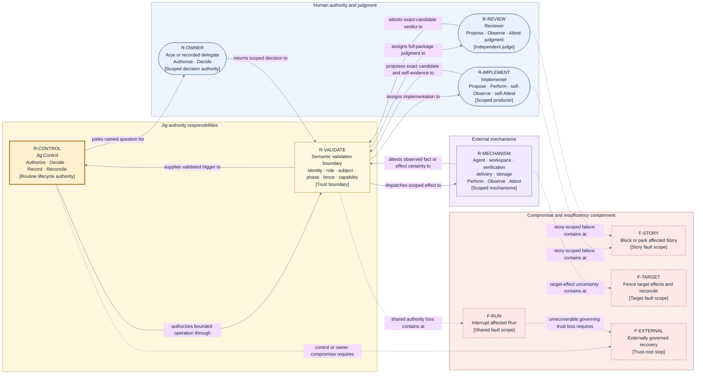

# Perspective — responsibilities, power, trust, and compromise

This perspective overlays the [system context](../context.md) with one concern: who holds which
power, how external trust is validated, and how far compromise propagates. It selects from the
[canonical model](../model.md); it does not define new objects.

## Power vocabulary

| Power         | Meaning                                                                                                        |
| ------------- | -------------------------------------------------------------------------------------------------------------- |
| **Propose**   | Supply a Candidate, recommendation, verdict, or requested action without changing authoritative control state. |
| **Perform**   | Execute work or an external effect.                                                                            |
| **Observe**   | Report a directly observed fact.                                                                               |
| **Attest**    | Return an attributable, contract-valid claim about an observation or judgment.                                 |
| **Authorize** | Permit one bounded Operation under the frozen Run basis and current authority.                                 |
| **Decide**    | Select a lifecycle state, business outcome, escalation, exception, or stop.                                    |
| **Record**    | Create the authoritative durable control fact.                                                                 |
| **Reconcile** | Resolve uncertain, duplicate, interrupted, or late activity from durable and external evidence.                |

## Responsibility and authority matrix

| Participant or responsibility  | Granted powers                              | Owns and may be trusted for                                                                                                                               | Explicitly excluded                                                                    |
| ------------------------------ | ------------------------------------------- | --------------------------------------------------------------------------------------------------------------------------------------------------------- | -------------------------------------------------------------------------------------- |
| Jig Control                    | Authorize, Decide, Record, Reconcile        | Input/result validation, scheduling, lifecycle, identity, authoritative state, recovery, proof obligations.                                               | Implementation/review judgment, provider-specific effects, or invented external facts. |
| Arye or recorded delegate      | Authorize, Decide                           | Architecture approval, policy or authority exceptions, imports, named escalations, stops, reopens, and bounded operational choices within recorded scope. | Routine implementation, verification, delivery, or implicit ambient intervention.      |
| Implementer                    | Propose, Perform, self-Observe, self-Attest | Implementation, exact Candidate, summary, changed scope, and evidence about its own work.                                                                 | Judging its own sufficiency, lifecycle authority, or remote-delivery authority.        |
| Reviewer                       | Propose, Observe, Attest judgment           | Full-package judgment of the exact Candidate and its delivery package.                                                                                    | Editing the Candidate, performing delivery, or directly changing lifecycle state.      |
| Agent mechanism                | Perform, Observe, Attest                    | Role-scoped session work and attributable result transport.                                                                                               | Selecting roles, routes, policy, or authority.                                         |
| Repository/workspace mechanism | Perform, Observe, Attest                    | Isolation and repository/content/basis/cleanliness/preservation facts.                                                                                    | Implementing, accepting, scheduling dependencies, or choosing remote integration.      |
| Verification mechanism         | Perform, Observe, Attest                    | Configured exact-subject check observations.                                                                                                              | Selecting required checks, judging whole-package sufficiency, or authorizing delivery. |
| Delivery mechanism             | Perform, Observe, Attest                    | Authorized publication/integration effects, target facts, remote gates, effect certainty, landing observations.                                           | Choosing whether delivery is allowed or declaring lifecycle completion.                |
| Durable store                  | Perform storage, Attest persistence         | Preservation and integrity of Jig-created authoritative records.                                                                                          | Selecting semantic facts, transitions, retries, or reconciliation outcomes.            |
| Read-only consumers            | Observe                                     | Durable views, explanations, outcomes, and obligations.                                                                                                   | Any undeclared control input.                                                          |

Participants never write authoritative lifecycle history directly. Jig records their validated
attestations and any accepted owner decision as inputs to its next deterministic transition.

## Trust and compromise posture

1. Every external result is validated against request identity, participant role, exact subject,
   current lifecycle position, controller and authority fences, and configured capability.
2. A mechanism is trusted only for its scoped effect or observation. Its output cannot widen its
   power or promote a success claim into an authoritative lifecycle fact.
3. Implementer evidence and reviewer judgment remain attributable inputs. A trusted envelope proves
   provenance, binding, and integrity; it does not make an underlying claim semantically true.
4. Missing, contradictory, stale, malformed, wrong-subject, unauthorized, or integrity-failing
   input creates no claimed fact and authorizes no progress.
5. A participant failure confined to one Story may block or park that Story while unrelated work
   continues with trustworthy authority and sufficient capacity.
6. Uncertainty or compromise of target-scoped authority fences further target effects while safe
   implementation and review may continue.
7. Loss or compromise of shared Jig authority, the ordered ledger, or controller fencing interrupts
   the affected Run. Compromise of Jig Control or owner decision authority is a trust-root failure.
8. Trust-root recovery is externally governed. Jig makes no autonomous safety, reconstruction,
   no-double-effect, or terminal-truth guarantee after the governing history or decision authority
   becomes untrustworthy.

## View V2 — responsibility, power, trust, and external relationships

- **Question:** Who may propose, perform, observe, attest, authorize, decide, record, and reconcile,
  how is external trust validated, and how far does compromise propagate?
- **View type:** Responsibility, power, trust, and external-relationship view.
- **Audience and purpose:** Architecture, security, engineering, and operations reviewers; make
  authority allocation and compromise containment explicit without prescribing components.
- **Scope and exclusions:** Major logical responsibilities, participant powers, validation, and fault
  scopes. Credentials, identity formats, sandboxing, interfaces, and enforcement mechanisms are
  excluded.
- **State:** Proposed.
- **Owner:** Arye Kogan.
- **Sources:** D2, D3, D8; I2–I3, I7, I15, I20; project brief QS6, QS8, and QS11.
- **Related views:** [V1](../context.md) locates participants; [V3](../flows/run-and-story-lifecycle.md)
  shows when powers apply; [V4](../state-and-recovery.md) relates authority to durable state and
  finalization.
- **Stable IDs:** `R-CONTROL`, `R-VALIDATE`, `R-OWNER`, `R-IMPLEMENT`, `R-REVIEW`, `R-MECHANISM`,
  `F-STORY`, `F-TARGET`, `F-RUN`, `F-EXTERNAL`.
- **Relationship labels:** Solid arrows carry normal proposed work, attestations, validation, or
  authorization; dashed arrows carry compromise or insufficiency containment.

**V2 legend:** Rounded rectangles are people; ordinary rectangles are logical responsibilities or
fault outcomes. Thick solid border marks the sole routine lifecycle authority. Dashed borders mark
containment or stop outcomes rather than normal participants. Yellow `R-*` nodes are Jig authority
or validation, blue `R-*` nodes are people, purple is the grouped external mechanism responsibility,
and red `F-*` nodes are fault scopes. Color is supplementary; IDs, bracketed types, shapes, and
borders carry the same meaning. Solid directed lines are normal assignment, authorization,
attestation, validation, or decision flow. Dashed directed lines are failure/compromise propagation.
`R` means responsibility and `F` fault scope; the words in the mechanism node expand its categories.

## Where to go next

- The failure postures these fault scopes trigger:
  [failure containment, bounded progress, and liveness](../failure-and-liveness.md).
- Why centralized deterministic authority was selected, with rejected alternatives:
  [D3 — responsibilities, trust, and authority](../decisions/D3-responsibilities-trust-authority.md).
