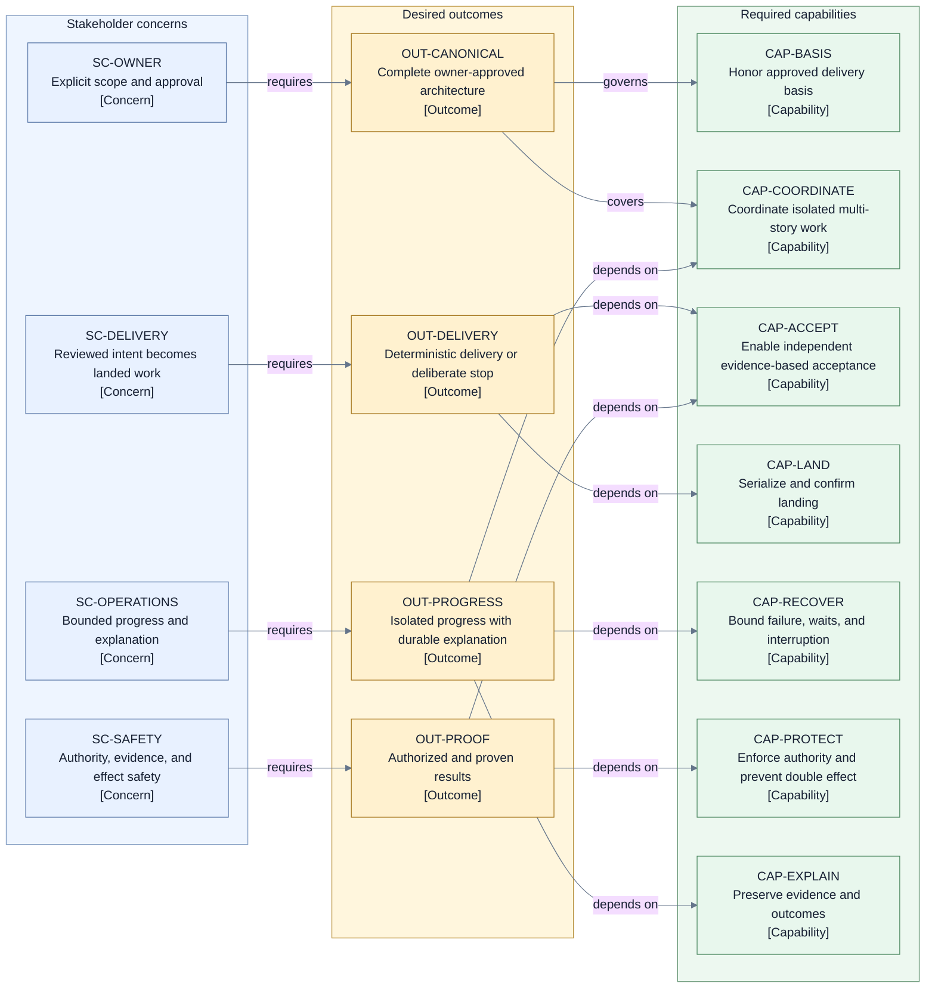

# Jig redesign — Layer 0 project definition

## Document context

| Context field             | Declaration                                                                                                                                                                                                                                                                          |
| ------------------------- | ------------------------------------------------------------------------------------------------------------------------------------------------------------------------------------------------------------------------------------------------------------------------------------ |
| Active layer              | Layer 0 approval finalization; Layer 1 is the next authorized active layer after the final exact-candidate `PASS`.                                                                                                                                                                   |
| Primary reader            | Arye Kogan; product, engineering, architecture, security, and operations leads; independent Layer 0 reviewers.                                                                                                                                                                       |
| Enabled decision          | Whether the final metadata faithfully records the initial content `PASS`, making this exact candidate canonical and permitting Layer 1 to begin.                                                                                                                                     |
| Prerequisite              | Arye's established initiative goal, source boundary, approval model, and project-level owner decisions, preserved through the 2026-07-14 documentation reset.                                                                                                                        |
| Canonical fact ownership  | When the final exact-candidate `PASS` makes the recorded approval effective, this document owns the active project-level definition. Later approved artifacts own architecture choices. Historical material remains provenance rather than a competing definition.                   |
| Complete explanation here | The problem, affected people, outcomes, success measures, capabilities, scope, non-goals, quality scenarios, constraints, accepted risks, assumptions, authority, source roles, and Layer 1 handoff.                                                                                 |
| Deep-dive routing         | The [guidelines](../guidelines/README.md) own method; the [raw manifest](../raw/README.md) owns provenance; the [former goal](../raw/GOAL.md) preserves the primary owner-intent source; the [design index](./README.md) owns active layer status.                                   |
| Explicit exclusions       | Internal runtime shapes, responsibility allocations, trust shapes, named lifecycle or state vocabulary, detailed contracts, operation and data shapes, coordination or persistence mechanisms, technology, implementation, migration, delivery sequencing, and current-state claims. |

This document is reader-complete for the project definition. Its raw links prove provenance; they
are not required reading for understanding the initiative.

## Problem and motivation

Jig needs one canonical, owner-approved architecture for the complete deterministic delivery of
multiple related stories. The architecture must account for the whole path from an approved plan,
policy, and configuration to reviewed and landed work or a deliberate, inspectable non-delivery
outcome.

The need is broader than coordinating tasks. Concurrent work can contaminate other work, acceptance
can rely on weak or mismatched evidence, landing can occur with unclear authority, failures can
leave progress ambiguous, and interruption can cause an effect to be repeated. A design that covers
only the happy path, or leaves these concerns to unrecorded discretion, cannot meet the initiative's
goal.

The documentation reset removed the prior presentation from active authority so the project can be
explained one reader-complete layer at a time. It did not discard or reopen Arye's established
decisions. Layer 0 therefore has to preserve the full project intent without selecting the
architecture that later work must define.

## People and their concerns

| Person or group                                            | Relationship to the initiative                                                                        | Project-level concern                                                                                                                                                |
| ---------------------------------------------------------- | ----------------------------------------------------------------------------------------------------- | -------------------------------------------------------------------------------------------------------------------------------------------------------------------- |
| Arye Kogan                                                 | Product and architecture decision owner                                                               | The project solves the intended full-lifecycle problem, preserves explicit decisions, surfaces every material trade-off, and advances only through authorized gates. |
| People authorizing delivery                                | Supply or approve the plan, policy, and configuration from which work begins                          | Their approved intent is the governing basis for execution and is not silently weakened or replaced.                                                                 |
| Product stakeholders                                       | Depend on the meaning of accepted and landed work                                                     | Success and non-delivery outcomes are unambiguous; any proposed change to an imported product promise is explicit.                                                   |
| Engineering leads and implementers                         | Must realize multiple related stories                                                                 | Work can proceed concurrently where eligible, remains isolated, and is not accepted or landed on a stale or mismatched basis.                                        |
| Independent delivery reviewers                             | Judge whether an exact result is acceptable                                                           | Judgment is independent, attributable, evidence-based, and bound to the exact work being judged.                                                                     |
| Security leads and risk owners                             | Bear the consequences of excessive authority, false evidence, secret exposure, or compromised control | Unauthorized or insufficiently proven actions fail closed; credentials do not become durable evidence; trust loss has a governed stop.                               |
| Operators                                                  | Keep work moving and recover it when progress fails                                                   | Waits and retries are bounded and owned; interruption, uncertainty, and exhaustion lead to recovery or a named inspectable outcome.                                  |
| People accountable for delivery targets and dependent work | Bear incorrect landing, duplicate-effect, preservation, and dependency-propagation risk               | Downstream work advances only from confirmed delivery; an effect is not applied twice; recoverable work and evidence survive destructive cleanup.                    |

The same people may occupy several rows. “Risk bearer” means anyone accountable when delivery is
incorrectly accepted, duplicated, unauthorized, unexplained, indefinitely stalled, or made
unrecoverable.

## Observable outcomes and success measures

| ID  | Required outcome                                                                                                       | Implementation-independent success measure                                                                                                                                                                     |
| --- | ---------------------------------------------------------------------------------------------------------------------- | -------------------------------------------------------------------------------------------------------------------------------------------------------------------------------------------------------------- |
| O1  | A canonical architecture covers Jig's complete deterministic multi-story delivery lifecycle.                           | A reviewer can trace every capability and every material unhappy-path scenario in this definition to an explicit later architecture decision, with no lifecycle gap or competing canonical answer.             |
| O2  | Approved intent governs the path from initial delivery basis to a confirmed result or deliberate non-delivery outcome. | For each evaluated scenario, the result follows only from the approved plan, policy, configuration, authorized decisions, and attributable evidence; unrecorded discretion cannot change it.                   |
| O3  | Eligible story work can progress concurrently without losing isolation or independent acceptance.                      | Concurrent scenarios show that one story cannot alter another's work or acceptance basis, and each result is judged independently against its exact subject.                                                   |
| O4  | Landing remains controlled and proven while other work may proceed concurrently.                                       | No two target-changing landings are authorized at the same time, and dependent work advances only after evidence confirms that the authoritative target contains the accepted result.                          |
| O5  | Failure, liveness loss, uncertainty, and interruption have deliberate outcomes.                                        | Every evaluated retry, wait, recovery, and exhaustion path has an accountable owner, a bound, and an explicit next outcome; no path ends in silent success or an unnamed indefinite wait.                      |
| O6  | Interruption does not cause a second application of the same semantic effect.                                          | Recovery scenarios either adopt a confirmed prior effect, establish its absence before another attempt, or stop with the uncertainty named; they never assume and repeat.                                      |
| O7  | Authority and proof are enforced throughout the lifecycle.                                                             | Missing, stale, contradictory, malformed, wrong-subject, integrity-failing, or unauthorized input does not advance work or create a claimed fact.                                                              |
| O8  | Outcomes, evidence, owner decisions, and unresolved obligations remain durably explainable.                            | After interruption or handoff, an authorized reader can determine what happened, why it happened, which evidence supports it, who decided, and what remains outstanding.                                       |
| O9  | Architecture decisions are complete, coherent, and explicitly approved.                                                | All material architecture decisions and failure semantics are closed; conflicts and trade-offs are recorded; the high-level foundation and final design each have the required exact-baseline approval record. |

## Required capabilities

The project requires the ability to:

1. accept and validate an already-approved execution plan, policy, and configuration as the
   delivery basis;
2. coordinate multiple stories, their dependencies, priorities, eligibility, and progress;
3. support isolated implementation so concurrent work cannot silently contaminate another story;
4. support independent acceptance of the exact work proposed for delivery;
5. collect, preserve, bind, and present the evidence needed for judgment and explanation;
6. allow eligible implementation and review to proceed concurrently;
7. serialize target-changing landing while preserving deterministic ordering;
8. confirm that the accepted result is present at the authoritative target before treating it as
   landed or releasing dependent work;
9. contain and explain failures at the smallest safe scope;
10. detect and resolve liveness loss through bounded progress or a named stop;
11. recover from interruption and uncertain effects without applying the same semantic effect
    twice;
12. enforce the authority of every requested action and accepted decision;
13. preserve recoverable work and evidence before destructive cleanup; and
14. produce durable, attributable, inspectable outcomes, including explicit unresolved obligations.

These are capability obligations. They do not allocate responsibility or select an internal
realization.

## Initiative landscape and outcome view

- **Question:** How do stakeholder concerns connect to project outcomes and required capabilities?
- **View type:** Initiative landscape and outcome trace.
- **Audience and purpose:** Owner, product, engineering, security, and operations leads validating
  project completeness before Layer 1.
- **Scope and exclusions:** Project concerns, outcomes, and capabilities only; internal runtime
  shapes, allocation, mechanisms, and technology are excluded.
- **State:** Approved Layer 0 candidate; final same-reviewer exact-candidate recheck pending
  before the recorded approval is effective or Layer 1 begins.
- **Owner:** Arye Kogan.
- **Sources:** [Former owner-approved goal](../raw/GOAL.md), [active workspace
  contract](../AGENTS.md), and the narrowly audited historical [foundation](../raw/design/README.md)
  and [decision record](../raw/design/decisions.md).
- **Related material:** [Layer 0 method](../guidelines/00-project-definition.md) and [design
  index](./README.md).

**Legend:** Every node is a solid rectangle and carries a stable ID plus a bracketed category, so
meaning does not depend on color. Blue `SC-*` nodes are stakeholder concerns, yellow `OUT-*` nodes
are desired outcomes, and green `CAP-*` nodes are required capabilities. Solid directed arrows use
verb labels to show requirement or dependency direction. There are no abbreviations beyond the
defined ID prefixes.

## Included scope

This initiative includes:

- defining and approving Jig's architecture for the complete deterministic multi-story delivery
  lifecycle;
- covering the full path from an approved execution plan, policy, and configuration through
  coordinated implementation, independent acceptance, evidence use, concurrent progress,
  serialized and confirmed landing, failure and liveness handling, interruption recovery,
  no-double-effect behavior, authority enforcement, preservation, and durable outcomes;
- approving and locking the high-level foundation before later work makes the design
  decision-complete;
- closing every material architecture decision and failure semantic;
- recording conflicts, revisions, rationales, consequences, trade-offs, approval, and any required
  reopen; and
- creating new canonical artifacts under `docs/redesign/design/` at the layer that owns each fact.

## Aggressive non-goals

The initiative does not include:

- runtime implementation;
- migration planning;
- delivery sequencing, estimates, or rollout planning;
- publication of current-state or implementation-conformance claims;
- preserving the current architecture or product contract by default;
- reconciling against repository product, design, decision, delivery, runtime, package, source, or
  test material that Arye has not explicitly imported for a named question;
- updating every existing document merely for consistency;
- treating a historical proposal, review, status label, former approval presentation, or prior
  handoff as the desired end state or executable instruction;
- selecting internal runtime shapes, allocation of responsibilities, trust relationships, named
  lifecycle vocabulary, detailed contracts, data shapes, coordination or persistence mechanisms,
  technology, hosting, or operational tooling in Layer 0; or
- authorizing Layer 1 before this exact candidate passes independent review.

## Material quality scenarios

| ID                                          | Situation                                                                                                                   | Required project response and evaluable evidence                                                                                                                                                                                                                                                     |
| ------------------------------------------- | --------------------------------------------------------------------------------------------------------------------------- | ---------------------------------------------------------------------------------------------------------------------------------------------------------------------------------------------------------------------------------------------------------------------------------------------------- |
| QS1 — deterministic decision                | The same approved delivery basis and same ordered, validated facts are evaluated again.                                     | The same decision and authorized effects result, and the explanation cites only recorded inputs and decisions.                                                                                                                                                                                       |
| QS2 — isolated concurrency                  | Two eligible stories progress at the same time.                                                                             | Each story's work, evidence, and acceptance basis remain attributable to that story; neither can silently alter the other.                                                                                                                                                                           |
| QS3 — independent acceptance                | An implementation result is proposed for delivery.                                                                          | A participant independent from implementation judges the exact result using attributable evidence; stale, mismatched, or unresolved evidence cannot support acceptance.                                                                                                                              |
| QS4 — serialized and confirmed landing      | Several accepted results are ready to change the same target.                                                               | At most one target-changing landing is authorized at a time. Once authoritative evidence confirms that the target contains the accepted result, dependent work is released without waiting for retirement or cleanup, and later retirement or cleanup cannot reverse that confirmed delivery result. |
| QS5 — interruption and duplicate prevention | Progress stops after an irreversible effect may have occurred but before its result is certain.                             | Work does not repeat that semantic effect until the prior effect is confirmed absent; otherwise it adopts the confirmed fact or stops with uncertainty named.                                                                                                                                        |
| QS6 — smallest-safe failure scope           | One story fails while unrelated work still has trustworthy authority and sufficient capacity.                               | The affected work and its dependents stop or wait as required, while independent safe work may continue; shared uncertainty widens the stop only as far as necessary.                                                                                                                                |
| QS7 — bounded progress                      | A retry, rework cycle, wait, recovery attempt, or post-outcome obligation does not complete normally.                       | The path has an accountable owner, durable reason, completion or wake condition, bound, and explicit exhaustion action; it never becomes silent success or an unnamed indefinite wait.                                                                                                               |
| QS8 — authority and evidence failure        | Input is unauthorized, missing, contradictory, stale, malformed, integrity-failing, or bound to the wrong subject.          | It creates no claimed fact and authorizes no progress; the reason and required authority or evidence are inspectable.                                                                                                                                                                                |
| QS9 — preservation before destruction       | Work ends without all resources or proof obligations completing automatically.                                              | Recoverable work and evidence are preserved before destructive cleanup, and every unresolved obligation has an accountable owner and explicit handoff status.                                                                                                                                        |
| QS10 — secret handling                      | Durable evidence and outcomes are recorded.                                                                                 | Credential and secret values are absent; necessary attribution and proof remain available without exposing them.                                                                                                                                                                                     |
| QS11 — trust-root failure                   | Governing history or decision authority is unavailable, corrupted, rolled back, or compromised beyond trustworthy recovery. | Autonomous progress fails closed, the loss of guarantee is explicit, and recovery proceeds only under external governance.                                                                                                                                                                           |
| QS12 — finite-scope liveness                | A finite accepted scope runs while all recorded liveness assumptions hold.                                                  | Every story reaches a definitive delivery or non-delivery outcome, and every post-outcome obligation completes or is explicitly handed to an accountable owner. If an assumption fails, the guaranteed outcome becomes a durable named stop.                                                         |

## Externally imposed and owner-established constraints

1. **First-principles basis:** current architecture and current product contracts are not preserved
   by default.
2. **Source boundary:** `docs/redesign/` is the default governing working set. Reading repository
   instructions, verifying git state, or running documentation checks does not widen it.
3. **Explicit import:** material outside `docs/redesign/` can become governing only when Arye imports
   an exact promise or constraint for a named comparison, constraint, or verification question and
   records its provenance, rationale, consequences, and affected decisions.
4. **Conflict disclosure:** any conflict with this definition, an explicit owner decision, or an
   imported promise must identify the governing statement, proposed revision, rationale, changed
   behavior or trade-off, and required owner decision.
5. **Layer gates:** Layer 1 starts only after the exact Layer 0 candidate passes its review gate. A
   locked later decision changes only through explicit reopen, impact statement, and renewed
   approval.
6. **No manufactured facts:** an owner may authorize investigation, safe stop, or explicit handoff,
   but no decision can turn missing evidence into a factual claim that an uncertain effect or
   delivery occurred.
7. **Secret exclusion:** credentials and secret values do not enter durable orchestration evidence.
8. **Layer discipline:** the active layer must remain reader-complete without importing decisions
   that belong to a later layer.

## Accepted project burdens and risks

Arye's established direction accepts the following burdens. They constrain later evaluation without
selecting how the architecture realizes them.

- Strong recovery and proof obligations add reconciliation complexity and can reduce availability
  because uncertain authority or evidence must fail closed.
- Independent judgment and evidence sufficiency retain residual risk: convincing but false evidence
  or a semantic mistake may escape detection under a policy that permits no additional final check.
- A changed result or changed target basis can invalidate earlier acceptance and cause review churn.
- Preserving progress and serialized landing can leave otherwise available execution capacity
  unused.
- Bounded exhaustion can end in an explicit pause, non-delivery outcome, escalation, interruption,
  or accountable residual handoff rather than successful delivery.
- Explicit authority, evidence, and integration obligations constrain provider flexibility and add
  mediation cost.
- Owner or delegate responsiveness is a liveness dependency for escalated decisions.
- Duplicate effects, unauthorized actions, contaminated concurrent work, false acceptance,
  unconfirmed delivery, lost evidence, destructive cleanup, and unnamed indefinite waits are risks
  the architecture must prevent or turn into explicit, inspectable outcomes.

## Facts and owner instructions

- Arye Kogan remains the product and architecture decision owner.
- The 2026-07-14 reset changes organization and presentation; it does not discard or reopen Arye's
  prior explicit decisions.
- This artifact records an approved faithful re-expression after an initial content `PASS`. The
  former Layer 0 approval label remains historical and is not the basis for this approval. Because
  the approval metadata changes the exact candidate, the recorded approval and Layer 1 authorization
  become effective only after the same reviewer passes this final candidate.
- No repository product reference or external product promise or constraint was imported into the
  former high-level architecture or this Layer 0 candidate.
- The former goal, source-role rules, and explicit project-level owner decisions are binding Layer 0
  fidelity inputs.
- Former architecture selections, invariants, accepted architectural consequences, and deliberate
  deferrals remain binding fidelity input for Layer 1 at their proper altitude, not content for this
  document.
- Layer progression is not automatic, and a later layer may not silently change an approved or
  locked earlier decision.

## Assumptions

The following assumptions limit the finite-scope liveness outcome in QS12. They are established
conditions, not new decisions:

1. the accepted scope being evaluated is finite and fixed for that evaluation;
2. governing history and decision authority remain trustworthy;
3. required execution capacity eventually becomes available;
4. participating execution mechanisms respond or reach a bounded timeout;
5. the delivery target remains stable long enough for bounded completion; and
6. Arye or an explicitly recorded delegate eventually answers escalations.

When an assumption does not hold, the project promises a durable named stop rather than autonomous
completion or successful delivery.

## Open questions

There are no unresolved Layer 0 product questions in the governing owner-intent sources. The open
work is the set of Layer 1 architecture questions in the handoff below. A reviewer finding that
would add or change project intent is not an open question for delegated resolution; it requires
`OWNER_DECISION_REQUIRED`.

## Decision ownership and escalation

| Decision or action                                                                           | Authority                               | Limit or required evidence                                                                                                                                                                 |
| -------------------------------------------------------------------------------------------- | --------------------------------------- | ------------------------------------------------------------------------------------------------------------------------------------------------------------------------------------------ |
| Product outcomes, scope, non-goals, quality requirements, accepted risks, and source imports | Arye Kogan                              | Any material change requires Arye's explicit decision and a recorded impact.                                                                                                               |
| Architecture selection, approval, lock, exception, or reopen                                 | Arye Kogan                              | Approval is explicit; it is never inferred from silence, historical labels, or reviewer synthesis.                                                                                         |
| Bounded operational decision                                                                 | Arye or an explicitly recorded delegate | Delegation must name its scope; it does not imply product or architecture approval authority.                                                                                              |
| Layer 0 independent review                                                                   | A reviewer independent of the author    | May return `PASS`, `CHANGES_REQUIRED`, or `OWNER_DECISION_REQUIRED` only against the exact Layer 0 gate.                                                                                   |
| Faithful editorial re-expression                                                             | The delegated independent reviewer      | May approve organization and wording only when no material outcome, boundary, quality requirement, owner, risk, guarantee, decision, trade-off, negative consequence, or deferral changes. |
| Material gap or proposed change                                                              | Arye Kogan                              | The reviewer or author returns `OWNER_DECISION_REQUIRED` and stops; neither may choose around it.                                                                                          |

A `PASS` applies only to the exact reviewed candidate, including its approval metadata. Any later
edit requires re-review. After three unsuccessful author/reviewer loops, unresolved findings return
to Arye and no later layer begins.

## Source and evidence roles

| Role                            | Material                                                                                                                    | How it may be used                                                                                                                                                                       |
| ------------------------------- | --------------------------------------------------------------------------------------------------------------------------- | ---------------------------------------------------------------------------------------------------------------------------------------------------------------------------------------- |
| Active working authority        | [`../AGENTS.md`](../AGENTS.md)                                                                                              | Governs source scope, layer order, delegated review, and stop rules; preserves Arye's ownership.                                                                                         |
| Architecture method             | [Guidelines index](../guidelines/README.md) and [Layer 0 page](../guidelines/00-project-definition.md)                      | Defines how this artifact is authored and reviewed; selects no project or architecture decision.                                                                                         |
| Binding Layer 0 owner intent    | [Former goal](../raw/GOAL.md), explicit owner decisions, and the 2026-07-14 reset instruction                               | Defines project outcomes, scope, approval model, source boundary, and owner authority to re-express faithfully.                                                                          |
| Historical provenance           | [Raw manifest](../raw/README.md) and [corpus index](../raw/CORPUS.md)                                                       | Proves file history and prior source roles; historical status and sequencing claims are not current authority.                                                                           |
| New canonical home              | [`design/`](./README.md)                                                                                                    | Holds active artifacts one approved layer at a time; this document becomes canonical only after its exact review gate passes.                                                            |
| Primary later-layer direction   | Historical standalone proposal identified by the raw manifest                                                               | Supplies architecture direction for later layers; it is immutable and is not approved architecture.                                                                                      |
| Later-layer corrective evidence | Historical independent proposal reviews identified by the raw manifest                                                      | Exposes contradictions, risks, and missing questions; it neither selects fixes nor grants approval.                                                                                      |
| Narrow Layer 0 audit evidence   | Historical [foundation](../raw/design/README.md) and [decision record](../raw/design/decisions.md)                          | Exposes project-level outcomes, burdens, risks, constraints, assumptions, source rules, and owner statements omitted from the former goal; all internal selections remain excluded here. |
| Outside-source boundary         | Repository product, design, decision, delivery, runtime, package, source, test, and other material outside `docs/redesign/` | Excluded as governing input unless Arye explicitly requests a named comparison or imports an exact promise or constraint with the required provenance and impact record.                 |

Historical `agreed`, `draft`, `proposal`, or `approved` labels describe their former artifacts only.
They do not establish current approval. Verification commands may inspect the repository without
turning repository material into design input.

## Layer 1 handoff

After this exact candidate passes the Layer 0 gate, Layer 1 must answer:

1. What responsibilities and high-level boundaries are required to satisfy every capability and
   quality scenario?
2. Which participants and inputs are trusted for which claims, and what happens when that trust
   fails?
3. Where is authority to propose, perform, observe, approve, decide, and recover owned?
4. What high-level progression and information flow covers the complete delivery lifecycle?
5. What continuity model makes interruption recovery, durable explanation, and duplicate prevention
   possible?
6. What concurrency and landing strategy preserves isolation, deterministic ordering, progress,
   and serialized target change?
7. What acceptance and evidence model makes independent exact-result judgment possible?
8. What failure, liveness, preservation, and recovery posture satisfies the quality scenarios and
   recorded assumptions?
9. Which high-level invariants keep every later decision traceable to this project definition?

Layer 0 intentionally does not answer those questions. It also excludes named internal runtime
units, selected responsibility or trust allocations, canonical lifecycle/state vocabulary,
detailed contracts, event or operation catalogs, data representations, persistence or scheduling
mechanisms, verification realization, technology, hosting, implementation, migration, delivery
sequencing, and current-state evidence. Those details cannot be treated as Layer 0 requirements.

## Layer 0 approval record

The independent reviewer returned an initial content `PASS` for the frozen baseline below. This
metadata finalization records that result without changing the approved project-definition meaning.
Because exact-candidate approval includes this metadata, the recorded approval is effective only
when the same reviewer returns `PASS` for this final metadata-bearing candidate. Layer 1 is the next
authorized active layer, but it must not begin before that final recheck passes.

| Record field                              | Recorded value                                                                                                                      |
| ----------------------------------------- | ----------------------------------------------------------------------------------------------------------------------------------- |
| Continuing product and architecture owner | Arye Kogan                                                                                                                          |
| Delegation date                           | 2026-07-14                                                                                                                          |
| Delegated scope                           | Faithful re-expression and organization of established Layer 0 intent only                                                          |
| Independent reviewer identity             | Independent Layer 0 architecture reviewer                                                                                           |
| Reviewer session UUID                     | `019f6236-648d-7af1-918b-d9cd3fcb189b`                                                                                              |
| Initial content verdict                   | `PASS`                                                                                                                              |
| Fidelity verdict                          | All 159 dispositions accepted: 70 preserved, 42 reorganized, 47 omitted as later-layer detail, 0 owner decisions required           |
| NQ10                                      | Resolved; confirmation releases dependent work without waiting for retirement or cleanup, which cannot reverse the confirmed result |
| Material decision impact                  | None; no new material decision was introduced                                                                                       |
| Final metadata-bearing candidate verdict  | Pending the same reviewer's exact-candidate recheck                                                                                 |
| Layer 1 authorization                     | Next authorized active layer; becomes actionable only after that final `PASS`                                                       |

### Initial content reviewed baseline

| Reviewed item                                | Exact baseline                                                     |
| -------------------------------------------- | ------------------------------------------------------------------ |
| Git `HEAD`                                   | `ffbb19906a43b63486ad8ab32133cdde89ba984b`                         |
| `docs/redesign/README.md`                    | `66a2413df94d33ebfc1690e9a423183d6d9fb5a17ad4c060da8ca8a5c26df60c` |
| `docs/redesign/design/README.md`             | `53ac422a2cfce6642c51a4cefcccbecc5d3f3af5c46abb74d69245957e1b272b` |
| `docs/redesign/design/project-definition.md` | `d613d866cb7967952f1dd8fae33f7c43a12b831a38e5dc0938ddb29941cbf28d` |
| `/tmp/jig-layer0-fidelity.md`                | `a733475d856d91bc7838c59fa3f6ada1ddb336e2d617b099049ed3a09ae0d277` |

The reviewer does not own product or architecture decisions. The delegated verdict confirms only
that this document faithfully organizes and re-expresses Arye's established Layer 0 intent. The
approval does not approve a Layer 1 architecture, implementation, migration, delivery sequence, or
current-state claim. Any change after the final exact-candidate `PASS` requires re-review under the
workspace rules.
