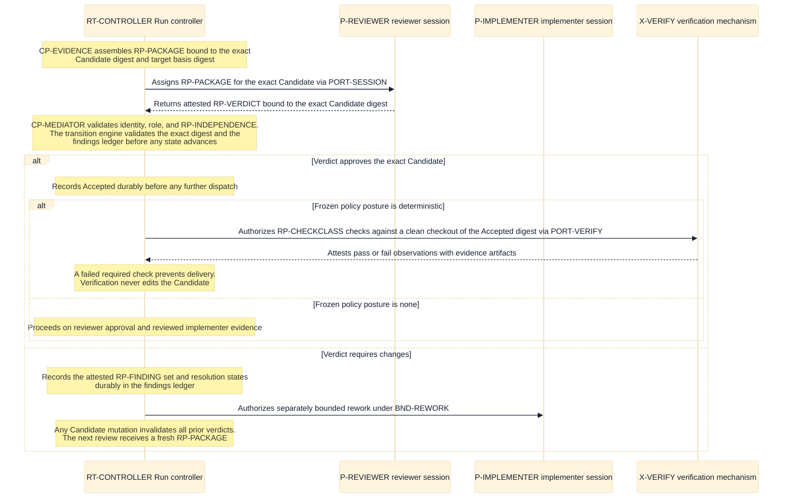

# Review and verification execution — protocol, findings, and check policy

This page consumes [D9 category 9](./decisions/D9-invariants-and-artifact-shape.md) (reviewer
protocol, finding representation, policy language, verification execution, and remote-gate
observation). It elaborates the acceptance model of
[acceptance and evidence](./acceptance-and-evidence.md) and the
[D7](./decisions/D7-acceptance-and-evidence.md) selection without changing them: the reviewer
remains the full-package acceptance principal (I8), and frozen policy still selects final
verification `deterministic` or `none` (I9). Protocol messages cross `PORT-SESSION`,
`PORT-VERIFY`, and `PORT-DELIVERY` as defined in the [runtime architecture](./runtime.md), and are
validated by `CP-MEDIATOR` in the [control plane](./components/control-plane.md).

## Review assignment package (`RP-PACKAGE`)

The controller assembles one complete assignment package per review; `CP-EVIDENCE` binds it to the
exact subject before dispatch. The package identifies the exact subject the reviewer judges; a
verdict over anything else is invalid (I7).

| Package element     | Content                                                                                         |
| ------------------- | ----------------------------------------------------------------------------------------------- |
| Exact Candidate     | The Candidate content digest and its recorded target basis digest; nothing mutable or symbolic. |
| Frozen requirements | The Story's approved requirements and acceptance criteria exactly as frozen at Run definition.  |
| Evidence manifest   | The complete manifest of digest-verified evidence artifacts bound to this Candidate.            |
| Findings ledger     | Every prior finding for this Story with its current resolution state (see `RP-FINDING`).        |
| Delivery metadata   | The Candidate's delivery metadata as proposed for acceptance judgment.                          |

A package element that is missing, integrity-failing, or bound to a different Candidate digest
fails the assignment closed before dispatch (QS8); Jig never asks a reviewer to judge an
incompletely identified subject.

## Verdict and finding representation

- **Verdict (`RP-VERDICT`):** exactly one of `approve` or `changes-required`, expressed over the
  exact Candidate content digest and target basis digest from `RP-PACKAGE`, attested and
  attributable to one validated reviewer session identity.
- **Finding (`RP-FINDING`):** a tuple of stable finding identity, subject anchor within the
  Candidate, severity class, requirement or risk trace, description, and resolution state.

Rules the representation must preserve:

| Rule                      | Statement                                                                                                                                                                                                      |
| ------------------------- | -------------------------------------------------------------------------------------------------------------------------------------------------------------------------------------------------------------- |
| Exact-candidate semantics | Any Candidate mutation invalidates all prior verdicts; a verdict never transfers to a successor Candidate (I7).                                                                                                |
| Blocking findings         | Unresolved blocking findings prevent acceptance. Jig validates finding presence and resolution state; it does not re-judge severity — severity classification remains reviewer judgment (I8).                  |
| Rework return             | A `changes-required` verdict returns the Story through a separately bounded rework loop, `BND-REWORK` in [scheduling and bounds](./scheduling-and-bounds.md); rework releases any held finalization authority. |
| Durable findings          | Findings and their resolution states are durable control facts in the ledger, not session-local notes; they survive interruption and appear in the next `RP-PACKAGE`.                                          |

## Reviewer independence enforcement (`RP-INDEPENDENCE`)

The implementer and the reviewer are distinct validated session identities for the same Story. The
controller rejects a verdict whose producer identity participated in producing the Candidate under
judgment — as implementer, as rework author, or as a contributing session. Independence is
validated **per Candidate**, not per Run: an identity that implemented one Candidate may review a
different Story's Candidate, but never a Candidate its own sessions helped produce. The rejected
alternative — trusting role labels asserted by the agent mechanism — was not selected because the
mechanism holds no identity authority; identity and role are validated at the trust boundary
(`R-VALIDATE` in the [authority and trust perspective](./perspectives/authority-and-trust.md)).

## Policy language for checks (`RP-CHECKCLASS`)

The check policy is **declarative; it contains no scripting**. The frozen policy names required
check classes with expected evidence kinds and the final-verification posture:

| Policy element       | Declares                                                                                                         |
| -------------------- | ---------------------------------------------------------------------------------------------------------------- |
| Required check class | A named class such as `build`, `test`, `lint`, or a custom named check, with the evidence kind each must return. |
| Verification posture | Exactly one of `deterministic` or `none` for final verification (D7).                                            |

Configuration binds each policy-named check class to concrete configured commands or providers.
Configuration may **add** checks but never remove or weaken a policy-required one (I9); a required
class with no valid binding fails preflight, not delivery time. The rejected alternative — an
embedded scripting language in policy — was not selected because scripts would move judgment and
effects into the policy document and defeat deterministic preflight validation.

## Verification execution (`RP-VERIFY`)

When the frozen policy posture is `deterministic`, the policy-selected final check set runs against
a clean checkout of the exact Accepted Candidate — its digest-verified content and target basis —
in an isolated workspace authorized through `PORT-WORKSPACE` and executed through `PORT-VERIFY`.
Observations return as attestations: pass or fail plus observations and bounded evidence
artifacts. A failed required check prevents delivery (D7). Verification never edits the Candidate;
a check that mutates its checkout invalidates nothing because the durable Candidate digest is the
subject, and its observations are rejected as wrong-subject. With posture `none`, delivery
proceeds from reviewer approval and reviewed implementer evidence, retaining the residual risk
D7 explicitly accepts.

## Remote-gate observation (`RP-REMOTE`)

Remotely enforced gates — for example forge required checks on an integration request — are
**observed, not executed**: they return as attested external facts through `PORT-DELIVERY` and are
recorded durably. Jig neither re-executes nor re-judges a remote gate; it validates the
attestation's subject, freshness, and integrity like any other inbound fact. A policy-required
remote gate that cannot be observed fails closed (I15, QS8): absence of gate evidence is never
treated as a passing gate. How gate states feed landing is owned by
[forge and landing](./forge-and-landing.md).

## View V14 — review and verification protocol

- **Question:** In exact message order, how does a Candidate travel through assignment, verdict,
  validation, acceptance, and policy-selected verification — and where does the changes-required
  branch return?
- **View type:** Protocol sequence view over the Layer 2 runtime units and ports.
- **Audience and purpose:** Engineering and security readers; verify the protocol-level
  enforcement of I7–I9 beneath the coarse Layer 1 scenario.
- **Scope and exclusions:** One Candidate's review and verification messages. Landing,
  finalization ordering, capacity, session hosting, and provider transports are excluded;
  [V5](./flows/story-delivery.md) owns the coarse end-to-end scenario, and this view owns the
  protocol detail beneath its review segment.
- **State:** Proposed.
- **Owner:** Arye Kogan.
- **Sources:** D7, D9 category 9; I7–I9, I15; [acceptance and evidence](./acceptance-and-evidence.md).
- **Related views:** [V5](./flows/story-delivery.md) is the coarse scenario;
  [V7](./components/control-plane.md) locates the validating components;
  [V15](./forge-and-landing.md) continues after verification succeeds.

**V14 legend:** Solid arrows are controller-authorized assignments or requests dispatched through
the named port in the message text; dashed arrows are the attributable attestations participants
return. Notes over the controller mark durable validations and recorded decisions; every recorded
decision commits to the ledger before the next dispatch, per the
[authoritative transition ordering](./flows/run-and-story-lifecycle.md#view-v3c--authoritative-transition-ordering).
The outer `alt` separates approval from changes-required; the inner `alt` separates the two D7
verification postures. `RP` means review protocol, `CP` controller component, `RT` runtime unit,
`P` person role, `X` external mechanism, and `BND` bound class. There are no other abbreviations.

## What this page deliberately excludes

- **Acceptance authority and evidence roles:** owned by
  [acceptance and evidence](./acceptance-and-evidence.md); this page adds protocol, not judgment.
- **Evidence artifact storage, integrity, and redaction rules:** owned by the Layer 2 evidence
  page under D9 category 8.
- **Rework, wait, and review-loop budgets:** owned by
  [scheduling and bounds](./scheduling-and-bounds.md) as `BND-*` classes with policy-supplied
  values and safe defaults; no numeric bound is architecture on this page.
- **Session hosting, identity validation mechanics, and provider transports:** owned by
  [mechanism and provider contracts](./mechanism-and-provider-contracts.md).
- **Landing and remote-gate consequences for delivery:** owned by
  [forge and landing](./forge-and-landing.md).

## Where to go next

- The Layer 1 acceptance contract this page realizes:
  [acceptance and evidence](./acceptance-and-evidence.md) and
  [D7 — acceptance and evidence](./decisions/D7-acceptance-and-evidence.md).
- The coarse scenario above this protocol: [Story delivery scenario](./flows/story-delivery.md).
- The components that validate and record these messages:
  [control plane components](./components/control-plane.md).
- What happens after verification succeeds: [forge and landing](./forge-and-landing.md).
