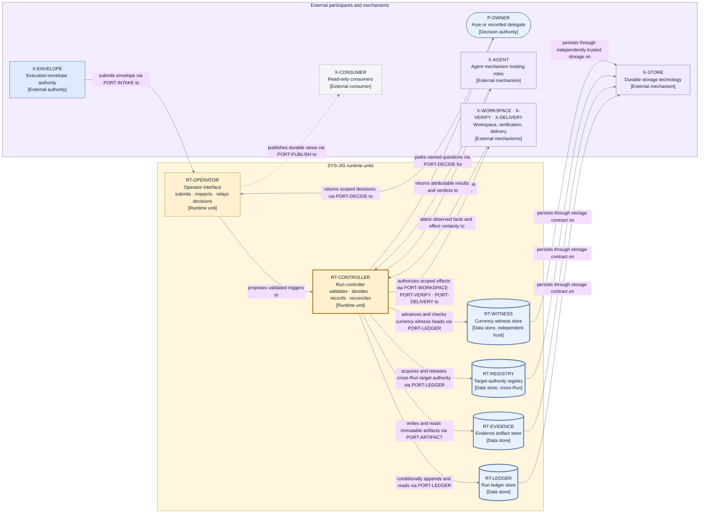
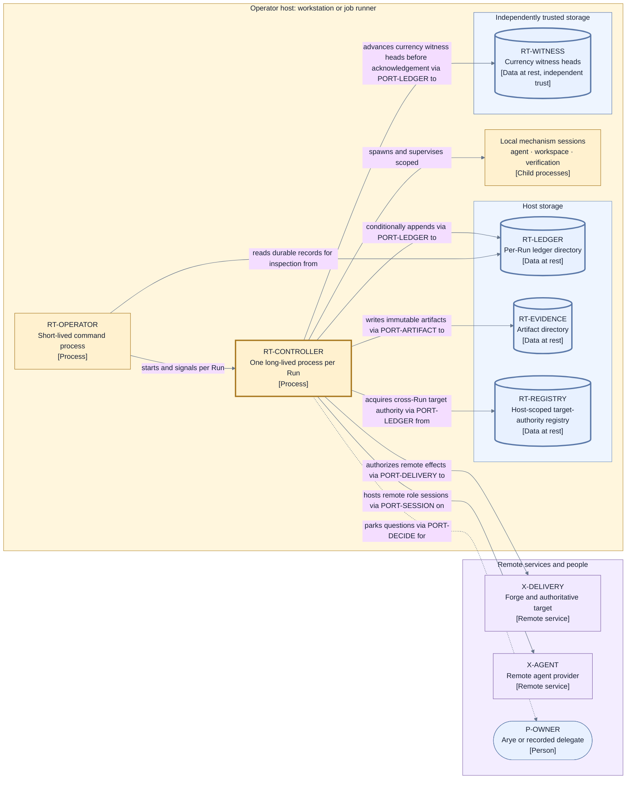

# Runtime architecture — decomposition, ports, and processes

This page decomposes `SYS-JIG` from the [system context](./context.md) one level. It consumes the
Layer 2 mandate of [D9 category 1](./decisions/D9-invariants-and-artifact-shape.md) and the D2
deferral of port and process decomposition. The decomposition rule follows
[D10](./decisions/D10-runtime-decomposition.md): **a modular single-authority runtime** — one
deterministic controller process per Run, passive durable stores, a thin operator interface, and
named ports as the only crossings of the authority-and-proof boundary.

The Jig product also ships the bounded Envelope Builder described in
[envelope production](./envelope-production.md). It realizes V1's `X-ENVELOPE` outside
`SYS-JIG`'s decision-authority boundary and reaches Work Source providers through `PORT-SOURCE`.
It is deliberately not a seventh D10 runtime unit: it authors and submits immutable input, while
the six units below realize the trusted Run authority core. Sharing an executable or installation
with `RT-OPERATOR` cannot move the builder inside the authority boundary.

## Runtime units

| ID              | Runtime unit              | Type         | Responsibility                                                                                                                                                                                                                           |
| --------------- | ------------------------- | ------------ | ---------------------------------------------------------------------------------------------------------------------------------------------------------------------------------------------------------------------------------------- |
| `RT-OPERATOR`   | Operator interface        | Runtime unit | Accepts envelope submission and owner or operator commands, and presents durable explanations and outcomes; it holds no lifecycle authority.                                                                                             |
| `RT-CONTROLLER` | Run controller            | Runtime unit | The single active Jig Control process for one Run: it validates, decides, records, dispatches, and reconciles under its controller generation.                                                                                           |
| `RT-LEDGER`     | Run ledger store          | Data store   | Holds one Run's durable ordered Transition ledger and durable control facts; passive data at rest with no decision behavior.                                                                                                             |
| `RT-EVIDENCE`   | Immutable artifact store  | Data store   | Holds bounded evidence artifacts and terminal audit exports referenced by digest from the ledger; passive data at rest with no decision behavior.                                                                                        |
| `RT-REGISTRY`   | Target-authority registry | Data store   | Holds the durable cross-Run target-authority registry keyed by canonical target identity (`ID-TARGET`); the one store shared by all Run controllers, and passive data at rest like the others.                                           |
| `RT-WITNESS`    | Currency witness store    | Data store   | Holds the `LG-WITNESS` heads for the Run ledgers and the registry, on storage whose trust is independent of `RT-LEDGER` and its backups; where no independent witness is configured, autonomous restore is traded for a deliberate stop. |

Rules the units must preserve:

- `RT-CONTROLLER` is the only unit that exercises Jig Control's Authorize, Decide, Record, and
  Reconcile powers (I3). `RT-OPERATOR` proposes triggers and reads projections; it can never
  advance lifecycle state directly.
- Every store is passive. Authority lives in the recorded content and its ordering, not in store
  behavior (I5); the storage technology below each store remains a replaceable external mechanism
  (`X-STORE`) behind `PORT-LEDGER` and `PORT-ARTIFACT`.
- Exactly one controller process is active per Run, enforced by the durable controller generation
  rather than by deployment convention (I6); a second controller instance is fenced, not merged.

## Named ports

Every interaction between Jig and the outside world crosses exactly one named port. A port is a
semantic contract owned by Jig, not a transport: transports, encodings, and provider protocols are
selected per configured mechanism in
[mechanism and provider contracts](./mechanism-and-provider-contracts.md).

| ID               | Port                   | Faces (V1)                                     | Carries                                                                                                                                                                                                                                           |
| ---------------- | ---------------------- | ---------------------------------------------- | ------------------------------------------------------------------------------------------------------------------------------------------------------------------------------------------------------------------------------------------------- |
| `PORT-INTAKE`    | Envelope intake        | `X-ENVELOPE`                                   | Digest-bound envelope submission in — plan, composed policy and repo floors, work profile, setup declaration, provider-authority approvals, configuration, and owner approval; durable intake acknowledgement and preflight outcome out.          |
| `PORT-DECIDE`    | Owner decision         | `P-OWNER`                                      | Parked named questions out; validated scoped decisions in.                                                                                                                                                                                        |
| `PORT-SESSION`   | Role session           | `X-AGENT` hosting `P-IMPLEMENTER`/`P-REVIEWER` | Bounded role assignments out; attributable results, self-reports, and verdicts in.                                                                                                                                                                |
| `PORT-WORKSPACE` | Workspace effects      | `X-WORKSPACE`                                  | Authorized isolation and repository effects out; content, basis, cleanliness, and preservation facts in.                                                                                                                                          |
| `PORT-VERIFY`    | Verification           | `X-VERIFY`                                     | Authorized exact-subject check requests out; check observations in.                                                                                                                                                                               |
| `PORT-DELIVERY`  | Delivery and target    | `X-DELIVERY`                                   | Authorized publication and integration effects out; target, gate, effect-certainty, and landing facts in.                                                                                                                                         |
| `PORT-LEDGER`    | Ledger commit and read | `X-STORE`                                      | Conditional ordered appends and verified reads of durable control records: the Run's ledger stream, the cross-Run target-authority registry lines keyed by canonical target, and the currency-witness heads advanced before each acknowledgement. |
| `PORT-ARTIFACT`  | Artifact persistence   | `X-STORE`                                      | Immutable evidence and terminal audit-export artifact writes, plus digest-verified reads.                                                                                                                                                         |
| `PORT-PUBLISH`   | Read-only publication  | `X-CONSUMER`                                   | Durable outcomes, explanations, actionable notices, immutable audit-export references, and obligations out; no control input.                                                                                                                     |

Port rules:

- One V1 external relationship maps to exactly one port, so the Layer 1 boundary stays checkable
  at Layer 2. `X-STORE` is reached through two ports because the ledger's conditional-append
  contract and the artifact store's immutable-blob contract are different proof obligations.
- Every inbound message is validated at the port against identity, role, exact subject, lifecycle
  position, fence, and capability before it can become a trigger (I7). The validating component is
  `CP-MEDIATOR` in the [control plane](./components/control-plane.md) for every port except
  `PORT-LEDGER`, whose commit primitive carries equivalent identity, position, and digest
  validation inside the transition engine's commit protocol.
- `PORT-PUBLISH` is one-directional by construction. A consumer that needs to influence a Run must
  enter through `PORT-INTAKE` or `PORT-DECIDE` as a first-class validated participant.
- `PORT-SOURCE` is not a tenth crossing of `SYS-JIG`: it belongs to `X-ENVELOPE`'s bounded product
  front end. Candidate work can reach `PORT-INTAKE` only after validation, composition, and owner
  approval produce a new immutable envelope.

## Process model

- `RT-OPERATOR` runs as a short-lived process per command (configure, submit, inspect, decide,
  stop, export). A realization may host the Envelope Builder in the same executable, but the
  builder still has only proposal authority and remains outside the controller's trust boundary.
  It communicates with a live controller only through durable records and validated port triggers,
  never through shared memory, so an absent or crashed operator process cannot corrupt control
  state.
- `RT-CONTROLLER` runs as one long-lived process per Run from intake acknowledgement to Run
  completion or interruption. On start and restart it acquires a new controller generation through
  `PORT-LEDGER` before any dispatch (I6). Concurrent Runs are concurrent controller processes; the
  only state shared between Runs is the target-authority registry (`RT-REGISTRY`), the deliberate
  cross-Run exception that serializes finalization authority per canonical target (I12).
- Mechanism sessions (agent roles, verification executions, delivery operations) run outside the
  controller process as separate local processes or remote services reached through their ports.
  A mechanism crash is a Story- or Operation-scoped fault (I15), never a controller memory fault.

### View V6 — runtime decomposition

- **Question:** What separately runnable or independently stored units realize Jig, and through
  which ports do they reach the outside world?
- **View type:** Runtime/container decomposition of `SYS-JIG`.
- **Audience and purpose:** Engineers, architects, security, and operations; see where each Layer 1
  responsibility executes before opening component detail.
- **Scope and exclusions:** Jig's runtime units, ports, and immediate external counterparts.
  Component internals, schemas, transports, and deployment topology are excluded (V6a owns
  topology).
- **State:** Approved (not locked).
- **Owner:** Arye Kogan.
- **Sources:** D2, D10; I2–I3, I5–I7; [system context V1](./context.md).
- **Related views:** [V1](./context.md) owns the boundary; [V7](./components/control-plane.md)
  opens the controller; [V6a](#view-v6a--process-and-deployment-model) places these units on a
  host.

**V6 legend:** Rectangles are runtime units, authorities, or mechanisms; cylinders are data stores;
the rounded rectangle is a person. The thick yellow border marks the sole lifecycle authority
(`RT-CONTROLLER`); thick blue borders mark the durable stores whose recorded content is
authoritative. The dashed border and dashed line mark read-only publication with no control
authority. Every crossing of the yellow region names its port in the edge label; there are no
unnamed crossings. Purple nodes are external mechanisms, blue the decision authority, and gray the
consumer; color is redundant with the stable IDs and bracketed types. The grouped
`X-WORKSPACE · X-VERIFY · X-DELIVERY` node keeps this view at one level; each mechanism keeps its
own V1 identity and its own port. `RT-REGISTRY` is deliberately cross-Run: it is shared by
every Run controller, serializing finalization authority per canonical target (I12) through the
same conditional-append contract as the Run ledger. `RT-WITNESS` deliberately sits on storage of
independent trust, because its purpose is to detect rollback of the other stores and their
backups.

## Deployment shape

The proposed deployment is **single-host, per-Run**: an operator host (workstation or job runner)
executes `RT-OPERATOR` commands, each accepted Run gets one `RT-CONTROLLER` process on that host,
and the ledger, evidence, and registry stores are directories or volumes owned by that host's
storage, while the currency witness lives on separately configured storage of independent trust.
Remote participants —
forge targets, remote agent providers, the owner answering an escalation — remain remote services
or people reached through the ports. A hosted or multi-tenant topology is a future deployment view,
not a change to this logical decomposition (the guide separates logical architecture from
deployment topology).

### View V6a — process and deployment model

- **Question:** Where do the runtime units execute in the proposed single-host deployment, and
  which parts live outside the host?
- **View type:** Deployment view for the single-host environment.
- **Audience and purpose:** Operations and engineering readers; see process boundaries, store
  placement, and remote seams.
- **Scope and exclusions:** One materially distinct environment (single host). Replica counts,
  hosting products, network hardware, and provider topology are excluded.
- **State:** Approved (not locked).
- **Owner:** Arye Kogan.
- **Sources:** D10; I6, I15.
- **Related views:** [V6](#view-v6--runtime-decomposition) owns the logical decomposition;
  [V12](./mechanism-and-provider-contracts.md) owns mechanism contracts across the remote seam.

**V6a legend:** Rectangles are processes or remote services; cylinders are data at rest; the
rounded rectangle is a person. The thick yellow border marks the controller process, the sole
lifecycle authority on the host; thick blue borders mark authoritative data at rest. Solid lines
are supervision, port-mediated effects, or reads; the dashed line is the escalation path to the
owner. The yellow region is the operator host, blue its storage, and purple everything remote;
color is redundant with IDs and bracketed types. Local mechanism sessions are grouped into one
node to keep this view at one level; their contracts are identical to remote mechanisms'.

## How the decomposition preserves the Layer 1 contract

| Layer 1 obligation                                  | Where it lands at Layer 2                                                                                                                                                                  |
| --------------------------------------------------- | ------------------------------------------------------------------------------------------------------------------------------------------------------------------------------------------ |
| Sole routine lifecycle authority (I3)               | Only `RT-CONTROLLER` decides; `RT-OPERATOR` proposes and reads; stores are passive.                                                                                                        |
| Ledger authority, record before adopt/dispatch (I5) | `RT-LEDGER` behind `PORT-LEDGER`'s conditional-append contract; the transition engine is its only writer.                                                                                  |
| Fencing and safe resume (I6)                        | Controller generation acquired through `PORT-LEDGER` before any dispatch; one controller process per Run.                                                                                  |
| One target-scoped finalization authority (I12)      | Cross-Run arbitration through the shared `RT-REGISTRY` store behind `PORT-LEDGER`'s conditional-append contract; every Run controller contends on one authority line per canonical target. |
| Fail-closed trust posture after rollback (I20)      | `LG-WITNESS` heads in `RT-WITNESS`, on storage whose trust is independent of the ledger and its backups, advanced before every acknowledgement.                                            |
| Exact-subject validation at the boundary (I7)       | Every inbound port message passes `CP-MEDIATOR` validation (or, for `PORT-LEDGER`, the commit protocol's equivalent validation) before becoming a trigger.                                 |
| Smallest-safe containment (I15)                     | Mechanism sessions are separate processes; their faults arrive as attested failures, not shared-memory failures.                                                                           |
| No undeclared control path (D2, D3)                 | `PORT-PUBLISH` is read-only; every other crossing is a named, validated port.                                                                                                              |

## Where to go next

- Inside the controller: [control plane components](./components/control-plane.md).
- Identity and schema shapes crossing these ports: [data and identity](./data-and-identity.md).
- The ledger and projection realization: [persistence and projections](./persistence-and-projections.md).
- Mechanism obligations behind the ports:
  [mechanism and provider contracts](./mechanism-and-provider-contracts.md).
- Why this decomposition was selected, with rejected alternatives:
  [D10 — runtime decomposition](./decisions/D10-runtime-decomposition.md).
