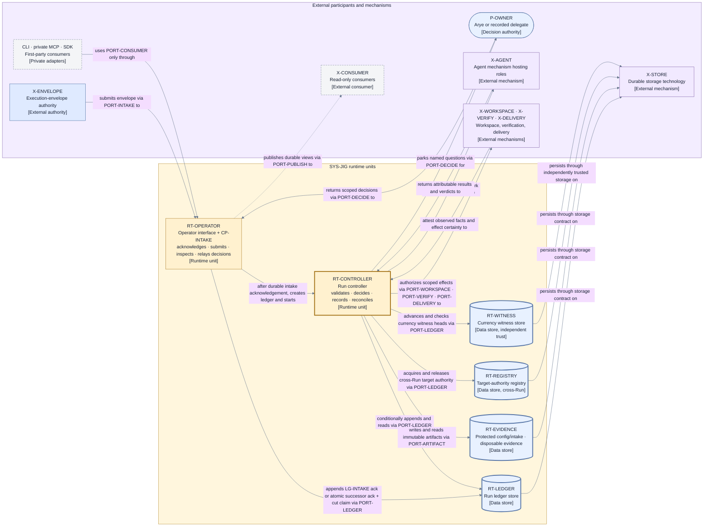
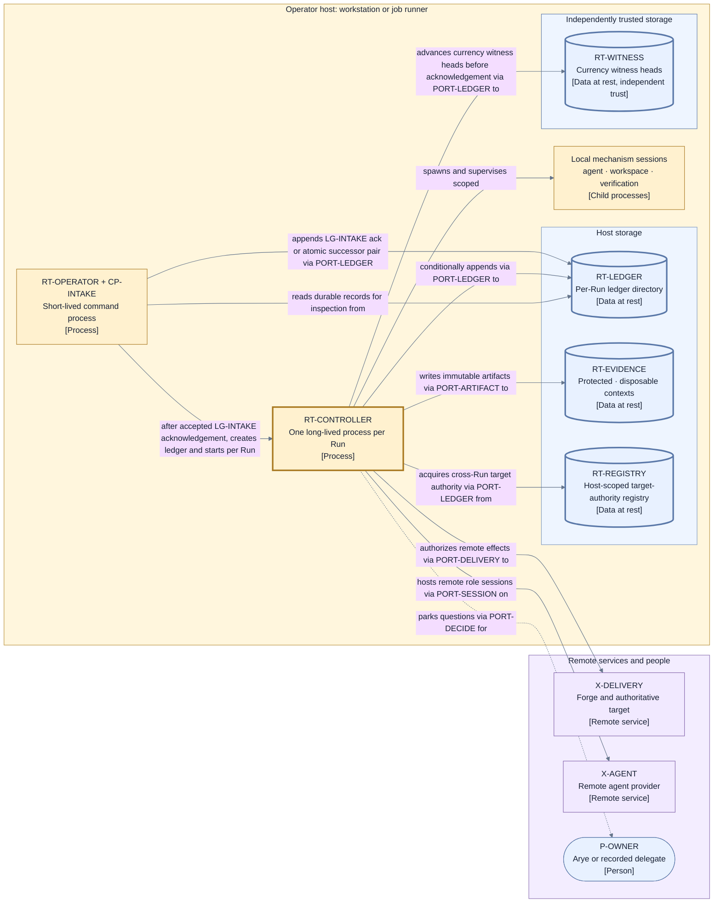

# Runtime architecture — decomposition, ports, and processes

This page decomposes `SYS-JIG` from the [system context](./context.md) one level. It consumes the
Layer 2 mandate of [D9 category 1](./decisions/D9-invariants-and-artifact-shape.md) and the D2
deferral of port and process decomposition. The decomposition rule follows
[D10](./decisions/D10-runtime-decomposition.md): **a modular single-authority runtime** — one
deterministic controller process per Run, passive durable stores, a thin operator interface, and
named ports as the only crossings of the authority-and-proof boundary.

The Jig product also ships the bounded Envelope Builder described in
[envelope production](./envelope-production.md). It realizes V1's `X-ENVELOPE` outside
`SYS-JIG`'s decision-authority boundary and reaches Work Source providers through `PORT-SOURCE`.
It is deliberately not a seventh D10 runtime unit: it authors and submits immutable input, while
the six units below realize the trusted Run authority core. Sharing an executable or installation
with `RT-OPERATOR` cannot move the builder inside the authority boundary.

## Runtime units

| ID              | Runtime unit              | Type         | Responsibility                                                                                                                                                                                                                                                                                                                                                                                                                                                                                                                                                                                                                                                                                                                                                                                                                                                                                                                      |
| --------------- | ------------------------- | ------------ | ----------------------------------------------------------------------------------------------------------------------------------------------------------------------------------------------------------------------------------------------------------------------------------------------------------------------------------------------------------------------------------------------------------------------------------------------------------------------------------------------------------------------------------------------------------------------------------------------------------------------------------------------------------------------------------------------------------------------------------------------------------------------------------------------------------------------------------------------------------------------------------------------------------------------------------- |
| `RT-OPERATOR`   | Operator interface        | Runtime unit | Implements the private first-party `PORT-CONSUMER` facade and hosts pre-controller `CP-INTAKE`. Intake's only durable authority write is an `LG-INTAKE` acknowledgement-only append or, for an accepted successor, one atomic acknowledgement-plus-unique-cut-claim append; its earlier attempt records use the non-authoritative `LG-PREFLIGHT-ATTEMPT` commit primitive. After an **accepted** witnessed acknowledgement exists, the operator idempotently creates the derived Run ledger and spawns the controller. A rejected acknowledgement permits neither action. The unit otherwise delegates commands and presents durable outcomes; it holds no lifecycle authority.                                                                                                                                                                                                                                                     |
| `RT-CONTROLLER` | Run controller            | Runtime unit | The single active Jig Control process for one Run: it validates, decides, records, dispatches, and reconciles under its controller generation.                                                                                                                                                                                                                                                                                                                                                                                                                                                                                                                                                                                                                                                                                                                                                                                      |
| `RT-LEDGER`     | Run ledger store          | Data store   | Holds one Run's durable ordered Transition ledger and durable control facts; passive data at rest with no decision behavior.                                                                                                                                                                                                                                                                                                                                                                                                                                                                                                                                                                                                                                                                                                                                                                                                        |
| `RT-EVIDENCE`   | Immutable artifact store  | Data store   | Holds bounded evidence and configuration artifacts, the artifact-backed records governed by `LG-PREFLIGHT-ATTEMPT`, plus terminal audit exports. Existing holder class deterministically selects one of two configured `PORT-ARTIFACT`/`CB-STORE` routing contexts: protected configuration/intake is non-disposable and contains the five pre-Run classes; disposable evidence contains the six controller-mediated classes and the authoritative deployment-wide reverse-reference pin lookup. Both contexts share this store and port, bind to the approved artifact-provider manifest/resource scope, add no record field, and never alias storage objects. The protected context is append-only and has no autonomous replacement/restore; unverifiable continuity is `FC-TRUST`. Preflight-attempt records are immutable mechanism evidence only; the `LG-INTAKE` terminal acknowledgement remains the sole intake authority. |
| `RT-REGISTRY`   | Target-authority registry | Data store   | Holds the durable cross-Run waiter and target-authority order keyed by `ID-TARGET`; grants only the comparator-least eligible recorded waiter, atomically rebinds Candidate-changing refreshes, and is the registry-first authority of record on recovery.                                                                                                                                                                                                                                                                                                                                                                                                                                                                                                                                                                                                                                                                          |
| `RT-WITNESS`    | Currency witness store    | Data store   | Holds the `LG-WITNESS` heads for the Run ledgers, registry, and `LG-INTAKE` intake-index head, plus exactly one artifact-reference-index witness line keyed by the approved artifact provider's configured deployment-wide disposable evidence resource scope, on storage whose trust is independent of every witnessed store and their backups, including `RT-EVIDENCE` and its pin lookup. Intake-index and disposable pin-lookup recovery are witness-verified readback; where no independent witness is configured, autonomous restore is traded for a deliberate stop.                                                                                                                                                                                                                                                                                                                                                         |

Rules the units must preserve:

- `RT-CONTROLLER` is the only unit that exercises Jig Control's Authorize, Decide, Record, and
  Reconcile powers (I3). `RT-OPERATOR` proposes triggers and reads projections; it can never
  advance lifecycle state directly.
- Every store is passive. Authority lives in the recorded content and its ordering, not in store
  behavior (I5); the storage technology below each store remains a replaceable external mechanism
  (`X-STORE`) behind `PORT-LEDGER` and `PORT-ARTIFACT`.
- Exactly one controller process is active per Run, enforced by the durable controller generation
  rather than by deployment convention (I6); a second controller instance is fenced, not merged.
- `RT-EVIDENCE` rejects disposal against every protected configuration/intake address. For its
  disposable context, an authoritative reverse-reference pin mutation is durably flushed, then
  its one `RT-WITNESS` line advances monotonically by position and head digest, before holder
  adoption or release is acknowledged. This safety guard creates no separate lifecycle or control
  authority.

## Named ports

For disposable evidence, `PORT-ARTIFACT` exposes no direct pin mutation: `OPC-ART-PUT` performs
put-or-verify plus exact temporary-event/intended-holder two-pin-set registration before adoption,
and `OPC-ART-DISPOSE` is bound to either post-retirement `release-pin` (no byte delete) or guarded
`dispose-bytes`. Both return
`EV-ARTIFACT-FACT` with lookup position/head; `CP-TRANSITION` then advances independent
`LG-WITNESS` through `PORT-LEDGER` before acknowledgement. The port cannot write a witness, and
restore refuses any missing, behind, forked, mismatched, or unverifiable head.

Every interaction between Jig and the outside world crosses exactly one named port. A port is a
semantic contract owned by Jig, not a transport: transports, encodings, and provider protocols are
selected per configured mechanism in
[mechanism and provider contracts](./mechanism-and-provider-contracts.md).

| ID               | Port                            | Faces (V1)                                                                                                                | Carries                                                                                                                                                                                                                                                                                                                                                                                                                                                                                                                                                                                                                                                                                                                                                                                                                                                                                                                                                                                                                                                                                                                                                                                                                                                                                                                                                                                                                                                                                                                                                                                                                                                                                                                                         |
| ---------------- | ------------------------------- | ------------------------------------------------------------------------------------------------------------------------- | ----------------------------------------------------------------------------------------------------------------------------------------------------------------------------------------------------------------------------------------------------------------------------------------------------------------------------------------------------------------------------------------------------------------------------------------------------------------------------------------------------------------------------------------------------------------------------------------------------------------------------------------------------------------------------------------------------------------------------------------------------------------------------------------------------------------------------------------------------------------------------------------------------------------------------------------------------------------------------------------------------------------------------------------------------------------------------------------------------------------------------------------------------------------------------------------------------------------------------------------------------------------------------------------------------------------------------------------------------------------------------------------------------------------------------------------------------------------------------------------------------------------------------------------------------------------------------------------------------------------------------------------------------------------------------------------------------------------------------------------------- |
| `PORT-CONSUMER`  | First-party consumer API facade | CLI, private MCP adapter, SDK                                                                                             | Versioned first-party preview, two distinct Arye-only approval methods, start, inspection, decision, and export methods. **Approve exact pre-Run proposal** invokes `EP-APPROVE` after binding Arye's configured `ID-PRINCIPAL` and the exact proposal digest/scope. **Approve exact provider authority manifest** binds that same configured principal to one exact `SCH-PROVIDER-AUTHORITY` digest and scope and returns the schema's existing exact owner-approval fields for `EP-PROVIDERS` to consume. The manifest action is not `EP-APPROVE`; neither action creates a Run, grant, event, Transition, or dispatch. Submission/core commands delegate to `PORT-INTAKE`, `PORT-DECIDE`, or `PORT-PUBLISH` without bypassing them. Every caller binds to exactly one configured principal or fails closed.                                                                                                                                                                                                                                                                                                                                                                                                                                                                                                                                                                                                                                                                                                                                                                                                                                                                                                                                  |
| `PORT-INTAKE`    | Envelope intake                 | `X-ENVELOPE`                                                                                                              | Composition-digest-keyed submission in; byte-equivalent durable `SCH-INTAKE-ACK` `terminal-ack` and, for an accepted successor, the atomically committed `SCH-INTAKE-CUT-CLAIM`, plus the accepted result's existing `ID-RUN` or rejected result's explicit absence on duplicate/lost-ack lookup, out. The claim is uniquely keyed by predecessor Run and cut position/digest; a losing composition receives a durable rejection naming the winning binding. Request identity, timeout, same-key replay, witnessed readback, and crash reconciliation are defined by `LG-INTAKE`. Pre-ack attempt variants arrive only through `PORT-ARTIFACT` and grant no intake authority.                                                                                                                                                                                                                                                                                                                                                                                                                                                                                                                                                                                                                                                                                                                                                                                                                                                                                                                                                                                                                                                                   |
| `PORT-DECIDE`    | Human decision                  | `P-OWNER`                                                                                                                 | Parked questions and provider human requests out; grant-aware answers, Run suspend/resume/terminal-stop decisions, delegation-grant changes, and notice acknowledgement/snooze events in. Each authenticated caller binds to exactly one configured `ID-PRINCIPAL` or fails closed.                                                                                                                                                                                                                                                                                                                                                                                                                                                                                                                                                                                                                                                                                                                                                                                                                                                                                                                                                                                                                                                                                                                                                                                                                                                                                                                                                                                                                                                             |
| `PORT-SESSION`   | Role session                    | Session mechanisms hosting `P-IMPLEMENTER`/`P-REVIEWER`: the Agent provider or a qualified human-client session mechanism | Bounded logical-session open/bind/assignment/collect/close requests and scoped Doorbell answers out; attributable acknowledgements, results, self-reports, verdicts, liveness, and human-needed provider requests in. Every rework turn uses a fresh logical `ID-SESSION` and deterministic assignment basis; provider-process correlation/reuse is non-authoritative metadata. Request/result identity, fence, timeout, replacement, and reconciliation follow `SCH-SESSION`/`SCH-OPERATION`.                                                                                                                                                                                                                                                                                                                                                                                                                                                                                                                                                                                                                                                                                                                                                                                                                                                                                                                                                                                                                                                                                                                                                                                                                                                  |
| `PORT-WORKSPACE` | Workspace effects               | `X-WORKSPACE`                                                                                                             | Authorized isolation and repository effects out; content, basis, cleanliness, and preservation facts in.                                                                                                                                                                                                                                                                                                                                                                                                                                                                                                                                                                                                                                                                                                                                                                                                                                                                                                                                                                                                                                                                                                                                                                                                                                                                                                                                                                                                                                                                                                                                                                                                                                        |
| `PORT-VERIFY`    | Verification                    | `X-VERIFY`                                                                                                                | Authorized exact-subject check requests out; check observations in.                                                                                                                                                                                                                                                                                                                                                                                                                                                                                                                                                                                                                                                                                                                                                                                                                                                                                                                                                                                                                                                                                                                                                                                                                                                                                                                                                                                                                                                                                                                                                                                                                                                                             |
| `PORT-DELIVERY`  | Delivery and target             | `X-DELIVERY`                                                                                                              | Disjoint review-publication `OPC-REV-*` effects and finalization/landing `OPC-DEL-*` effects out; target, gate, effect-certainty, request, and landing facts in. Review scope can never invoke target-changing classes.                                                                                                                                                                                                                                                                                                                                                                                                                                                                                                                                                                                                                                                                                                                                                                                                                                                                                                                                                                                                                                                                                                                                                                                                                                                                                                                                                                                                                                                                                                                         |
| `PORT-LEDGER`    | Ledger commit and read          | `X-STORE`                                                                                                                 | Conditional ordered appends and verified reads of Run/registry authority; the deployment-scoped `LG-INTAKE` acknowledgement index and unique predecessor/cut claims, including atomic accepted-successor pair append; and the only advance/read path for witness heads, including the intake head and one deployment-wide artifact pin-lookup head.                                                                                                                                                                                                                                                                                                                                                                                                                                                                                                                                                                                                                                                                                                                                                                                                                                                                                                                                                                                                                                                                                                                                                                                                                                                                                                                                                                                             |
| `PORT-ARTIFACT`  | Artifact persistence            | `X-STORE`                                                                                                                 | Immutable evidence and terminal audit-export writes, digest-verified reads, and the disposable context's authoritative reverse-reference pin lookup. The protected configuration/intake context rejects disposal, move, or cross-context aliasing. `OPC-ART-PUT` is the sole path to put/verify bytes and register the exact temporary-event/intended-holder two-pin set; adoption changes no lookup and later retires/releases the temporary tuple. `OPC-ART-DISPOSE` is mode-bound to post-retirement `release-pin` or guarded owner-authorized `dispose-bytes`. Each result returns `EV-ARTIFACT-FACT` with lookup `(position, head digest)`; `CP-TRANSITION` advances independent `LG-WITNESS` through `PORT-LEDGER` before acknowledgement. Restart/restore verifies that witnessed head before the applicable Operation result can be adopted. For configuration reads, it is the storage-facing path of `LG-PREFLIGHT-ATTEMPT`: `CP-INTAKE` directs each attempt through `CP-MEDIATOR`, bound by its holder class to the protected context, exact subject, expected digest, composition digest, one exchange-attempt key with derived start/result variant keys, ordinal, `BND-WAIT-MECHANISM`, and `BND-RETRY`. The commit primitive conditional-creates or reads back byte-equivalent immutable `SCH-INTAKE-ACK` variants at those separate keys. A new start must bind the prior terminal result or prove its deadline elapsed; variant mismatch, predecessor, deadline, digest, or integrity failure fails closed, so loss/crash cannot reset consumption. Exhaustion rejects intake before Run creation. The ordered handles enter the `terminal-ack`; attempt variants grant no intake authority and create no Operation or event. |
| `PORT-PUBLISH`   | Read-only publication           | `X-CONSUMER`                                                                                                              | Durable outcomes, explanations, actionable notices, immutable audit-export references, and obligations out; no control input.                                                                                                                                                                                                                                                                                                                                                                                                                                                                                                                                                                                                                                                                                                                                                                                                                                                                                                                                                                                                                                                                                                                                                                                                                                                                                                                                                                                                                                                                                                                                                                                                                   |

The disposable pin-lookup durability sequence composes the two existing storage ports without
bypassing either one. `OPC-ART-PUT` registration and `OPC-ART-DISPOSE` `release-pin` return proof
that their exact mutation durably flushed in `EV-ARTIFACT-FACT`; `CP-TRANSITION` supplies exact
`(position, head digest)` to the existing witness-line `PORT-LEDGER` commit protocol, which
withholds acknowledgement until independent `RT-WITNESS` advance is durable. `PORT-ARTIFACT` never writes `RT-WITNESS` directly, and witness completion grants
no authority. The five pre-Run holder classes use the non-disposable protected context instead;
they require no pin-witness crossing and never become an `OPC-ART-DISPOSE` subject.

### Pre-Run attempt commit primitive

`LG-PREFLIGHT-ATTEMPT` is the one commit-primitive-class contract shared by both durable pre-Run
attempt families: `CP-INTAKE` configuration reads through `PORT-ARTIFACT`, and
`EP-PROVIDERS` capability-proof acquisition through the selected provider's existing configured
mechanism-port exchange. The owning exchange supplies an immutable store implementing
conditional-create and verified readback under the deterministic family, exact subject/basis, and
attempt ordinal. Each exchange-attempt key derives separate start and result variant keys; first
create at either key returns that exact stored record, and same-variant-key replay returns only
byte-equivalent canonical content. A same-variant-key byte mismatch, missing or mismatched predecessor,
changed deadline or bound consumption, digest mismatch, or failed integrity proof fails closed.
A later ordinal is admissible only after the prior terminal result is verified or its frozen
deadline is proved elapsed; loss, crash, or timeout cannot reset `BND-WAIT-MECHANISM` or
`BND-RETRY`.

This primitive records evidence of bounded acquisition only. It appends no Run or authority
ledger, grants no intake or provider authority, mints no Run, and creates no Operation, event, or
Transition. `LG-INTAKE` remains the single intake commit point, so the shared primitive is not a
second ledger authority.

Port rules:

- One V1 external relationship maps to exactly one port, so the Layer 1 boundary stays checkable
  at Layer 2. `X-STORE` is reached through two ports because the ledger's conditional-append
  contract and the artifact store's immutable-blob contract are different proof obligations.
- Every inbound message is validated at the port against identity, role, exact subject, lifecycle
  position, fence, and capability before it can become a trigger (I7). `CP-MEDIATOR` validates the
  mediated mechanism ports; `CP-INTAKE` validates `PORT-INTAKE`; `CP-ESCALATION` validates
  `PORT-DECIDE`; controller derivation validation owns wakes; and `PORT-LEDGER`'s commit primitive
  carries equivalent identity, position, and digest validation inside the transition engine's
  commit protocol.
- `PORT-PUBLISH` is one-directional by construction. A consumer that needs to influence a Run must
  enter through `PORT-INTAKE` or `PORT-DECIDE` as a first-class validated participant.
- `PORT-CONSUMER` is a private product facade, not another lifecycle authority or provider seam. It
  terminates at `RT-OPERATOR`, binds each authenticated caller to exactly one configured principal
  from the local execution context or fails closed, preserves that caller principal/grant and event
  schema, and delegates to the existing validated ports for core actions. Preview and exact-proposal
  approval invoke the Envelope Builder's `EP-PREVIEW` and `EP-APPROVE` paths outside the core
  authority boundary. The separate **Approve exact provider authority manifest** action accepts
  only Arye's bound principal and one exact `SCH-PROVIDER-AUTHORITY` digest/scope; it returns the
  existing manifest-approval fields for `EP-PROVIDERS` and cannot approve an envelope proposal.
  Neither approval action uses `PORT-DECIDE`, a per-Run `ID-GRANT`, event, Transition, or dispatch.
  Controller components, stores, and mechanisms remain unreachable until the separately approved
  envelope is submitted through intake.
- `PORT-SOURCE` is not an eleventh crossing of `SYS-JIG`: it belongs to `X-ENVELOPE`'s bounded product
  front end. Candidate work can reach `PORT-INTAKE` only after validation, composition, and owner
  approval produce a new immutable envelope.

### First-party consumer API delegation

| Consumer action                                        | Delegates to                                          | Boundary rule                                                                                                                                                                                                                                      |
| ------------------------------------------------------ | ----------------------------------------------------- | -------------------------------------------------------------------------------------------------------------------------------------------------------------------------------------------------------------------------------------------------- |
| Preview                                                | Envelope Builder `EP-PREVIEW`                         | Runs composition and validation effect-free; never calls intake, mints a Run, writes a ledger, or dispatches.                                                                                                                                      |
| Approve exact pre-Run proposal                         | Envelope Builder `EP-APPROVE`                         | Requires Arye's authenticated `ID-PRINCIPAL`; records exact proposal digest and scope; no delegate, Run grant, event, Transition, or dispatch.                                                                                                     |
| Approve exact provider authority manifest              | Provider-manifest approval consumed by `EP-PROVIDERS` | Requires Arye's authenticated `ID-PRINCIPAL`; binds the exact `SCH-PROVIDER-AUTHORITY` digest and scope and returns only its existing approval fields. It is distinct from `EP-APPROVE` and creates no Run, grant, event, Transition, or dispatch. |
| Start / envelope submission                            | `PORT-INTAKE`                                         | Reuses digest-keyed validation and acknowledgement; only intake may mint or retrieve a Run.                                                                                                                                                        |
| Decide, override, handoff, stop, resume, notice action | `PORT-DECIDE`                                         | Preserves authenticated principal, current `ID-GRANT`, exact subject, and event schema.                                                                                                                                                            |
| Inspect, watch, ask why, notices, outcomes             | `PORT-PUBLISH`                                        | Reads a durable projection at a stated ledger position, scoped to the configured reader-principal set; no control input is added.                                                                                                                  |
| Export retrieval                                       | `PORT-PUBLISH`, then `OPC-ART-GET` internally         | Returns a validated reference/read; the consumer never reads `RT-EVIDENCE` or storage directly.                                                                                                                                                    |

The facade is private and versioned for shipped first-party consumers. It creates no public package
or external stability commitment; changing that posture is a deliberate owner-visible decision.

## Process model

- `RT-OPERATOR` runs as a short-lived process per command (configure, preview, approve, start/submit,
  inspect, decide,
  suspend, resume, notice acknowledge/snooze, export). A realization may host the Envelope Builder
  in the same executable, but the
  builder still has only proposal authority and remains outside the controller's trust boundary.
  It communicates with a live controller only through durable records and validated port triggers,
  never through shared memory, so an absent or crashed operator process cannot corrupt control
  state. For start/submit it hosts `CP-INTAKE`; the acknowledgement-only or atomic accepted-
  successor acknowledgement-plus-cut-claim append is the single commit point, and controller spawn
  occurs only after that witnessed **accepted** acknowledgement exists;
  a rejected acknowledgement is terminal preflight and cannot derive a ledger or controller.
- `RT-CONTROLLER` runs as one long-lived process per Run after intake acknowledgement through Run
  completion, interruption, or suspension. A suspended controller holds no live dispatch authority.
  On start, restart, or operator resume it acquires a new controller generation through
  `PORT-LEDGER` before any dispatch (I6). Concurrent Runs are concurrent controller processes; the
  only state shared between Runs is the target-authority registry (`RT-REGISTRY`), the deliberate
  cross-Run exception that serializes finalization authority per canonical target (I12). Every
  acquisition first records the waiter's D6/`C-ORDER` tuple; the registry grants only the
  comparator-least eligible waiter, records grant/release by conditional append, and performs a
  Candidate-changing refresh rebind in one atomic registry append. Recovery treats the registry as
  the cross-Run authority of record before reconciling a Run-ledger mirror. No global scheduler or
  second arbiter exists.
- Mechanism sessions (agent roles, verification executions, delivery operations) run outside the
  controller process as separate local processes or remote services reached through their ports.
  A mechanism crash is a Story- or Operation-scoped fault (I15), never a controller memory fault.

### View V6 — runtime decomposition

- **Question:** What separately runnable or independently stored units realize Jig, and through
  which ports do they reach the outside world?
- **View type:** Runtime/container decomposition of `SYS-JIG`.
- **Audience and purpose:** Engineers, architects, security, and operations; see where each Layer 1
  responsibility executes before opening component detail.
- **Scope and exclusions:** Jig's runtime units, ports, and immediate external counterparts.
  Component internals, schemas, transports, and deployment topology are excluded (V6a owns
  topology).
- **State:** Approved (not locked).
- **Owner:** Arye Kogan.
- **Sources:** D2, D10; I2–I3, I5–I7; [system context V1](./context.md).
- **Related views:** [V1](./context.md) owns the boundary; [V7](./components/control-plane.md)
  opens the controller; [V6a](#view-v6a--process-and-deployment-model) places these units on a
  host.

**V6 legend:** Rectangles are runtime units, authorities, or mechanisms; cylinders are data stores;
the rounded rectangle is a person. The thick yellow border marks the sole lifecycle authority
(`RT-CONTROLLER`); thick blue borders mark the durable stores whose recorded content is
authoritative. The dashed border and dashed line mark read-only publication with no control
authority. Every crossing of the yellow region names its port in the edge label; there are no
unnamed crossings. Purple nodes are external mechanisms, blue the decision authority, and gray the
consumer; color is redundant with the stable IDs and bracketed types. The grouped
`X-WORKSPACE · X-VERIFY · X-DELIVERY` node keeps this view at one level; each mechanism keeps its
own V1 identity and its own port. `RT-REGISTRY` is deliberately cross-Run: it is shared by
every Run controller, serializing finalization authority per canonical target (I12) through the
same conditional-append contract as the Run ledger. `RT-WITNESS` deliberately sits on storage of
independent trust, because its purpose is to detect rollback of the other stores and their
backups, including the disposable evidence pin lookup in `RT-EVIDENCE`; its one
artifact-reference-index witness line must be verified before any disposable pin adoption, release,
or `OPC-ART-DISPOSE` after restart or restore. The five pre-Run classes use the protected context;
holder-class routing and the approved artifact-provider resource binding are verified instead of a
pin witness, and disposal/move/alias remains impossible.

## Deployment shape

The proposed deployment is **single-host, per-Run**: an operator host (workstation or job runner)
executes `RT-OPERATOR` commands, each accepted Run gets one `RT-CONTROLLER` process on that host,
and the ledger, evidence, and registry stores are directories or volumes owned by that host's
storage, while the currency witness lives on separately configured storage of independent trust.
Remote participants —
forge targets, remote agent providers, the owner answering an escalation — remain remote services
or people reached through the ports. A hosted or multi-tenant topology is a future deployment view,
not a change to this logical decomposition (the guide separates logical architecture from
deployment topology).

### View V6a — process and deployment model

- **Question:** Where do the runtime units execute in the proposed single-host deployment, and
  which parts live outside the host?
- **View type:** Deployment view for the single-host environment.
- **Audience and purpose:** Operations and engineering readers; see process boundaries, store
  placement, and remote seams.
- **Scope and exclusions:** One materially distinct environment (single host). Replica counts,
  hosting products, network hardware, and provider topology are excluded.
- **State:** Approved (not locked).
- **Owner:** Arye Kogan.
- **Sources:** D10; I6, I15.
- **Related views:** [V6](#view-v6--runtime-decomposition) owns the logical decomposition;
  [V12](./mechanism-and-provider-contracts.md) owns mechanism contracts across the remote seam.

**V6a legend:** Rectangles are processes or remote services; cylinders are data at rest; the
rounded rectangle is a person. The thick yellow border marks the controller process, the sole
lifecycle authority on the host; thick blue borders mark authoritative data at rest. Solid lines
are supervision, port-mediated effects, or reads; the dashed line is the escalation path to the
owner. The yellow region is the operator host, blue its storage, and purple everything remote;
color is redundant with IDs and bracketed types. Local mechanism sessions are grouped into one
node to keep this view at one level; their contracts are identical to remote mechanisms'.

## How the decomposition preserves the Layer 1 contract

| Layer 1 obligation                                  | Where it lands at Layer 2                                                                                                                                                                                                                                                                                                                                                                             |
| --------------------------------------------------- | ----------------------------------------------------------------------------------------------------------------------------------------------------------------------------------------------------------------------------------------------------------------------------------------------------------------------------------------------------------------------------------------------------- |
| Sole routine lifecycle authority (I3)               | Only `RT-CONTROLLER` decides; `RT-OPERATOR` proposes and reads; stores are passive.                                                                                                                                                                                                                                                                                                                   |
| Ledger authority, record before adopt/dispatch (I5) | `RT-LEDGER` behind `PORT-LEDGER`; the transition engine alone writes Run Transitions, including terminal-stop Settlement-overlay progress. `CP-INTAKE` writes only `LG-INTAKE` acknowledgement or atomic accepted-successor acknowledgement-plus-cut-claim authority; the non-authoritative `LG-PREFLIGHT-ATTEMPT` and registry arbitration use their separately declared commit-primitive contracts. |
| Fencing and safe resume (I6)                        | Controller generation acquired through `PORT-LEDGER` before any dispatch; one controller process per Run.                                                                                                                                                                                                                                                                                             |
| One target-scoped finalization authority (I12)      | Cross-Run arbitration through the shared `RT-REGISTRY` store behind `PORT-LEDGER`'s conditional-append contract; every Run controller contends on one authority line per canonical target.                                                                                                                                                                                                            |
| Fail-closed trust posture after rollback (I20)      | `LG-WITNESS` heads in `RT-WITNESS`, on storage whose trust is independent of every witnessed store and its backups, advanced before every relevant acknowledgement; this includes the disposable artifact-reference-index line before any disposable holder adoption or release acknowledgement. Protected configuration/intake addresses reject disposal independently of that lookup.               |
| Exact-subject validation at the boundary (I7)       | Mechanism messages pass `CP-MEDIATOR`; intake passes `CP-INTAKE`; decisions pass `CP-ESCALATION`; wakes pass controller derivation validation; ledger primitives pass commit-protocol validation.                                                                                                                                                                                                     |
| Smallest-safe containment (I15)                     | Mechanism sessions are separate processes; their faults arrive as attested failures, not shared-memory failures.                                                                                                                                                                                                                                                                                      |
| No undeclared control path (D2, D3)                 | `PORT-PUBLISH` is read-only; every other crossing is a named, validated port.                                                                                                                                                                                                                                                                                                                         |

## Where to go next

- Inside the controller: [control plane components](./components/control-plane.md).
- Identity and schema shapes crossing these ports: [data and identity](./data-and-identity.md).
- The ledger and projection realization: [persistence and projections](./persistence-and-projections.md).
- Mechanism obligations behind the ports:
  [mechanism and provider contracts](./mechanism-and-provider-contracts.md).
- Why this decomposition was selected, with rejected alternatives:
  [D10 — runtime decomposition](./decisions/D10-runtime-decomposition.md).
