# Scheduling and bounds — admission, reservation, wait, and budget realization

This page consumes [D9 category 4](./decisions/D9-invariants-and-artifact-shape.md) — retry,
rework, refresh, wait, timeout, timer, queue, reservation, capacity, and fairness algorithms and
numeric budgets — realizing [concurrency and finalization](./concurrency-and-finalization.md) and
[failure and liveness](./failure-and-liveness.md). `CP-SCHEDULER` and `CP-ESCALATION` inside
`RT-CONTROLLER` ([runtime](./runtime.md)) decide; nothing moves authority outside Jig Control (I3).

## Resource classes (`RC-*`)

Each class realizes one high-level capacity class named by
[D6](./decisions/D6-concurrency-and-finalization.md): configuration declares hard available
capacity; frozen policy may only narrow it, resolving the effective maximum to the lower value.

| ID               | Resource class                | What consumes one unit                                                | Hard capacity declared by                   | Policy may lower it to                              |
| ---------------- | ----------------------------- | --------------------------------------------------------------------- | ------------------------------------------- | --------------------------------------------------- |
| `RC-ISOLATION`   | Isolated workspaces           | Each active Story workspace obtained through `PORT-WORKSPACE`.        | Workspace mechanism configuration.          | Any value at or above the progress reserve.         |
| `RC-SESSION`     | Retained role sessions        | Each retained implementer or reviewer session identity across turns.  | Agent mechanism configuration.              | Any value at or above the progress reserve.         |
| `RC-IMPL-TURN`   | Active implementer turns      | Each dispatched implementation or rework turn on `PORT-SESSION`.      | Agent mechanism configuration.              | Any value at or above the progress reserve.         |
| `RC-REVIEW-TURN` | Active reviewer turns         | Each dispatched independent review turn on `PORT-SESSION`.            | Agent mechanism configuration.              | Any value at or above the progress reserve.         |
| `RC-VERIFY`      | Verification executions       | Each policy-selected deterministic verification run on `PORT-VERIFY`. | Verification mechanism configuration.       | Any value at or above the progress reserve.         |
| `RC-DELIVERY`    | Delivery operations in flight | Each authorized publication or integration effect on `PORT-DELIVERY`. | Delivery mechanism configuration.           | Any value at or above the progress reserve.         |
| `RC-FINALIZER`   | Target finalization authority | The single Story holding finalization authority for one target.       | Fixed by the architecture: exactly 1 (I12). | Not lowerable; capacity 1 is structural, not tuned. |

**Progress-reserve rule (mandatory, all classes):** every class carries a reserve so that every
admitted Story retains a path to its **next mandatory safe point** — the nearest of preserved
rework, recorded block, acceptance, or confirmed landing — using only remaining capacity. Preflight
rejects an envelope whose declared capacity, policy maxima, and reserve cannot jointly preserve
that path for any admissible Story (D6, I10). The reserve is a class property with a named
conservative default; frozen policy may enlarge it, never waive it.

## Admission algorithm — deterministic, derived, replayable

On every relevant durable fact change (a Transition commits, a wake trigger fires, capacity facts
change), `CP-SCHEDULER` recomputes admission from durable authority alone, so any two replays of
the same ledger produce the same admissions (I4):

1. **Eligibility derivation:** a Story is eligible when all prerequisites are confirmed `Landed`
   (I13), it holds no durable direct blocker (I14), and its Run is not interrupted or stopping.
2. **Total order:** order the eligible set by the immutable comparator — approved plan priority,
   then immutable plan ordinal, then unique Story identity (I11). No arrival, collection, or
   mechanism order participates.
3. **Capacity check with progress reserve:** admit greedily in that order while every admitted
   Story keeps a progress path to its next mandatory safe point under remaining capacity (I10); a
   reserve-breaking Story is skipped as a derived wait and later Stories are still considered.
4. **Record before touch:** each admission is recorded as a Transition whose operation intents are
   the durable **reservations** against the consumed `RC-*` classes; no workspace, session, turn,
   or delivery resource is touched before that Transition commits (I5).
5. **Constrained preference:** while any class is constrained, `CP-SCHEDULER` prefers advancing or
   retiring already-admitted work over admitting new Stories (D6); freed reservations are released
   by the Transition that records the advance or Retirement.

Queues are **derived state**, rebuilt from the ledger by `CP-PROJECTION`, never authoritative;
reservations are **durable facts**, the admission Transition's operation intents, reconciled like
any Operation on Recovery. No admitted Story or current finalization-authority holder is preempted
by a later higher-priority Story — preemption trades determinism for utilization D6 declined.

## Bound and budget classes (`BND-*`)

For every class: frozen policy supplies the value; configuration may only narrow it; and each class
carries a named safe conservative default as a **class property**, never a magic number in control
logic. Every wait opened under a class records its accountable owner, durable reason, wake or
completion condition, and deadline class (I16). Exhaustion actions come from the fixed
[D8](./decisions/D8-failure-and-liveness.md) set — retry, block, park, escalate, interrupt, stop,
or Residual Obligation — never silent success or an unnamed indefinite wait.

| ID                   | What it bounds                                                                                                 | Value source and default posture                                | Explicit exhaustion action                                                                                        |
| -------------------- | -------------------------------------------------------------------------------------------------------------- | --------------------------------------------------------------- | ----------------------------------------------------------------------------------------------------------------- |
| `BND-REWORK`         | Review and rework loops per Story.                                                                             | Policy; conservative default: few loops.                        | Block the Story; dependents derive `Not run — dependency blocked`.                                                |
| `BND-RETRY`          | Attempts per Operation class.                                                                                  | Policy per Operation class; conservative default: few attempts. | Block at the owning Story or Operation scope.                                                                     |
| `BND-REFRESH`        | Target refreshes while holding finalization authority.                                                         | Policy; conservative default: few refreshes.                    | Park with escalation naming target instability.                                                                   |
| `BND-WAIT-DECISION`  | Owner-decision waits on parked questions.                                                                      | Policy deadline class; conservative default: long, renewable.   | Escalate again durably; the question stays parked, never dropped.                                                 |
| `BND-WAIT-MECHANISM` | Mechanism response deadlines on the mediated Operation ports (session, workspace, verify, delivery, artifact). | Policy per port; conservative default: short.                   | Retry under `BND-RETRY`; then block at the owning Story or Operation scope.                                       |
| `BND-WAIT-LEDGER`    | Authoritative-store waits: ledger and target-authority-registry commit acknowledgements and verified reads.    | Policy; conservative default: short.                            | Halt dispatch and interrupt the Run into Recovery; shared authority uncertainty is never Story-blocked (D8, I15). |
| `BND-WAIT-TARGET`    | Target stability waits before and during finalization.                                                         | Policy; conservative default: moderate.                         | Park with escalation; target effects stay fenced.                                                                 |
| `BND-RECOVERY`       | Reconciliation attempts for one uncertain effect (I17).                                                        | Policy; conservative default: few attempts.                     | Escalate; no second semantic attempt until reconciled.                                                            |
| `BND-RETIRE`         | Retirement attempts per obligation.                                                                            | Policy; conservative default: few attempts.                     | Residual Obligation handed to the owner (I19).                                                                    |

The mechanism/ledger split is deliberate: a timed-out or unknown outcome on a mediated Operation
port is a Story- or Operation-scoped fault, but an unknown ledger or registry acknowledgement is
uncertainty about shared durable authority itself. Continuing other Stories from an uncertain
ledger would violate the containment ladder of
[failure and liveness](./failure-and-liveness.md), so `BND-WAIT-LEDGER` exhaustion always halts
dispatch and enters Run-scoped Recovery ([persistence and projections](./persistence-and-projections.md)).

## Timers and wake triggers

Durable typed **wake triggers** are the authoritative wait facts: each records its subject,
deadline class, and completion or wake condition, committed with the Transition that opened the
wait. Transient in-process timers only prompt re-evaluation and carry no decision authority (D8);
a fired timer whose durable condition no longer holds does nothing. On Recovery, wake triggers are
reconstructed from the ledger before dispatch resumes (I6), so no wait is lost with process memory
and a missed deadline follows its recorded exhaustion action.

## Fairness and starvation resistance

Fairness is **deterministic order plus admitted-progress priority plus bounded turns** — not
dynamic aging, weights, or lotteries, rejected for reintroducing arrival-order-sensitive outcomes
(I4, I11); bounded `BND-*` turns mean the head of the total order always advances or exits.

| Starvation scenario        | Risk                                                                       | Preventing rule                                                                                    |
| -------------------------- | -------------------------------------------------------------------------- | -------------------------------------------------------------------------------------------------- |
| Reviewer-capacity deadlock | Implementation turns absorb all capacity; no review can ever start.        | `RC-REVIEW-TURN` progress reserve plus advance-before-admit under constraint.                      |
| Session exhaustion         | Retained sessions accumulate until no Story can obtain one.                | `RC-SESSION` explicit class, preflight rejection, and retire-before-admit reclamation.             |
| Finalizer wait             | Accepted Stories waiting on `RC-FINALIZER` are bypassed by newer arrivals. | Total comparator orders the wait; no preemption; `BND-REFRESH`/`BND-WAIT-TARGET` bound the holder. |

### View V10 — deterministic admission pipeline

- **Question:** How does a durable fact change become a recorded admission with reservations, and
  where do constrained capacity and bound exhaustion divert the pipeline?
- **View type:** Behavior flow of the `CP-SCHEDULER` admission pipeline.
- **Audience and purpose:** Engineers and operations readers; see why a Story was or was not
  admitted and which exits exist, before reading component internals.
- **Scope and exclusions:** Admission derivation, ordering, capacity, recording, and dispatch for
  one Run. Finalization-authority transfer, provider-capacity mapping, and schemas are excluded.
- **State:** Proposed.
- **Owner:** Arye Kogan.
- **Sources:** D6, D8; I4, I5, I10–I13, I16; [runtime V6](./runtime.md).
- **Related views:** [V6](./runtime.md#view-v6--runtime-decomposition) places `RT-CONTROLLER`; V7
  ([control plane](./components/control-plane.md)) opens `CP-SCHEDULER`; V12
  ([mechanism contracts](./mechanism-and-provider-contracts.md)) owns provider capacity.

```mermaid
%%{init: {"theme": "base", "themeVariables": {"fontFamily": "Inter, ui-sans-serif, system-ui", "primaryTextColor": "#172033", "lineColor": "#65758b"}}}%%
flowchart LR
    subgraph Durable["Durable authority"]
        Ledger[("RT-LEDGER<br/>Durable facts: landings, blockers, reservations<br/>[Authoritative store]")]
        Admit["CP-TRANSITION<br/>Admission Transition with reservation intents<br/>[Authoritative record]"]
    end

    subgraph Pipeline["CP-SCHEDULER: derived, rebuilt from the ledger"]
        Elig["I13<br/>Eligibility derivation<br/>prerequisites confirmed Landed<br/>[Derived step]"]
        Order["I11<br/>Immutable total comparator<br/>priority, ordinal, Story identity<br/>[Deterministic rule]"]
        Cap["RC-ISOLATION to RC-FINALIZER<br/>Capacity check with progress reserve<br/>[Derived check]"]
    end

    subgraph Flight["Dispatched and admitted work"]
        Dispatch["CP-MEDIATOR<br/>Dispatch through named ports<br/>[Dispatch]"]
        Admitted["STORY-*<br/>Admitted work in flight<br/>[Admitted Stories]"]
    end

    Exhaust["BND-*<br/>Explicit exhaustion actions<br/>retry, block, park, escalate, interrupt, stop, residual<br/>[Bounded exit]"]

    Ledger -->|"supplies facts on every relevant change to"| Elig
    Elig -->|"passes the eligible set to"| Order
    Order -->|"offers Stories in total order to"| Cap
    Cap -->|"records admission and reservations via"| Admit
    Admit -->|"commits before any resource is touched to"| Ledger
    Admit -->|"authorizes dispatch of admitted work to"| Dispatch
    Dispatch -->|"advances"| Admitted
    Cap -.->|"constrained: prefers advancing or retiring"| Admitted
    Admitted -.->|"on bound exhaustion follows"| Exhaust
    Exhaust -.->|"is recorded durably back into"| Ledger

    style Durable fill:#fff6dd,stroke:#b8903a,color:#172033
    style Pipeline fill:#eef5ff,stroke:#7a96bd,color:#172033
    style Flight fill:#e8f7ed,stroke:#4f8a63,color:#172033
    classDef store fill:#e8f1ff,stroke:#5a78a8,stroke-width:3px,color:#172033
    classDef record fill:#fff1cf,stroke:#a8781f,stroke-width:3px,color:#172033
    classDef derived fill:#e8f1ff,stroke:#5a78a8,color:#172033
    classDef work fill:#e8f7ed,stroke:#4f8a63,color:#172033
    classDef exit fill:#fce8e6,stroke:#a7615b,stroke-dasharray:5 3,color:#172033
    class Ledger store
    class Admit record
    class Elig,Order,Cap derived
    class Dispatch,Admitted work
    class Exhaust exit
```

**V10 legend:** The cylinder is the authoritative store; rectangles are pipeline steps, records,
dispatch, or work. The thick yellow border marks the authoritative admission record
(`CP-TRANSITION`); the thick blue border marks the authoritative ledger; plain blue pipeline nodes
are derived state rebuilt from the ledger, never authoritative. Solid lines are the normal
deterministic admission path; dashed lines mark only the constrained-capacity preference and the
bound exhaustion exits, and the red dashed-border node groups the `BND-*` exhaustion actions.
`RC-ISOLATION to RC-FINALIZER`, `BND-*`, and `STORY-*` group this page's classes and the admitted
Stories, each keeping its own identity. Color is redundant with IDs and bracketed types.

## Exclusions

Provider-capacity mapping — how each configured provider's real limits become `RC-*` hard
capacity — and authority APIs live in
[mechanism and provider contracts](./mechanism-and-provider-contracts.md), authored concurrently.
Reservation and wake-trigger record shapes belong to the data and ledger pages; this page owns
their meaning and algorithmic use only.

## Where to go next

- Layer 1 rules realized here: [concurrency and finalization](./concurrency-and-finalization.md)
  and [failure and liveness](./failure-and-liveness.md).
- The scheduler and escalation components in context:
  [control plane components](./components/control-plane.md).
- Why capacity classes and bounded exhaustion were selected:
  [D6](./decisions/D6-concurrency-and-finalization.md),
  [D8](./decisions/D8-failure-and-liveness.md).
