# State and recovery — durable authority, reconstruction, and reconciliation

## State classification

| Classification                         | Canonical contents                                                                                                                                                                                                                                                                                                                                                                                                        | Authority rule                                                                                      |
| -------------------------------------- | ------------------------------------------------------------------------------------------------------------------------------------------------------------------------------------------------------------------------------------------------------------------------------------------------------------------------------------------------------------------------------------------------------------------------- | --------------------------------------------------------------------------------------------------- |
| **Durable authority**                  | Run identity and frozen envelope; ordered Transition decisions; stable Operation identities, per-dispatch reauthorizations, and effect certainty; Run suspension/terminal-stop state; Story business and Retirement states; Candidates, reviews, acceptance, evidence references, target bases, fences, bounds, waits, landing proof, owner decisions, notices, escalations, Residual Obligations, and terminal outcomes. | The ordered ledger is the sole control truth.                                                       |
| **Transient mechanism or cache state** | In-memory projections and indexes; prepared but unrecorded requests; queues and capacity calculations; live provider clients/process handles; local timers; UI/read-model caches; temporary access material; unaccepted observations.                                                                                                                                                                                     | Replaceable and never independently authoritative.                                                  |
| **Derived and recomputable state**     | Eligibility, dependency-blocked outcomes, total ordering, capacity use, summaries, read-only projections, metrics, and compact completed-Story indexes.                                                                                                                                                                                                                                                                   | Recompute from durable authority and frozen definition; do not maintain as competing mutable truth. |

An opaque external resource identity is durable when recovery needs it; a live provider object is not.
Credentials and secret values never enter durable authority or durable evidence.

## Durable ordering and uncertain acknowledgement

The durable ordered Transition ledger remains authoritative. A snapshot or materialized current view
may accelerate reconstruction only when its ledger position and integrity are verifiable.
Each validated trigger is committed as `SCH-EVENT`; its `ID-EVENT` is
`<run>/event/<ledger position>`, and that commit position is the one and only I4 trigger-ordering
key. Replay consumes events in ledger commit order. Arrival time, provider timestamps, queue order,
and live process scheduling cannot reorder them; before validation-commit an event has no identity
and no effect.

When commit acknowledgement is lost, Jig resolves the stable Transition identity and expected prior
position:

- **confirmed committed:** adopt the recorded Transition exactly once;
- **confirmed absent:** retry the same Transition identity and content; or
- **indeterminate:** halt advancement and enter Recovery.

Jig never dispatches an effect from an indeterminate control commit.

## Operation identity and fencing

- One semantic effect has one durable Operation identity.
- Same-identity retry exists only for an effectful Operation after reconciliation proves confirmed
  absence. A newly recorded reauthorization retains its identity and payload basis, refreshes the
  current `ID-GEN` and, when target authority was reacquired, `ID-AUTH` plus `ID-REGISTRY`, and
  records which generation dispatched the attempt.
- An effect-free observation is never retried under the same identity. A lost, cancelled, or
  replaced observation is a newly authorized Operation with a new identity over the same exact
  subject; supersession and cancellation are durable records, never silence.
- A new linked semantic attempt is allowed only after the earlier effect is reconciled.
- Candidate-sensitive work binds the Story, Candidate, and target basis. Review publication binds
  its dedicated `CB-REVIEW-PUBLICATION` without finalization authority; target-changing work also
  binds the current finalization authority.
- A durable controller generation rejects stale pre-interruption dispatchers.
- Retaining a stale fence on redispatch is exactly `FC-FENCE`, not a legal retry; stale, duplicate,
  mismatched, late, or wrong-fence results never advance state.

## Reconstruction and reconciliation

After interruption, Jig acquires a new controller generation, verifies the ledger, reconstructs
canonical state, enumerates pending and uncertain Operations, reconciles external state, records the
observations, revalidates authorities, and only then resumes.

A deliberate operator `Suspended` Run uses the same machinery on resume: suspension stops dispatch,
fences target authority without changing any Story state, and releases it only after the holding
Story's target-changing Operations reconcile. Resume acquires a new controller generation before
running `RC-RESUME-INTEGRITY`. A safety-relevant difference parks for exact re-approval; only an
unchanged, reconciled basis returns the underlying Stories to dispatch.

`RC-RESUME-INTEGRITY` also reads `LG-INTAKE` for an accepted successor acknowledgement naming this
Run as predecessor. Such an acknowledgement permanently fences predecessor resumption: the check
fails resume closed with a parked explanation naming the accepted successor, rather than restoring
the predecessor's underlying Stories to dispatch. Intake consumes one predecessor quarantine cut
for at most one accepted successor; the second successor submission naming an already-consumed cut
fails intake closed.

No irreversible effect is blindly replayed:

- confirmed effect: adopt its factual result;
- confirmed absence: frozen policy may authorize a bounded same-identity retry only for an
  effectful Operation; an effect-free replacement receives a new identity; or
- indeterminate effect: park and escalate without authorizing a second semantic effect.

If the ledger is unavailable, corrupted, rolled back, or compromised beyond trustworthy recovery,
Jig cannot guarantee reconstruction, audit completeness, Operation ownership, no-double-effect
behavior, safe autonomous resume, or trustworthy terminal outcomes. `FC-TRUST` first fences all
dispatch and adoption and surfaces the operator-visible stop condition without claiming an
authoritative ledger record. A `Stopped` record follows only when a witnessed verified-currency
append basis remains, or later through externally governed recovery; until then the terminal
disposition is externally owned. This unwitnessable `FC-TRUST` halt has no Jig audit export, and
Jig promises none for the path. Any export-equivalent record is produced by the externally
governed recovery under its own authority, using Jig's surfaced stop condition and the surviving
ledger bytes as its material.

## View V4 — state, recovery, acceptance, concurrency, and finalization

- **Question:** How do durable authority, replaceable state, Recovery, exact-Candidate acceptance,
  resource-class concurrency, single-target finalization, landing proof, dependency release, and
  Retirement relate without creating a competing source of truth?
- **View type:** Cross-cutting state, Recovery, acceptance, concurrency, and finalization relationship
  view.
- **Audience and purpose:** Architecture, engineering, security, and operations; expose the complete
  authority and proof chain from durable basis through final outcome while keeping detailed contracts
  deferred.
- **Scope and exclusions:** Layer 1 ownership and dependency relationships. Storage technology,
  schemas, queue/reservation algorithms, exact verification commands, merge methods, and cleanup
  mechanics are excluded.
- **State:** Proposed.
- **Owner:** Arye Kogan.
- **Sources:** D5–D8; I5–I20; project brief QS2–QS9 and QS12.
- **Related views:** [V1](./context.md) locates external systems;
  [V2](./perspectives/authority-and-trust.md) owns powers/trust;
  [V3](./flows/run-and-story-lifecycle.md) owns progression and record-before-adopt/dispatch
  ordering.
- **Stable IDs:** `S-LEDGER`, `S-PROJECTION`, `S-DERIVED`, `S-RECOVERY`, `A-CANDIDATE`, `A-EVIDENCE`,
  `A-REVIEW`, `A-ACCEPTED`, `C-CAPACITY`, `C-ORDER`, `C-FINALIZER`, `X-TARGET`, `F-PROOF`,
  `F-RELEASE`, `F-RETIRE`.
- **Relationship labels:** Solid arrows show authoritative derivation, validation, admission, or
  finalization. Dashed arrows show reconstruction/reconciliation or the explicitly separate
  Retirement path. Edge labels state direction and no meaning relies on placement or color.

```mermaid
%%{init: {"theme": "base", "themeVariables": {"fontFamily": "Inter, ui-sans-serif, system-ui", "primaryTextColor": "#172033", "lineColor": "#65758b"}}}%%
flowchart LR
    subgraph State["Authority and replaceable state"]
        Ledger[("S-LEDGER<br/>Ordered Transition ledger<br/>[Durable authority]")]
        Projection["S-PROJECTION<br/>Live projection and mechanism state<br/>[Transient]"]
        Derived["S-DERIVED<br/>Eligibility · ordering · capacity · summaries<br/>[Derived]"]
        Recovery["S-RECOVERY<br/>Fence · reconstruct · reconcile<br/>[Recovery responsibility]"]
    end

    subgraph Acceptance["Exact-Candidate acceptance"]
        Candidate["A-CANDIDATE<br/>Exact committed Candidate and target basis<br/>[Subject]"]
        Evidence["A-EVIDENCE<br/>Attributable exact-subject evidence<br/>[Proof input]"]
        Review(["A-REVIEW<br/>Independent full-package review<br/>[Judgment]"])
        Accepted["A-ACCEPTED<br/>Accepted<br/>[Durable lifecycle decision]"]
    end

    subgraph Concurrency["Concurrency and target authority"]
        Capacity["C-CAPACITY<br/>Scarce resource-class capacity<br/>with progress reserve<br/>[Admission constraint]"]
        Order["C-ORDER<br/>Priority · plan ordinal · Story ID<br/>[Total comparator]"]
        Finalizer["C-FINALIZER<br/>Exactly one target-scoped authority<br/>[Serialized finalization]"]
    end

    subgraph Finalization["Proof, release, and separate Retirement"]
        Target["X-TARGET<br/>Configured authoritative target<br/>[External fact source]"]
        Proof["F-PROOF<br/>Target contains Accepted result<br/>[Landing proof]"]
        Release["F-RELEASE<br/>Record Landed and release dependents<br/>[Business outcome]"]
        Retire["F-RETIRE<br/>Preserve · settle · release · clean or hand off<br/>[Retirement]"]
    end

    Ledger -->|"reconstructs current facts into"| Projection
    Ledger -->|"deterministically derives"| Derived
    Projection -.->|"interruption submits durable facts to"| Recovery
    Recovery -.->|"verifies and reconciles before appending to"| Ledger

    Candidate -->|"binds subject for"| Evidence
    Candidate -->|"is judged exactly by"| Review
    Evidence -->|"is assessed for sufficiency by"| Review
    Review -->|"attests approval for validation into"| Accepted
    Accepted -->|"is recorded in"| Ledger

    Derived -->|"supplies eligible work to"| Capacity
    Capacity -->|"admits work while preserving progress under"| Order
    Order -->|"selects next waiting Accepted Story for"| Finalizer
    Accepted -->|"waits without authority until selected by"| Finalizer
    Finalizer -->|"proposes exact-basis effect for recorded Transition authorization against"| Target
    Target -->|"returns independently observed fact for"| Proof
    Proof -->|"permits durable"| Release
    Release -->|"records business outcome in"| Ledger
    Release -.->|"immediately releases dependents before"| Retire
    Retire -.->|"completes or records Residual Obligation in"| Ledger
    Finalizer -.->|"uncertain effect returns to"| Recovery

    style State fill:#eef5ff,stroke:#7a96bd,color:#172033
    style Acceptance fill:#edf8f0,stroke:#659574,color:#172033
    style Concurrency fill:#fff6dd,stroke:#b8903a,color:#172033
    style Finalization fill:#f3edff,stroke:#8a6eb0,color:#172033
    classDef durable fill:#e8f1ff,stroke:#5a78a8,stroke-width:3px,color:#172033
    classDef transient fill:#f4f5f7,stroke:#7c8798,color:#172033
    classDef recovery fill:#fce8e6,stroke:#a7615b,stroke-dasharray:5 3,color:#172033
    classDef acceptance fill:#e8f7ed,stroke:#4f8a63,color:#172033
    classDef judgment fill:#e8f7ed,stroke:#4f8a63,stroke-width:2px,color:#172033
    classDef concurrency fill:#fff1cf,stroke:#a8781f,color:#172033
    classDef finalization fill:#f1e9ff,stroke:#8061a8,color:#172033
    class Ledger durable
    class Projection,Derived transient
    class Recovery recovery
    class Candidate,Evidence,Accepted acceptance
    class Review judgment
    class Capacity,Order,Finalizer concurrency
    class Target,Proof,Release,Retire finalization
```

**V4 legend:** The cylinder is durable authority; rectangles are subjects, proof inputs, decisions,
constraints, external fact sources, outcomes, or obligations; the rounded rectangle is independent
human judgment. Thick borders mark durable authority or an independently owned judgment. The dashed
border marks Recovery. Blue `S-*` nodes are state responsibilities, green `A-*` nodes are acceptance,
yellow `C-*` nodes are concurrency/finalization authority, and the purple `X-TARGET` external fact
source plus `F-*` nodes are target proof, outcome, and Retirement. Color is redundant because every
node carries a stable ID and bracketed type. Solid lines show authoritative derivation, validation,
admission, selection, effect, or proof. Dashed lines show Recovery/reconciliation or the deliberately
separate Retirement path. `S` means state, `A` acceptance, `C` concurrency, `X` external fact source,
and `F` finalization/outcome.

## Where to go next

- The acceptance and evidence rules V4 references:
  [acceptance and evidence](./acceptance-and-evidence.md).
- The admission and finalization rules V4 references:
  [concurrency and finalization](./concurrency-and-finalization.md).
- Why the ledger-authority model was selected, with rejected alternatives:
  [D5 — state authority and recovery](./decisions/D5-state-authority-and-recovery.md).
