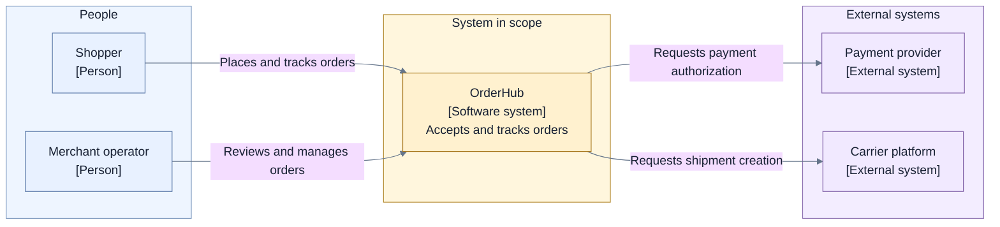

# Layer 1 — High-level architecture

## Read this page when

Use this layer when the project definition is approved but the system's architectural foundation is
not yet explicitly approved and locked.

Read the [guidelines index](./README.md), this page, and the approved project-definition artifacts.
Do not read detailed-architecture or implementation guidance unless a specific question cannot be
decided responsibly at this level and the owner explicitly expands the scope.

## Entry conditions and inputs

Required:

- an approved problem, outcomes, scope, non-goals, constraints, and decision owner;
- known product or policy promises that architecture may preserve or revise;
- evidence about current systems or prior proposals when such evidence exists.

Existing architecture, implementation, incidents, and proposals are evidence and comparison points.
They do not become the target merely because they already exist.

## Questions this layer must answer

1. What system is in scope, and what remains upstream, downstream, or external?
2. Which major responsibilities must exist, and where are their boundaries?
3. Which participants or components are trusted, untrusted, or independently verifiable?
4. Who owns authority for decisions, data, execution, irreversible effects, and escalation?
5. What is the primary lifecycle and information flow?
6. What state must be durable, and what may remain transient or derived?
7. What work may proceed concurrently, and what must be serialized?
8. What constitutes acceptance, and which evidence makes that judgment trustworthy?
9. How does the system fail, stop, remain live, and recover from interruption?
10. Which invariants must every later design preserve?

## Required output

Produce one connected, proposed architecture set containing only the artifacts needed to express:

- system boundary and external relationships;
- major runtime responsibilities and relationships;
- trust and authority boundaries;
- primary lifecycle and data flow;
- major state and persistence posture;
- concurrency and serialization strategy;
- acceptance and evidence posture;
- failure, interruption, recovery, and escalation posture;
- key invariants;
- alternatives, trade-offs, product conflicts, and owner decisions;
- approval and lock record.

The set may be one document or several linked views. Document count is not a completeness measure.

## Allowed views and diagrams

Use only when they answer a named decision:

- project or initiative context summary;
- system-context view;
- high-level runtime/container view;
- primary success and material failure flows;
- coarse lifecycle or state view;
- trust and authority view or perspective;
- high-level data ownership and persistence view;
- decision and conflict records.

Every view must use the same canonical identities, responsibilities, and relationships.

### Illustrative system-context view

- **Purpose:** Establish OrderHub's external boundary.
- **Audience:** Product, engineering, security, and operations.
- **Scope:** People and directly connected external systems; internal runtime units excluded.
- **State:** Exploration.
- **Owner:** Example architecture owner.

The context view does not decide whether OrderHub uses an API, worker, queue, or database. Those
belong in a separate high-level runtime view if that view enables a Layer 1 decision.

## Crafting flow

1. Convert the approved project definition into Layer 1 decision criteria.
2. Establish vocabulary, system boundary, owners, and trust assumptions.
3. Develop at least two credible architectural shapes when a material alternative exists.
4. Model major responsibilities and relationships before drawing selective views.
5. Walk the primary outcome plus material rejection, failure, interruption, and recovery paths.
6. Check state, authority, evidence, concurrency, and recovery as cross-cutting perspectives.
7. Compare the candidate with current promises, implementation evidence, prior proposals, and
   reviews without treating them as defaults.
8. Record conflicts using the current promise, proposed revision, rationale, changed trade-off, and
   owner decision.
9. Review the complete set as one coherent model.
10. Obtain explicit owner approval and record the lock.

## Keep out of this layer

- internal component decomposition that does not change a high-level boundary;
- field-level schemas, serialization, API signatures, and event catalogs;
- exhaustive state-transition or error-code tables;
- concrete port and adapter interfaces;
- technology, package, source-tree, cloud-product, and deployment-node choices;
- migration plans, rollout waves, implementation tasks, and delivery sequencing;
- claims that approval means implementation or current behavior.

## Review and lock gate

Approve and lock this layer only when:

- every Layer 1 question has a clear answer or explicit non-applicability decision;
- the model, views, flows, and decision records agree on boundaries and responsibilities;
- success, rejection, failure, interruption, and recovery are architecturally possible and owned;
- trust and authority do not rely on unnamed behavior;
- concurrency and serialization rules cannot produce an obvious safety or liveness contradiction;
- acceptance is tied to trustworthy evidence;
- product-contract conflicts have explicit owner decisions;
- alternatives and negative consequences are visible;
- no material high-level decision is hidden in a later-layer placeholder;
- the owner explicitly approves the foundation and the approval is durably recorded.

After the lock, a change to the foundation requires an explicit reopen, impact statement, and renewed
approval. Editing a Layer 2 document cannot silently reopen Layer 1.

## Handoff to Layer 2

The handoff contains:

- the approved and locked Layer 1 artifact set;
- stable model identities and vocabulary;
- invariants and product decisions Layer 2 must preserve;
- deliberately deferred detailed decisions;
- the approval and lock record.

A Layer 2 session reads those artifacts, the [guidelines index](./README.md), and
[Layer 2 — Detailed architecture](./02-detailed-architecture.md). It does not need this page unless
it is reviewing compliance with or proposing a reopen of the locked foundation.
