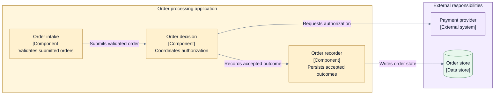

# Layer 2 — Detailed architecture

## Read this page when

Use this layer after the high-level foundation is explicitly approved and locked, and before
implementation design begins.

Read the [guidelines index](./README.md), this page, and the approved Layer 1 artifact set. Do not
reread Layer 1 guidance by default. The locked artifacts—not the earlier crafting instructions—are
the input contract.

## Entry conditions and inputs

Required:

- approved and locked high-level architecture;
- stable vocabulary, identities, boundaries, responsibilities, and invariants;
- explicit deferred-decision list;
- product decisions and approved contract changes;
- relevant current-state evidence and constraints.

If detailed work reveals that a locked boundary, trust model, authority owner, lifecycle, persistence
posture, or other high-level decision must change, stop and propose a Layer 1 reopen.

## Questions this layer must answer

As applicable to the system:

1. How are major responsibilities decomposed into cohesive components?
2. What inputs, outputs, contracts, ports, and authority checks cross each boundary?
3. What are the valid states, transitions, triggers, guards, and terminal outcomes?
4. Who owns data, identity, ordering, time, correlation, and persistence?
5. What are the operation and result semantics, including uncertain effects?
6. How do scheduling, concurrency, locking, and backpressure work precisely?
7. What are the retry, timeout, cancellation, liveness, and escalation rules?
8. How are idempotency, reconciliation, recovery, and no-double-effect behavior achieved?
9. How are credentials, sensitive data, and trust boundaries enforced?
10. What observability, audit, verification, and conformance evidence must implementations produce?

## Required output

Produce a decision-complete architecture set with only the detailed artifacts required by the
system. Typical outputs include:

- selective component views;
- interface and port responsibilities;
- input, output, operation, result, and error semantics;
- detailed flows for success, rejection, failure, retry, timeout, and recovery;
- state machines and transition tables;
- data ownership, integrity, retention, and consistency rules;
- threat, trust, authority, and credential boundaries;
- idempotency and uncertain-effect reconciliation;
- observability and audit requirements;
- architectural verification and conformance obligations;
- decision records and traceability to Layer 1.

Field-level schemas are appropriate only when field identity or compatibility is itself an
architectural decision. Otherwise record semantic contracts and defer serialization to Layer 3.

## Allowed views and diagrams

Use only where a question requires them:

- selected component views within one high-level responsibility;
- sequence or flow diagrams for critical scenarios;
- state machines and transition tables;
- data models and ownership views;
- trust-boundary and threat views;
- dependency and authority maps;
- failure, recovery, and reconciliation flows.

Do not create a component view for every runtime unit or a state diagram for every entity. Volatile
or mechanical detail should remain a schema, generated view, or implementation link.

### Illustrative component and flow relationship

- **Purpose:** Show responsibility decomposition for one runtime unit.
- **Audience:** Engineers implementing or integrating with the unit.
- **Scope:** Order processing internals; deployment topology excluded.
- **State:** Exploration.
- **Owner:** Example architecture owner.

This structural view establishes possible relationships. A separate flow must define message order,
failure branches, retries, and postconditions when those details drive a decision.

## Crafting flow

1. Translate every locked Layer 1 responsibility and invariant into detailed decision obligations.
2. Partition work by independently reviewable boundary or behavior, not by arbitrary document size.
3. Define semantic contracts and ownership before choosing serialization or technology.
4. Walk critical flows and use them to test the structural model.
5. Close success, rejection, failure, retry, timeout, cancellation, and recovery semantics where
   material.
6. Analyze trust, authority, sensitive data, observability, and operational failure as perspectives.
7. Check every detailed choice against the locked foundation and record traceability.
8. Record viable alternatives and consequences for material choices.
9. Define the conformance evidence an implementation must produce.
10. Review the complete architecture for contradictions and open material decisions.

## Keep out of this layer

- changing locked high-level decisions without an explicit reopen;
- source-file, package, class, or function plans unless their boundary is architecturally material;
- vendor selection and cloud topology that do not affect an architectural quality or constraint;
- task breakdown, estimates, delivery sequencing, and pull-request planning;
- rollout and migration detail unless transition architecture is part of the approved scope;
- generated field lists or code-level diagrams with no decision value.

## Review and approval gate

Approve this layer only when:

- every material detailed decision is closed or explicitly out of scope;
- structures, flows, state machines, data models, and contracts use the same identities and rules;
- every message or transition has a responsible owner and valid boundary;
- failure, retry, timeout, cancellation, uncertain-effect, and recovery behavior is defined where
  material;
- authority and credential rules are enforceable rather than aspirational;
- persistence, ordering, idempotency, and concurrency rules are mutually consistent;
- observability and audit requirements can prove the promised behavior;
- conformance obligations are specific enough to test implementations;
- every choice remains compatible with the locked foundation;
- no implementation detail is pretending to close an architectural ambiguity.

## Handoff to Layer 3

The handoff contains:

- approved decision-complete architecture;
- contracts, states, invariants, and authority rules implementations must satisfy;
- conformance and verification obligations;
- deliberate implementation choices still open;
- any approved transitional-architecture constraints.

A Layer 3 session reads those artifacts, the [guidelines index](./README.md), and
[Layer 3 — Implementation and operations](./03-implementation-and-operations.md). It does not need
this page unless it is auditing conformance or proposing an architecture change.
