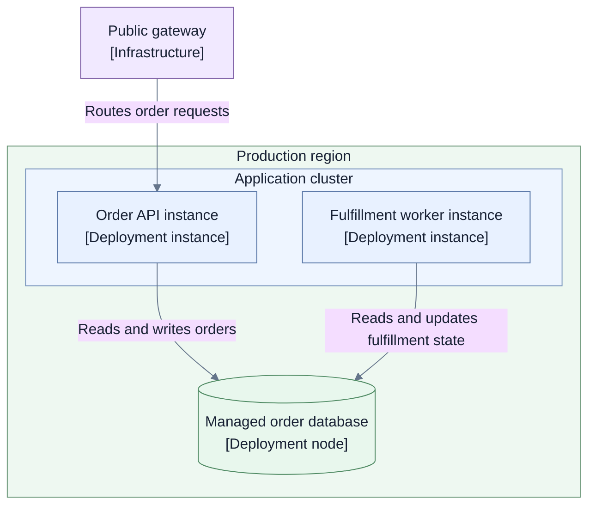

# Layer 3 — Implementation and operations

## Read this page when

Use this layer when the architecture is approved and decision-complete enough to implement.

Read the [guidelines index](./README.md), this page, and the approved architecture artifacts. Do not
reread earlier crafting guidance unless implementation evidence exposes a contradiction that may
require reopening architecture.

## Entry conditions and inputs

Required:

- approved high-level and detailed architecture;
- explicit contracts, invariants, authority rules, and failure semantics;
- conformance and verification obligations;
- known codebase, infrastructure, environment, and operational constraints;
- approved transition scope when migration or coexistence is required.

Implementation convenience does not authorize changing approved architecture. Raise a design change
through the layer that owns it.

## Questions this layer must answer

1. Where do approved responsibilities and contracts live in code and configuration?
2. Which technologies, frameworks, schemas, and provider implementations satisfy the architecture?
3. How are external inputs validated and failures handled at implementation boundaries?
4. Where and how will each environment run the system?
5. Which security controls enforce trust, credential, and data boundaries?
6. Which tests and conformance suites prove architectural obligations?
7. Which telemetry, alerts, audit records, and runbooks make the system operable?
8. How will approved changes coexist, migrate, roll out, and roll back when those activities are in
   scope?
9. How will implementation and operational evidence remain linked to architecture?

## Required output

Create only the implementation and operations artifacts needed by the change, such as:

- mapping from model objects to repositories, packages, modules, schemas, and entry points;
- technology and provider choices with constraints and rationale;
- API, event, persistence, and configuration schemas;
- environment-specific deployment views;
- security-control implementation and credential flow;
- test strategy and conformance mapping;
- observability, alerting, audit, and runbook links;
- migration, coexistence, rollout, and rollback plans when approved and applicable;
- implementation verification record.

Prefer generated or linked volatile detail over manually maintained file-tree or code diagrams.

## Allowed views and diagrams

Use:

- implementation maps;
- deployment views per materially different environment;
- infrastructure and network views where boundaries matter;
- credential and secret flows;
- migration or coexistence views;
- operational flows for detection, response, recovery, and rollback;
- generated dependency or code views when they answer a specific question.

Keep logical architecture separate from deployment topology. A runtime responsibility remains the
same model object even when different environments deploy it differently.

### Illustrative deployment view

- **Purpose:** Show where approved OrderHub runtime units execute in one environment.
- **Audience:** Platform engineering, operations, and security.
- **Scope:** Production deployment; logical responsibility definitions are linked, not repeated.
- **State:** Proposed.
- **Owner:** Example platform owner.

This view should link to the canonical logical runtime model rather than redefine the API or worker's
responsibility.

## Crafting flow

1. Map each approved responsibility, contract, and invariant to an implementation owner and evidence
   obligation.
2. Inspect current code, schemas, infrastructure, configuration, telemetry, and runbooks.
3. Select technologies and implementation boundaries against approved decision drivers.
4. Define schemas and validation at external and persistence boundaries.
5. Design each materially different deployment environment separately from logical architecture.
6. Plan transition, coexistence, rollout, and rollback only when they are in approved scope.
7. Implement and test in independently understandable units.
8. Produce conformance, security, operational, and failure evidence.
9. Reconcile implementation evidence with the approved architecture.
10. Record deviations and route material ones to the owning architecture layer.

## Keep out of this layer

- silent changes to approved architecture;
- manually maintained code detail that can be generated or linked;
- one deployment diagram that mixes materially different environments;
- rollout work when migration or delivery planning is explicitly out of scope;
- claims that code existence proves conformance or operational readiness;
- promotion of a proposal to current before verification.

## Review and completion gate

Complete this layer only when:

- every implemented responsibility and contract maps to its architecture source;
- required schemas and validation are explicit at system boundaries;
- tests and conformance evidence cover architectural invariants and failure semantics;
- deployment views match the relevant environments without redefining logical architecture;
- security, credential, data, and authority controls are implemented and evidenced;
- telemetry, alerts, audit records, and runbooks support promised operations and recovery;
- transition and rollback evidence exists when applicable;
- deviations are resolved, accepted, or routed to an explicit architecture reopen;
- implementation and verification are recorded separately from approval.

## Handoff to Layer 4

The handoff contains verified implementation and operational evidence, links from model objects to
reality, known deviations, ownership, and review triggers.

A Layer 4 session reads that evidence, the [guidelines index](./README.md), and
[Layer 4 — Current state and maintenance](./04-current-state-and-maintenance.md). It does not need
this page unless it is reviewing implementation conformance.
