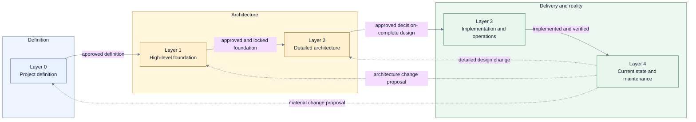

# Architecture design and documentation guidelines

> **Superseded:** This handbook is the earlier process-stage distillation and is scheduled to be
> replaced by a generalized abstraction-layer handbook per the 2026-07-15 owner continuation
> instruction. Where it differs from the
> [source guide](../architecture-design-and-documentation-guide.md), the source guide governs.

Use this handbook to design, explain, review, approve, and maintain software architecture without
reading guidance for work that is not currently in scope.

The handbook is generic. It does not select a product architecture, prescribe a technology, or make
initiative-specific decisions.

## The reading contract

Do not read this directory recursively by default.

1. Read this index.
2. Select the one active layer from the routing table below.
3. Read that layer page in full.
4. Read the approved artifacts from earlier layers as input contracts, not the earlier layer
   guidance.
5. Open a different layer page only when the work explicitly enters, reviews, or reopens that layer.

A layer page is self-contained for its level. It includes its entry conditions, required inputs,
questions, allowed artifacts and diagrams, crafting flow, review gate, approval semantics, example,
and next-layer handoff.

## Select the active layer

| Current need                                                                 | Read                                                                             | Stop after                                                                                      |
| ---------------------------------------------------------------------------- | -------------------------------------------------------------------------------- | ----------------------------------------------------------------------------------------------- |
| Define why work exists, its outcomes, scope, constraints, and decision owner | [Layer 0 — Project definition](./00-project-definition.md)                       | The project definition is explicit and approved.                                                |
| Establish system boundaries and the high-level architectural foundation      | [Layer 1 — High-level architecture](./01-high-level-architecture.md)             | The foundation is explicitly approved and locked.                                               |
| Make the locked foundation decision-complete                                 | [Layer 2 — Detailed architecture](./02-detailed-architecture.md)                 | Material contracts, states, failure semantics, and verification obligations are closed.         |
| Map approved architecture to implementation, deployment, and operations      | [Layer 3 — Implementation and operations](./03-implementation-and-operations.md) | The change is implemented, verified, deployable, and operable within its declared scope.        |
| Keep documentation aligned with verified reality                             | [Layer 4 — Current state and maintenance](./04-current-state-and-maintenance.md) | Current documentation and evidence are refreshed, or a new proposal is routed to another layer. |
| Understand the background or rationale behind a rule                         | [Source reference](./source-reference.md)                                        | The specific question is answered; the source guide is never mandatory operational reading.     |

### Layer progression



Progression is not automatic. Each transition requires the prior layer's explicit exit gate. A
later layer may refine earlier decisions but must not silently change an approved or locked one.

## Shared rules for every layer

1. Start with the reader, question, and decision—not a diagram or folder structure.
2. Create the smallest artifact set that closes the active layer's decisions.
3. Keep one coherent model of identities, responsibilities, boundaries, relationships, ownership,
   lifecycle, and evidence.
4. Use selective views over that model; do not make each diagram invent its own architecture.
5. Keep one primary story and one abstraction level per artifact.
6. Keep structure, behavior, state, data, deployment, and cross-cutting perspectives distinct.
7. Label facts, assumptions, proposals, decisions, and implementation evidence differently.
8. Record meaningful alternatives, trade-offs, consequences, and decision owners.
9. Link to the canonical fact or evidence instead of copying it into several pages.
10. Stop at the active layer. More detail is not more complete when that detail belongs later.

There are no artifact or diagram quotas. Create an artifact only when it answers a named question,
enables a decision, or preserves evidence that another artifact cannot express clearly.

## Artifact state vocabulary

| State                 | Meaning                                                                                   |
| --------------------- | ----------------------------------------------------------------------------------------- |
| `exploration`         | A disposable option or sketch with no approval claim.                                     |
| `proposed`            | A coherent candidate submitted for review and decision.                                   |
| `approved`            | Selected by the decision owner but not necessarily implemented.                           |
| `approved and locked` | Approved foundation that later work cannot change without an explicit reopen.             |
| `transitional`        | Temporary architecture used during an approved change.                                    |
| `implemented`         | Realized in code or infrastructure but not yet necessarily verified as the current truth. |
| `current`             | Implemented, verified, and maintained as the present architecture.                        |
| `deprecated`          | Still present but intentionally scheduled for removal.                                    |
| `historical`          | Frozen evidence of an earlier state, proposal, or decision.                               |

Approval, implementation, verification, and current-state publication are separate events.

## Minimum communication contract

Every durable artifact identifies:

```yaml
title: <artifact title>
purpose: <question it answers>
audience:
  - <intended reader>
scope: <included and excluded boundary>
state: <state from the shared vocabulary>
owner: <decision or maintenance owner>
last_verified: <date when the artifact claims current facts>
sources_of_truth:
  - <governing source or evidence>
related:
  - <next view, decision, or evidence>
```

For proposals, `last_verified` may describe source evidence rather than imply that the proposal is
current. For historical records, preserve the original date and reviewed baseline.

## Model and view rules

A model fact has one canonical identity and owner. A view selects model facts for one reader and
question.

Every modeled object should have, when relevant:

- stable identity and unambiguous name;
- type and parent scope;
- one-sentence responsibility;
- lifecycle state and owner;
- directed relationships with specific intent;
- links to decisions and evidence.

Every diagram should:

- state its view type, scope, and non-current state in the title;
- name its audience, purpose, owner, sources, and related views;
- use a dominant reading direction and one abstraction level;
- label relationships with directed verb phrases;
- explain colors, shapes, borders, line styles, icons, and abbreviations;
- avoid color as the only carrier of meaning;
- remain readable without its author narrating it.

## How reviewers use the handbook

A reviewer reads this index, the target layer page, and the artifacts being reviewed. The review
gate at the end of that layer page is the applicable checklist. Reviewers do not require artifacts
from later layers and do not reject work merely because optional artifacts are absent.

If a review discovers that a prerequisite layer is missing, ambiguous, or being changed silently,
classify that as a layer-boundary problem. Return to or explicitly reopen the owning layer instead
of solving it with accidental lower-level detail.

## Source basis

The operational pages distill the comprehensive
[architecture design and documentation source guide](../architecture-design-and-documentation-guide.md).
The source guide preserves extended rationale, research links, failure modes, and expanded examples.
It is optional reference material; no operational layer requires reading it in full.
